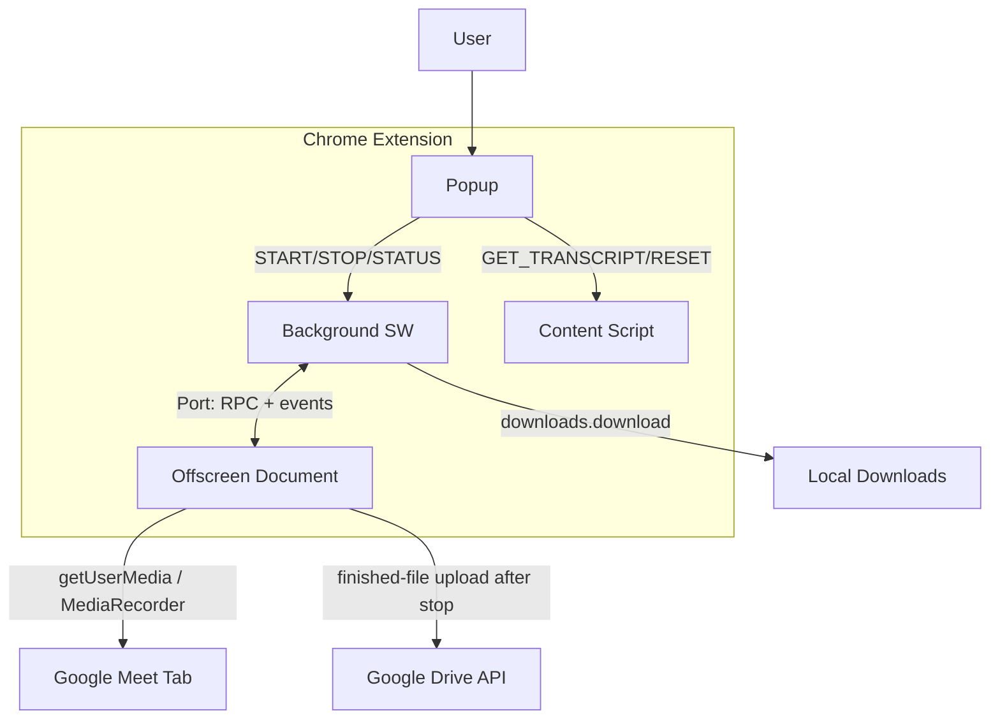
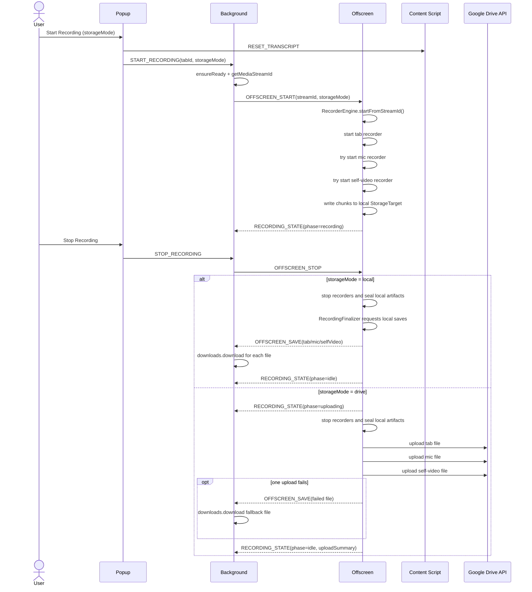
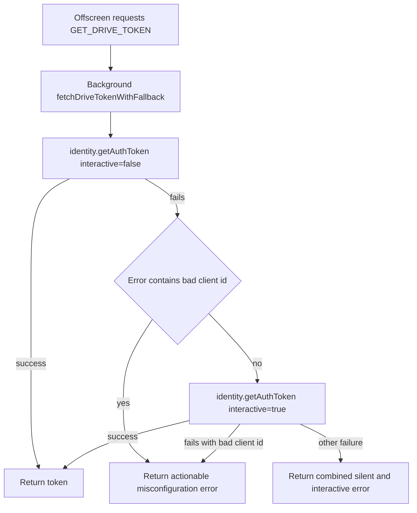
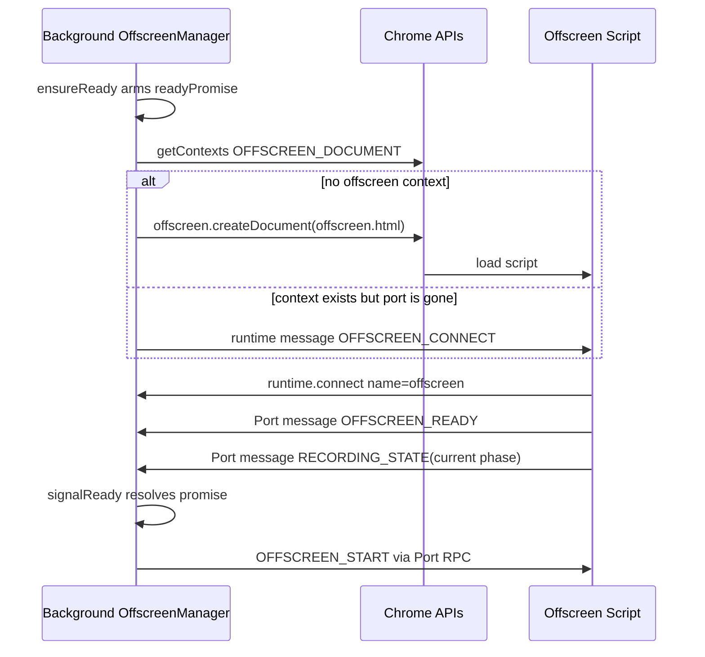
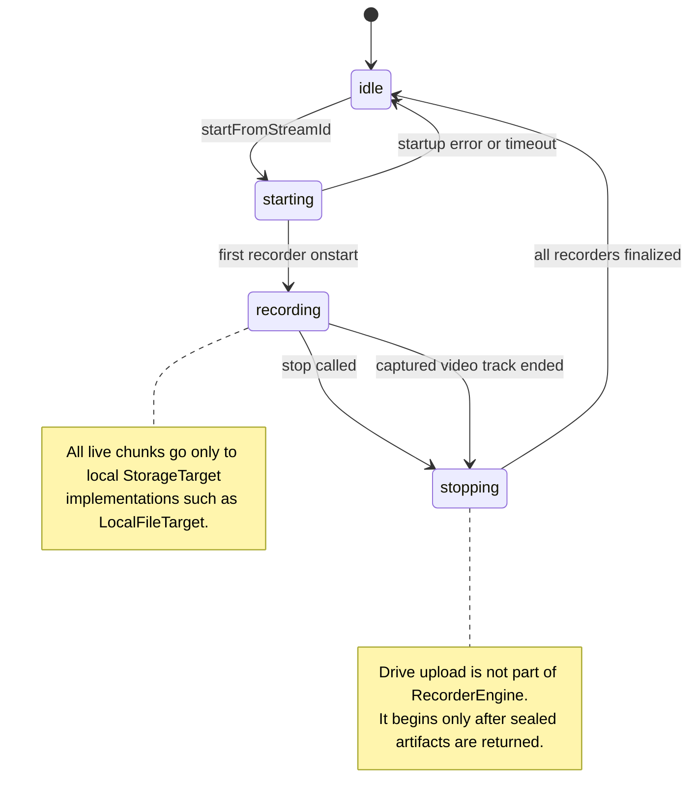
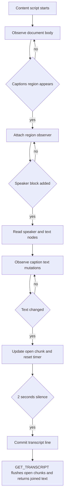
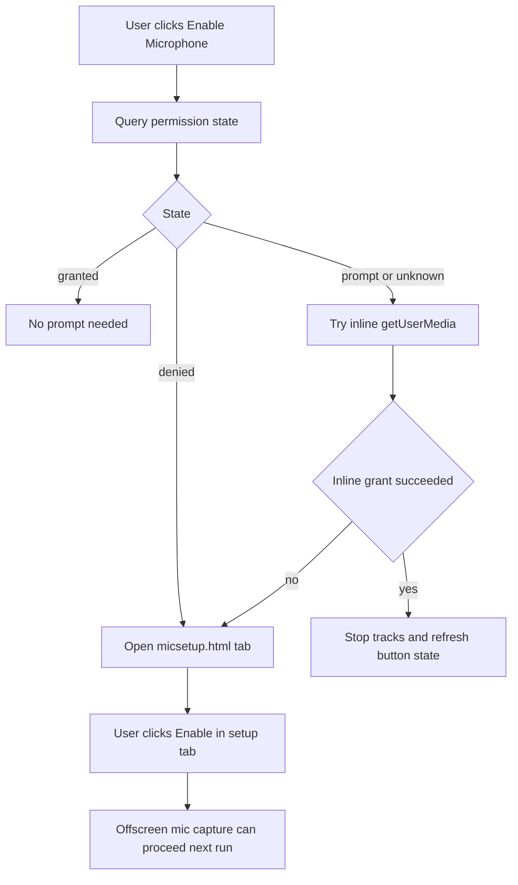
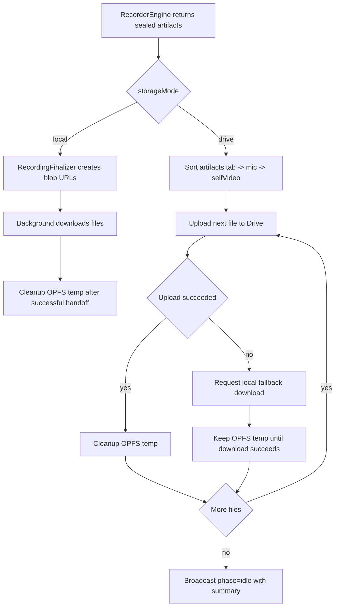
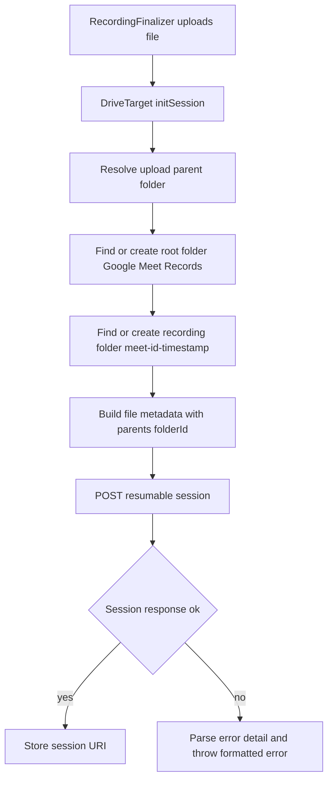

# Chrome Extension Analysis and Documentation

## Project Overview
This extension records Google Meet sessions (tab video/audio plus optional microphone and optional self video) and exports caption transcripts.

It is built on Manifest V3 and uses an Offscreen Document for media APIs that are unavailable in service workers.

It supports two recording storage modes:
- Local mode: record to local temp storage, then download after stop.
- Drive mode: record to local temp storage, then upload finished files to Google Drive after stop.

Current architectural principle:
- Recording and network upload are separate phases.
- Capture is local-first.
- Upload continues even if the popup is closed.

## Architecture (Manifest V3)

### 1. Background Service Worker (`src/background.ts`)
Role:
- Orchestrator and Chrome API boundary.

Responsibilities:
- Receives popup commands (`START_RECORDING`, `STOP_RECORDING`, `GET_RECORDING_STATUS`).
- Ensures Offscreen is alive and connected through `OffscreenManager`.
- Acquires tab capture stream ID (`chrome.tabCapture.getMediaStreamId`).
- Handles Drive token requests (`GET_DRIVE_TOKEN`) through `fetchDriveTokenWithFallback`.
- Maintains keepalive while phase is `recording` or `uploading`.
- Handles local-file save requests (`OFFSCREEN_SAVE`) through `chrome.downloads.download`.
- Preserves state across service worker restarts via `chrome.storage.session` phase rehydration.

Drive auth behavior:
- Silent auth first: `chrome.identity.getAuthToken({ interactive: false })`.
- If silent fails, interactive fallback: `{ interactive: true }`.
- `bad client id` is converted into explicit misconfiguration guidance including current extension ID and manifest client ID.

### 2. Offscreen Document (`src/offscreen.ts`, `offscreen.html`)
Role:
- Recording runtime and post-stop persistence runtime.

Responsibilities:
- Owns `RecorderEngine` lifecycle.
- Maintains persistent `chrome.runtime.Port` to background and reconnect logic.
- Writes all live recording data to local storage targets.
- Runs `RecordingFinalizer` after stop.
- In Drive mode, uploads finished files sequentially and falls back to local download per file if needed.
- Broadcasts lifecycle phase (`idle`, `recording`, `uploading`).

### 3. Recorder Engine (`src/offscreen/RecorderEngine.ts`)
Role:
- Capture and encode media.

Responsibilities:
- Captures tab stream from background-provided `streamId`.
- Captures microphone stream best-effort.
- Optionally captures self-video camera stream.
- Starts independent `MediaRecorder` instances per stream.
- Streams chunks only to local `StorageTarget` implementations.
- Tracks recording state machine (`idle`, `starting`, `recording`, `stopping`).
- Returns sealed local artifacts only after write-drain is complete.

### 4. Local Storage Subsystem (`src/offscreen/LocalFileTarget.ts`)
Role:
- Disk-backed live recording sink.

Responsibilities:
- Streams chunks to OPFS during recording.
- Serializes writes to avoid concurrent OPFS write failures.
- Seals the file on `close()`.
- Returns `{ filename, file, opfsFilename, cleanup() }` to the caller.

### 5. Drive Upload Subsystem (`src/offscreen/RecordingFinalizer.ts`, `src/offscreen/DriveTarget.ts`, `src/offscreen/drive/*`)
Role:
- Post-stop file persistence and cloud upload.

Responsibilities by file:
- `RecordingFinalizer.ts`:
  - Sorts sealed artifacts into deterministic upload order (`tab`, `mic`, `selfVideo`).
  - In local mode, requests background downloads.
  - In Drive mode, uploads each sealed file sequentially.
  - Falls back per-file to local download if Drive upload fails.
- `DriveTarget.ts`:
  - Opens Drive resumable upload sessions for finished files.
  - Uploads in fixed chunks with `Content-Range`.
  - Probes committed byte range after transient failure.
  - Reuses a cached OAuth token during one file upload.
- `drive/DriveFolderResolver.ts`:
  - Finds or creates target folder hierarchy.
  - Caches per-recording folder creation promises to avoid duplicate creates.
- `drive/constants.ts`:
  - Drive endpoints, root folder name, and upload tuning constants.
- `drive/request.ts`:
  - Token caching helper plus auth-aware retry helper.
- `drive/errors.ts`:
  - Normalizes Drive error details and hint text.
- `drive/folderNaming.ts`:
  - Derives `<google-meet-id>-<timestamp>` from recorder filenames.

Current folder model:
- Root folder: `Google Meet Records` (created if missing).
- Per-recording folder: `<google-meet-id>-<timestamp>` (created per run).
- Tab, mic, and optional self-video files from one run go into the same per-recording folder.

### 6. Popup UI (`src/popup.ts`, `src/popup/*`)
Role:
- User control surface.

Responsibilities:
- Starts/stops recording.
- Selects storage mode (`local` or `drive`).
- Downloads transcript from content script data.
- Handles microphone priming flow.
- Reflects current phase and upload summary.

Important property:
- Popup is not part of the recording/upload control plane. It can be closed safely while upload continues.

### 7. Content Script (`src/scrapingScript.ts`)
Role:
- Caption collector.

Responsibilities:
- Observes Meet caption DOM.
- Aggregates/debounces speaker text.
- Serves transcript via message API.

## Architecture Diagrams

### 1. Context Map

### 2. Recording Flow (Local and Drive)

### 3. Drive OAuth Token Fallback

### 4. Offscreen Ready Handshake

### 5. RecorderEngine State Machine

### 6. Caption Collection Pipeline

### 7. Microphone Permission Flow

### 8. Post-Stop Persistence Pipeline

### 9. Drive Folder Resolution and Session Init

## File Breakdown

| File | Context | Description |
| :--- | :--- | :--- |
| `src/background.ts` | Service Worker | Message entry point, recording orchestration, keepalive control, Drive token endpoint. |
| `src/background/OffscreenManager.ts` | Service Worker | Offscreen lifecycle, Port wiring, badge state, local downloads from OFFSCREEN_SAVE. |
| `src/background/driveAuth.ts` | Service Worker | Silent-plus-interactive OAuth fallback and bad-client-id diagnostics. |
| `src/offscreen.ts` | Offscreen Document | Offscreen bootstrap, Port RPC server, phase updates, local-first recording runtime. |
| `src/offscreen/RecorderEngine.ts` | Offscreen Document | Tab/mic/self-video capture and recorder state machine. |
| `src/offscreen/LocalFileTarget.ts` | Offscreen Document | OPFS-backed live recording target. |
| `src/offscreen/RecordingFinalizer.ts` | Offscreen Document | Post-stop local save / Drive upload coordinator. |
| `src/offscreen/DriveTarget.ts` | Offscreen Document | Drive resumable uploader for one finished file. |
| `src/offscreen/errors.ts` | Offscreen Document | Runtime error formatting helpers. |
| `src/offscreen/drive/constants.ts` | Offscreen Document | Drive URLs, MIME constants, folder name, upload tuning constants. |
| `src/offscreen/drive/request.ts` | Offscreen Document | Token caching and auth-aware Drive retry helper. |
| `src/offscreen/drive/errors.ts` | Offscreen Document | Drive response detail extraction and hint formatting. |
| `src/offscreen/drive/folderNaming.ts` | Offscreen Document | Per-recording folder naming from generated filenames. |
| `src/offscreen/drive/DriveFolderResolver.ts` | Offscreen Document | Root/per-recording folder lookup and creation. |
| `src/popup.ts` | Popup | Popup entrypoint. |
| `src/popup/PopupController.ts` | Popup | UI wiring for start/stop, transcript save, phase display, upload summary. |
| `src/popup/MicPermissionService.ts` | Popup | Microphone permission query and setup-tab fallback. |
| `src/popup/CameraPermissionService.ts` | Popup | Camera permission query and setup-tab fallback. |
| `src/scrapingScript.ts` | Content Script | Meet caption observation and transcript aggregation. |
| `src/micsetup.ts` | Extension Tab | Dedicated microphone permission primer page. |
| `src/camsetup.ts` | Extension Tab | Dedicated camera permission primer page. |
| `src/shared/protocol.ts` | Shared | Typed message and RPC protocol definitions. |
| `src/shared/rpc.ts` | Shared | Port-based RPC client/server transport. |
| `src/shared/timeouts.ts` | Shared | Timeout constants for capture and startup paths. |
| `src/shared/logger.ts` | Shared | Prefixed logging helper. |
| `src/shared/async.ts` | Shared | Timeout and async helpers. |
| `manifest.json` | Extension Manifest | MV3 entrypoints, permissions, OAuth config. |

## Key Concepts and Logic

### Offscreen Pattern
MV3 service workers cannot use `MediaRecorder` directly. Offscreen provides a hidden DOM context for media capture, OPFS access, and post-stop upload orchestration.

### Local-First Storage Model
- Local mode:
  - Stream chunks to OPFS (`LocalFileTarget`).
  - On completion, offscreen asks background to download the sealed files.
- Drive mode:
  - Stream chunks to OPFS (`LocalFileTarget`).
  - After stop, upload the sealed files to Drive (`RecordingFinalizer` + `DriveTarget`).
  - Fall back per-file to local download if upload fails.

### Deterministic Per-Run Drive Foldering
`RecordingFinalizer` derives one per-recording folder name from the first sealed filename after stop. The same value is reused for tab, mic, and optional self-video uploads from that run.

### Resumable Upload Behavior
`DriveTarget` uploads finished files using resumable PUT requests:
- chunk size: `2 MiB`
- non-final chunk success: HTTP `308`
- final chunk success: HTTP `200` or `201`
- `408`, `429`, `5xx`, and network aborts trigger committed-offset probe and retry

### OAuth and Misconfiguration Diagnostics
`driveAuth.ts` increases reliability and clarity:
- uses silent auth first, interactive fallback second
- detects `bad client id` and returns explicit remediation including extension ID and manifest client ID

### Popup Closure Safety
Recording and upload state live in background/offscreen. The popup is just a client. Closing the popup does not stop recording or upload.

### Caption Selector Fragility
Caption scraping depends on Meet DOM selectors (for example `.ygicle`, `.NWpY1d`). These may change when Meet frontend updates.

## Performance Notes

Current performance-sensitive design choices:
- recording is disk-backed rather than RAM-buffered for long meetings
- upload happens after stop, not during capture
- Drive uploads are sequential for reliability
- Drive auth token is cached for the lifetime of one file upload, avoiding one token fetch per chunk
- tab recording prefers VP8 to reduce CPU cost when multiple recorders run at once

Potential future improvements:
- adaptive webcam profile selection based on actual camera capability
- dynamic Drive chunk sizing based on throughput
- optional limited upload parallelism after long-run reliability validation
- lightweight upload telemetry for retry counts and upload duration
