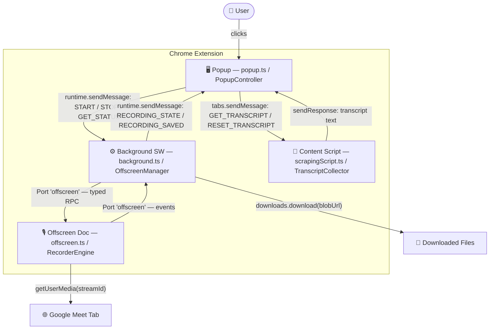
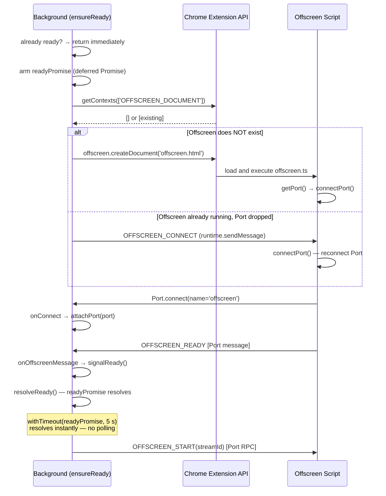
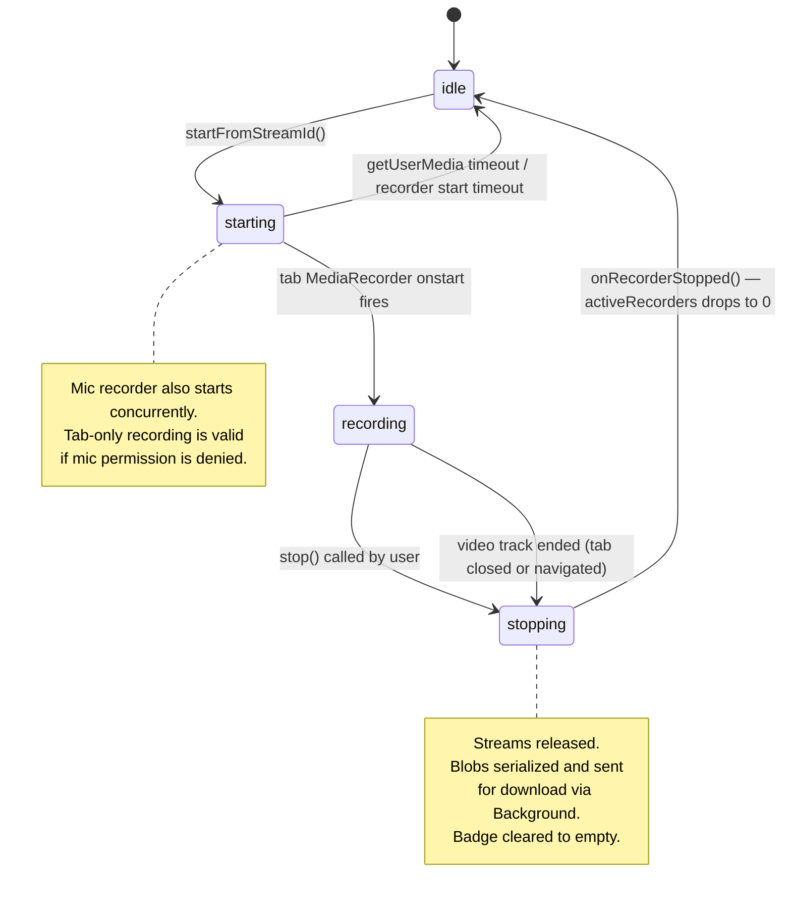
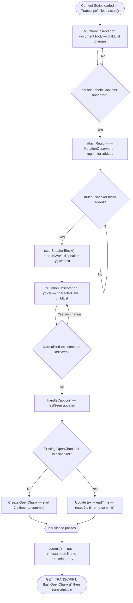
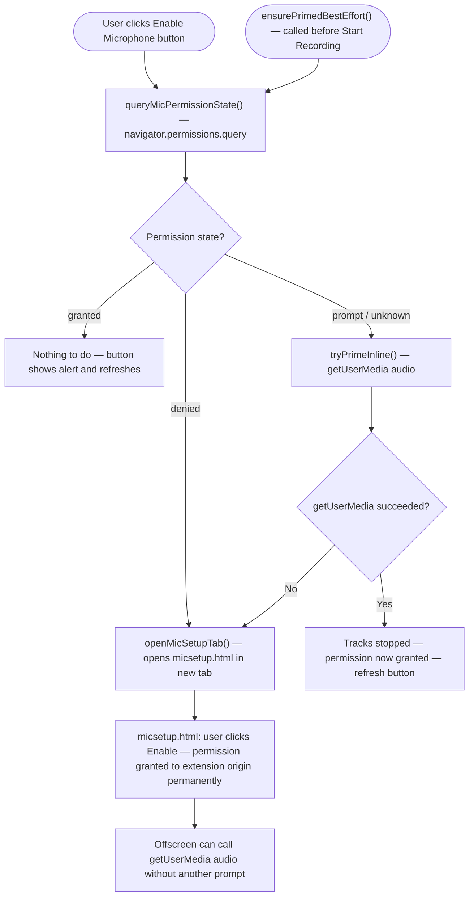

# Chrome Extension Analysis & Documentation

## Project Overview
This extension is designed to **record Google Meet sessions** (audio + video) and **transcribe live captions**. It solves the limitation of Chrome Extensions not being able to access `MediaRecorder` or raw audio streams directly in service workers (Manifest V3) by utilizing an **Offscreen Document**.

## Architecture (Manifest V3)
The extension follows the modern MV3 architecture handling specific constraints around persistent background scripts and DOM access.

### 1. **Background Service Worker** (`background.ts`)
- **Role**: Orchestrator.
- **Responsibility**:
    - Runs as an event-driven service worker (terminates when idle).
    - Manages the lifecycle of the **Offscreen Document**.
    - Generates the `tabCapture` stream ID (`chrome.tabCapture.getMediaStreamId`).
    - Acts as a bridge between the **Popup** (UI) and the **Offscreen** (Recording Logic).

### 2. **Offscreen Document** (`offscreen.ts` / `offscreen.html`)
- **Role**: The Recording Studio.
- **Responsibility**:
    - Exists to provide a DOM environment for `MediaRecorder` and `AudioContext`.
    - Captures the tab stream using the `streamId` provided by the background.
    - Captures the Microphone stream (`navigator.mediaDevices.getUserMedia`).
    - **Keeps Audio Separate**: Records tab audio+video and mic audio into separate files.
    - Encodes the video/audio into `.webm` files.
    - Handles the file download process.

### 3. **Content Script** (`scrapingScript.ts`)
- **Role**: The Transcriber.
- **Responsibility**:
    - Injected into `https://meet.google.com/*` at `document_idle`.
    - Runs entirely locally — no data leaves the browser.
    - Uses nested `MutationObserver`s to watch for Google Meet caption elements (obfuscated classes like `.ygicle`).
    - Debounces caption fragments with a 2 s grace timer before "committing" a line to the transcript.
    - Returns the transcript to the Popup on request via `chrome.runtime.onMessage`.

### 4. **Popup & UI** (`popup.ts`)
- **Role**: Control Panel.
- **Responsibility**:
    - Allows user to Start/Stop recording.
    - Allows user to Save Transcript.
    - Handles Microphone Permissions "Priming" (opening `micsetup.html`).

## Architecture Diagrams

---

### 1. Context Map — Four Isolated JavaScript Worlds

Each box is a separate OS process with no shared memory. Everything flows through Chrome message APIs.

---

### 2. Recording Flow — Full Sequence

Shows every message and internal step from "Start" click to files saved on disk.

```mermaid
sequenceDiagram
    actor User
    participant P as Popup
    participant B as Background (SW)
    participant O as Offscreen
    participant C as Content Script

    User->>P: click Start Recording
    P->>C: RESET_TRANSCRIPT (clears buffer)
    P->>B: START_RECORDING(tabId)

    rect rgb(30, 50, 70)
        Note over B,O: ensureReady() — arm promise, create offscreen doc
        B->>O: offscreen.createDocument('offscreen.html')
        O->>B: Port.connect('offscreen')
        O->>B: OFFSCREEN_READY [Port]
        B->>B: readyPromise resolves instantly
    end

    B->>B: tabCapture.getMediaStreamId(tabId)
    B->>O: OFFSCREEN_START(streamId) [Port RPC]

    rect rgb(30, 50, 70)
        Note over O: RecorderEngine.startFromStreamId()
        O->>O: getUserMedia(streamId, source=tab) → baseStream
        O->>O: AudioPlaybackBridge — re-route tab audio to speakers
        O->>O: tabRecorder.start() — records video + tab audio
        O->>O: getUserMedia(mic) — separate mic stream
        O->>O: micRecorder.start() — records mic audio only
    end

    O-->>B: RECORDING_STATE(recording=true) [Port]
    B->>B: badge → "REC"
    B-->>P: RECORDING_STATE(recording=true)
    P->>User: Stop button enabled

    User->>P: click Stop Recording
    P->>B: STOP_RECORDING
    B->>O: OFFSCREEN_STOP [Port RPC]
    O->>O: tabRecorder.stop() + micRecorder.stop()

    O-->>B: OFFSCREEN_SAVE(tab-file.webm, blobUrl) [Port]
    B->>B: downloads.download(blobUrl) → tab recording saved
    O-->>B: OFFSCREEN_SAVE(mic-file.webm, blobUrl) [Port]
    B->>B: downloads.download(blobUrl) → mic recording saved
    O-->>B: RECORDING_STATE(recording=false) [Port]
    B->>B: badge → ""
    B-->>P: RECORDING_SAVED

    User->>P: click Save Transcript
    P->>C: GET_TRANSCRIPT
    C->>C: flushOpenChunks() — commit any buffered speech
    C-->>P: { transcript: "[ts] Speaker: text\n..." }
    P->>B: downloads.download(transcript.txt)
```

---

### 3. Offscreen Ready Handshake — Promise-Based Startup

Illustrates how `OffscreenManager.ensureReady()` works without polling loops.

---

### 4. RecorderEngine State Machine

All state transitions in `RecorderEngine`. `isRecording()` returns `true` for `starting`, `recording`, and `stopping`.

---

### 5. Caption Scraping Pipeline

How `TranscriptCollector` turns raw Google Meet DOM mutations into a clean transcript.

---

### 6. Microphone Permission Flow

`MicPermissionService` decides whether inline priming, a full setup tab, or no action is needed.

## File Breakdown

| File | Context | Description |
| :--- | :--- | :--- |
| `src/background.ts` | Service Worker | Entry point. Wires `OffscreenManager` and message handlers. |
| `src/background/OffscreenManager.ts` | Service Worker | Offscreen lifecycle, Port connection, RPC client, badge, downloads. |
| `src/offscreen.ts` | Offscreen Document | Entry point. Wires `RecorderEngine` and Port RPC server. |
| `src/offscreen/RecorderEngine.ts` | Offscreen Document | MediaRecorder capture, mixing, saving. State machine for recording lifecycle. |
| `src/popup.ts` | Popup Page | Entry point. Passes DOM elements to `PopupController`. |
| `src/popup/PopupController.ts` | Popup Page | Start/stop, transcript download, recording state UI. |
| `src/popup/MicPermissionService.ts` | Popup Page | Permission query, inline priming, opens micsetup tab when needed. |
| `src/scrapingScript.ts` | Content Script | Watches Google Meet DOM for captions. `TranscriptCollector` class. |
| `src/micsetup.ts` | Browser Tab | Full-page permission primer for microphone. |
| `src/shared/protocol.ts` | All contexts | **Source of truth** for all inter-context message types. |
| `src/shared/rpc.ts` | All contexts | Port-based bidirectional RPC helpers (client + server). |
| `src/shared/timeouts.ts` | All contexts | Named constants for all timeout and poll values. |
| `src/shared/logger.ts` | All contexts | Prefixed logger factory (`makeLogger`). |
| `src/shared/async.ts` | All contexts | `sleep` and `withTimeout` utilities. |
| `manifest.json` | Chrome | Permissions (`tabCapture`, `offscreen`, `activeTab`) and entry points. |

## Key Concepts & logic

### The "Offscreen" Pattern
In Manifest V3, background scripts are Service Workers and cannot access DOM APIs like `MediaRecorder` or `AudioContext`. To record audio/video, extensions must create an "Offscreen Document" (`chrome.offscreen.createDocument`). This document is invisible but has full DOM access.

### Separate Audio Outputs
To keep meeting audio (tab) and mic audio separate, the extension records:
- **Tab stream**: Video + tab audio into a `.webm` file.
- **Mic stream**: Audio-only into a separate `.webm` file.

### Obfuscated Selectors
`scrapingScript.ts` relies on specific class names (`.ygicle`, `.NWpY1d`) used by Google Meet. These are likely generated classes and **may break** if Google updates their frontend code. The script attempts to find these elements via `aria-label="Captions"` regions to be somewhat robust.
