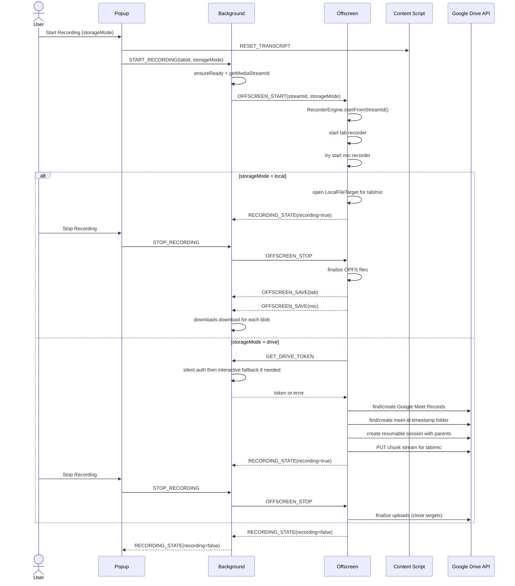
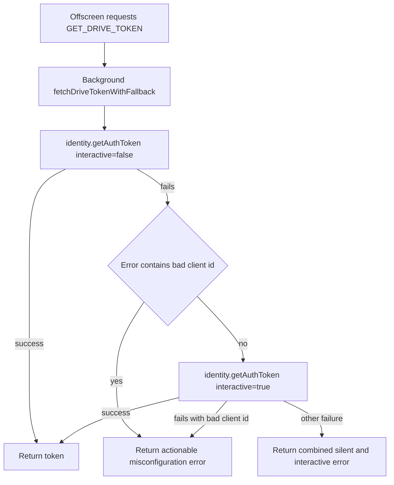
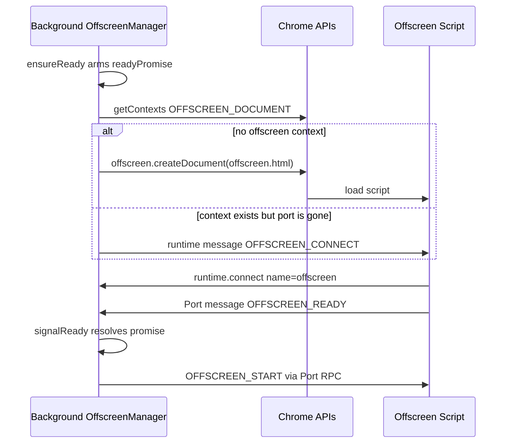
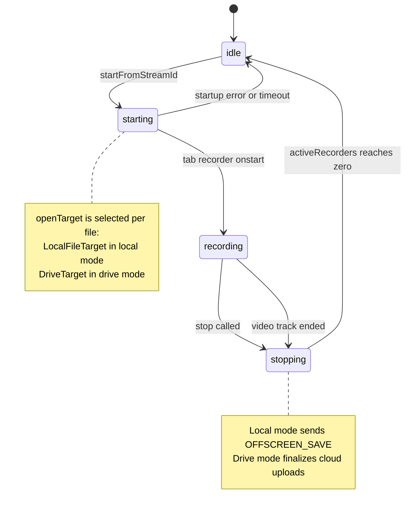
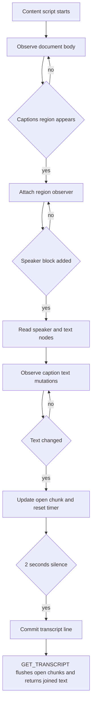
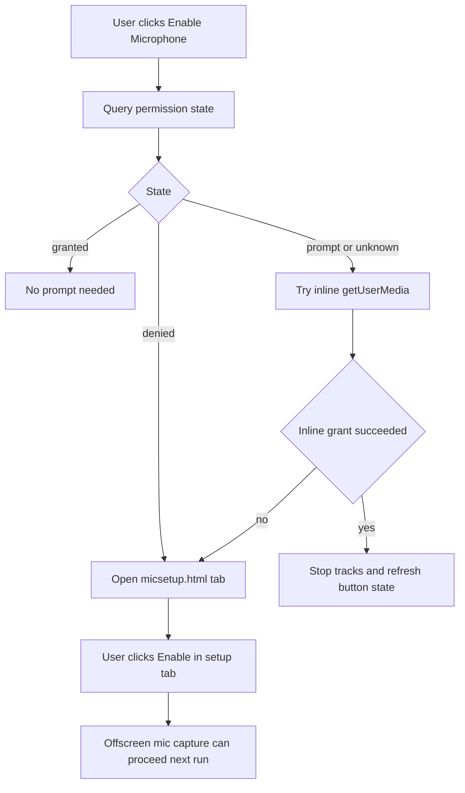
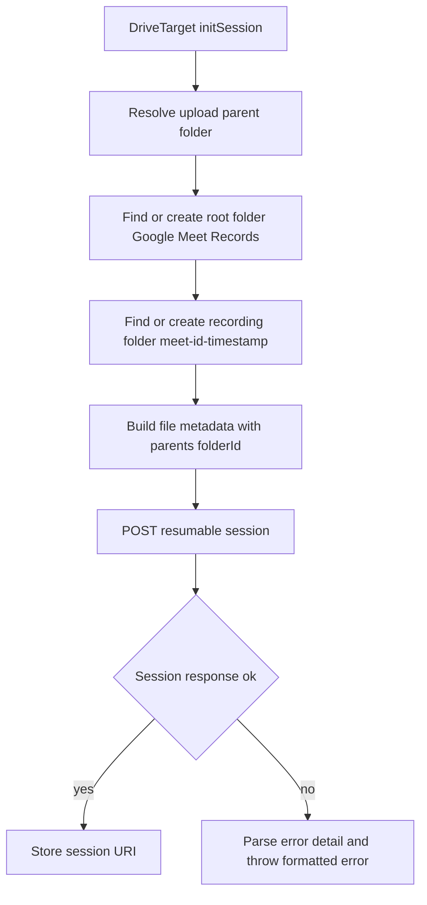

# Chrome Extension Analysis and Documentation

## Project Overview
This extension records Google Meet sessions (tab video/audio plus optional microphone) and exports caption transcripts.

It is built on Manifest V3 and uses an Offscreen Document for media APIs that are unavailable in service workers.

It supports two recording storage modes:
- Local mode: stream chunks to OPFS, then trigger a download via background.
- Drive mode: stream chunks directly to Google Drive via resumable upload.

## Architecture (Manifest V3)

### 1. Background Service Worker (`src/background.ts`)
Role:
- Orchestrator and policy boundary.

Responsibilities:
- Receives popup commands (`START_RECORDING`, `STOP_RECORDING`, `GET_RECORDING_STATUS`).
- Ensures Offscreen is alive and connected through `OffscreenManager`.
- Acquires tab capture stream ID (`chrome.tabCapture.getMediaStreamId`).
- Handles Drive token requests (`GET_DRIVE_TOKEN`) through `fetchDriveTokenWithFallback`.
- Maintains recording keepalive and badge state.
- Handles local-file save requests (`OFFSCREEN_SAVE`) through `chrome.downloads.download`.

Drive auth behavior:
- Silent auth first: `chrome.identity.getAuthToken({ interactive: false })`.
- If silent fails, interactive fallback: `{ interactive: true }`.
- `bad client id` is converted into explicit misconfiguration guidance including current extension ID and manifest client ID.

### 2. Offscreen Document (`src/offscreen.ts`, `offscreen.html`)
Role:
- Recording runtime (DOM-capable context).

Responsibilities:
- Owns `RecorderEngine` lifecycle.
- Maintains persistent `chrome.runtime.Port` to background and reconnect logic.
- Chooses storage target per run (`LocalFileTarget` or `DriveTarget`) based on `storageMode`.
- In Drive mode, derives one per-recording folder name and reuses it for both tab and mic files.

### 3. Recorder Engine (`src/offscreen/RecorderEngine.ts`)
Role:
- Capture and encode media.

Responsibilities:
- Captures tab stream from background-provided `streamId`.
- Captures microphone stream best-effort.
- Starts independent tab and mic `MediaRecorder` instances.
- Streams chunks to selected `StorageTarget`.
- Tracks recording state machine (`idle`, `starting`, `recording`, `stopping`).

### 4. Drive Upload Subsystem (`src/offscreen/DriveTarget.ts`, `src/offscreen/drive/*`)
Role:
- Direct cloud streaming and folder organization.

Responsibilities by file:
- `DriveTarget.ts`:
  - Opens resumable upload session.
  - Buffers chunks up to 5 MB and flushes with `Content-Range`.
  - Handles finalization and transient retry logic.
- `drive/DriveFolderResolver.ts`:
  - Finds or creates target folder hierarchy.
  - Caches per-recording folder creation promises to avoid duplicate creates.
- `drive/constants.ts`:
  - Drive endpoint constants and root folder name (`Google Meet Records`).
- `drive/request.ts`:
  - Auth-aware request helper with one retry for `401/403`.
- `drive/errors.ts`:
  - Normalizes Drive error details and hint text.
- `drive/folderNaming.ts`:
  - Derives `<google-meet-id>-<timestamp>` from recorder filenames.

Current folder model:
- Root folder: `Google Meet Records` (created if missing).
- Per-recording folder: `<google-meet-id>-<timestamp>` (created per run).
- Both tab and mic files from one run go into the same per-recording folder.

### 5. Popup UI (`src/popup.ts`, `src/popup/*`)
Role:
- User control surface.

Responsibilities:
- Starts/stops recording.
- Selects storage mode (`local` or `drive`).
- Downloads transcript from content script data.
- Handles microphone priming flow.

### 6. Content Script (`src/scrapingScript.ts`)
Role:
- Caption collector.

Responsibilities:
- Observes Meet caption DOM.
- Aggregates/debounces speaker text.
- Serves transcript via message API.

## Architecture Diagrams

### 1. Context Map
```mermaid
graph TB
    U[User]

    subgraph EXT[Chrome Extension]
      P[Popup]
      B[Background SW]
      O[Offscreen Document]
      C[Content Script]
    end

    M[Google Meet Tab]
    D[Local Downloads]
    G[Google Drive API]

    U --> P
    P -->|START/STOP/STATUS| B
    P -->|GET_TRANSCRIPT/RESET| C
    B <-->|Port: RPC + events| O
    O -->|getUserMedia(streamId)| M
    O -->|Drive REST upload + folder APIs| G
    O -->|OFFSCREEN_SAVE (local mode only)| B
    B -->|downloads.download (local mode only)| D
```

### 2. Recording Flow (Local and Drive)


### 3. Drive OAuth Token Fallback


### 4. Offscreen Ready Handshake


### 5. RecorderEngine State Machine


### 6. Caption Collection Pipeline


### 7. Microphone Permission Flow


### 8. Drive Folder Resolution and Session Init


## File Breakdown

| File | Context | Description |
| :--- | :--- | :--- |
| `src/background.ts` | Service Worker | Message entry point, recording orchestration, Drive token endpoint. |
| `src/background/OffscreenManager.ts` | Service Worker | Offscreen lifecycle, Port wiring, badge state, local downloads from OFFSCREEN_SAVE. |
| `src/background/driveAuth.ts` | Service Worker | Silent-plus-interactive OAuth fallback and bad-client-id diagnostics. |
| `src/offscreen.ts` | Offscreen Document | Offscreen bootstrap, Port RPC server, storage-target selection. |
| `src/offscreen/RecorderEngine.ts` | Offscreen Document | Tab/mic capture and recorder state machine. |
| `src/offscreen/LocalFileTarget.ts` | Offscreen Document | OPFS streaming target used in local mode. |
| `src/offscreen/DriveTarget.ts` | Offscreen Document | Drive resumable upload target used in Drive mode. |
| `src/offscreen/drive/constants.ts` | Offscreen Document | Drive URLs, MIME constants, root folder name. |
| `src/offscreen/drive/request.ts` | Offscreen Document | Auth-aware Drive request retry helper. |
| `src/offscreen/drive/errors.ts` | Offscreen Document | Drive response detail extraction and hint formatting. |
| `src/offscreen/drive/folderNaming.ts` | Offscreen Document | Per-recording folder naming from generated filenames. |
| `src/offscreen/drive/DriveFolderResolver.ts` | Offscreen Document | Root/per-recording folder lookup and creation. |
| `src/popup.ts` | Popup | Popup entrypoint. |
| `src/popup/PopupController.ts` | Popup | UI wiring for start/stop, transcript save, storage mode. |
| `src/popup/MicPermissionService.ts` | Popup | Microphone permission query and setup-tab fallback. |
| `src/scrapingScript.ts` | Content Script | Meet caption observation and transcript aggregation. |
| `src/micsetup.ts` | Extension Tab | Dedicated microphone permission primer page. |
| `src/shared/protocol.ts` | Shared | Typed message and RPC protocol definitions. |
| `src/shared/rpc.ts` | Shared | Port-based RPC client/server transport. |
| `src/shared/timeouts.ts` | Shared | Timeout constants for capture and startup paths. |
| `src/shared/logger.ts` | Shared | Prefixed logging helper. |
| `src/shared/async.ts` | Shared | Timeout and async helpers. |
| `manifest.json` | Extension Manifest | MV3 entrypoints, permissions, OAuth config. |

## Key Concepts and Logic

### Offscreen Pattern
MV3 service workers cannot use `MediaRecorder` directly. Offscreen provides a hidden DOM context for media capture and encoding.

### Storage Mode Split
- Local mode:
  - Stream chunks to OPFS (`LocalFileTarget`).
  - On completion, offscreen sends blob URLs to background (`OFFSCREEN_SAVE`) and background triggers downloads.
- Drive mode:
  - Stream chunks directly to Drive (`DriveTarget`).
  - No background download step for recording files.

### Drive Folder Determinism per Run
`offscreen.ts` sets one `currentDriveRecordingFolderName` on first target open after `OFFSCREEN_START`. The same value is reused by both tab and mic targets, keeping both files together.

### Resumable Upload Behavior
`DriveTarget` uses bounded buffering and resumable PUT uploads:
- Flush threshold: 5 MB.
- Non-final chunk success: HTTP `308`.
- Final chunk success: HTTP `200` or `201`.
- `500/503` triggers commit-offset probe and retry.

### OAuth and Misconfiguration Diagnostics
`driveAuth.ts` increases reliability and clarity:
- Uses silent auth first, interactive fallback second.
- Detects `bad client id` and returns explicit remediation including extension ID and manifest client ID.

### Caption Selector Fragility
Caption scraping depends on Meet DOM selectors (for example `.ygicle`, `.NWpY1d`). These may change when Meet frontend updates.
