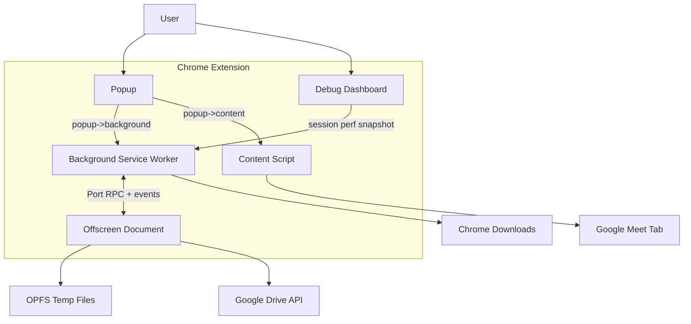
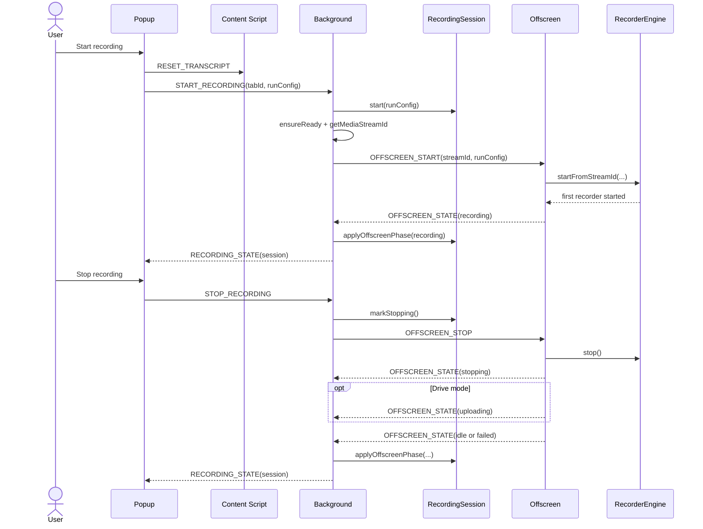
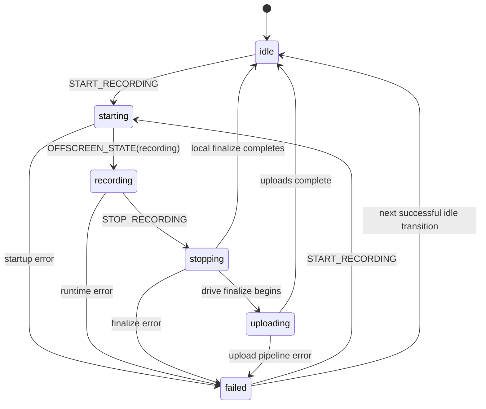
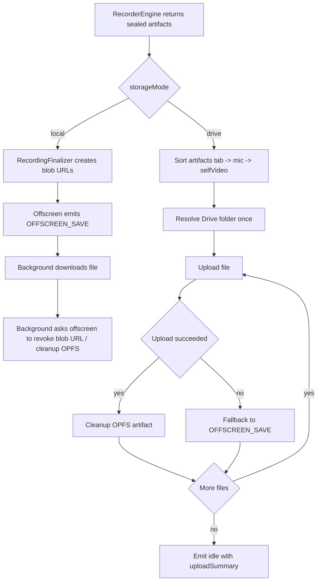
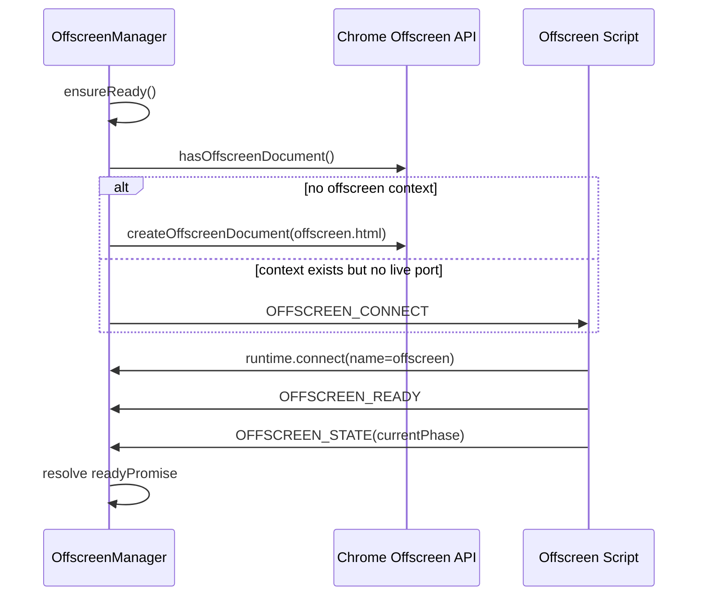
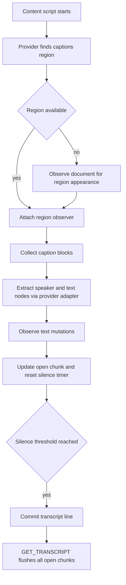
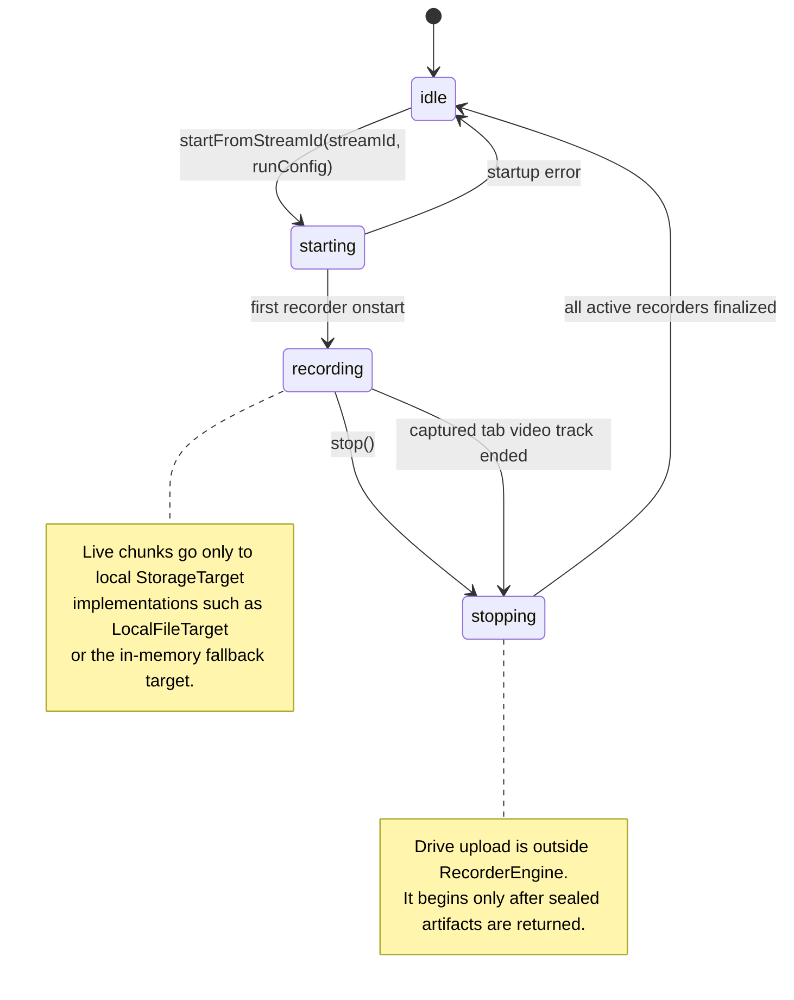
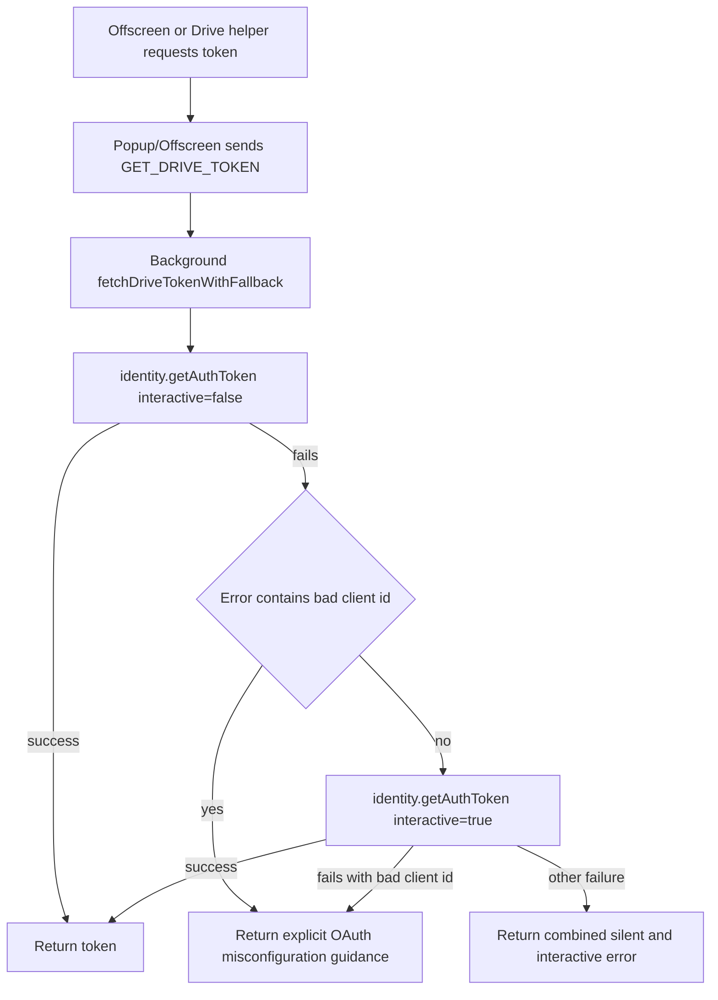
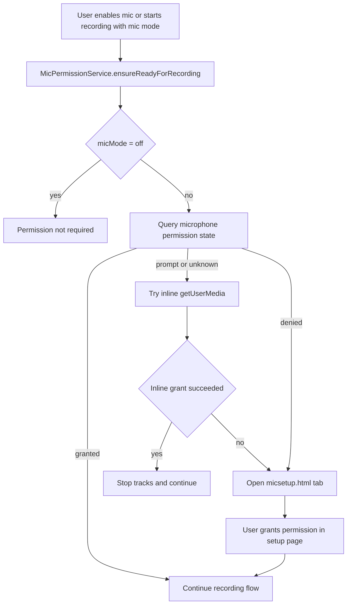
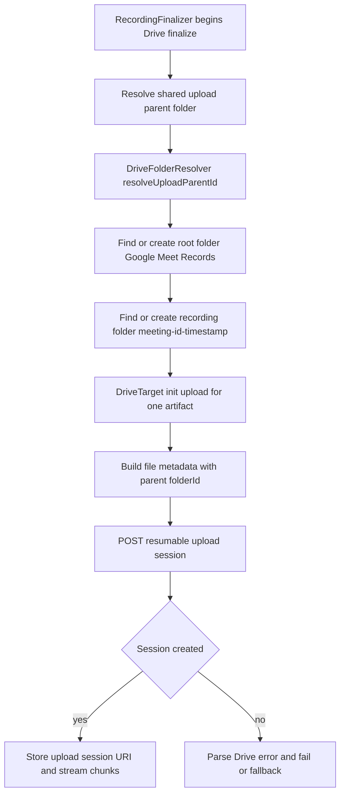

# Chrome Extension Architecture Documentation

## Overview
This extension records Google Meet sessions and exports caption transcripts.

Current user-visible capabilities:
- Record the active Meet tab.
- Choose a microphone mode per run: `off`, `mixed`, or `separate`.
- Optionally record the user's camera as a separate file.
- Save locally or upload to Google Drive after capture stops.
- Download a transcript collected from live captions in the Meet tab.

The implementation is built around Manifest V3 constraints:
- The background service worker owns orchestration and privileged Chrome APIs.
- The offscreen document owns media APIs and OPFS-backed file writing.
- The popup is disposable and never owns recording state.
- The content script owns transcript collection inside the Meet page.

Core design principles:
- Local-first capture: live recording data is always written to local storage targets first.
- Post-stop persistence: Google Drive upload starts only after capture is sealed.
- Single active recording session: one canonical session snapshot is persisted in `chrome.storage.session`.
- Typed contracts: popup/background/offscreen/content communication is defined in shared protocol types.
- Extension-first boundaries: Chrome APIs are wrapped behind small platform adapters in `src/platform/chrome/*`.

## Runtime Contexts

### Background Service Worker
File: `src/background.ts`

Purpose:
- Own the extension control plane.
- Receive commands from popup.
- Keep recording lifecycle state durable across service worker restarts.
- Create and reconnect the offscreen document.
- Broker local download requests and Drive token requests.

Key responsibilities:
- Maintains the canonical `RecordingSession`.
- Persists the session snapshot under `recordingSession` in `chrome.storage.session`.
- Keeps the worker alive while a session is in a busy phase (`starting`, `recording`, `stopping`, `uploading`).
- Bridges offscreen events into popup updates.
- Handles `OFFSCREEN_SAVE` by triggering `chrome.downloads.download`.
- Hydrates legacy session keys (`phase`, `activeRunConfig`) when present so old in-session state is not lost during migration.

### Offscreen Document
Files: `static/offscreen.html`, `src/offscreen.ts`

Purpose:
- Own all browser APIs unavailable in MV3 service workers:
  - `getUserMedia`
  - `MediaRecorder`
  - `AudioContext`
  - OPFS (`navigator.storage.getDirectory()`)

Key responsibilities:
- Maintains a reconnecting `chrome.runtime.Port` to background.
- Runs `RecorderEngine`.
- Writes chunks to local storage targets during capture.
- Runs `RecordingFinalizer` after stop.
- Emits explicit runtime phase updates back to background: `starting`, `recording`, `stopping`, `uploading`, `failed`, `idle`.

### Popup
Files: `static/popup.html`, `src/popup.ts`, `src/popup/*`

Purpose:
- Collect user intent and render current session state.

Key responsibilities:
- Builds a `RecordingRunConfig`.
- Resets transcript buffer before a new recording starts.
- Enforces microphone and camera permission readiness.
- Reflects session state sent from background.
- Downloads transcript text returned by the content script.

Important property:
- The popup is disposable. Closing it does not stop recording or upload.

### Content Script
File: `src/scrapingScript.ts`

Purpose:
- Observe the Google Meet DOM and accumulate caption transcript text.

Key responsibilities:
- Detects the captions region when it appears.
- Observes speaker blocks and incremental text updates.
- Debounces speech fragments into committed transcript lines.
- Serves transcript requests from popup.
- Uses a provider adapter abstraction instead of hard-coding Meet logic into the collector itself.

## Canonical Domain Model
File: `src/shared/recording.ts`

### Recording Run Config
```ts
type RecordingRunConfig = {
  storageMode: 'local' | 'drive';
  micMode: 'off' | 'mixed' | 'separate';
  recordSelfVideo: boolean;
};
```

### Recording Session Snapshot
```ts
type RecordingSessionSnapshot = {
  phase: 'idle' | 'starting' | 'recording' | 'stopping' | 'uploading' | 'failed';
  runConfig: RecordingRunConfig | null;
  uploadSummary?: UploadSummary;
  error?: string;
  updatedAt: number;
};
```

### Recording Phases
- `idle`: no active run.
- `starting`: background/offscreen startup is in progress.
- `recording`: at least one recorder has started.
- `stopping`: the stop path has begun and recorders are sealing.
- `uploading`: post-stop Drive upload is in progress.
- `failed`: the last run failed before returning to `idle`.

Busy phases are:
- `starting`
- `recording`
- `stopping`
- `uploading`

## Architecture Components

### 1. Recording Session State Machine
File: `src/background/RecordingSession.ts`

This class is the canonical lifecycle owner.

It is responsible for:
- hydrating the last persisted session snapshot
- starting a new session from a normalized run config
- transitioning through `stopping`, `uploading`, `idle`, and `failed`
- applying offscreen phase updates without leaking offscreen-specific state shape into the rest of the background runtime

This is the main architectural improvement over the older design, where lifecycle state was distributed across module globals.

### 2. Offscreen Lifecycle Manager
File: `src/background/OffscreenManager.ts`

`OffscreenManager` is deliberately narrow:
- ensures the offscreen context exists
- waits for the `OFFSCREEN_READY` handshake
- manages the port-backed RPC client
- receives `OFFSCREEN_STATE` and `OFFSCREEN_SAVE`
- updates the action badge

It does not own business state. Background does.

Badge semantics:
- `REC`: starting, recording, or stopping
- `UP`: uploading
- `ERR`: failed
- empty badge: idle

### 3. Offscreen Runtime Entrypoint
File: `src/offscreen.ts`

`src/offscreen.ts` is the runtime shell around media work.

Responsibilities:
- connect or reconnect the background port
- expose RPC handlers for `OFFSCREEN_START`, `OFFSCREEN_STOP`, and `REVOKE_BLOB_URL`
- push phase updates through `OFFSCREEN_STATE`
- run the post-stop finalize pipeline
- emit perf samples and long-task diagnostics when debug mode is enabled

Important runtime rule:
- capture and upload are separate phases
- Drive upload starts only after `RecorderEngine.stop()` returns sealed artifacts

### 4. Recorder Engine
File: `src/offscreen/RecorderEngine.ts`

`RecorderEngine` coordinates capture and recorder instances, but it is now split across smaller support modules:

- `src/offscreen/RecorderAudio.ts`
  - `MixedAudioMixer`
  - `AudioPlaybackBridge`
- `src/offscreen/RecorderCapture.ts`
  - tab capture acquisition
  - microphone acquisition
  - self-video acquisition
  - active-tab suffix inference
- `src/offscreen/RecorderProfiles.ts`
  - MIME selection
  - chunk timeslice policy
  - adaptive self-video bitrate policy
- `src/offscreen/RecorderVideoResizer.ts`
  - live tab downscale before `MediaRecorder`
  - hidden `video -> canvas` pipeline for deterministic output size
- `src/offscreen/RecorderSupport.ts`
  - media error formatting

Recorder responsibilities:
- capture tab media from the background-provided `streamId`
- enforce microphone mode contract
- optionally capture self video
- start one or more `MediaRecorder` instances
- stream chunks into `StorageTarget`
- resolve only when final writes are drained and artifacts are sealed

Self-video profiles:
- preset-based direct camera profile
  - settings page offers `640x360`, `854x480`, `1280x720`, and `1920x1080`
  - default preset is `1920x1080` at `30fps` when the extension opens the webcam itself
  - the recorder always uses the same fallback ladder: exact preset size/FPS, exact size with bounded FPS, then best-effort preset constraints
  - actual delivered settings still depend on Chrome camera sharing and hardware limits
  - recorder diagnostics and popup session warnings include both the requested profile and the delivered track settings when they differ

Tab capture profiles:
- preset-based recorded output size
  - settings page offers `640x360`, `854x480`, `1280x720`, and `1920x1080`
  - tab acquisition still requests a stable high ceiling up to `1920x1080`
  - when the selected preset is smaller than the delivered tab stream, the offscreen document first tries live downscale before `MediaRecorder` starts
  - if live downscale cannot be established, or the live recorder input still misses the requested target, recording continues and the finalized tab artifact is downscaled after stop
  - if fallback post-stop downscale also fails, the original artifact is preserved and a visible warning explains that the requested preset could not be enforced
  - visual detail still depends on what Meet rendered into the tab before the extension captured it

#### Microphone Modes
- `off`
  - no microphone capture
- `mixed`
  - microphone audio is mixed with tab audio into the main tab recording
  - no separate mic artifact is created
- `separate`
  - microphone is recorded as a second artifact

#### Artifact Model
Possible sealed artifacts:
- `tab`
- `mic`
- `selfVideo`

Result combinations:
- tab only
- tab + mic
- tab + selfVideo
- tab + mic + selfVideo

### 5. Local Storage Target
File: `src/offscreen/LocalFileTarget.ts`

This is the long-meeting safety mechanism.

Responsibilities:
- create a temp file in OPFS
- serialize chunk writes through a promise chain
- close and seal the file
- expose `cleanup()` so later stages can remove temp files

Fallback behavior:
- if OPFS target creation fails, `RecorderEngine` falls back to an in-memory target for that stream

### 6. Recording Finalizer and Drive Upload
Files:
- `src/offscreen/RecordingFinalizer.ts`
- `src/offscreen/DriveTarget.ts`
- `src/offscreen/drive/*`

`RecordingFinalizer` owns post-stop persistence.

Local mode:
- create blob URLs for sealed artifacts
- ask background to save them locally
- background revokes blob URLs and optionally removes OPFS files later
- if a tab artifact was marked `requiresPostprocess`, finalize it through the fallback downscale pipeline before creating the blob URL

Drive mode:
- resolve a shared folder once per finalize run
- upload ordered artifacts to Drive
- clean up OPFS files after successful upload
- fall back per file to local download if upload fails
- return `UploadSummary`

Fallback tab postprocess:
- replay the sealed tab artifact inside the offscreen document
- capture that playback back into a stream
- reuse the canvas-based resize pipeline to produce the requested final size/frame rate
- replace the original tab artifact only if the fallback pass succeeds

Upload order is deterministic:
1. `tab`
2. `mic`
3. `selfVideo`

Folder model:
- root folder: `Google Meet Records`
- recording folder: `<meeting-id>-<timestamp>`
- default upload behavior is sequential; guarded optional concurrency can raise this to `2`

### 7. Popup Control Layer
Files:
- runtime popup: `popup.html` (source: `static/popup.html`)
- `src/popup.ts`
- `src/popup/PopupController.ts`
- `src/popup/popupRunConfig.ts`
- `src/popup/popupView.ts`
- `src/popup/popupStatus.ts`
- `src/popup/popupMessages.ts`
- `src/popup/MicPermissionService.ts`
- `src/popup/CameraPermissionService.ts`

Current popup controls:
- transcript download
- microphone permission primer
- microphone mode select
- storage mode select
- self-video enable
- settings gear button
- start recording
- stop recording
- diagnostics page link in dev builds

`PopupController` behavior:
- reads session state only from background
- never guesses lifecycle state locally
- maps form controls to `RecordingRunConfig` through `popupRunConfig.ts`
- disables controls for all busy phases
- shows upload summaries and local fallback errors
- includes run configuration in status text so popup reopen shows the real session configuration

### 7.1 Settings Page
Files:
- `static/settings.html`
- `src/settings.ts`
- `src/shared/extensionSettings.ts`

Purpose:
- configure default run behavior and advanced recorder parameters outside the disposable popup

Current settings behavior:
- camera and tab capture sizes are chosen through preset selectors instead of raw width/height inputs
- every settings field exposes a click-to-open tooltip with a short operational explanation
- legacy stored width/height settings are normalized into the nearest supported preset on load
- the popup gear icon opens this page in a regular extension tab

### 8. Meeting Provider Adapter Boundary
Files:
- `src/content/MeetingProviderAdapter.ts`
- `src/content/GoogleMeetAdapter.ts`
- `src/shared/provider.ts`

The transcript collector is now provider-oriented.

Current provider implementation:
- `GoogleMeetAdapter`

Adapter responsibilities:
- return provider metadata
- locate the captions region
- enumerate caption blocks
- extract speaker name, text node, and stable caption key

Why this matters:
- Google Meet selector fragility is isolated behind one adapter
- future providers can be added without rewriting the transcript collector core

### 9. Shared Protocol and Messaging
Files:
- `src/shared/protocol.ts`
- `src/shared/messages.ts`
- `src/shared/rpc.ts`

These files define the extension's inter-context contracts.

#### Popup -> Background
- `START_RECORDING`
- `STOP_RECORDING`
- `GET_RECORDING_STATUS`
- `GET_DRIVE_TOKEN`

#### Popup -> Content Script
- `GET_TRANSCRIPT`
- `RESET_TRANSCRIPT`

#### Background -> Popup
- `RECORDING_STATE`
- `RECORDING_SAVED`
- `RECORDING_SAVE_ERROR`

#### Background -> Offscreen
- `OFFSCREEN_START`
- `OFFSCREEN_STOP`
- `REVOKE_BLOB_URL`
- `OFFSCREEN_CONNECT`

#### Offscreen -> Background
- `OFFSCREEN_READY`
- `OFFSCREEN_STATE`
- `OFFSCREEN_SAVE`

#### Cross-Cutting Perf Event
- `PERF_EVENT`

### 10. Platform Adapters
Directory: `src/platform/chrome/`

Current adapter modules:
- `action.ts`
- `downloads.ts`
- `identity.ts`
- `offscreen.ts`
- `runtime.ts`
- `storage.ts`
- `tabs.ts`

Purpose:
- reduce direct `chrome.*` coupling in business modules
- make runtime boundaries more explicit
- improve testability and architectural readability

### 11. Diagnostics and Debug Dashboard
Files:
- `src/shared/perf.ts`
- `src/background/PerfDebugStore.ts`
- `src/debug/DebugDashboard.ts`

Diagnostics model:
- runtime components emit structured perf events
- background aggregates them into a session-scoped debug snapshot
- the debug dashboard reads and renders that snapshot

Observed domains:
- recorder start latency and chunk persistence
- audio bridge behavior
- caption observer count
- Drive chunk/file upload timings and retries
- runtime memory, event loop lag, and long tasks

Availability:
- the dashboard is useful primarily in dev builds

## End-to-End Flows

### Recording Start
1. Popup queries the active tab.
2. Popup resets transcript state in the content script.
3. Popup builds `RecordingRunConfig`.
4. Popup ensures microphone and camera permission readiness as needed.
5. Popup sends `START_RECORDING` to background.
6. Background normalizes the run config and transitions the canonical session to `starting`.
7. Background ensures offscreen is ready.
8. Background acquires the tab capture `streamId`.
9. Background sends `OFFSCREEN_START`.
10. Offscreen starts `RecorderEngine`.
11. Offscreen emits `OFFSCREEN_STATE(phase='recording')` once the first recorder starts.
12. Background applies that phase to the canonical session and broadcasts `RECORDING_STATE` to popup.

### Recording Stop
1. Popup sends `STOP_RECORDING`.
2. Background marks the session `stopping`.
3. Background sends `OFFSCREEN_STOP`.
4. Offscreen transitions to `stopping` and starts finalize orchestration.
5. `RecorderEngine.stop()` releases the extension-owned camera immediately, then seals artifacts.
6. If storage mode is `drive`, offscreen transitions to `uploading`.
7. `RecordingFinalizer` either saves locally or uploads to Drive.
8. Offscreen emits `OFFSCREEN_STATE(phase='idle', uploadSummary?)` or `OFFSCREEN_STATE(phase='failed', error)`.
9. Background persists the final session state and broadcasts it to popup.

### Transcript Download
1. Popup sends `GET_TRANSCRIPT` to the active tab.
2. Content script flushes open caption chunks.
3. Content script returns:
   - transcript text
   - provider info
4. Popup downloads a local `.txt` file using the meeting identifier when available.

## Architecture Diagrams

### 1. Runtime Context Map


### 2. Recording Control Plane


### 3. Recording Session State Machine


### 4. Post-Stop Persistence Pipeline


### 5. Offscreen Ready / Reconnect Handshake


### 6. Transcript Collection Pipeline


### 7. Recorder Engine State Machine


### 8. Drive OAuth Token Fallback


### 9. Microphone Permission Flow


### 10. Drive Folder Resolution and Upload Session Init


## Message Contract Reference

### Popup -> Background
| Message | Payload | Response |
| :--- | :--- | :--- |
| `START_RECORDING` | `tabId`, `runConfig` | `CommandResult` with session snapshot |
| `STOP_RECORDING` | none | `CommandResult` with session snapshot |
| `GET_RECORDING_STATUS` | none | current session snapshot |
| `GET_DRIVE_TOKEN` | optional `refresh` | token or error |

### Popup -> Content
| Message | Response |
| :--- | :--- |
| `GET_TRANSCRIPT` | transcript text + provider info |
| `RESET_TRANSCRIPT` | `{ ok: true }` |

### Offscreen -> Background
| Message | Meaning |
| :--- | :--- |
| `OFFSCREEN_READY` | offscreen port is attached and ready |
| `OFFSCREEN_STATE` | phase transition or finalize result |
| `OFFSCREEN_SAVE` | request a local save through background |

### Background -> Offscreen
| Message | Meaning |
| :--- | :--- |
| `OFFSCREEN_START` | begin a run for a specific `streamId` and `runConfig` |
| `OFFSCREEN_STOP` | stop active recording and begin finalize flow |
| `REVOKE_BLOB_URL` | release local save blob URLs and optionally cleanup OPFS temp files |
| `OFFSCREEN_CONNECT` | ask an existing offscreen page to reconnect its runtime port |

### Background -> Popup
| Message | Meaning |
| :--- | :--- |
| `RECORDING_STATE` | canonical session snapshot update |
| `RECORDING_SAVED` | local save succeeded |
| `RECORDING_SAVE_ERROR` | local save failed |

## File Map

### Core Runtime
| File | Role |
| :--- | :--- |
| `src/background.ts` | top-level MV3 orchestration |
| `src/background/RecordingSession.ts` | canonical session lifecycle owner |
| `src/background/OffscreenManager.ts` | offscreen lifecycle + RPC transport |
| `src/background/PerfDebugStore.ts` | aggregated diagnostics snapshot store |
| `src/background/driveAuth.ts` | Drive OAuth fallback and error normalization |
| `src/offscreen.ts` | offscreen runtime shell |
| `src/offscreen/RecorderEngine.ts` | capture and recorder coordinator |
| `src/offscreen/RecordingFinalizer.ts` | post-stop save/upload coordinator |
| `src/offscreen/LocalFileTarget.ts` | OPFS-backed live storage target |

### Recorder Support Modules
| File | Role |
| :--- | :--- |
| `src/offscreen/RecorderAudio.ts` | audio mixing and playback bridge |
| `src/offscreen/RecorderCapture.ts` | media acquisition helpers |
| `src/offscreen/RecorderProfiles.ts` | MIME, bitrate, and timeslice policy |
| `src/offscreen/RecorderSupport.ts` | recorder error helpers |

### Drive Subsystem
| File | Role |
| :--- | :--- |
| `src/offscreen/DriveTarget.ts` | resumable upload for one file |
| `src/offscreen/drive/DriveFolderResolver.ts` | root/recording folder lookup and creation |
| `src/offscreen/drive/request.ts` | cached token provider + retry wrapper |
| `src/offscreen/drive/errors.ts` | Drive error parsing |
| `src/offscreen/drive/folderNaming.ts` | folder name derivation from filenames |
| `src/offscreen/drive/constants.ts` | upload constants and endpoints |

### Popup and Permissions
| File | Role |
| :--- | :--- |
| `src/popup.ts` | popup entrypoint |
| `src/popup/PopupController.ts` | UI orchestration |
| `src/popup/popupRunConfig.ts` | popup form <-> run-config mapping helpers |
| `src/popup/popupView.ts` | popup control state DOM helpers |
| `src/popup/popupStatus.ts` | popup status and upload-summary text formatting |
| `src/popup/popupMessages.ts` | user-facing popup copy constants/builders |
| `src/popup/MicPermissionService.ts` | microphone permission flow |
| `src/popup/CameraPermissionService.ts` | camera permission flow |
| `src/settings.ts` | settings page controller |
| `src/shared/extensionSettings.ts` | preset-based settings normalization and runtime accessors |
| `src/micsetup.ts` | dedicated mic setup page |
| `src/camsetup.ts` | dedicated camera setup page |

### Diagnostics UI
| File | Role |
| :--- | :--- |
| `src/debug.ts` | diagnostics page entrypoint |
| `src/debug/DebugDashboard.ts` | renders aggregated perf snapshot |
| `src/debug/debugDashboardText.ts` | dashboard text and formatting helpers |
| `static/debug.html` | diagnostics page shell |

### Transcript Collection
| File | Role |
| :--- | :--- |
| `src/scrapingScript.ts` | provider-agnostic transcript collector |
| `src/content/MeetingProviderAdapter.ts` | provider contract |
| `src/content/GoogleMeetAdapter.ts` | Google Meet implementation |

### Shared Infrastructure
| File | Role |
| :--- | :--- |
| `src/shared/recordingTypes.ts` | recording domain types |
| `src/shared/recordingConstants.ts` | recording defaults and allowed values |
| `src/shared/recording.ts` | recording normalization and session helpers |
| `src/shared/protocol.ts` | message contracts |
| `src/shared/protocolMessageTypes.ts` | runtime message type constants |
| `src/shared/typeGuards.ts` | shared runtime type guards |
| `src/shared/messages.ts` | typed message helpers |
| `src/shared/rpc.ts` | port RPC transport |
| `src/shared/perf.ts` | perf settings, event types, and helpers |
| `src/shared/provider.ts` | meeting provider metadata |
| `src/shared/timeouts.ts` | timeout constants |
| `src/shared/logger.ts` | prefixed logger |
| `src/shared/async.ts` | async helpers |

### Platform Adapters
| File | Role |
| :--- | :--- |
| `src/platform/chrome/action.ts` | badge text wrapper |
| `src/platform/chrome/downloads.ts` | local download wrapper |
| `src/platform/chrome/identity.ts` | OAuth token wrapper |
| `src/platform/chrome/offscreen.ts` | offscreen document wrapper |
| `src/platform/chrome/runtime.ts` | runtime messaging/URL helpers |
| `src/platform/chrome/storage.ts` | local/session storage wrapper |
| `src/platform/chrome/tabs.ts` | active tab, tab messages, stream ID |

## Manifest and Entry Surfaces
File: `static/manifest.json`

Note:
- `oauth2.client_id` in source control is a placeholder.
- Webpack injects the real value from `.env` / shell env key `GOOGLE_OAUTH_CLIENT_ID` into `dist/manifest.json` at build time.
- If the env var is missing, build keeps the placeholder and logs a warning; Drive auth will fail until configured.
- Source HTML shells and the source manifest live under `static/`, shared popup assets live under `public/`, and the emitted extension layout in `dist/` remains flat.

Important permissions:
- `activeTab`
- `downloads`
- `tabCapture`
- `offscreen`
- `storage`
- `tabs`
- `desktopCapture`
- `identity`

Host permissions:
- `https://meet.google.com/*`
- `https://www.googleapis.com/*`

Extension entrypoints:
- action popup: `popup.html`
- background service worker: `background.js`
- content script: `scrapingScript.js`
- offscreen document: `offscreen.html`

## Operational Notes and Extension Gotchas

### Popup State Is Not Authoritative
The popup is a client. The source of truth is the background `RecordingSession`.

### Service Worker Restarts Are Expected
The background service worker may be suspended and restarted by Chrome. Rehydration from `chrome.storage.session` and offscreen reconnect are required parts of the design, not edge cases.

### Offscreen Is The Only Media Runtime
Do not move capture or `MediaRecorder` logic into background. MV3 service workers cannot support it reliably.

### Local-First Capture Is Intentional
Even in Drive mode, the extension records locally first and uploads only after stop. This avoids coupling real-time capture stability to network conditions.

### Google Meet Selectors Are Fragile
`GoogleMeetAdapter` contains reverse-engineered selectors. If transcripts stop working after a Meet UI change, start there.

### Mixed Mic Mode Uses A Real Audio Graph
`mixed` is not just UI wording. It is implemented by building an audio graph and recording the composed stream.

### Local Save Cleanup Is Deferred
Background waits before revoking blob URLs and optionally removing OPFS files so the handoff to Chrome Downloads is not cut off too early.

### Diagnostics Are Session-Scoped
Perf debug data is persisted in session storage and cleared when appropriate. The dashboard is meant for development and runtime diagnosis, not user-facing product state.

## Safe Extension Points

If you need to extend the system, prefer these seams:

- add a new meeting provider
  - implement `MeetingProviderAdapter`
  - keep provider-specific selector logic out of `TranscriptCollector`

- add a new storage backend
  - preserve `RecorderEngine` as a local artifact producer
  - extend post-stop persistence around `RecordingFinalizer`

- add new runtime commands
  - update `src/shared/protocol.ts`
  - add typed helpers in `src/shared/messages.ts` if needed
  - keep message payload normalization in shared/domain code

- change lifecycle behavior
  - start in `RecordingSession`
  - keep background as the canonical owner of session state

- change media behavior
  - prefer `RecorderCapture`, `RecorderProfiles`, or `RecorderAudio` before expanding `RecorderEngine`

## Summary
The current architecture is intentionally split into:
- a canonical background session model
- an offscreen media runtime
- a post-stop persistence pipeline
- a disposable popup UI
- a provider-adapter-based transcript collector
- a typed shared message contract
- thin Chrome platform wrappers

That split is the main structural rule to preserve as the extension grows.
