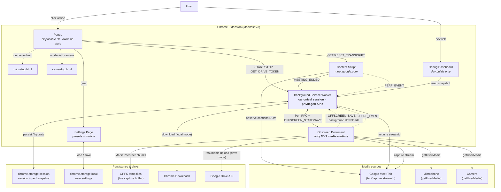
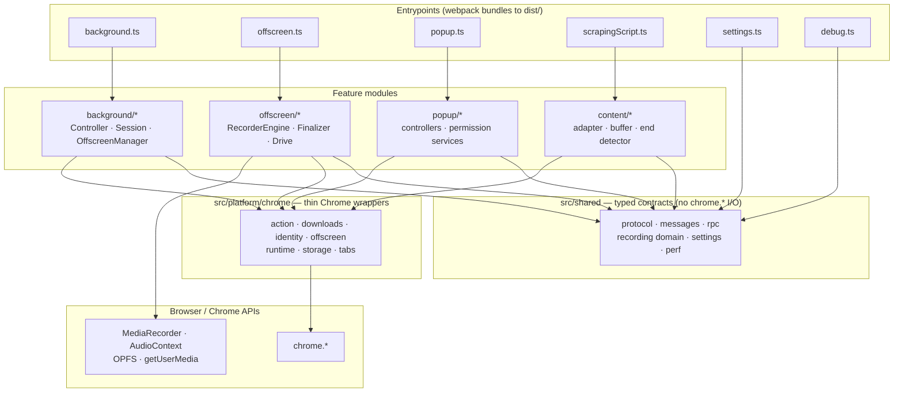
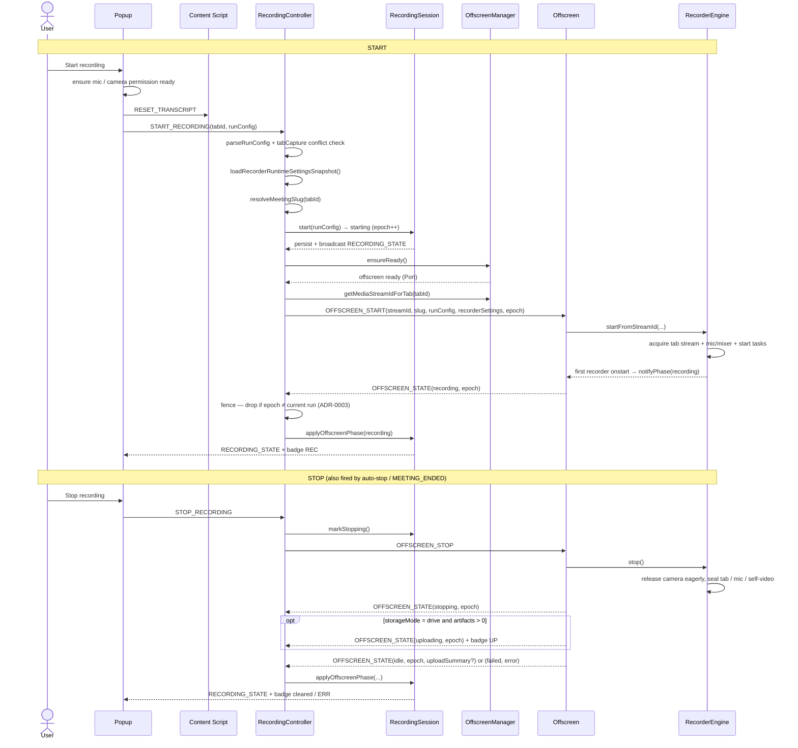
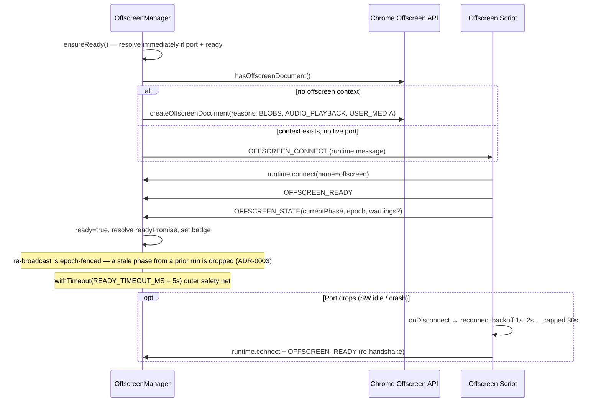
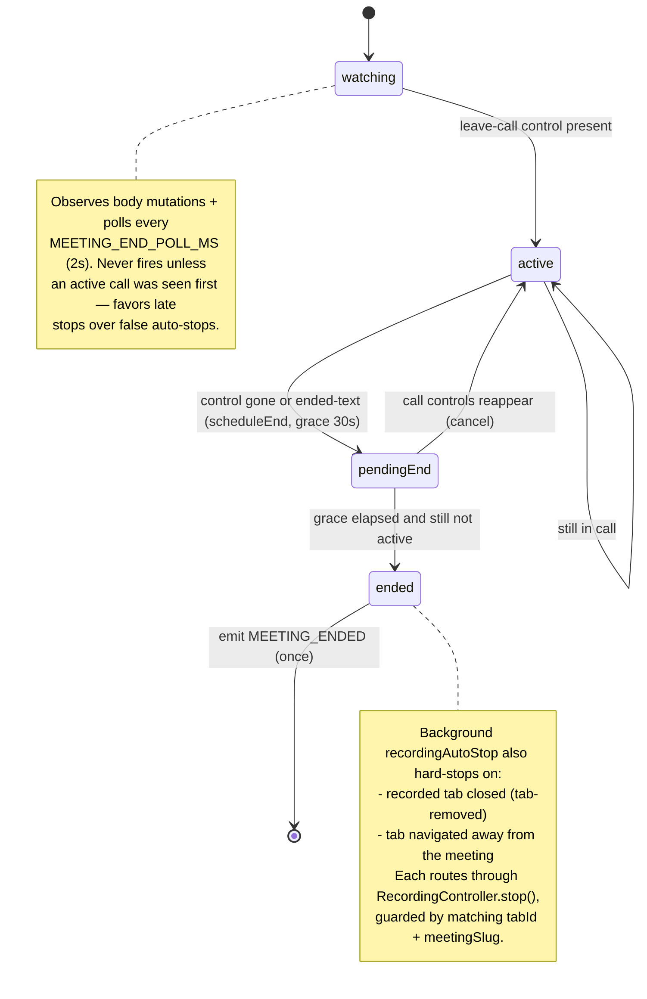
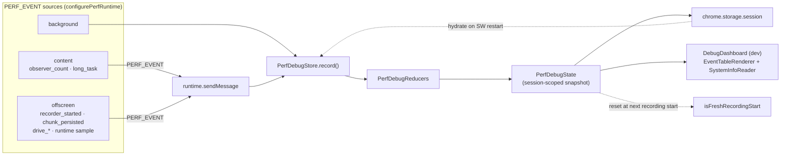

# Meeting Recording Extension (Chrome Extension)

**Copyright (c) 2026 Kostiantyn Stroievskyi. All Rights Reserved.**

No permission is granted to use, copy, modify, merge, publish, distribute, sublicense, or sell copies of this software or any portion of it, for any purpose, without explicit written permission from the copyright holder.

---

Scrape live captions from a Google Meet into a timestamped `.txt` transcript, or record the current Meet tab (video + system audio) — plus an optional microphone and camera — to `.webm` files. Save locally or straight to Google Drive.

Everything runs in your browser. Capture is **local-first**: recording data streams to the Origin Private File System (OPFS) during the call and is finalized to a download or Drive only after you stop. No audio or video leaves your device while you're recording.

## Why this extension

- **Private by design** — nothing leaves the device during capture, and transcripts live only in the page until you explicitly download them.
- **Built for long meetings** — chunks stream to disk continuously, so memory stays flat on multi-hour recordings instead of growing until the tab crashes.
- **Efficient encoding** — the camera bitrate adapts to the frame Chrome actually delivers (and defaults to 24 fps for a talking head), and the tab bitrate follows its content type — so files and CPU stay low with no visible quality loss.
- **Flexible per run** — microphone off / mixed / separate, optional camera, screen-vs-video tab quality, and local-or-Drive, all chosen per recording.
- **Adjust without stopping** — mute the mic, hide the camera, or pause/resume the whole recording mid-call; paused spans are cut so the files resume as a seamless join.
- **Resilient** — survives service-worker eviction, and recovers the captured file (and resumes interrupted Drive uploads) on the next launch after a crash or power loss.

---

## Features

**Transcript saver** — parses Meet's live captions into a timestamped `.txt`. Turn captions on in Meet, then hit Download Transcript at any point during or after the call.

**Tab recorder** — captures the Meet tab (video + system audio) to `.webm` via `MediaRecorder`. The resolution preset is the capture *ceiling*; the file reflects what Chrome actually delivers. A **per-recording tab content type** (`Screen` vs `Video`) sets the bitrate target — `Screen` for slides/UI/whiteboards (sharp text, small files), `Video` for motion-heavy content.

**Direct-to-disk streaming** — chunks stream continuously to OPFS during capture, keeping memory bounded to a small working buffer. If the disk falls behind, a soft warning fires first and a hard ceiling triggers a protective stop that seals what was captured — so memory stays bounded even on a slow or failing disk, and a 2-hour+ meeting never crashes the tab.

**Explicit microphone modes** — chosen per run:

- `Off` — no microphone capture
- `Mix into tab recording` — mic audio is blended into the main tab file via a real Web Audio graph
- `Save separately` — mic is recorded as a second `.webm` artifact

**Optional self-video capture** — record your camera feed to its own `.webm`. A constraint ladder (exact size+FPS → exact size with bounded FPS → best-effort) keeps it working across cameras, and the encoded resolution is enforced to your preset even when Meet holds the camera open at a higher one (Chrome otherwise records the shared native buffer; a toggle opts out to keep Meet's auto-resolution). The camera bitrate is fully automatic — it adapts to the delivered frame so the camera never wastes bits.

**Live recording controls** — adjust a recording in place, without stopping it:

- **Mute / unmute the microphone** — records true digital silence for the muted span (the mic track stays live, so the timeline never breaks). Works in both `mixed` and `separate` mic modes.
- **Hide / show the camera** — records black frames while hidden, on the separate self-video file.
- **Pause / resume the whole recording** — pauses every stream (tab, mic, camera) at once. The paused span is **not** written, so the files resume as a **seamless join** — before and after are stitched directly together, with no black/blank/frozen filler. Tracks stay live so resume is instant.

**State-driven popup** — a different layout per phase: a clean **configuration** screen before recording, a **recording** screen with a red banner, a pause-aware elapsed **timer** (counts recorded time only — it freezes on pause and equals the saved file's duration), live **status chips** (a Transcript indicator that tracks whether Meet captions are actually on, plus the storage target), mic/camera **toggle rows**, and a **finalizing** screen with the run summary.

**Local or Google Drive output** — finalized files download locally or upload to `Google Meet Records/<meeting-id>-<timestamp>/` in your Drive, with an upload progress indicator. Drive uploads use resumable sessions and fall back per-file to a local download if an individual upload fails.

**MV3 / offscreen architecture** — recording runs in a hidden offscreen document, the only MV3 context Chrome allows `MediaRecorder` and `AudioContext`. The background service worker keeps the run alive and rehydrates session state from `chrome.storage.session` after Chrome suspends and restarts it.

**Diagnostics dashboard** (dev builds) — aggregates structured perf events from every runtime context: recorder start latency, chunk persistence, audio-bridge behavior, Drive upload timings, memory, event-loop lag, and long tasks (offscreen and the Meet-tab main thread).

---

## Requirements

- **Google Chrome** (or Chromium-based browser) with Manifest V3 and the Offscreen API. Chrome 116+ is sufficient.
- **Node.js 18+** and **npm** to build the extension.
- **FFmpeg and FFprobe** for performance E2E artifact analysis.

The extension requests the following Chrome permissions: `activeTab`, `downloads`, `tabCapture`, `offscreen`, `storage`, `tabs`, `desktopCapture`

Drive mode additionally requires: `identity` and host access to `https://www.googleapis.com/*`.

---

## Quick start

```bash
# 1. Clone and install
git clone https://github.com/kstroevsky/chrome-meeting-recording-extension.git
cd chrome-recording-transcription-extension
npm install

# 2. Build
npm run build          # outputs to ./dist

# 3. Load into Chrome
#    chrome://extensions → Developer mode ON → Load unpacked → select ./dist
```

> If you plan to use Drive mode, create `.env` from `.env.example` and set `GOOGLE_OAUTH_CLIENT_ID` before building. See [Google Drive setup](#google-drive-setup).

Open a Google Meet, click the extension icon, and you're ready to record or download transcripts.

---

## Detailed build setup

### 1. Install Node

- macOS: `brew install node`
- Ubuntu/Debian: `sudo apt-get install -y nodejs npm`
- Verify: `node -v && npm -v`

### 2. Install dependencies

```bash
npm install
```

### 3. Build

```bash
npm run build       # production build — minified, output to dist/
npm run dev         # development build — unminified, with source maps
npm run watch       # rebuild on every file change (development)
```

All three commands compile TypeScript via `ts-loader`, copy HTML shells and the manifest from `static/`, and emit a flat extension layout to `dist/`.

### 4. Load the extension

- Visit `chrome://extensions`
- Turn on **Developer mode** (top-right toggle)
- Click **Load unpacked** and select the `dist/` directory

> After each `watch` rebuild, click **Reload** on the extension in `chrome://extensions`. For service worker or manifest changes, a full extension reload is required. For content-script-only changes, refreshing the Google Meet tab may be enough.

---

## Using the extension

1. Open a Google Meet at `https://meet.google.com/...`
2. (For transcripts) turn on **Captions** in the Google Meet UI.
3. Click the extension icon in the Chrome toolbar (pin it from the puzzle-piece menu for quick access).

### Transcript

**Download Transcript** — saves `google-meet-transcript-<meeting-id>-<timestamp>.txt` from the buffered live captions. Captions must be enabled in Google Meet before the meeting or the buffer will be empty.

### Recording

**Enable Microphone** — click this before starting a recording if you want to use any mic mode. The popup prompt may not appear reliably; if it fails, the button opens a dedicated `micsetup.html` page where you can click **Enable** and grant mic access. Once granted, the label changes to **Microphone Enabled**.

**Microphone Mode** — controls mic capture for the upcoming recording:

- `Off` — no microphone capture.
- `Mix into tab recording` — your mic is blended into the main tab recording via an audio graph. No separate mic file is created.
- `Save separately` — a second `.webm` artifact is created for the mic stream only.

**Storage Mode** — `Local Disk` or `Google Drive`. Drive uploads happen after you stop recording, not during capture.

**Record my camera separately** — if checked, starts an additional camera-only recorder. If camera permission is missing when you click Start, a `camsetup.html` tab opens so you can grant access. Camera quality is controlled by the extension settings page, not Google Meet's own video setting.

**Start Recording** — begins capturing the current tab (video + system audio). The extension asks Chrome for the selected tab resolution preset as the capture ceiling. Actual resolution still depends on Chrome tab-capture behavior and what Meet renders into the tab.

**Stop Recording** — releases the extension-owned camera immediately, seals all active recorders, and runs the finalization pipeline. The extension also stops the active run if the recorded tab closes, navigates away from the meeting, or the Meet page stays in an ended-call state for 30 seconds. In local mode a file download begins. In Drive mode the popup passes through an `uploading` phase before returning to idle.

### The popup is state-driven

The popup renders one of three layouts depending on the current recording phase, so each screen only shows the controls that make sense for that state:

- **Configuration** (idle) — the setup screen above: microphone mode, storage, "record my camera separately", Download Transcript, Enable Mic, and **Start Recording**. None of the in-recording controls appear here.
- **Recording** (recording / paused) — a red **Recording** banner (amber **Paused** when paused) with a live elapsed **timer**, two status chips (**Transcript on/off** and the storage target), a **Microphone** row and a **Camera** row each with an on/off toggle, and **Pause** + **Stop**.
- **Finalizing** (stopping / uploading) — a spinner with the run summary: storage target, recorded duration, microphone mode, and whether the camera was separate, plus "you can close this popup".

**The live timer is pause-aware.** It counts only *recorded* time: it freezes while paused and stops at stop, so the number you see equals the duration of the saved file. It is computed from authoritative timing on the session, so reopening the popup mid-recording shows the correct elapsed time.

**The Transcript chip reflects live captions.** While recording, the popup polls the active Meet tab and shows *Transcript on* only while Google Meet's captions region is actually present (dimmed *Transcript off* otherwise).

**Live controls (recording view)** — these act on the running recording in place and never interrupt it:

- **Microphone toggle** — shown when the run uses a microphone (`mixed` or `separate`). Switching it off records true silence for as long as it stays off; switching back on resumes live audio. A rejected toggle leaves the recording untouched.
- **Camera toggle** — shown when the run records the camera separately. Off records black frames; on resumes the live camera.
- **Pause / Resume** — pauses the entire recording (tab + mic + camera). While paused nothing is recorded — the banner reads **Paused**, the timer freezes, and **Stop** still works — and on Resume the files continue as a seamless join, with the paused time absent rather than filled with a blank or frozen gap. Reopening the popup while paused still shows **Resume**.

> The extension badge shows `REC` while recording and `UP` while uploading to Drive.

---

## Settings page

Open the settings page by clicking the gear icon in the popup. Settings persist across sessions via `chrome.storage.local`.

| Setting | Description |
| :--- | :--- |
| Tab capture preset | Output resolution for the tab recording: `640×360`, `854×480`, `1280×720`, or `1920×1080` |
| Tab video bitrate | Encoder bitrate at the `1920×1080`@30 reference; the recorder scales it down automatically for smaller tab presets / frame rates |
| Camera capture preset | Output resolution for the self-video recording, same preset options |
| Prefer the automatically selected resolution | When on, the camera is recorded at whatever resolution Chrome/Meet already selected instead of re-encoding it to the camera preset above — skips the per-frame resize work. Off by default |

The tab and camera capture presets control what size the final file targets, not what resolution Chrome delivers from the source. Actual resolution depends on Chrome, camera hardware, and sharing limits. The popup and debug dashboard warn when the delivered profile differs from the requested one.

Every settings field shows a tooltip (click the label) with a short operational explanation.

Legacy stored width/height values from previous extension versions are normalized to the nearest supported preset on settings load.

---

## Output files

All filenames include the Google Meet meeting ID suffix and a UTC timestamp.

| Artifact | Filename pattern |
| :--- | :--- |
| Tab recording | `google-meet-recording-<meet-suffix>-<timestamp>.webm` |
| Microphone (separate mode) | `google-meet-mic-<meet-suffix>-<timestamp>.webm` |
| Self-video | `google-meet-self-video-<meet-suffix>-<timestamp>.webm` |
| Transcript | `google-meet-transcript-<meet-suffix>-<timestamp>.txt` |

In Drive mode, all artifacts for one recording session are uploaded to a per-recording folder: `Google Meet Records/<meeting-id>-<timestamp>/`.

---

## Google Drive setup

Drive mode requires a **Chrome Extension** OAuth 2.0 client. A Desktop or Web client type will not work with `chrome.identity.getAuthToken`.

1. In the [Google Cloud Console](https://console.cloud.google.com/), enable the **Google Drive API** for your project.
2. Configure an **OAuth consent screen** and add the scope `https://www.googleapis.com/auth/drive.file`.
3. Load the extension into Chrome (`chrome://extensions` → Load unpacked → `dist/`) and note your extension ID.
4. Create an **OAuth 2.0 client** with **Application type: Chrome Extension** and enter the exact extension ID.
5. Create a `.env` file at the repo root (copy from `.env.example`) and set:

   ```
   GOOGLE_OAUTH_CLIENT_ID=<your-chrome-extension-oauth-client-id>
   ```

   If the variable is missing, the build succeeds with a placeholder client ID, but Drive auth will fail at runtime.
6. Rebuild: `npm run build` or `npm run watch`. Webpack injects the client ID into `dist/manifest.json`.
7. Reload the extension in Chrome after rebuilding.

**Keep a stable extension ID** — the `key` field in `static/manifest.json` is checked into this repo and pins the extension ID. If the key changes, the extension ID changes and the OAuth client must be recreated for the new ID. The webpack build emits the runtime manifest to `dist/manifest.json`.

### Other Chromium browsers (Edge, Brave, Opera, …)

`chrome.identity.getAuthToken` is Chrome-only, so the rest of the Chromium family signs in via `chrome.identity.launchWebAuthFlow` against a **Web application** OAuth client (ADR-0002). Build per target — `npm run build:brave`, `build:edge`, `build:opera` — which emit to `dist-<target>/`. All Chromium targets keep the **same `key`**, so they share one extension ID and therefore **one redirect URI**.

1. Create an **OAuth 2.0 client** with **Application type: Web application**, enable the Drive API, and add the `drive.file` scope on the consent screen (add yourself as a test user while the app is unverified).
2. Get the redirect URI to register: `npm run redirect-uri` prints `https://<id>.chromiumapp.org/`. Add that exact value (trailing `/` included) to the client's **Authorized redirect URIs**.
3. In `.env`, set `GOOGLE_WEB_OAUTH_CLIENT_ID` and `GOOGLE_WEB_OAUTH_CLIENT_SECRET` (for a Desktop/Web client the secret is shipped in the non-Chrome bundle and never in the Chrome bundle).
4. Build the target, load `dist-<target>/` unpacked, and sign in.

Each **store-published** build (Chrome Web Store, Edge Add-ons) gets its own store-assigned ID; add that build's `https://<id>.chromiumapp.org/` to the same OAuth client. The `redirect-uri` script covers the stable unpacked/dev ID.

**Drive folder structure** — Drive mode auto-creates:

- Root folder: `Google Meet Records` (created once, reused)
- Per-recording folder: `<meeting-id>-<timestamp>` (created fresh each run)

---

## Scripts

| Command | Description |
| :--- | :--- |
| `npm run build` | Production build to `dist/` (minified, Chrome target) |
| `npm run build:edge` / `build:brave` / `build:opera` | Per-browser production build to `dist-<target>/` (drops Chrome-only `oauth2`/`key`; auth via `launchWebAuthFlow`) |
| `npm run dev` | Development build to `dist/` (unminified, source maps) |
| `npm run watch` | Rebuild on every file save (development) |
| `npm run typecheck` | Strict TypeScript check across `src/` without emitting |
| `npm run typecheck:e2e` | TypeScript check for Playwright specs and helpers |
| `npm run lint` | Alias for `typecheck` |
| `npm test` / `npm run test:unit` | Unit test suite (skips E2E) |
| `npm version patch\|minor\|major` | Bump the release version (single source of truth) and tag the commit |
| `npm run release:build` | Production build to `dist/` then the production guards (version + no E2E markers) |
| `npm run test:e2e` / `npm run test:e2e:mock` | Functional mocked-Meet E2E plus performance smoke |
| `npm run test:e2e:perf:smoke` | Three critical browser/extension performance cases |
| `npm run test:e2e:perf:full` / `npm run test:e2e:perf` | Complete pairwise matrix and repeated benchmarks |
| `npm run test:e2e:perf:endurance` | Ten-minute local and two-minute throttled-Drive runs |
| `npm run test:e2e:perf:hardware` | Headed physical microphone/camera tier |
| `npm run test:production-guards` | Proves E2E capture, fake OAuth, and Drive bridge markers are absent from `dist/` |
| `npm run test:e2e:real:profile` | Prepare or verify the persistent signed-in Chrome profile |
| `npm run test:e2e:real -- <meet-url>` | One-admission real Google Meet scenario matrix |
| `npm run test:e2e:live -- <meet-url>` / `npm run test:real-meet -- <meet-url>` | Compatibility aliases for the real-Meet suite |

### Versioning and releasing

There are two independent version identifiers; do not conflate them:

- **Build ID** (`globalThis.__BUILD_ID__`) is a content hash stamped into every bundle by webpack. It changes on every code change and drives the service-worker ↔ offscreen skew handshake and the on-update reload. It is fully automatic — never set it by hand.
- **Release version** (semver) lives in **`package.json` only — the single source of truth.** `dist/manifest.json`'s `version` is *derived* from it at build time (`transformManifest` in `webpack.config.js`), so the two cannot drift. The `version` in `static/manifest.json` is an ignored `0.0.0` placeholder.

To cut a release:

```bash
npm version patch   # or minor / major — bumps package.json and creates the git tag
npm run release:build   # production build + guards (asserts the derived version)
git push --follow-tags  # publish the tag when you are ready
# then zip ./dist and upload to the Chrome Web Store
```

`npm version` requires a clean working tree (commit or stash first) and runs the `preversion` gate — `typecheck` plus the unit suite — before it bumps and tags, so a release can't be cut over failing checks. It also keeps `package-lock.json` in sync automatically.

Chrome requires the manifest `version` to be 1–4 dot-separated integers and to strictly increase on each store upload. `npm version` guarantees the increment; the build coerces any semver pre-release tag (e.g. `1.4.0-beta.2`) down to the numeric `1.4.0` for `version` while preserving the full string in `version_name`. The `1.4.0-beta.2` form would collide with `1.4.0` at upload — use a numeric build segment for pre-release channels.

Two end-to-end testing scenarios exist:

- **Scenario A** — the deterministic mocked-Meet Playwright suite and CI gate: functional tests, the performance matrix, mocked Drive, media analysis, and the physical camera/microphone tier. See the [Scenario A guide](docs/testing-scenario-a.md).
- **Scenario B** — manual real Google Meet calibration in stable Chrome with a signed-in account, real `chrome.tabCapture`, and real devices. See the [Scenario B guide](docs/testing-scenario-b.md).

### Real Google Meet (Scenario B)

Scenario B drives the **real** production Meet in stable Chrome with a signed-in account, real `chrome.tabCapture`, and the real camera/microphone used concurrently by Meet and the extension. It is a manual, headed tier — a host admits the test account — and is **not** a CI gate.

```bash
npm run test:e2e:real:profile                                  # one-time: sign in + install the extension
npm run test:e2e:real -- https://meet.google.com/abc-defg-hij  # run the live matrix
```

It requires OS camera/microphone access for Google Chrome and **Accessibility** permission for the launching terminal/app, because the suite starts recording with a real `Control+Shift+9` keystroke so Chrome grants `activeTab` to `tabCapture`. Validated recordings are saved as named `.webm` files under `output/real-meet/recordings/`.

Full setup, OS permissions, Google login, run options, scenarios, named recordings, reports, and troubleshooting are in the [Scenario B guide](docs/testing-scenario-b.md).

---

## How it works

```
User
 ├─ Popup ────────────────────────────────► Background Service Worker
 │    START_RECORDING / STOP_RECORDING        │   canonical state owner · MV3 keep-alive · re-hydrates after suspend
 │    GET_TRANSCRIPT → Content Script          ├─ RecordingController    single start/stop orchestrator (one seam)
 │                                             ├─ RecordingSession       phase state machine (idle…uploading…failed)
 │                                             ├─ OffscreenManager       reconnecting Port RPC + action badge
 │                                             ├─ recordingAutoStop      tab closed / navigated / MEETING_ENDED
 │                                             ├─ driveAuth              OAuth token (silent → interactive)
 │                                             ├─ PerfDebugStore         aggregates PERF_EVENTs
 │                                             └─ Offscreen Document  ◄── only MV3 context allowed media APIs
 │                                                 │   OFFSCREEN_START/STOP ▸ OFFSCREEN_READY/STATE/SAVE
 │                                                 ├─ RecorderEngine (facade + state machine)
 │                                                 │   ├─ TabRecorderTask       ◄── tabCapture streamId (video + system audio)
 │                                                 │   ├─ MicRecorderTask       ◄── getUserMedia(microphone)
 │                                                 │   ├─ SelfVideoRecorderTask ◄── getUserMedia(camera)
 │                                                 │   └─ MixedAudioMixer / AudioPlaybackBridge (AudioContext audio graph)
 │                                                 ├─ StorageTarget: WorkerStorageTarget (OPFS sync-handle worker) ▸ LocalFileTarget (OPFS) ▸ InMemory fallback
 │                                                 └─ RecordingFinalizer (runs only after capture stops)
 │                                                     ├─ local : blob URL ─OFFSCREEN_SAVE→ Chrome Downloads API
 │                                                     └─ drive : DriveTarget ─resumable upload→ Google Drive API
 │
 ├─ Content Script (meet.google.com tab)
 │    ├─ GoogleMeetAdapter → CaptionBuffer ─(GET_TRANSCRIPT)→ Popup
 │    └─ MeetingEndDetector ─MEETING_ENDED→ Background (auto-stop)
 │
 └─ Debug Dashboard (dev builds) ─reads aggregated perf snapshot→ Background

State persistence:  chrome.storage.session → RecordingSessionSnapshot + perf snapshot   ·   chrome.storage.local → user settings
```

1. **Content script** observes the Google Meet caption DOM, debounces speech fragments into committed transcript lines, and serves them on demand.
2. **Popup** collects user intent (run config), checks permissions, and sends commands to the background worker.
3. **Background service worker** owns session state, coordinates the offscreen document, acquires the tab capture stream ID, and handles local downloads.
4. **Offscreen document** runs the recorder engine, streams chunks to OPFS, and drives the post-stop finalization pipeline (local save or Drive upload).

---

## Dependencies and toolchain

**Runtime dependency**

| Package | Purpose |
| :--- | :--- |
| `webm-duration-fix` | Patches missing `MediaRecorder` duration metadata by streaming the file (no whole-file load into memory) and adds seek cues; runs inside the OPFS storage worker. Replaced `fix-webm-duration`, which loaded the entire file into the JS heap at finalize |

**Development dependencies**

| Package | Purpose |
| :--- | :--- |
| `typescript` | TypeScript compiler (target: ES2020) |
| `webpack` / `webpack-cli` | Module bundler |
| `ts-loader` | TypeScript loader for webpack |
| `copy-webpack-plugin` | Copies `static/` assets into `dist/` |
| `clean-webpack-plugin` | Cleans `dist/` before each build |
| `@types/chrome` | Chrome extension API type definitions |
| `@types/node` | Node.js type definitions |
| `jest` / `ts-jest` | Test runner and TypeScript Jest transform |
| `jest-environment-jsdom` | DOM environment for unit tests |
| `@types/jest` | Jest type definitions |
| `playwright` | Browser automation for E2E tests |
| `puppeteer` / `puppeteer-core` | Alternative browser automation for E2E |
| `@types/puppeteer` | Puppeteer type definitions |

---

## Permissions explained

| Permission | Why it is needed |
| :--- | :--- |
| `activeTab` | Query the active tab to target and label the recording |
| `tabs` | Query tab metadata needed for stream acquisition and labeling |
| `downloads` | Save transcript and recording files locally via Chrome's Downloads API |
| `tabCapture` / `desktopCapture` | Capture video and audio from the current tab |
| `offscreen` | Create a hidden offscreen document to run `MediaRecorder` (not available in MV3 service workers) |
| `storage` | Persist ephemeral session state for UI sync and service worker recovery after suspension |
| `identity` | Authenticate the user silently to write to Google Drive (Drive mode only) |
| `host: meet.google.com/*` | Scope the content script to Google Meet pages |
| `host: googleapis.com/*` | Allow Drive API requests during post-stop upload (Drive mode only) |
| `system.cpu` | **Dev builds only** — system CPU% for the diagnostics dashboard; injected into the manifest only in development builds, never requested in production |

---

## Troubleshooting

**I don't see any transcript text.**

- Enable **Captions** in the Google Meet UI before or during the meeting.
- The extension only scrapes from `https://meet.google.com/*`.
- Reload the Google Meet page after loading or reloading the extension.

**"Failed to start recording: Offscreen not ready" or similar.**

- Open `chrome://extensions`, click **Reload** on the extension, then try again.
- Ensure Chrome is up to date (MV3 + Offscreen API require Chrome 116+).
- Some enterprise policies can block offscreen documents — check with your admin if applicable.

**No microphone audio in the recording.**

- Click **Enable Microphone** in the popup before starting. If the inline prompt fails, a mic setup tab opens — click **Enable** there and allow access.
- Check OS mic permissions for Chrome: `System Settings → Privacy & Security → Microphone`.

**Recording is silent or very quiet.**

- Make sure the Google Meet tab is playing audio (the tab is not muted and Meet audio is not muted).
- If a microphone mode is enabled, confirm the OS input device and volume levels.

**Stop Recording finishes but no file appears.**

- Check the Chrome Downloads panel (`chrome://downloads`).
- If **Ask where to save each file** is enabled in Chrome settings, a save dialog appears — it may be behind other windows.
- Some download manager extensions can interfere. Disable them and retry.

**Popup buttons are not enabling or disabling correctly.**

- The popup reflects state broadcast from the background worker. If it falls out of sync, stop any active recording, then click **Reload** on the extension in `chrome://extensions`.

**`Token fetch failed ... bad client id` when saving to Drive.**

- Google rejected the `manifest.oauth2.client_id`.
- Verify the OAuth credential type is **Chrome Extension** (not Web, Desktop, or Installed).
- Verify the client was created for the exact extension ID shown in `chrome://extensions`.
- Verify the consent screen includes the scope `https://www.googleapis.com/auth/drive.file` and your account is listed as a test user if the app is in Testing mode.
- Rebuild (`npm run build`) after editing `.env`, reload the extension, and retry.

**`Drive session init failed: 403`.**

- Open the extension service worker console and read the full Google API error text.
- `insufficientPermissions` / `scope` — re-consent and verify the Drive scope is configured.
- `accessNotConfigured` / `Drive API has not been used` — enable the Drive API in the same Google Cloud project as your OAuth client.
- Test user or consent restrictions — add your account to OAuth test users or publish the consent screen.

---

## Development tips

- Use `npm run watch` during iteration. Changes rebuild automatically; you still need to click **Reload** in `chrome://extensions` for service worker or manifest changes.
- **Background / service worker logs**: `chrome://extensions` → your extension → **service worker** → **Inspect**.
- **Offscreen logs**: visible in the same service worker console under `[offscreen]` prefix.
- **Content script logs**: open DevTools in the Google Meet tab → **Console**.
- **Diagnostics dashboard**: in a dev build, the popup shows a link to the debug dashboard, which renders the aggregated perf snapshot for the current session (recorder start latency, chunk sizes, Drive upload timings, event-loop lag, long tasks).
- **Google Meet DOM selectors** live in `src/content/GoogleMeetAdapter.ts`. If transcripts stop working after a Meet UI update, start there.
- **Drive mode without a real OAuth client**: set `GOOGLE_OAUTH_CLIENT_ID` to any non-empty string before building to suppress the build warning. Drive auth will still fail at runtime, but the build and all non-Drive features work normally.

---
---

# Architecture Reference

---

## Architecture overview

The extension is built around Manifest V3 constraints. Four runtime contexts own strictly separated responsibilities — nothing bleeds across context boundaries:

- The **background service worker** owns orchestration and privileged Chrome APIs.
- The **offscreen document** owns media APIs and OPFS-backed file writing.
- The **popup** is disposable and never owns recording state.
- The **content script** owns transcript collection inside the Meet page.

Recording state is canonical in the background. The offscreen document is the only context that can run `MediaRecorder` and `AudioContext` under MV3. Closing the popup never stops a recording.

---

## Module guide

Per-module documentation lives in each module's `README.md` — the *why*, invariants, and gotchas, scoped to that directory. This root reference keeps only the **cross-cutting** picture (the layering/flow diagrams below, the message contract, the end-to-end flows).

| Module | README | Owns |
| :--- | :--- | :--- |
| Background (control plane) | [`src/background`](src/background/README.md) | SW lifecycle, session state machine, watchdog, control-plane orchestration |
| Offscreen (data plane) | [`src/offscreen`](src/offscreen/README.md) | the recording runtime + stop→finalize composition |
| &nbsp;&nbsp;└ Recorder engine | [`src/offscreen/engine`](src/offscreen/engine/README.md) | capture→encode pipeline, audio graph, live controls |
| &nbsp;&nbsp;└ Storage | [`src/offscreen/storage`](src/offscreen/storage/README.md) | OPFS streaming, fallback ladder, crash recovery |
| &nbsp;&nbsp;└ Drive | [`src/offscreen/drive`](src/offscreen/drive/README.md) | resumable upload, OAuth use, recovery |
| Shared kernel | [`src/shared`](src/shared/README.md) | recording state model + `projectPhase`, messaging substrate |
| &nbsp;&nbsp;└ Settings | [`src/shared/settings`](src/shared/settings/README.md) | the config schema + derive pipeline |
| Popup | [`src/popup`](src/popup/README.md) | state-driven control UI, permission readiness |
| Content | [`src/content`](src/content/README.md) | Meet transcript scraping, meeting-end detection |
| Debug | [`src/debug`](src/debug/README.md) | the diagnostics dashboard |
| Platform | [`src/platform`](src/platform/README.md) | browser-abstraction layer ([chrome seam](src/platform/chrome/README.md), [auth capability](src/platform/capabilities/README.md)) |

Also: [`tests/`](tests/README.md) · [`scripts/`](scripts/README.md) · [`static/`](static/README.md) · [`docs/`](docs/README.md) · [module-README conventions](docs/agents/module-readmes.md).


## Design principles

- **Local-first capture** — live recording data is always written to local storage targets first. Google Drive upload starts only after capture is sealed.
- **Single active session** — one canonical session snapshot is persisted in `chrome.storage.session`. There is no distributed state across context globals.
- **Typed contracts** — popup/background/offscreen/content communication is defined in shared protocol types. Untyped message passing is not used.
- **Extension-first boundaries** — Chrome APIs are wrapped behind small platform adapters in `src/platform/chrome/*`. Business modules do not call `chrome.*` directly.
- **Post-stop persistence** — Google Drive upload begins only after `RecorderEngine.stop()` returns sealed artifacts. Real-time capture stability is never coupled to network conditions.

---

## Runtime contexts

### Background Service Worker

Files: `src/background.ts`, `src/background/*`

**Purpose:**

- Own the extension control plane.
- Receive commands from popup.
- Keep recording lifecycle state durable across service worker restarts.
- Create and reconnect the offscreen document.
- Broker local download requests and Drive token requests.

**Key responsibilities:**

- Maintains the canonical `RecordingSession`.
- Persists the session snapshot under `recordingSession` in `chrome.storage.session`.
- Keeps the worker alive while a session is in a busy phase (`starting`, `recording`, `stopping`, `uploading`).
- Bridges offscreen events into popup updates.
- Handles `OFFSCREEN_SAVE` by triggering `chrome.downloads.download`.
- Hydrates legacy session keys (`phase`, `activeRunConfig`) when present so old in-session state is not lost during migration.

**Module decomposition:**

- `src/background/RecordingController.ts` — single start/stop orchestrator for the recording control plane. Owns the start/stop decisions, the session transitions they imply, and the `OFFSCREEN_START`/`OFFSCREEN_STOP` RPC handshake. Every trigger — popup commands, auto-stop tab listeners, and the content-script meeting-ended signal — drives recording through this one seam.
- `src/background/recordingAutoStop.ts` — conservative automatic stop triggers. `registerRecordingAutoStop` binds tab-removed / tab-updated listeners (recorded tab closed or navigated away from the meeting); `handleMeetingEndedMessage` handles the content-script `MEETING_ENDED` signal. Both call into `RecordingController.stop()`.
- `src/background/messageHandlers.ts` — routes popup messages, delegating `START_RECORDING`/`STOP_RECORDING` to `RecordingController` and serving `GET_RECORDING_STATUS` and `GET_DRIVE_TOKEN`; also forwards the content-script `MEETING_ENDED` message to the auto-stop handler. Owns `successResult`/`failureResult` helpers.
- `src/background/sessionLifecycle.ts` — manages the service-worker keep-alive loop (`startKeepAlive` / `stopKeepAlive`) and perf-diagnostics clearing driven by session phase transitions. Isolates all `setInterval` keep-alive logic.
- `src/background/legacySession.ts` — hydrates old single-key session storage shapes (`phase`, `activeRunConfig`) into the current `RecordingSessionSnapshot` layout so in-flight sessions are not lost during extension upgrades.
- `src/background/perf/PerfDebugReducers.ts` — reduces incoming `PERF_EVENT` messages into the debug snapshot state.
- `src/background/perf/PerfDebugState.ts` — defines the mutable debug snapshot shape and its initialization / clearing helpers.

### Offscreen Document

Files: `static/offscreen.html`, `src/offscreen.ts`, `src/offscreen/rpcHandlers.ts`

**Purpose:**

- Own all browser APIs unavailable in MV3 service workers:
  - `getUserMedia`
  - `MediaRecorder`
  - `AudioContext`
  - OPFS (`navigator.storage.getDirectory()`)

**Key responsibilities:**

- Maintains a reconnecting `chrome.runtime.Port` to background.
- Runs `RecorderEngine`.
- Streams chunks to a storage target during capture — by default an OPFS sync-access-handle Worker, so disk writes stay off the offscreen main thread.
- Runs `RecordingFinalizer` after stop.
- On startup (while idle), runs crash recovery — resumes interrupted Drive uploads and recovers orphaned recordings left by a previous crash (see [6.1 Resilience and crash recovery](#61-resilience-and-crash-recovery)).
- Emits explicit runtime phase updates back to background: `starting`, `recording`, `stopping`, `uploading`, `failed`, `idle`.

**Entrypoint decomposition:**

- `src/offscreen.ts` — runtime shell: port connect/reconnect, perf sampling loop, long-task diagnostics, finalize orchestration.
- `src/offscreen/rpcHandlers.ts` — wires all background→offscreen RPC and runtime messages (`OFFSCREEN_START`, `OFFSCREEN_STOP`, `REVOKE_BLOB_URL`, `OFFSCREEN_CONNECT`) to their handlers, keeping the entrypoint focused on setup and sampling rather than message dispatch.

### Popup

Files: `static/popup.html`, `src/popup.ts`, `src/popup/*`

**Purpose:**

- Collect user intent and render current session state.

**Key responsibilities:**

- Builds a `RecordingRunConfig`.
- Resets transcript buffer before a new recording starts.
- Enforces microphone and camera permission readiness.
- Reflects session state sent from background.
- Downloads transcript text returned by the content script.

**Important property:** The popup is disposable. Closing it does not stop recording or upload.

### Content Script

File: `src/scrapingScript.ts`, `src/content/*`

**Purpose:**

- Observe the Google Meet DOM and accumulate caption transcript text.

**Key responsibilities:**

- Detects the captions region when it appears.
- Observes speaker blocks and incremental text updates.
- Debounces speech fragments into committed transcript lines via `captionBuffer.ts`.
- Serves transcript requests from popup.
- Uses a provider adapter abstraction instead of hard-coding Meet logic into the collector itself.
- Detects meeting end (`MeetingEndDetector`) and signals the background for auto-stop.

**End-detector coalescing (F8):** `MeetingEndDetector` observes the page for the meeting ending, but its DOM observer wakes only on structural changes (`childList`/`subtree`), **not** `characterData` — live caption text mutates the body almost every frame, and re-running the doc-wide leave-call `querySelector` on each was pure waste. Mutation bursts are further coalesced to one throttled evaluation (`MEETING_END_OBSERVER_THROTTLE_MS`). A 2 s poll backstop and 30 s grace own detection latency, so the throttle costs nothing on correctness.

---

## Canonical domain model

→ The recording domain model — `RecordingRunConfig`, the full `RecordingSessionSnapshot`, the derived `phase` (`projectPhase`), and the legacy migration — is documented with the code that owns it: **[`src/shared`](src/shared/README.md)**.

## Architecture components

### 1. Recording Session State Machine

→ The canonical state machine (writes `desired`/`observed`/`failed`, derives `phase`): **[`src/background`](src/background/README.md)**.

### 1.1 Recording Control Plane Orchestrator

→ The start/stop orchestration (`RecordingController`): **[`src/background`](src/background/README.md)**.

### 2. Offscreen Lifecycle Manager

→ `OffscreenManager` (ensure/reconnect, version handshake, recorder-tab fallback): **[`src/background`](src/background/README.md)**.

### 3. Offscreen Runtime Entrypoint

→ The offscreen runtime composition + port/RPC wiring: **[`src/offscreen`](src/offscreen/README.md)**.

### 4. Recorder Engine

→ Capture→encode pipeline, mic modes + audio graph, the artifact model, and live mute/hide/pause: **[`src/offscreen/engine`](src/offscreen/engine/README.md)**.

### 5. Storage Targets (worker, OPFS, RAM)

The long-meeting safety mechanism: chunks stream straight to OPFS (default off the main thread via a sync-access worker), through a fallback ladder **`WorkerStorageTarget` ▸ `LocalFileTarget` ▸ `InMemoryStorageTarget`**, with backpressure guards, protective-stop escalations, a hang-proof `close()`, periodic flush, and orphan recovery for bytes left on disk after a crash.

→ Full subsystem reference (invariants, the OPFS streaming/fallback diagram, files, wiring): [`src/offscreen/storage/README.md`](src/offscreen/storage/README.md).

### 6. Recording Finalizer and Drive Upload

→ The post-stop finalize pipeline lives in **[`src/offscreen`](src/offscreen/README.md)**; the resumable upload in **[`src/offscreen/drive`](src/offscreen/drive/README.md)**.

### 6.1 Resilience and crash recovery

→ Split across **[storage](src/offscreen/storage/README.md)** (orphan recovery, protective stop), **[drive](src/offscreen/drive/README.md)** (fresh re-upload), and **[offscreen](src/offscreen/README.md)** (the crash-safe save).

### 7. Popup Control Layer

→ State-driven views, optimistic-but-reconciled controls, the timer: **[`src/popup`](src/popup/README.md)**.

### 7.1 Settings Page

→ The settings schema + derive pipeline: **[`src/shared/settings`](src/shared/settings/README.md)** (the page UI is `src/settings.ts`).

### 8. Meeting Provider Adapter Boundary

→ The Meet adapter boundary, transcript scraping, and meeting-end detection: **[`src/content`](src/content/README.md)**.

### 9. Shared Protocol and Messaging

→ The rpc/protocol mechanism: **[`src/shared`](src/shared/README.md)**. The full message catalogue is in [Message contract reference](#message-contract-reference) below.

### 10. Platform Adapters

→ The browser-abstraction layer (chrome seam + auth capability): **[`src/platform`](src/platform/README.md)**.

### 11. Diagnostics and Debug Dashboard

→ The diagnostics dashboard: **[`src/debug`](src/debug/README.md)** (and the [instrumentation doc](docs/plans/storage-and-instrumentation-architecture.md)).

## End-to-end flows

### Recording Start

1. Popup queries the active tab.
2. Popup resets transcript state in the content script.
3. Popup builds `RecordingRunConfig`.
4. Popup ensures microphone and camera permission readiness as needed.
5. Popup sends `START_RECORDING` to background.
6. Background normalizes the run config and transitions the canonical session to `starting`.
7. Background ensures offscreen is ready.
8. Background acquires the tab capture `streamId`.
9. Background sends `OFFSCREEN_START`.
10. Offscreen starts `RecorderEngine`.
11. Offscreen emits `OFFSCREEN_STATE(phase='recording')` once the first recorder starts.
12. Background applies that phase to the canonical session and broadcasts `RECORDING_STATE` to popup.

### Recording Stop

1. Popup sends `STOP_RECORDING`.
2. Background marks the session `stopping`.
3. Background sends `OFFSCREEN_STOP`.
4. Offscreen transitions to `stopping` and starts finalize orchestration.
5. `RecorderEngine.stop()` releases the extension-owned camera immediately, then seals artifacts.
6. If storage mode is `drive`, offscreen transitions to `uploading`.
7. `RecordingFinalizer` either saves locally or uploads to Drive.
8. Offscreen emits `OFFSCREEN_STATE(phase='idle', uploadSummary?)` or `OFFSCREEN_STATE(phase='failed', error)`.
9. Background persists the final session state and broadcasts it to popup.

### Transcript Download

1. Popup sends `GET_TRANSCRIPT` to the active tab.
2. Content script flushes open caption chunks.
3. Content script returns transcript text and provider info.
4. Popup downloads a local `.txt` file using the meeting identifier when available.

---

## Architecture diagrams

These diagrams are the canonical visual reference for the runtime. They are grouped so you can read them in dependency order: **topology** (what runs where), then the **control plane** (who decides start/stop), then the **media engine** (how capture works), then **persistence** (where bytes go after stop), then **transcript / auto-stop**, and finally **permissions and diagnostics**. Every box and edge maps to a named symbol or file in `src/` so the picture stays honest against the code.

---

**Topology — what runs where**

### 1. Runtime Context Map

Four isolated MV3 contexts plus the optional debug page, the media sources they pull from, and the persistence/sinks they write to. Solid edges are commands/data; dashed edges are best-effort or diagnostic.



### 2. Module Layering and Dependency Direction

Dependencies point **downward only**. Feature modules depend on shared contracts and the platform wrappers; nothing in a feature module calls `chrome.*` directly. The offscreen layer is the only one that touches raw Web media APIs.



> The platform layer wraps Chrome **operations** only. Entry-point listener
> *registration* (`onMessage` / `onConnect` / `onSuspend`) stays inline in the
> entrypoints — see [ADR-0001](docs/adr/0001-platform-chrome-is-a-utility-layer-not-a-port.md).

### 3. Service Worker Lifecycle, Keep-Alive & Rehydration

→ Moved to its module: **[`src/background`](src/background/README.md)** (the MV3 SW-lifecycle diagram).

### 4. Recording Start / Stop Control Plane

Every start and stop — popup buttons, tab auto-stop, and the content-script meeting-ended signal — funnels through `RecordingController`, which owns the session transitions and the offscreen RPC handshake. Each run carries a monotonic **epoch** (a fencing token): the background stamps it on `start()`, sends it in `OFFSCREEN_START`, and drops any `OFFSCREEN_STATE` whose epoch ≠ the current run — so stale status from a previous run (after a port reconnect or service-worker restart) can't clobber the session. See [ADR-0003](docs/adr/0003-recording-phase-ownership-and-stale-offscreen-status.md).



### 5. Recording Session State Machine (Background)

→ Moved to **[`src/shared`](src/shared/README.md)** (the derived-phase lifecycle) / **[`src/background`](src/background/README.md)**.

### 6. Offscreen Ready / Reconnect Handshake

`OffscreenManager.ensureReady()` either creates the offscreen document or asks an existing one to reconnect, then waits (Promise, not poll) for the `OFFSCREEN_READY` handshake. The offscreen side reconnects its port with exponential backoff after the worker sleeps or the page is torn down.



---

**Media engine — how capture works**

### 7. Recorder Engine Internal Architecture

→ Moved to **[`src/offscreen/engine`](src/offscreen/engine/README.md)** (the capture→encode dataflow).

### 8. Recorder Engine State Machine (Offscreen)

→ Moved to **[`src/offscreen/engine`](src/offscreen/engine/README.md)** (the engine state machine).

### 9. Mixed-Mic Audio Graph

→ Moved to **[`src/offscreen/engine`](src/offscreen/engine/README.md)** (the mixed-mic audio graph).

### 10. OPFS Streaming & Storage-Target Fallback

This diagram (chunk → backpressure → fallback ladder → seal, with the protective-stop and RAM-cap escalations) now lives with the subsystem it documents:
→ [`src/offscreen/storage/README.md`](src/offscreen/storage/README.md#diagram-opfs-streaming--storage-target-fallback).

---

**Persistence — where bytes go after stop**

### 11. Post-Stop Persistence Pipeline

→ Moved to **[`src/offscreen`](src/offscreen/README.md)** (the stop→finalize pipeline).

### 12. Drive Folder Resolution & Resumable Upload Session

→ Moved to **[`src/offscreen/drive`](src/offscreen/drive/README.md)** (the resumable-upload protocol).

### 13. Drive OAuth Token Fallback

→ Moved to **[`src/offscreen/drive`](src/offscreen/drive/README.md)** (token use) + **[`src/platform/capabilities`](src/platform/capabilities/README.md)** (acquisition).

### 14. Transcript Collection Pipeline

→ Moved to **[`src/content`](src/content/README.md)** (the transcript-collection diagram).

### 15. Meeting-End Auto-Stop

A deliberately conservative content-script detector: it only arms after a live call is seen, then requires a 30-second grace window of "ended" state before signalling. Two hard background triggers (tab closed, tab navigated away) bypass the grace entirely.



---

**Permissions & diagnostics**

### 16. Microphone & Camera Permission Readiness

→ Moved to **[`src/popup`](src/popup/README.md)** (the permission-readiness flow).

### 17. Diagnostics / Perf Event Flow

All runtime contexts emit structured `PERF_EVENT`s through `configurePerfRuntime`. The background store reduces them into a session-scoped snapshot that the dev dashboard renders; the snapshot is reset at the **start of the next recording** (not on idle), so a finished run survives for export, and the event log is bounded so a long run can't overflow the storage quota.



---

## Message contract reference

### Popup → Background

| Message | Payload | Response |
| :--- | :--- | :--- |
| `START_RECORDING` | `tabId`, `runConfig` | `CommandResult` with session snapshot |
| `STOP_RECORDING` | none | `CommandResult` with session snapshot |
| `GET_RECORDING_STATUS` | none | current session snapshot |
| `GET_DRIVE_TOKEN` | optional `refresh` | token or error |

### Popup → Content

| Message | Response |
| :--- | :--- |
| `GET_TRANSCRIPT` | transcript text + provider info |
| `RESET_TRANSCRIPT` | `{ ok: true }` |
| `GET_CAPTION_STATE` | `{ captionsActive: boolean }` |

### Offscreen → Background

| Message | Meaning |
| :--- | :--- |
| `OFFSCREEN_READY` | offscreen port is attached and ready |
| `OFFSCREEN_STATE` | phase transition or finalize result; carries the run `epoch` the background fences on (ADR-0003) |
| `OFFSCREEN_SAVE` | request a local save through background |

### Content Script → Background

| Message | Meaning |
| :--- | :--- |
| `MEETING_ENDED` | Meet page entered a post-call state; routed to auto-stop, which stops any active recording |

### Background → Offscreen

| Message | Meaning |
| :--- | :--- |
| `OFFSCREEN_START` | begin a run for a specific `streamId` and `runConfig`; carries the run `epoch` the offscreen echoes back (ADR-0003) |
| `OFFSCREEN_STOP` | stop active recording and begin finalize flow |
| `REVOKE_BLOB_URL` | release local save blob URLs and optionally cleanup OPFS temp files |
| `OFFSCREEN_CONNECT` | ask an existing offscreen page to reconnect its runtime port |

### Background → Popup

| Message | Meaning |
| :--- | :--- |
| `RECORDING_STATE` | canonical session snapshot update |
| `RECORDING_SAVED` | local save succeeded |
| `RECORDING_SAVE_ERROR` | local save failed |

---

## Project structure

```
.
├─ static/       # source HTML shells and manifest (webpack copies to dist/)
├─ public/       # shared static assets copied to dist/ (e.g. gear.png)
├─ src/
│  ├─ background.ts / background/    # service worker and session lifecycle
│  ├─ offscreen.ts / offscreen/      # media runtime (recorder engine, OPFS, Drive upload)
│  ├─ popup.ts / popup/              # popup UI and permission flows
│  ├─ settings.ts                    # settings page
│  ├─ scrapingScript.ts / content/   # caption scraping content script
│  ├─ debug.ts / debug/              # diagnostics dashboard
│  ├─ platform/chrome/               # thin Chrome API wrappers
│  └─ shared/                        # domain model, protocol, settings, perf types
├─ tests/        # unit and E2E test suite
└─ dist/         # build output (generated, not committed)
```

> Source HTML shells and the manifest live under `static/`. The `dist/` layout is flat (`popup.html`, `offscreen.html`, `manifest.json`, etc.) because Chrome expects extension entrypoints at the extension root.

---

## File map

→ Per-module file maps now live in each module's README (see the **Module guide** near the top). This root no longer duplicates them.

## Manifest and entry surfaces

File: `static/manifest.json`

- `oauth2.client_id` in source control is a placeholder.
- Webpack injects the real value from `.env` / shell env key `GOOGLE_OAUTH_CLIENT_ID` into `dist/manifest.json` at build time.
- If the env var is missing, build keeps the placeholder and logs a warning; Drive auth will fail until configured.
- The extension icon is declared by the top-level `icons` block and `action.default_icon` (sizes 16/32/48/128). The `icon16/32/48/128.png` set lives in `public/`; without it Chrome falls back to a generic grey placeholder for the toolbar button and the extensions menu.
- Source HTML shells and the source manifest live under `static/`, shared static assets (the `icon*.png` set and the settings-page `gear.png`) live under `public/`, and both are copied to `dist/` at build time. The emitted extension layout in `dist/` is flat because Chrome requires entrypoints at the extension root.

Extension entrypoints:

- action popup: `popup.html`
- background service worker: `background.js`
- content script: `scrapingScript.js`
- offscreen document: `offscreen.html`

---

## Operational notes

### Popup state is not authoritative

The popup is a client. The source of truth is the background `RecordingSession`.

### Service worker restarts are expected

The background service worker may be suspended and restarted by Chrome. Rehydration from `chrome.storage.session` and offscreen reconnect are required parts of the design, not edge cases.

### Offscreen is the only media runtime

Do not move capture or `MediaRecorder` logic into background. MV3 service workers cannot support it reliably.

### Local-first capture is intentional

Even in Drive mode, the extension records locally first and uploads only after stop. This avoids coupling real-time capture stability to network conditions.

### Google Meet selectors are fragile

`GoogleMeetAdapter` contains reverse-engineered selectors. If transcripts stop working after a Meet UI change, start there.

### Mixed mic mode uses a real audio graph

`mixed` is not just UI wording. It is implemented by building an audio graph and recording the composed stream.

### Local save cleanup is deferred

Background waits before revoking blob URLs and optionally removing OPFS files so the handoff to Chrome Downloads is not cut off too early.

### Diagnostics are session-scoped

Perf debug data is persisted in session storage and cleared when appropriate. The dashboard is meant for development and runtime diagnosis, not user-facing product state.

---

## Safe extension points

If you need to extend the system, prefer these seams:

- **Add a new meeting provider** — implement `MeetingProviderAdapter`; keep provider-specific selector logic out of `TranscriptCollector`.

- **Add a new storage backend** — preserve `RecorderEngine` as a local artifact producer; extend post-stop persistence around `RecordingFinalizer`.

- **Add new runtime commands** — update `src/shared/protocol.ts`; add typed helpers in `src/shared/messages.ts` if needed; keep message payload normalization in shared/domain code.

- **Change lifecycle behavior** — start in `RecordingSession`; keep background as the canonical owner of session state.

- **Change media behavior** — prefer `RecorderCapture`, `RecorderProfiles`, or `RecorderAudio` before expanding `RecorderEngine`.

---

The architecture is intentionally split into: a canonical background session model, an offscreen media runtime, a post-stop persistence pipeline, a disposable popup UI, a provider-adapter-based transcript collector, a typed shared message contract, and thin Chrome platform wrappers. That split is the main structural rule to preserve as the extension grows.
