# Meeting Recording Extension (Chrome Extension)

**Copyright (c) 2026 Kostiantyn Stroievskyi. All Rights Reserved.**

No permission is granted to use, copy, modify, merge, publish, distribute, sublicense, or sell copies of this software or any portion of it, for any purpose, without explicit written permission from the copyright holder.

---

Scrape live captions from a Google Meet and save them as a `.txt` transcript, or record the current Google Meet tab (video + audio) to a `.webm` file. Microphone capture is explicit per run: off, mixed into the main recording, or saved as a separate audio file.

Everything happens in your browser. Capture is **local-first**: recording data streams to the Origin Private File System (OPFS) during capture and is finalized to a local download or Google Drive only after you stop. No audio or video ever leaves your device during an active recording session.

---

## Features

**Transcript saver** — parses Google Meet's live captions and downloads a timestamped `.txt` file. Turn captions on in Google Meet, then hit Download Transcript at any point during or after the meeting.

**Tab recorder** — captures the Google Meet tab (video + system audio) into a `.webm` via `MediaRecorder`. The selected resolution preset is requested as the tab-capture ceiling; the final file reflects the stream Chrome actually delivers.

**Direct-to-disk streaming** — recording chunks stream continuously to OPFS during capture, keeping memory bounded to a 5 MB working buffer. This prevents memory crashes on 2-hour+ meetings. Drive uploads happen after stop, not during capture.

**Explicit microphone modes** — three options per run:

- `Off` — no microphone capture
- `Mix into tab recording` — mic audio is blended into the main tab file via a real audio graph
- `Save separately` — mic is recorded as a second `.webm` artifact

**Optional self-video capture** — record your camera feed as a separate `.webm` file. The extension tries the same fallback ladder on every run: exact preset size/FPS → exact size with bounded FPS → best-effort constraints.

**Google Drive storage** — after stop, finalized files are uploaded to `Google Meet Records/<meeting-id>-<timestamp>/` in your Drive. Drive upload falls back per-file to a local download if an individual upload fails.

**MV3/Offscreen architecture** — recording runs in a hidden offscreen document, which is the only place Chrome MV3 allows `MediaRecorder` and `AudioContext`. The background service worker maintains a keep-alive loop and rehydrates session state from `chrome.storage.session` after Chrome suspends and restarts it.

**Diagnostics dashboard** — a debug page (dev builds) aggregates structured perf events from all runtime contexts: recorder start latency, chunk persistence, audio bridge behavior, Drive upload timings, memory, event-loop lag, and long tasks.

---

## How it works

```
User
 ├─ Popup ────────────────────────────────► Background Service Worker
 │    START_RECORDING / STOP_RECORDING        │   canonical state owner · MV3 keep-alive · re-hydrates after suspend
 │    GET_TRANSCRIPT → Content Script          ├─ RecordingController    single start/stop orchestrator (one seam)
 │                                             ├─ RecordingSession       phase state machine (idle…uploading…failed)
 │                                             ├─ OffscreenManager       reconnecting Port RPC + action badge
 │                                             ├─ recordingAutoStop      tab closed / navigated / MEETING_ENDED
 │                                             ├─ driveAuth              OAuth token (silent → interactive)
 │                                             ├─ PerfDebugStore         aggregates PERF_EVENTs
 │                                             └─ Offscreen Document  ◄── only MV3 context allowed media APIs
 │                                                 │   OFFSCREEN_START/STOP ▸ OFFSCREEN_READY/STATE/SAVE
 │                                                 ├─ RecorderEngine (facade + state machine)
 │                                                 │   ├─ TabRecorderTask       ◄── tabCapture streamId (video + system audio)
 │                                                 │   ├─ MicRecorderTask       ◄── getUserMedia(microphone)
 │                                                 │   ├─ SelfVideoRecorderTask ◄── getUserMedia(camera)
 │                                                 │   └─ MixedAudioMixer / AudioPlaybackBridge (AudioContext audio graph)
 │                                                 ├─ StorageTarget: WorkerStorageTarget (OPFS sync-handle worker) ▸ LocalFileTarget (OPFS) ▸ InMemory fallback
 │                                                 └─ RecordingFinalizer (runs only after capture stops)
 │                                                     ├─ local : blob URL ─OFFSCREEN_SAVE→ Chrome Downloads API
 │                                                     └─ drive : DriveTarget ─resumable upload→ Google Drive API
 │
 ├─ Content Script (meet.google.com tab)
 │    ├─ GoogleMeetAdapter → CaptionBuffer ─(GET_TRANSCRIPT)→ Popup
 │    └─ MeetingEndDetector ─MEETING_ENDED→ Background (auto-stop)
 │
 └─ Debug Dashboard (dev builds) ─reads aggregated perf snapshot→ Background

State persistence:  chrome.storage.session → RecordingSessionSnapshot + perf snapshot   ·   chrome.storage.local → user settings
```

1. **Content script** observes the Google Meet caption DOM, debounces speech fragments into committed transcript lines, and serves them on demand.
2. **Popup** collects user intent (run config), checks permissions, and sends commands to the background worker.
3. **Background service worker** owns session state, coordinates the offscreen document, acquires the tab capture stream ID, and handles local downloads.
4. **Offscreen document** runs the recorder engine, streams chunks to OPFS, and drives the post-stop finalization pipeline (local save or Drive upload).

---

## Requirements

- **Google Chrome** (or Chromium-based browser) with Manifest V3 and the Offscreen API. Chrome 116+ is sufficient.
- **Node.js 18+** and **npm** to build the extension.
- **FFmpeg and FFprobe** for performance E2E artifact analysis.

The extension requests the following Chrome permissions:
`activeTab`, `downloads`, `tabCapture`, `offscreen`, `storage`, `tabs`, `desktopCapture`

Drive mode additionally requires: `identity` and host access to `https://www.googleapis.com/*`.

---

## Quick start

```bash
# 1. Clone and install
git clone https://github.com/kstroevsky/chrome-meeting-recording-extension.git
cd chrome-recording-transcription-extension
npm install

# 2. Build
npm run build          # outputs to ./dist

# 3. Load into Chrome
#    chrome://extensions → Developer mode ON → Load unpacked → select ./dist
```

> If you plan to use Drive mode, create `.env` from `.env.example` and set `GOOGLE_OAUTH_CLIENT_ID` before building. See [Google Drive setup](#google-drive-setup).

Open a Google Meet, click the extension icon, and you're ready to record or download transcripts.

---

## Detailed build setup

### 1. Install Node

- macOS: `brew install node`
- Ubuntu/Debian: `sudo apt-get install -y nodejs npm`
- Verify: `node -v && npm -v`

### 2. Install dependencies

```bash
npm install
```

### 3. Build

```bash
npm run build       # production build — minified, output to dist/
npm run dev         # development build — unminified, with source maps
npm run watch       # rebuild on every file change (development)
```

All three commands compile TypeScript via `ts-loader`, copy HTML shells and the manifest from `static/`, and emit a flat extension layout to `dist/`.

### 4. Load the extension

- Visit `chrome://extensions`
- Turn on **Developer mode** (top-right toggle)
- Click **Load unpacked** and select the `dist/` directory

> After each `watch` rebuild, click **Reload** on the extension in `chrome://extensions`. For service worker or manifest changes, a full extension reload is required. For content-script-only changes, refreshing the Google Meet tab may be enough.

---

## Using the extension

1. Open a Google Meet at `https://meet.google.com/...`
2. (For transcripts) turn on **Captions** in the Google Meet UI.
3. Click the extension icon in the Chrome toolbar (pin it from the puzzle-piece menu for quick access).

### Transcript

**Download Transcript** — saves `google-meet-transcript-<meeting-id>-<timestamp>.txt` from the buffered live captions. Captions must be enabled in Google Meet before the meeting or the buffer will be empty.

### Recording

**Enable Microphone** — click this before starting a recording if you want to use any mic mode. The popup prompt may not appear reliably; if it fails, the button opens a dedicated `micsetup.html` page where you can click **Enable** and grant mic access. Once granted, the label changes to **Microphone Enabled**.

**Microphone Mode** — controls mic capture for the upcoming recording:

- `Off` — no microphone capture.
- `Mix into tab recording` — your mic is blended into the main tab recording via an audio graph. No separate mic file is created.
- `Save separately` — a second `.webm` artifact is created for the mic stream only.

**Storage Mode** — `Local Disk` or `Google Drive`. Drive uploads happen after you stop recording, not during capture.

**Record my camera separately** — if checked, starts an additional camera-only recorder. If camera permission is missing when you click Start, a `camsetup.html` tab opens so you can grant access. Camera quality is controlled by the extension settings page, not Google Meet's own video setting.

**Start Recording** — begins capturing the current tab (video + system audio). The extension asks Chrome for the selected tab resolution preset as the capture ceiling. Actual resolution still depends on Chrome tab-capture behavior and what Meet renders into the tab.

**Stop Recording** — releases the extension-owned camera immediately, seals all active recorders, and runs the finalization pipeline. The extension also stops the active run if the recorded tab closes, navigates away from the meeting, or the Meet page stays in an ended-call state for 30 seconds. In local mode a file download begins. In Drive mode the popup passes through an `uploading` phase before returning to idle.

> The extension badge shows `REC` while recording and `UP` while uploading to Drive.

---

## Settings page

Open the settings page by clicking the gear icon in the popup. Settings persist across sessions via `chrome.storage.local`.

| Setting | Description |
| :--- | :--- |
| Tab capture preset | Output resolution for the tab recording: `640×360`, `854×480`, `1280×720`, or `1920×1080` |
| Tab video bitrate | Encoder bitrate at the `1920×1080`@30 reference; the recorder scales it down automatically for smaller tab presets / frame rates |
| Camera capture preset | Output resolution for the self-video recording, same preset options |

The tab and camera capture presets control what size the final file targets, not what resolution Chrome delivers from the source. Actual resolution depends on Chrome, camera hardware, and sharing limits. The popup and debug dashboard warn when the delivered profile differs from the requested one.

Every settings field shows a tooltip (click the label) with a short operational explanation.

Legacy stored width/height values from previous extension versions are normalized to the nearest supported preset on settings load.

---

## Output files

All filenames include the Google Meet meeting ID suffix and a UTC timestamp.

| Artifact | Filename pattern |
| :--- | :--- |
| Tab recording | `google-meet-recording-<meet-suffix>-<timestamp>.webm` |
| Microphone (separate mode) | `google-meet-mic-<meet-suffix>-<timestamp>.webm` |
| Self-video | `google-meet-self-video-<meet-suffix>-<timestamp>.webm` |
| Transcript | `google-meet-transcript-<meet-suffix>-<timestamp>.txt` |

In Drive mode, all artifacts for one recording session are uploaded to a per-recording folder: `Google Meet Records/<meeting-id>-<timestamp>/`.

---

## Google Drive setup

Drive mode requires a **Chrome Extension** OAuth 2.0 client. A Desktop or Web client type will not work with `chrome.identity.getAuthToken`.

1. In the [Google Cloud Console](https://console.cloud.google.com/), enable the **Google Drive API** for your project.
2. Configure an **OAuth consent screen** and add the scope `https://www.googleapis.com/auth/drive.file`.
3. Load the extension into Chrome (`chrome://extensions` → Load unpacked → `dist/`) and note your extension ID.
4. Create an **OAuth 2.0 client** with **Application type: Chrome Extension** and enter the exact extension ID.
5. Create a `.env` file at the repo root (copy from `.env.example`) and set:

   ```
   GOOGLE_OAUTH_CLIENT_ID=<your-chrome-extension-oauth-client-id>
   ```

   If the variable is missing, the build succeeds with a placeholder client ID, but Drive auth will fail at runtime.
6. Rebuild: `npm run build` or `npm run watch`. Webpack injects the client ID into `dist/manifest.json`.
7. Reload the extension in Chrome after rebuilding.

**Keep a stable extension ID** — the `key` field in `static/manifest.json` is checked into this repo and pins the extension ID. If the key changes, the extension ID changes and the OAuth client must be recreated for the new ID. The webpack build emits the runtime manifest to `dist/manifest.json`.

**Drive folder structure** — Drive mode auto-creates:

- Root folder: `Google Meet Records` (created once, reused)
- Per-recording folder: `<meeting-id>-<timestamp>` (created fresh each run)

---

## Scripts

| Command | Description |
| :--- | :--- |
| `npm run build` | Production build to `dist/` (minified) |
| `npm run dev` | Development build to `dist/` (unminified, source maps) |
| `npm run watch` | Rebuild on every file save (development) |
| `npm run typecheck` | Strict TypeScript check across `src/` without emitting |
| `npm run typecheck:e2e` | TypeScript check for Playwright specs and helpers |
| `npm run lint` | Alias for `typecheck` |
| `npm test` / `npm run test:unit` | Unit test suite (skips E2E) |
| `npm run test:e2e` / `npm run test:e2e:mock` | Functional mocked-Meet E2E plus performance smoke |
| `npm run test:e2e:perf:smoke` | Three critical browser/extension performance cases |
| `npm run test:e2e:perf:full` / `npm run test:e2e:perf` | Complete pairwise matrix and repeated benchmarks |
| `npm run test:e2e:perf:endurance` | Ten-minute local and two-minute throttled-Drive runs |
| `npm run test:e2e:perf:hardware` | Headed physical microphone/camera tier |
| `npm run test:production-guards` | Proves E2E capture, fake OAuth, and Drive bridge markers are absent from `dist/` |
| `npm run test:e2e:real:profile` | Prepare or verify the persistent signed-in Chrome profile |
| `npm run test:e2e:real -- <meet-url>` | One-admission real Google Meet scenario matrix |
| `npm run test:e2e:live -- <meet-url>` / `npm run test:real-meet -- <meet-url>` | Compatibility aliases for the real-Meet suite |

Two end-to-end testing scenarios exist:

- **Scenario A** — the deterministic mocked-Meet Playwright suite and CI gate:
  functional tests, the performance matrix, mocked Drive, media analysis, and the
  physical camera/microphone tier. See the
  [Scenario A guide](docs/testing-scenario-a.md).
- **Scenario B** — manual real Google Meet calibration in stable Chrome with a
  signed-in account, real `chrome.tabCapture`, and real devices. See the
  [Scenario B guide](docs/testing-scenario-b.md).

### Real Google Meet (Scenario B)

Scenario B drives the **real** production Meet in stable Chrome with a signed-in
account, real `chrome.tabCapture`, and the real camera/microphone used
concurrently by Meet and the extension. It is a manual, headed tier — a host
admits the test account — and is **not** a CI gate.

```bash
npm run test:e2e:real:profile                                  # one-time: sign in + install the extension
npm run test:e2e:real -- https://meet.google.com/abc-defg-hij  # run the live matrix
```

It requires OS camera/microphone access for Google Chrome and **Accessibility**
permission for the launching terminal/app, because the suite starts recording
with a real `Control+Shift+9` keystroke so Chrome grants `activeTab` to
`tabCapture`. Validated recordings are saved as named `.webm` files under
`output/real-meet/recordings/`.

Full setup, OS permissions, Google login, run options, scenarios, named
recordings, reports, and troubleshooting are in the
[Scenario B guide](docs/testing-scenario-b.md).

---

## Dependencies and toolchain

**Runtime dependency**

| Package | Purpose |
| :--- | :--- |
| `webm-duration-fix` | Patches missing `MediaRecorder` duration metadata by streaming the file (no whole-file load into memory) and adds seek cues; runs inside the OPFS storage worker. Replaced `fix-webm-duration`, which loaded the entire file into the JS heap at finalize |

**Development dependencies**

| Package | Purpose |
| :--- | :--- |
| `typescript` | TypeScript compiler (target: ES2020) |
| `webpack` / `webpack-cli` | Module bundler |
| `ts-loader` | TypeScript loader for webpack |
| `copy-webpack-plugin` | Copies `static/` assets into `dist/` |
| `clean-webpack-plugin` | Cleans `dist/` before each build |
| `@types/chrome` | Chrome extension API type definitions |
| `@types/node` | Node.js type definitions |
| `jest` / `ts-jest` | Test runner and TypeScript Jest transform |
| `jest-environment-jsdom` | DOM environment for unit tests |
| `@types/jest` | Jest type definitions |
| `playwright` | Browser automation for E2E tests |
| `puppeteer` / `puppeteer-core` | Alternative browser automation for E2E |
| `@types/puppeteer` | Puppeteer type definitions |

---

## Permissions explained

| Permission | Why it is needed |
| :--- | :--- |
| `activeTab` | Query the active tab to target and label the recording |
| `tabs` | Query tab metadata needed for stream acquisition and labeling |
| `downloads` | Save transcript and recording files locally via Chrome's Downloads API |
| `tabCapture` / `desktopCapture` | Capture video and audio from the current tab |
| `offscreen` | Create a hidden offscreen document to run `MediaRecorder` (not available in MV3 service workers) |
| `storage` | Persist ephemeral session state for UI sync and service worker recovery after suspension |
| `identity` | Authenticate the user silently to write to Google Drive (Drive mode only) |
| `host: meet.google.com/*` | Scope the content script to Google Meet pages |
| `host: googleapis.com/*` | Allow Drive API requests during post-stop upload (Drive mode only) |
| `system.cpu` | **Dev builds only** — system CPU% for the diagnostics dashboard; injected into the manifest only in development builds, never requested in production |

---

## Troubleshooting

**I don't see any transcript text.**

- Enable **Captions** in the Google Meet UI before or during the meeting.
- The extension only scrapes from `https://meet.google.com/*`.
- Reload the Google Meet page after loading or reloading the extension.

**"Failed to start recording: Offscreen not ready" or similar.**

- Open `chrome://extensions`, click **Reload** on the extension, then try again.
- Ensure Chrome is up to date (MV3 + Offscreen API require Chrome 116+).
- Some enterprise policies can block offscreen documents — check with your admin if applicable.

**No microphone audio in the recording.**

- Click **Enable Microphone** in the popup before starting. If the inline prompt fails, a mic setup tab opens — click **Enable** there and allow access.
- Check OS mic permissions for Chrome: `System Settings → Privacy & Security → Microphone`.

**Recording is silent or very quiet.**

- Make sure the Google Meet tab is playing audio (the tab is not muted and Meet audio is not muted).
- If a microphone mode is enabled, confirm the OS input device and volume levels.

**Stop Recording finishes but no file appears.**

- Check the Chrome Downloads panel (`chrome://downloads`).
- If **Ask where to save each file** is enabled in Chrome settings, a save dialog appears — it may be behind other windows.
- Some download manager extensions can interfere. Disable them and retry.

**Popup buttons are not enabling or disabling correctly.**

- The popup reflects state broadcast from the background worker. If it falls out of sync, stop any active recording, then click **Reload** on the extension in `chrome://extensions`.

**`Token fetch failed ... bad client id` when saving to Drive.**

- Google rejected the `manifest.oauth2.client_id`.
- Verify the OAuth credential type is **Chrome Extension** (not Web, Desktop, or Installed).
- Verify the client was created for the exact extension ID shown in `chrome://extensions`.
- Verify the consent screen includes the scope `https://www.googleapis.com/auth/drive.file` and your account is listed as a test user if the app is in Testing mode.
- Rebuild (`npm run build`) after editing `.env`, reload the extension, and retry.

**`Drive session init failed: 403`.**

- Open the extension service worker console and read the full Google API error text.
- `insufficientPermissions` / `scope` — re-consent and verify the Drive scope is configured.
- `accessNotConfigured` / `Drive API has not been used` — enable the Drive API in the same Google Cloud project as your OAuth client.
- Test user or consent restrictions — add your account to OAuth test users or publish the consent screen.

---

## Development tips

- Use `npm run watch` during iteration. Changes rebuild automatically; you still need to click **Reload** in `chrome://extensions` for service worker or manifest changes.
- **Background / service worker logs**: `chrome://extensions` → your extension → **service worker** → **Inspect**.
- **Offscreen logs**: visible in the same service worker console under `[offscreen]` prefix.
- **Content script logs**: open DevTools in the Google Meet tab → **Console**.
- **Diagnostics dashboard**: in a dev build, the popup shows a link to the debug dashboard, which renders the aggregated perf snapshot for the current session (recorder start latency, chunk sizes, Drive upload timings, event-loop lag, long tasks).
- **Google Meet DOM selectors** live in `src/content/GoogleMeetAdapter.ts`. If transcripts stop working after a Meet UI update, start there.
- **Drive mode without a real OAuth client**: set `GOOGLE_OAUTH_CLIENT_ID` to any non-empty string before building to suppress the build warning. Drive auth will still fail at runtime, but the build and all non-Drive features work normally.

---
---

# Architecture Reference

---

## Architecture overview

The extension is built around Manifest V3 constraints. Four runtime contexts own strictly separated responsibilities — nothing bleeds across context boundaries:

- The **background service worker** owns orchestration and privileged Chrome APIs.
- The **offscreen document** owns media APIs and OPFS-backed file writing.
- The **popup** is disposable and never owns recording state.
- The **content script** owns transcript collection inside the Meet page.

Recording state is canonical in the background. The offscreen document is the only context that can run `MediaRecorder` and `AudioContext` under MV3. Closing the popup never stops a recording.

---

## Design principles

- **Local-first capture** — live recording data is always written to local storage targets first. Google Drive upload starts only after capture is sealed.
- **Single active session** — one canonical session snapshot is persisted in `chrome.storage.session`. There is no distributed state across context globals.
- **Typed contracts** — popup/background/offscreen/content communication is defined in shared protocol types. Untyped message passing is not used.
- **Extension-first boundaries** — Chrome APIs are wrapped behind small platform adapters in `src/platform/chrome/*`. Business modules do not call `chrome.*` directly.
- **Post-stop persistence** — Google Drive upload begins only after `RecorderEngine.stop()` returns sealed artifacts. Real-time capture stability is never coupled to network conditions.

---

## Runtime contexts

### Background Service Worker

Files: `src/background.ts`, `src/background/*`

**Purpose:**

- Own the extension control plane.
- Receive commands from popup.
- Keep recording lifecycle state durable across service worker restarts.
- Create and reconnect the offscreen document.
- Broker local download requests and Drive token requests.

**Key responsibilities:**

- Maintains the canonical `RecordingSession`.
- Persists the session snapshot under `recordingSession` in `chrome.storage.session`.
- Keeps the worker alive while a session is in a busy phase (`starting`, `recording`, `stopping`, `uploading`).
- Bridges offscreen events into popup updates.
- Handles `OFFSCREEN_SAVE` by triggering `chrome.downloads.download`.
- Hydrates legacy session keys (`phase`, `activeRunConfig`) when present so old in-session state is not lost during migration.

**Module decomposition:**

- `src/background/RecordingController.ts` — single start/stop orchestrator for the recording control plane. Owns the start/stop decisions, the session transitions they imply, and the `OFFSCREEN_START`/`OFFSCREEN_STOP` RPC handshake. Every trigger — popup commands, auto-stop tab listeners, and the content-script meeting-ended signal — drives recording through this one seam.
- `src/background/recordingAutoStop.ts` — conservative automatic stop triggers. `registerRecordingAutoStop` binds tab-removed / tab-updated listeners (recorded tab closed or navigated away from the meeting); `handleMeetingEndedMessage` handles the content-script `MEETING_ENDED` signal. Both call into `RecordingController.stop()`.
- `src/background/messageHandlers.ts` — routes popup messages, delegating `START_RECORDING`/`STOP_RECORDING` to `RecordingController` and serving `GET_RECORDING_STATUS` and `GET_DRIVE_TOKEN`; also forwards the content-script `MEETING_ENDED` message to the auto-stop handler. Owns `successResult`/`failureResult` helpers.
- `src/background/sessionLifecycle.ts` — manages the service-worker keep-alive loop (`startKeepAlive` / `stopKeepAlive`) and perf-diagnostics clearing driven by session phase transitions. Isolates all `setInterval` keep-alive logic.
- `src/background/legacySession.ts` — hydrates old single-key session storage shapes (`phase`, `activeRunConfig`) into the current `RecordingSessionSnapshot` layout so in-flight sessions are not lost during extension upgrades.
- `src/background/perf/PerfDebugReducers.ts` — reduces incoming `PERF_EVENT` messages into the debug snapshot state.
- `src/background/perf/PerfDebugState.ts` — defines the mutable debug snapshot shape and its initialization / clearing helpers.

### Offscreen Document

Files: `static/offscreen.html`, `src/offscreen.ts`, `src/offscreen/rpcHandlers.ts`

**Purpose:**

- Own all browser APIs unavailable in MV3 service workers:
  - `getUserMedia`
  - `MediaRecorder`
  - `AudioContext`
  - OPFS (`navigator.storage.getDirectory()`)

**Key responsibilities:**

- Maintains a reconnecting `chrome.runtime.Port` to background.
- Runs `RecorderEngine`.
- Streams chunks to a storage target during capture — by default an OPFS sync-access-handle Worker, so disk writes stay off the offscreen main thread.
- Runs `RecordingFinalizer` after stop.
- On startup (while idle), runs crash recovery — resumes interrupted Drive uploads and recovers orphaned recordings left by a previous crash (see [6.1 Resilience and crash recovery](#61-resilience-and-crash-recovery)).
- Emits explicit runtime phase updates back to background: `starting`, `recording`, `stopping`, `uploading`, `failed`, `idle`.

**Entrypoint decomposition:**

- `src/offscreen.ts` — runtime shell: port connect/reconnect, perf sampling loop, long-task diagnostics, finalize orchestration.
- `src/offscreen/rpcHandlers.ts` — wires all background→offscreen RPC and runtime messages (`OFFSCREEN_START`, `OFFSCREEN_STOP`, `REVOKE_BLOB_URL`, `OFFSCREEN_CONNECT`) to their handlers, keeping the entrypoint focused on setup and sampling rather than message dispatch.

### Popup

Files: `static/popup.html`, `src/popup.ts`, `src/popup/*`

**Purpose:**

- Collect user intent and render current session state.

**Key responsibilities:**

- Builds a `RecordingRunConfig`.
- Resets transcript buffer before a new recording starts.
- Enforces microphone and camera permission readiness.
- Reflects session state sent from background.
- Downloads transcript text returned by the content script.

**Important property:**
The popup is disposable. Closing it does not stop recording or upload.

### Content Script

File: `src/scrapingScript.ts`, `src/content/*`

**Purpose:**

- Observe the Google Meet DOM and accumulate caption transcript text.

**Key responsibilities:**

- Detects the captions region when it appears.
- Observes speaker blocks and incremental text updates.
- Debounces speech fragments into committed transcript lines via `captionBuffer.ts`.
- Serves transcript requests from popup.
- Uses a provider adapter abstraction instead of hard-coding Meet logic into the collector itself.
- Detects meeting end (`MeetingEndDetector`) and signals the background for auto-stop.

**End-detector coalescing (F8):** `MeetingEndDetector` observes the page for the meeting ending, but its DOM observer wakes only on structural changes (`childList`/`subtree`), **not** `characterData` — live caption text mutates the body almost every frame, and re-running the doc-wide leave-call `querySelector` on each was pure waste. Mutation bursts are further coalesced to one throttled evaluation (`MEETING_END_OBSERVER_THROTTLE_MS`). A 2 s poll backstop and 30 s grace own detection latency, so the throttle costs nothing on correctness.

---

## Canonical domain model

File: `src/shared/recording.ts`

### Recording Run Config

```ts
type RecordingRunConfig = {
  storageMode: 'local' | 'drive';
  micMode: 'off' | 'mixed' | 'separate';
  recordSelfVideo: boolean;
};
```

### Recording Session Snapshot

```ts
type RecordingSessionSnapshot = {
  phase: 'idle' | 'starting' | 'recording' | 'stopping' | 'uploading' | 'failed';
  runConfig: RecordingRunConfig | null;
  uploadSummary?: UploadSummary;
  error?: string;
  updatedAt: number;
};
```

### Recording Phases

- `idle` — no active run.
- `starting` — background/offscreen startup is in progress.
- `recording` — at least one recorder has started.
- `stopping` — the stop path has begun and recorders are sealing.
- `uploading` — post-stop Drive upload is in progress.
- `failed` — the last run failed before returning to `idle`.

Busy phases (service worker kept alive, popup controls disabled):

- `starting`
- `recording`
- `stopping`
- `uploading`

---

## Architecture components

### 1. Recording Session State Machine

File: `src/background/RecordingSession.ts`

This class is the canonical lifecycle owner.

Responsibilities:

- hydrating the last persisted session snapshot
- starting a new session from a normalized run config
- transitioning through `stopping`, `uploading`, `idle`, and `failed`
- applying offscreen phase updates without leaking offscreen-specific state shape into the rest of the background runtime

This is the main architectural improvement over the older design, where lifecycle state was distributed across module globals.

### 1.1 Recording Control Plane Orchestrator

Files: `src/background/RecordingController.ts`, `src/background/recordingAutoStop.ts`

`RecordingController` is the single orchestrator for start and stop. It owns the start/stop decisions and the offscreen RPC handshake, and delegates the state transitions to `RecordingSession` (component 1).

Responsibilities:

- validate `START_RECORDING` (tabId + run config), reject when the tab already has an active tab capture, load the frozen recorder settings snapshot, resolve the meeting slug, transition the session to `starting`, and fire `OFFSCREEN_START`
- guard `stop()` against stopping when no session is active, mark the session `stopping`, and fire `OFFSCREEN_STOP`
- shape every failure into a `CommandResult` carrying the current popup-facing status view

Every recording trigger drives this one interface:

- the popup `START_RECORDING` / `STOP_RECORDING` commands (via `messageHandlers.ts`)
- the auto-stop tab listeners and the content-script meeting-ended signal (via `recordingAutoStop.ts`)

`recordingAutoStop.ts` registers the conservative automatic stop triggers — recorded tab closed, navigated away from the meeting, or the content script reporting `MEETING_ENDED` — and routes each through `RecordingController.stop()` so failure shaping and RPC sequencing stay in one place.

### 2. Offscreen Lifecycle Manager

File: `src/background/OffscreenManager.ts`

`OffscreenManager` is deliberately narrow:

- ensures the offscreen context exists
- waits for the `OFFSCREEN_READY` handshake
- manages the port-backed RPC client
- receives `OFFSCREEN_STATE` and `OFFSCREEN_SAVE`
- updates the action badge

It does not own business state. Background does.

Badge semantics:

- `REC`: starting, recording, or stopping
- `UP`: uploading
- `ERR`: failed
- empty badge: idle

### 3. Offscreen Runtime Entrypoint

Files: `src/offscreen.ts`, `src/offscreen/rpcHandlers.ts`

`src/offscreen.ts` is the runtime shell around media work.

Responsibilities:

- connect or reconnect the background port
- push phase updates through `OFFSCREEN_STATE`
- run the post-stop finalize pipeline
- emit perf samples and long-task diagnostics when debug mode is enabled

RPC message handling is split into `src/offscreen/rpcHandlers.ts`:

- exposes handlers for `OFFSCREEN_START`, `OFFSCREEN_STOP`, `REVOKE_BLOB_URL`, and `OFFSCREEN_CONNECT`
- receives `RpcHandlerDeps` (engine reference, port accessors, phase/state callbacks) so it can be composed into the entrypoint without coupling handler logic to setup code

**Important runtime rule:**

- capture and upload are separate phases
- Drive upload starts only after `RecorderEngine.stop()` returns sealed artifacts

### 4. Recorder Engine

Files: `src/offscreen/RecorderEngine.ts`, `src/offscreen/engine/*`

`RecorderEngine` is the facade that coordinates capture and recorder instances. Internal work is split across task sub-modules and support files:

**Task sub-modules** (`src/offscreen/engine/`):

- `RecorderEngineTypes.ts` — shared types across all task files: `StorageTarget`, `SealedStorageFile`, `CompletedRecordingArtifact`, `RecorderEngineDeps`, and `InMemoryStorageTarget` (RAM-backed fallback when OPFS is unavailable for a stream).
- `RecorderEngineSetup.ts` — engine initialization helpers (stream acquisition sequencing, storage target opening).
- `RecorderTaskUtils.ts` — task utility helpers shared by multiple tasks.
- `TabRecorderTask.ts` — tab capture recorder task: records the tab stream from the background-provided `streamId` with `MediaRecorder` and streams chunks to `StorageTarget`.
- `MicRecorderTask.ts` — mic capture recorder task: acquires the microphone stream, starts a dedicated `MediaRecorder` in `separate` mode, streams chunks to a second `StorageTarget`.
- `SelfVideoRecorderTask.ts` — self-video recorder task: opens the camera, applies the preset fallback ladder, starts `MediaRecorder`, streams chunks to a third `StorageTarget`.

**Support modules:**

- `src/offscreen/RecorderAudio.ts` — `MixedAudioMixer` (mixes mic + tab audio into one stream) and `AudioPlaybackBridge` (routes tab audio for mixing).
- `src/offscreen/RecorderCapture.ts` — media acquisition helpers for tab, mic, and self-video.
- `src/offscreen/RecorderProfiles.ts` — MIME type selection, chunk timeslice policy, adaptive self-video bitrate policy.
- `src/offscreen/RecorderSupport.ts` — media error formatting helpers.

**Recorder responsibilities:**

- capture tab media from the background-provided `streamId`
- enforce microphone mode contract
- optionally capture self video
- start one or more `MediaRecorder` instances
- stream chunks into `StorageTarget`
- resolve only when final writes are drained and artifacts are sealed

**Self-video profiles:**

- settings page offers `640x360`, `854x480`, `1280x720`, and `1920x1080`
- default preset is `1920x1080` at `30fps` when the extension opens the webcam itself
- the recorder always uses the same fallback ladder: exact preset size/FPS, exact size with bounded FPS, then best-effort preset constraints
- actual delivered settings still depend on Chrome camera sharing and hardware limits
- recorder diagnostics and popup session warnings include both the requested profile and the delivered track settings when they differ

**Tab capture profiles:**

- settings page offers `640x360`, `854x480`, `1280x720`, and `1920x1080`
- tab acquisition requests the selected preset as Chrome's capture ceiling
- the tab recorder records the stream Chrome delivers directly; it does not run a resize pass
- visual detail still depends on what Meet rendered into the tab before the extension captured it

#### Microphone Modes

- `off` — no microphone capture
- `mixed` — microphone audio is mixed with tab audio into the main tab recording; no separate mic artifact is created
- `separate` — microphone is recorded as a second artifact

#### Artifact Model

Possible sealed artifacts: `tab`, `mic`, `selfVideo`

Result combinations:

- tab only
- tab + mic
- tab + selfVideo
- tab + mic + selfVideo

### 5. Storage Targets (worker, OPFS, RAM)

Files: `src/offscreen/storage/opfsWorker.ts`, `src/offscreen/storage/WorkerStorageTarget.ts`, `src/offscreen/storage/WriteBackpressure.ts`, `src/offscreen/storage/FlushPolicy.ts`, `src/offscreen/LocalFileTarget.ts`, `src/offscreen/engine/RecorderEngineTypes.ts`

This is the long-meeting safety mechanism. All three implement the same `StorageTarget` interface (`write(chunk)` / `close()`), tried in a fallback ladder: **`WorkerStorageTarget` ▸ `LocalFileTarget` ▸ `InMemoryStorageTarget`**.

**`WorkerStorageTarget` (default)** — writes OPFS off the main thread:

- spawns `opfsWorker.js`, which opens the file via `createSyncAccessHandle()` and appends each chunk synchronously, in place, off the offscreen main thread
- each chunk's `ArrayBuffer` is transferred (zero-copy) to the worker; writes serialize so they can't reorder past `close()`
- on `close()` the worker also runs the WebM duration fix (`webm-duration-fix`) in-thread, so the parse never touches the offscreen main thread, and returns the sealed `File`
- gated by the `opfsWorkerStorage` perf flag (default on); `create()` doubles as the capability probe — if `Worker`/`createSyncAccessHandle` is unavailable it rejects and the factory falls back

**`LocalFileTarget` (fallback)** — main-thread OPFS via `createWritable()`:

- create a temp file in OPFS, serialize chunk writes through a promise chain, close and seal, expose `cleanup()`
- the duration fix runs on the main thread here (dynamic-imported `webm-duration-fix`, so it stays out of the offscreen bundle)

**`InMemoryStorageTarget` (last resort)** — defined in `RecorderEngineTypes.ts`:

- RAM-backed; used only when OPFS target creation fails entirely; accumulates `Blob` chunks and assembles a `File` on `close()`; `cleanup()` is a no-op

**Backpressure (F9):** `makeChunkHandler` wraps every write with `WriteBackpressure`, which tracks in-flight bytes/chunks. If the disk falls behind (>64 MB or >16 chunks queued) it raises a throttled `reportWarning` and a `write_backpressure` diagnostic, so a slow disk degrades to a visible warning instead of an unbounded RAM backlog.

**Periodic flush (power-cut durability):** by default the worker only forces the OS page cache to disk on `close()`, so a hard power cut could lose everything still buffered. `FlushPolicy` (a time-based gate with an injectable clock) makes the worker `flush()` at most once per ~10 s of writes, bounding power-cut loss to roughly the last 10 seconds rather than the whole unflushed window. The flush runs in the worker thread, so it never blocks the offscreen main thread. (A browser/extension crash with the OS still alive was already safe — the page cache survives; this specifically hardens the hard-power-cut case.)

### 6. Recording Finalizer and Drive Upload

Files:

- `src/offscreen/RecordingFinalizer.ts`
- `src/offscreen/DriveTarget.ts`
- `src/offscreen/drive/DriveChunkUploader.ts`
- `src/offscreen/drive/DriveFolderResolver.ts`
- `src/offscreen/drive/request.ts`
- `src/offscreen/drive/errors.ts`
- `src/offscreen/drive/folderNaming.ts`
- `src/offscreen/drive/constants.ts`
- `src/offscreen/drive/PendingUploadStore.ts`
- `src/offscreen/drive/resumePendingUploads.ts`

`RecordingFinalizer` owns post-stop persistence.

**Local mode:**

- create blob URLs for sealed artifacts
- ask background to save them locally
- background revokes the blob URL and removes the OPFS source **when the download actually completes** — gated on `chrome.downloads.onChanged` (via `awaitDownloadSettled`), not a blind timer, so a service worker that suspends right after a recording can't drop the cleanup and leak a correctly-saved file. An interrupted (or never-settling) download keeps its OPFS file so orphan recovery can reclaim it.

**Drive mode:**

- resolve a shared folder once per finalize run
- upload ordered artifacts to Drive
- clean up OPFS files after successful upload
- fall back per file to local download if upload fails
- return `UploadSummary`

**Upload order is deterministic:**

1. `tab`
2. `mic`
3. `selfVideo`

**Folder model:**

- root folder: `Google Meet Records`
- recording folder: `<meeting-id>-<timestamp>`
- default upload behavior is sequential; guarded optional concurrency can raise this to `2`

**Drive subsystem decomposition:**

- `DriveTarget.ts` — orchestrates a single-file resumable upload session; delegates chunk streaming to `DriveChunkUploader`.
- `drive/DriveChunkUploader.ts` — implements chunked upload: splits the blob into sized pieces, POSTs each chunk to the resumable upload URI, retries on transient errors.
- `drive/DriveFolderResolver.ts` — finds or creates the `Google Meet Records` root folder and the per-recording subfolder; caches the resolved IDs for the duration of one finalize run.
- `drive/request.ts` — cached Drive API token provider and retry wrapper for Drive REST calls.
- `drive/errors.ts` — parses Drive API error responses into typed error objects with human-readable detail.
- `drive/folderNaming.ts` — derives the per-recording folder name from artifact filenames.
- `drive/constants.ts` — upload endpoint URLs and chunk size constants.

### 6.1 Resilience and crash recovery

Files: `src/offscreen/drive/PendingUploadStore.ts`, `src/offscreen/drive/resumePendingUploads.ts`, `src/offscreen/storage/recoverOrphanRecordings.ts`, `src/offscreen/storage/FlushPolicy.ts`

The recorder is designed so a recording is never silently lost. Each failure mode has a dedicated failsafe:

| Failure | Failsafe |
|---|---|
| Slow disk — writes fall behind | **Backpressure (F9)** — throttled warning + diagnostic before RAM backs up (Component 5) |
| OPFS target creation fails | **Storage fallback ladder** — `WorkerStorageTarget ▸ LocalFileTarget ▸ InMemoryStorageTarget` (Component 5) |
| Hard power cut mid-recording | **Periodic OPFS flush** — `FlushPolicy` bounds loss to ~10 s (Component 5) |
| Network drops during a Drive upload | **In-session retry/resume** — backoff + resume from the committed offset, else local download |
| Crash / power-off **during** a Drive upload | **Resume-on-restart (#1)** — re-upload the interrupted file on next launch |
| Crash / power-off **during** capture | **Orphan recovery (#2)** — seal and download the leftover OPFS file on next launch |

**Continuous durable persistence (the foundation).** Chunks stream to OPFS every timeslice (~4 s), so a crash never loses more than the last few seconds of *bytes* — the recording is always on disk up to the most recent chunk. The mechanisms below turn those on-disk bytes back into a usable file.

**In-session upload resilience (`DriveChunkUploader`).** Each resumable-upload chunk retries up to 5 times with exponential backoff. On a network error it asks Drive for the committed byte offset (`recoverFromCommittedState`, the resumable `Content-Range: bytes */total` protocol) and resumes from exactly there, never re-sending committed bytes. If retries are exhausted, the finalizer falls back to a **local download** of the sealed file. Net: no data loss — worst case the file lands in Downloads instead of Drive.

**Resume-on-restart for interrupted uploads (#1).** When power is lost *during* an upload, the resumable session is gone but the sealed file is still in OPFS. `RecordingFinalizer` writes a per-file marker to `chrome.storage.local` (`PendingUploadStore`) before each upload and clears it once the upload settles, so a marker survives only a crash. On the next launch, `resumePendingDriveUploads` re-opens the raw OPFS file, re-runs the duration fix, and **uploads it fresh** through a new session — it deliberately does *not* splice onto the abandoned session, because the on-disk bytes are the raw, pre-duration-fix recording and a byte-offset resume would corrupt the file. It re-sends the file only in this rare crash case, in exchange for guaranteed correctness, and also covers a crash that happened before the upload even got a session.

**Orphan recovery for interrupted recordings (#2).** A crash *during* capture leaves an unsealed OPFS file with no upload marker — which #1 ignores. On the next launch, `recoverOrphanRecordings` scans OPFS for leftover recording files (skipping any a pending-upload marker owns), seals each best-effort (the duration fix on a truncated file still yields a valid partial duration; on failure it delivers the raw bytes), and hands it to the existing local-save flow — which removes the OPFS file only on download success, so a failed recovery is retried next launch and orphans never accumulate. Recovery is **bounded** so even a pathological backlog (e.g. a run of crashes, or leftover test files) can't overwhelm startup: it handles at most 25 files per launch (oldest first — the remainder drains on later launches, and since each success deletes its file nothing is lost), and for very large files it skips the in-memory duration fix and delivers the raw, disk-backed bytes (a complete, playable WebM whose duration metadata may be unset until the first seek) rather than risk OOM-ing the offscreen. A **start-time cutoff** (only files older than this offscreen's start are eligible) guarantees the scan can never touch the file an in-progress recording is actively writing.

**Where recovery runs.** Both passes fire-and-forget at offscreen startup — gated on the idle phase and the presence of `chrome.storage`, sequentially (#1 then #2) — and are no-ops when nothing is pending.

### 7. Popup Control Layer

Files:

- `static/popup.html` → runtime: `popup.html`
- `src/popup.ts`
- `src/popup/PopupController.ts`
- `src/popup/controllers/PopupStateController.ts`
- `src/popup/popupRunConfig.ts`
- `src/popup/popupView.ts`
- `src/popup/popupStatus.ts`
- `src/popup/popupMessages.ts`
- `src/popup/MicPermissionService.ts`
- `src/popup/CameraPermissionService.ts`

**Current popup controls:**

- transcript download
- microphone permission primer
- microphone mode select
- storage mode select
- self-video enable
- settings gear button
- start recording
- stop recording
- diagnostics page link in dev builds

**`PopupController` behavior:**

- reads session state only from background
- never guesses lifecycle state locally
- maps form controls to `RecordingRunConfig` through `popupRunConfig.ts`
- disables controls for all busy phases
- shows upload summaries and local fallback errors
- includes run configuration in status text so popup reopen shows the real session configuration

**`PopupStateController`** (`src/popup/controllers/PopupStateController.ts`):

- manages internal popup state that does not belong in the main controller: active run config, warning accumulation, upload summary deduplication, and idle-phase status line computation
- loads the persisted extension settings on init and builds a default `RecordingRunConfig` from the stored presets
- exposes typed state accessors consumed by `PopupController`

### 7.1 Settings Page

Files:

- `static/settings.html`
- `src/settings.ts`
- `src/shared/settings/` — the settings deep module (load, persist, normalize, and derive recorder configuration); its public interface is `src/shared/settings/index.ts`, and internal files (`defaults.ts`, `model.ts`, `validate.ts`, `normalize.ts`, `store.ts`) are not imported directly

Purpose:

- configure default run behavior and advanced recorder parameters outside the disposable popup

Current settings behavior:

- camera and tab capture sizes are chosen through preset selectors instead of raw width/height inputs
- every settings field exposes a click-to-open tooltip with a short operational explanation
- legacy stored width/height settings are normalized into the nearest supported preset on load
- the popup gear icon opens this page in a regular extension tab

### 8. Meeting Provider Adapter Boundary

Files:

- `src/content/MeetingProviderAdapter.ts`
- `src/content/GoogleMeetAdapter.ts`
- `src/content/captionBuffer.ts`
- `src/shared/provider.ts`

The transcript collector is provider-oriented.

Current provider implementation: `GoogleMeetAdapter`

**Adapter responsibilities:**

- return provider metadata
- locate the captions region
- enumerate caption blocks
- extract speaker name, text node, and stable caption key

**`captionBuffer.ts`:**

- owns the in-memory transcript buffer shared across the content script runtime
- accumulates open (in-progress) caption chunks from the DOM observer
- commits chunks to the completed transcript when a silence debounce threshold fires
- exposes a `flush()` operation that the `GET_TRANSCRIPT` handler calls to commit any remaining open chunks before serving the transcript

**Why this matters:**

- Google Meet selector fragility is isolated behind one adapter
- buffer logic is separated from observer and adapter so each can evolve independently
- future providers can be added without rewriting the transcript collector core

### 9. Shared Protocol and Messaging

Files:

- `src/shared/protocol.ts`
- `src/shared/messages.ts`
- `src/shared/rpc.ts`

These files define the extension's inter-context contracts.

#### Popup → Background

- `START_RECORDING`
- `STOP_RECORDING`
- `GET_RECORDING_STATUS`
- `GET_DRIVE_TOKEN`

#### Popup → Content Script

- `GET_TRANSCRIPT`
- `RESET_TRANSCRIPT`

#### Background → Popup

- `RECORDING_STATE`
- `RECORDING_SAVED`
- `RECORDING_SAVE_ERROR`

#### Background → Offscreen

- `OFFSCREEN_START`
- `OFFSCREEN_STOP`
- `REVOKE_BLOB_URL`
- `OFFSCREEN_CONNECT`

#### Offscreen → Background

- `OFFSCREEN_READY`
- `OFFSCREEN_STATE`
- `OFFSCREEN_SAVE`

#### Content Script → Background

- `MEETING_ENDED`

#### Cross-Cutting Perf Event

- `PERF_EVENT`

### 10. Platform Adapters

Directory: `src/platform/chrome/`

Current adapter modules:

- `action.ts`
- `downloads.ts`
- `identity.ts`
- `offscreen.ts`
- `runtime.ts`
- `storage.ts`
- `tabs.ts`

Purpose:

- reduce direct `chrome.*` coupling in business modules
- make runtime boundaries more explicit
- improve testability and architectural readability

This is a **thin normalization layer, not a substitutable port**: all Chrome *operations* route through it, while entry-point listener *registration* (`onMessage` / `onConnect` / `onSuspend`) stays inline. Recent additions closed the remaining operation leaks — `getTab` and tab-lifecycle listeners (`addTabRemovedListener` / `addTabUpdatedListener`) in `tabs.ts`, and `addStorageChangedListener` / `removeStorageChangedListener` in `storage.ts` — so callers no longer reach past the layer. See [ADR-0001](docs/adr/0001-platform-chrome-is-a-utility-layer-not-a-port.md) for the rationale and why this is deliberately not a fake-able ports-and-adapters seam.

### 11. Diagnostics and Debug Dashboard

Files:

- `src/shared/perf.ts`
- `src/shared/types/perfTypes.ts`
- `src/shared/constants/perfConstants.ts`
- `src/background/PerfDebugStore.ts`
- `src/background/perf/PerfDebugReducers.ts`
- `src/background/perf/PerfDebugState.ts`
- `src/background/perf/CpuSampler.ts`
- `src/debug/DebugDashboard.ts`
- `src/debug/debugDashboardText.ts`
- `src/debug/renderers/EventTableRenderer.ts`
- `src/debug/renderers/SystemInfoReader.ts`

**Diagnostics model:**

- runtime components emit structured `PERF_EVENT` messages
- background `PerfDebugStore` receives them and applies `PerfDebugReducers` to maintain the session-scoped debug snapshot (`PerfDebugState`)
- the debug dashboard reads and renders that snapshot

**Dashboard renderer decomposition:**

- `DebugDashboard.ts` — top-level dashboard orchestrator; reads the aggregated snapshot from background and delegates to renderer modules.
- `debugDashboardText.ts` — text formatting and layout helpers.
- `renderers/EventTableRenderer.ts` — renders the perf event log as a sortable table.
- `renderers/SystemInfoReader.ts` — collects and renders browser/system info (Chrome version, memory estimate, platform) alongside the session snapshot.

**Observed domains:**

- recorder start latency and chunk persistence
- audio bridge behavior
- caption observer count
- Drive chunk/file upload timings and retries
- runtime memory, event loop lag, and long tasks
- system CPU utilization (dev builds only)

**System CPU (dev only):** `CpuSampler` derives a system-wide CPU% from `chrome.system.cpu` tick deltas, sampled by the background service worker on each runtime sample (no extra timer). The `"system.cpu"` permission is injected into the manifest **only for development builds** (see the webpack manifest transform), so production never requests it — `chrome.system.cpu` is undefined there and the sampler silently no-ops. The reading is system-wide (every process on the machine), so it is a coarse, directional load signal, not per-extension attribution.

**Availability:** the dashboard is linked from the popup only in dev builds; it is meant for development and runtime diagnosis, not user-facing product state.

---

## End-to-end flows

### Recording Start

1. Popup queries the active tab.
2. Popup resets transcript state in the content script.
3. Popup builds `RecordingRunConfig`.
4. Popup ensures microphone and camera permission readiness as needed.
5. Popup sends `START_RECORDING` to background.
6. Background normalizes the run config and transitions the canonical session to `starting`.
7. Background ensures offscreen is ready.
8. Background acquires the tab capture `streamId`.
9. Background sends `OFFSCREEN_START`.
10. Offscreen starts `RecorderEngine`.
11. Offscreen emits `OFFSCREEN_STATE(phase='recording')` once the first recorder starts.
12. Background applies that phase to the canonical session and broadcasts `RECORDING_STATE` to popup.

### Recording Stop

1. Popup sends `STOP_RECORDING`.
2. Background marks the session `stopping`.
3. Background sends `OFFSCREEN_STOP`.
4. Offscreen transitions to `stopping` and starts finalize orchestration.
5. `RecorderEngine.stop()` releases the extension-owned camera immediately, then seals artifacts.
6. If storage mode is `drive`, offscreen transitions to `uploading`.
7. `RecordingFinalizer` either saves locally or uploads to Drive.
8. Offscreen emits `OFFSCREEN_STATE(phase='idle', uploadSummary?)` or `OFFSCREEN_STATE(phase='failed', error)`.
9. Background persists the final session state and broadcasts it to popup.

### Transcript Download

1. Popup sends `GET_TRANSCRIPT` to the active tab.
2. Content script flushes open caption chunks.
3. Content script returns transcript text and provider info.
4. Popup downloads a local `.txt` file using the meeting identifier when available.

---

## Architecture diagrams

These diagrams are the canonical visual reference for the runtime. They are grouped
so you can read them in dependency order: **topology** (what runs where), then the
**control plane** (who decides start/stop), then the **media engine** (how capture
works), then **persistence** (where bytes go after stop), then **transcript /
auto-stop**, and finally **permissions and diagnostics**. Every box and edge maps to
a named symbol or file in `src/` so the picture stays honest against the code.

---

**Topology — what runs where**

### 1. Runtime Context Map

Four isolated MV3 contexts plus the optional debug page, the media sources they pull
from, and the persistence/sinks they write to. Solid edges are commands/data; dashed
edges are best-effort or diagnostic.

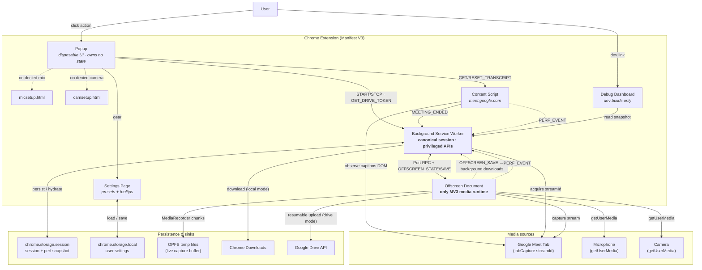

### 2. Module Layering and Dependency Direction

Dependencies point **downward only**. Feature modules depend on shared contracts and
the platform wrappers; nothing in a feature module calls `chrome.*` directly. The
offscreen layer is the only one that touches raw Web media APIs.

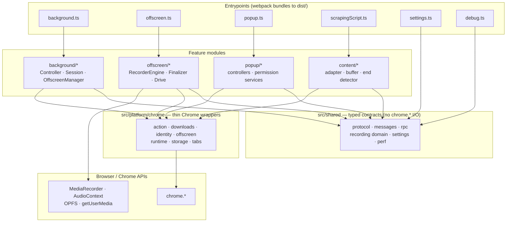

> The platform layer wraps Chrome **operations** only. Entry-point listener
> *registration* (`onMessage` / `onConnect` / `onSuspend`) stays inline in the
> entrypoints — see [ADR-0001](docs/adr/0001-platform-chrome-is-a-utility-layer-not-a-port.md).

### 3. Service Worker Lifecycle, Keep-Alive & Rehydration

The MV3 worker is disposable: Chrome can suspend it mid-recording. State survives in
`chrome.storage.session`, and the worker re-attaches the offscreen document and restarts
the keep-alive loop when it wakes into a busy phase.

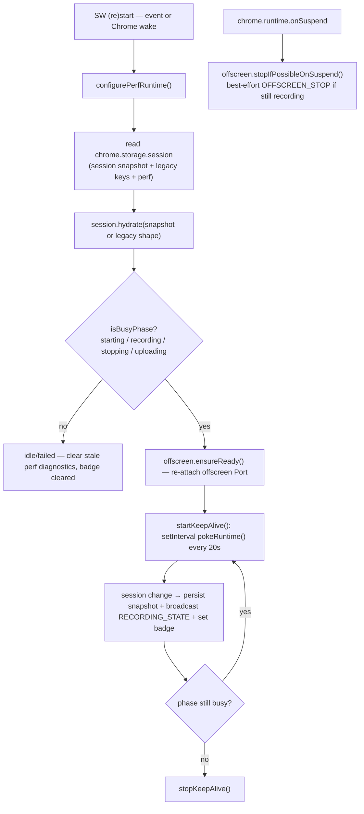

---

**Control plane — who decides start/stop**

### 4. Recording Start / Stop Control Plane

Every start and stop — popup buttons, tab auto-stop, and the content-script
meeting-ended signal — funnels through `RecordingController`, which owns the
session transitions and the offscreen RPC handshake.

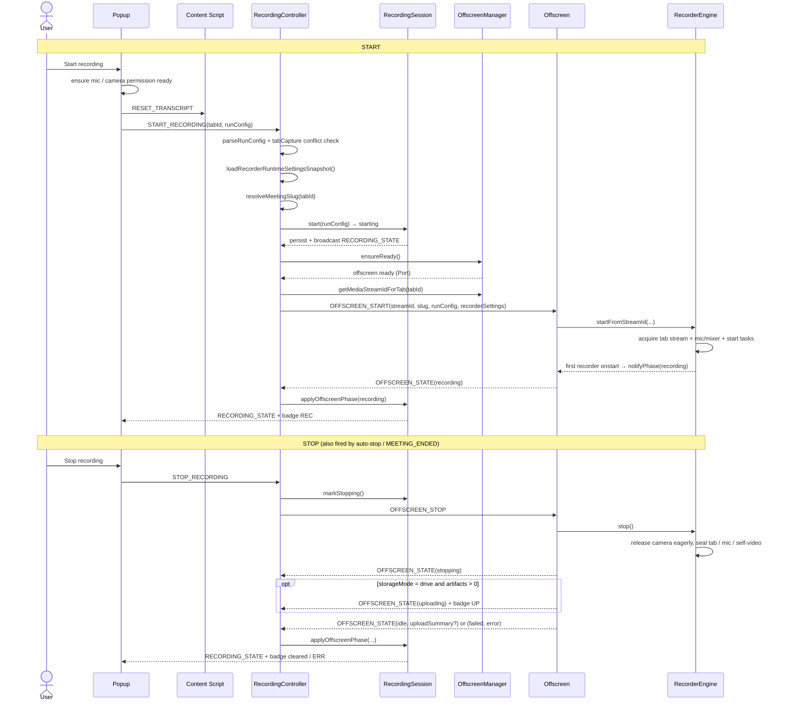

### 5. Recording Session State Machine (Background)

The canonical, persisted session phase owned by `RecordingSession`. This is the
**control-plane** state — distinct from the offscreen engine's own machine (#8).

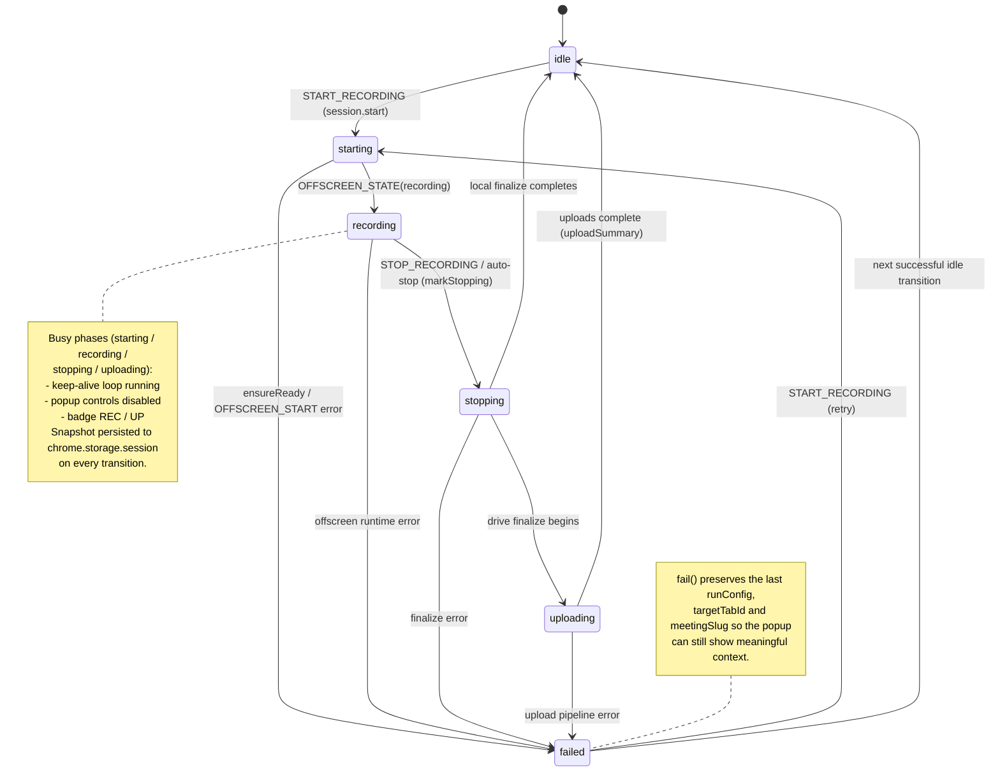

### 6. Offscreen Ready / Reconnect Handshake

`OffscreenManager.ensureReady()` either creates the offscreen document or asks an
existing one to reconnect, then waits (Promise, not poll) for the `OFFSCREEN_READY`
handshake. The offscreen side reconnects its port with exponential backoff after the
worker sleeps or the page is torn down.

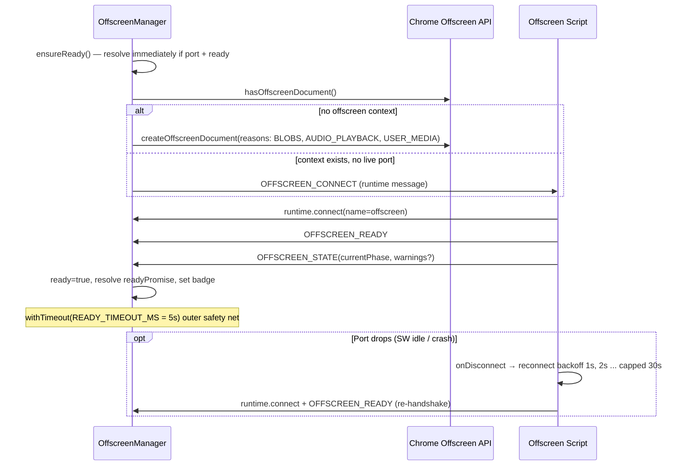

---

**Media engine — how capture works**

### 7. Recorder Engine Internal Architecture

`RecorderEngine` is a facade: setup acquires streams and the optional audio graph,
then up to three per-stream tasks run in parallel. Tab is required; mic and
self-video are best-effort. Each task streams chunks to its own `StorageTarget`.

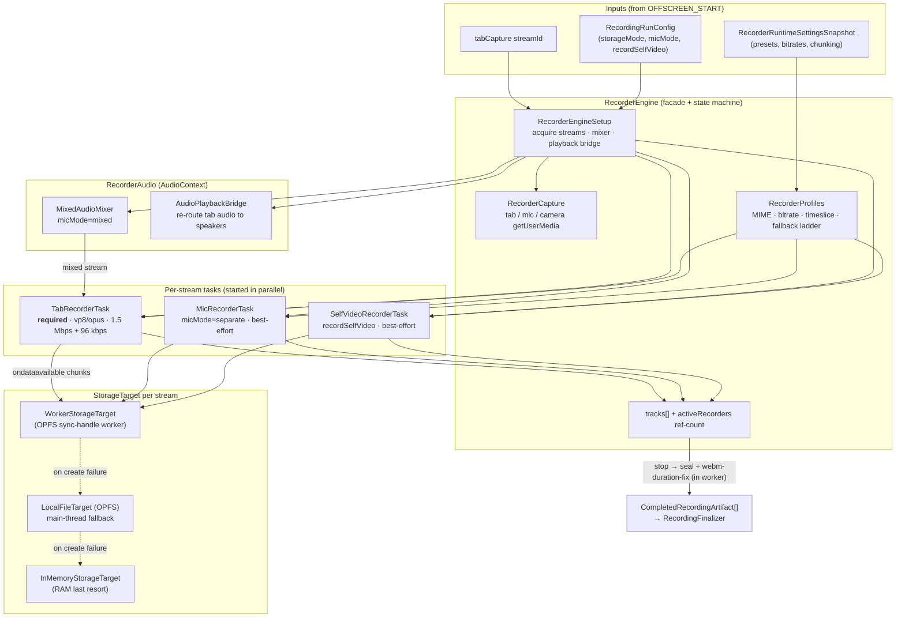

### 8. Recorder Engine State Machine (Offscreen)

The engine's own lifecycle. Note it has **no** `uploading` or `failed` phase — upload
lives entirely in the finalizer, and startup errors reset back to `idle` and rethrow.

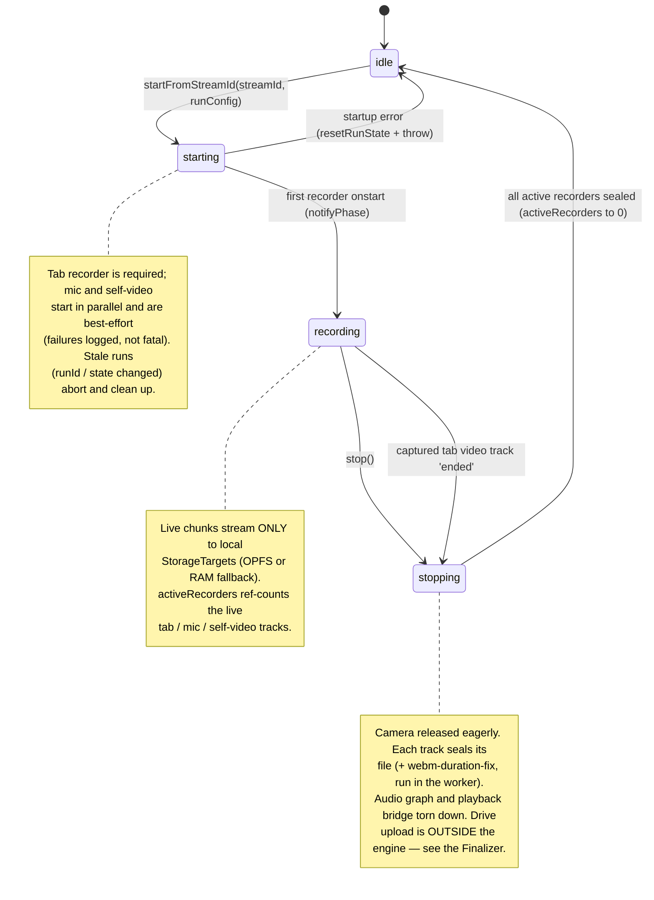

### 9. Mixed-Mic Audio Graph

`micMode=mixed` builds a real Web Audio graph: tab and mic audio are summed into one
`MediaStreamDestination` track, recombined with the tab video, and recorded as a
single `.webm`. A separate `AudioPlaybackBridge` restores tab audio to the speakers
when Chrome suppresses local playback during capture.

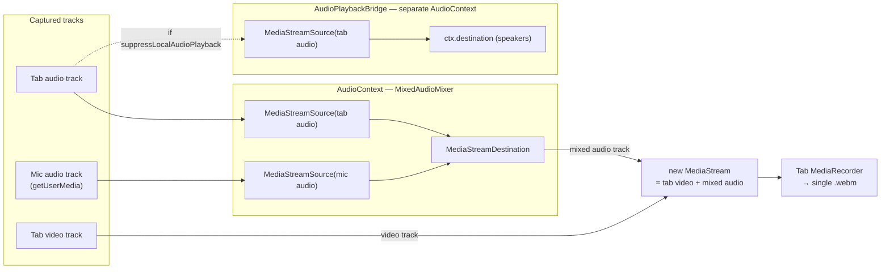

### 10. OPFS Streaming & Storage-Target Fallback

The long-meeting safety mechanism. Chunks stream straight to OPFS so memory stays
bounded (a real 22-min / 507 MB recording peaks at ~23 MB JS heap). By default writes
go to an off-main-thread sync-access-handle worker; `makeChunkHandler` guards the queue
with `WriteBackpressure`; and the target degrades worker ▸ main-thread OPFS ▸ RAM.

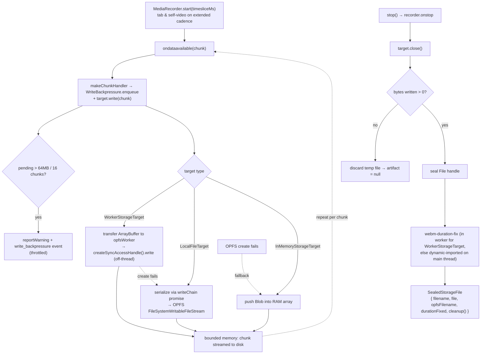

---

**Persistence — where bytes go after stop**

### 11. Post-Stop Persistence Pipeline

Runs only after `RecorderEngine.stop()` returns sealed artifacts. Local mode hands
blob URLs to the background downloader; Drive mode uploads with bounded concurrency and
falls back to a local download per file on any failure.

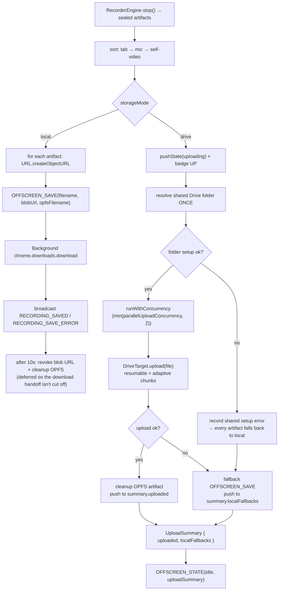

### 12. Drive Folder Resolution & Resumable Upload Session

The shared parent folder is resolved once per finalize run (and cached statically
across files), then each file opens its own resumable session and streams chunks whose
size adapts to observed throughput.

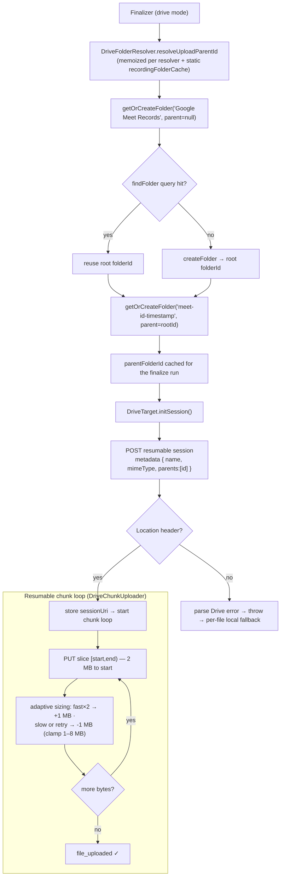

### 13. Drive OAuth Token Fallback

`fetchDriveTokenWithFallback` tries a silent token first, escalates to interactive,
and short-circuits to actionable guidance the moment Google reports a bad client ID.
The offscreen side requests tokens via `GET_DRIVE_TOKEN` through a cached provider.

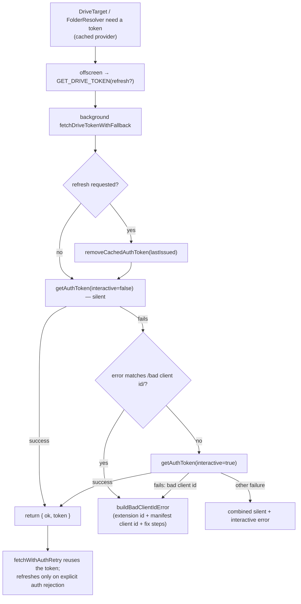

---

**Transcript & auto-stop**

### 14. Transcript Collection Pipeline

A tiered observer tree feeds a grace-timer buffer. The region observer waits for the
captions panel; the caption observer tracks speaker blocks; per-block text observers
catch Meet's incremental refinements; the buffer commits an utterance after a short
silence and de-duplicates via text normalization.

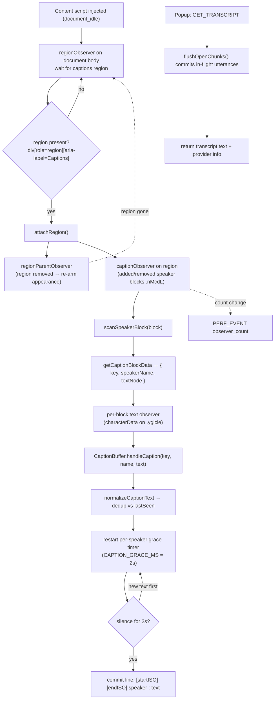

### 15. Meeting-End Auto-Stop

A deliberately conservative content-script detector: it only arms after a live call is
seen, then requires a 30-second grace window of "ended" state before signalling. Two
hard background triggers (tab closed, tab navigated away) bypass the grace entirely.

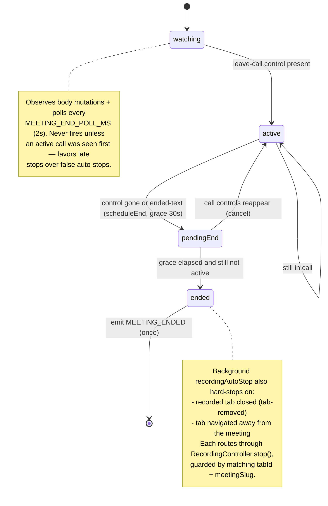

---

**Permissions & diagnostics**

### 16. Microphone & Camera Permission Readiness

Both permission services share one ladder: check state, try an inline `getUserMedia`
prime, and fall back to a dedicated setup tab if Chrome blocks the inline prompt. The
only difference is the mic's `off` short-circuit.

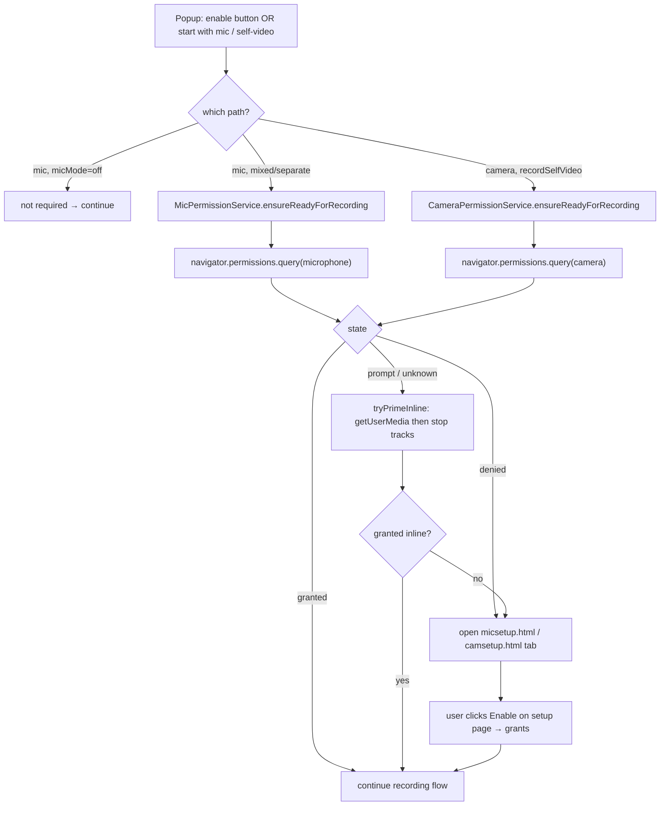

### 17. Diagnostics / Perf Event Flow

All runtime contexts emit structured `PERF_EVENT`s through `configurePerfRuntime`. The
background store reduces them into a session-scoped snapshot that the dev dashboard
renders; the snapshot is cleared when idle and no dashboard is open.

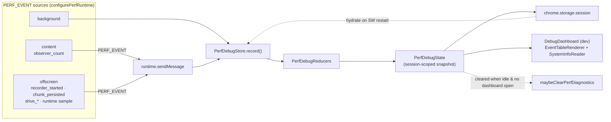

---

## Message contract reference

### Popup → Background

| Message | Payload | Response |
| :--- | :--- | :--- |
| `START_RECORDING` | `tabId`, `runConfig` | `CommandResult` with session snapshot |
| `STOP_RECORDING` | none | `CommandResult` with session snapshot |
| `GET_RECORDING_STATUS` | none | current session snapshot |
| `GET_DRIVE_TOKEN` | optional `refresh` | token or error |

### Popup → Content

| Message | Response |
| :--- | :--- |
| `GET_TRANSCRIPT` | transcript text + provider info |
| `RESET_TRANSCRIPT` | `{ ok: true }` |

### Offscreen → Background

| Message | Meaning |
| :--- | :--- |
| `OFFSCREEN_READY` | offscreen port is attached and ready |
| `OFFSCREEN_STATE` | phase transition or finalize result |
| `OFFSCREEN_SAVE` | request a local save through background |

### Content Script → Background

| Message | Meaning |
| :--- | :--- |
| `MEETING_ENDED` | Meet page entered a post-call state; routed to auto-stop, which stops any active recording |

### Background → Offscreen

| Message | Meaning |
| :--- | :--- |
| `OFFSCREEN_START` | begin a run for a specific `streamId` and `runConfig` |
| `OFFSCREEN_STOP` | stop active recording and begin finalize flow |
| `REVOKE_BLOB_URL` | release local save blob URLs and optionally cleanup OPFS temp files |
| `OFFSCREEN_CONNECT` | ask an existing offscreen page to reconnect its runtime port |

### Background → Popup

| Message | Meaning |
| :--- | :--- |
| `RECORDING_STATE` | canonical session snapshot update |
| `RECORDING_SAVED` | local save succeeded |
| `RECORDING_SAVE_ERROR` | local save failed |

---

## Project structure

```
.
├─ static/       # source HTML shells and manifest (webpack copies to dist/)
├─ public/       # shared static assets copied to dist/ (e.g. gear.png)
├─ src/
│  ├─ background.ts / background/    # service worker and session lifecycle
│  ├─ offscreen.ts / offscreen/      # media runtime (recorder engine, OPFS, Drive upload)
│  ├─ popup.ts / popup/              # popup UI and permission flows
│  ├─ settings.ts                    # settings page
│  ├─ scrapingScript.ts / content/   # caption scraping content script
│  ├─ debug.ts / debug/              # diagnostics dashboard
│  ├─ platform/chrome/               # thin Chrome API wrappers
│  └─ shared/                        # domain model, protocol, settings, perf types
├─ tests/        # unit and E2E test suite
└─ dist/         # build output (generated, not committed)
```

> Source HTML shells and the manifest live under `static/`. The `dist/` layout is flat (`popup.html`, `offscreen.html`, `manifest.json`, etc.) because Chrome expects extension entrypoints at the extension root.

---

## File map

### Core Runtime

| File | Role |
| :--- | :--- |
| `src/background.ts` | top-level MV3 orchestration entrypoint |
| `src/background/RecordingController.ts` | single start/stop orchestrator (control plane seam) |
| `src/background/recordingAutoStop.ts` | automatic stop triggers (tab closed/navigated, meeting ended) |
| `src/background/RecordingSession.ts` | canonical session lifecycle owner |
| `src/background/OffscreenManager.ts` | offscreen lifecycle + port RPC transport |
| `src/background/PerfDebugStore.ts` | aggregated diagnostics snapshot store |
| `src/background/driveAuth.ts` | Drive OAuth fallback and error normalization |
| `src/background/messageHandlers.ts` | popup→background message routing |
| `src/background/sessionLifecycle.ts` | keep-alive loop and perf-clearing driven by phase |
| `src/background/legacySession.ts` | legacy session key hydration helpers |
| `src/background/perf/PerfDebugReducers.ts` | perf event reduction logic |
| `src/background/perf/PerfDebugState.ts` | perf debug snapshot state helpers |
| `src/offscreen.ts` | offscreen runtime shell |
| `src/offscreen/rpcHandlers.ts` | background→offscreen RPC message wiring |
| `src/offscreen/RecorderEngine.ts` | capture and recorder coordinator (facade) |
| `src/offscreen/RecordingFinalizer.ts` | post-stop save/upload coordinator |
| `src/offscreen/storage/opfsWorker.ts` | dedicated worker: OPFS `createSyncAccessHandle` writes + in-worker duration fix |
| `src/offscreen/storage/WorkerStorageTarget.ts` | default storage target — drives `opfsWorker.js` off the main thread |
| `src/offscreen/storage/WriteBackpressure.ts` | bounds the write queue; warns on slow-disk backlog (F9) |
| `src/offscreen/LocalFileTarget.ts` | main-thread OPFS storage target (fallback when the worker is unavailable) |

### Recorder Task Sub-Modules

| File | Role |
| :--- | :--- |
| `src/offscreen/engine/RecorderEngineTypes.ts` | shared types: `StorageTarget`, `SealedStorageFile`, `CompletedRecordingArtifact`, `InMemoryStorageTarget` |
| `src/offscreen/engine/RecorderEngineSetup.ts` | engine initialization helpers |
| `src/offscreen/engine/RecorderTaskUtils.ts` | task utility helpers |
| `src/offscreen/engine/TabRecorderTask.ts` | tab capture recorder task |
| `src/offscreen/engine/MicRecorderTask.ts` | mic capture recorder task |
| `src/offscreen/engine/SelfVideoRecorderTask.ts` | self-video capture recorder task |

### Recorder Support Modules

| File | Role |
| :--- | :--- |
| `src/offscreen/RecorderAudio.ts` | audio mixing (`MixedAudioMixer`) and playback bridge (`AudioPlaybackBridge`) |
| `src/offscreen/RecorderCapture.ts` | media acquisition helpers (tab, mic, self-video) |
| `src/offscreen/RecorderProfiles.ts` | MIME type, bitrate, and timeslice policy |
| `src/offscreen/RecorderSupport.ts` | recorder error helpers |

### Drive Subsystem

| File | Role |
| :--- | :--- |
| `src/offscreen/DriveTarget.ts` | resumable Drive upload orchestrator for one file |
| `src/offscreen/drive/DriveChunkUploader.ts` | chunked upload implementation |
| `src/offscreen/drive/DriveFolderResolver.ts` | root/recording folder lookup and creation |
| `src/offscreen/drive/request.ts` | cached token provider + retry wrapper |
| `src/offscreen/drive/errors.ts` | Drive API error parsing |
| `src/offscreen/drive/folderNaming.ts` | folder name derivation from filenames |
| `src/offscreen/drive/constants.ts` | upload endpoint URLs and chunk size constants |

### Popup, Settings, and Permissions

| File | Role |
| :--- | :--- |
| `src/popup.ts` | popup entrypoint |
| `src/popup/PopupController.ts` | popup UI orchestration |
| `src/popup/controllers/PopupStateController.ts` | internal popup state (run config, warnings, upload summary) |
| `src/popup/popupRunConfig.ts` | form ↔ run-config mapping helpers |
| `src/popup/popupView.ts` | popup control state DOM helpers |
| `src/popup/popupStatus.ts` | status and upload-summary text formatting |
| `src/popup/popupMessages.ts` | user-facing copy constants and builders |
| `src/popup/MicPermissionService.ts` | microphone permission flow |
| `src/popup/CameraPermissionService.ts` | camera permission flow |
| `src/settings.ts` | settings page controller |
| `src/shared/settings/` | settings deep module: load/persist/normalize/derive recorder config (interface in `index.ts`) |
| `src/micsetup.ts` | dedicated mic permission setup page |
| `src/camsetup.ts` | dedicated camera permission setup page |

### Diagnostics UI

| File | Role |
| :--- | :--- |
| `src/debug.ts` | diagnostics page entrypoint |
| `src/debug/DebugDashboard.ts` | renders aggregated perf snapshot |
| `src/debug/debugDashboardText.ts` | dashboard text and formatting helpers |
| `src/debug/renderers/EventTableRenderer.ts` | perf event table renderer |
| `src/debug/renderers/SystemInfoReader.ts` | system info collection for the dashboard |
| `static/debug.html` | diagnostics page shell |

### Transcript Collection

| File | Role |
| :--- | :--- |
| `src/scrapingScript.ts` | provider-agnostic transcript collector entrypoint |
| `src/content/MeetingProviderAdapter.ts` | provider contract interface |
| `src/content/GoogleMeetAdapter.ts` | Google Meet DOM selector implementation |
| `src/content/captionBuffer.ts` | caption buffering and commit logic |

### Shared Infrastructure

| File | Role |
| :--- | :--- |
| `src/shared/recording.ts` | recording domain barrel (re-exports types, constants, normalizers, factories) |
| `src/shared/recordingTypes.ts` | recording domain types |
| `src/shared/recordingConstants.ts` | recording defaults and allowed values |
| `src/shared/recordingNormalizers.ts` | `normalize*`/`parse*` helpers for recording values |
| `src/shared/recordingFactories.ts` | `create*`/`get*`/status-view factory helpers |
| `src/shared/settings/` | settings deep module — load/persist/normalize/derive recorder configuration (interface in `index.ts`) |
| `src/shared/protocol.ts` | typed inter-context message contracts |
| `src/shared/protocolMessageTypes.ts` | runtime message type constants |
| `src/shared/typeGuards.ts` | shared runtime type guards |
| `src/shared/messages.ts` | typed message helpers |
| `src/shared/rpc.ts` | port RPC transport |
| `src/shared/perf.ts` | perf event types and helpers |
| `src/shared/types/perfTypes.ts` | perf event type definitions |
| `src/shared/constants/perfConstants.ts` | perf event name constants |
| `src/shared/utils/mathUtils.ts` | math helpers |
| `src/shared/provider.ts` | meeting provider metadata |
| `src/shared/timeouts.ts` | timeout constants |
| `src/shared/logger.ts` | prefixed logger |
| `src/shared/async.ts` | async helpers |
| `src/shared/build.ts` | build-time constants injected by webpack |

### Platform Adapters

| File | Role |
| :--- | :--- |
| `src/platform/chrome/action.ts` | badge text wrapper |
| `src/platform/chrome/downloads.ts` | local download wrapper |
| `src/platform/chrome/identity.ts` | OAuth token wrapper |
| `src/platform/chrome/offscreen.ts` | offscreen document wrapper |
| `src/platform/chrome/runtime.ts` | runtime messaging and URL helpers |
| `src/platform/chrome/storage.ts` | local/session storage wrapper + storage-change listener registration |
| `src/platform/chrome/tabs.ts` | active tab, tab lookup, tab messages, tab-lifecycle listeners, and stream ID |

---

## Manifest and entry surfaces

File: `static/manifest.json`

- `oauth2.client_id` in source control is a placeholder.
- Webpack injects the real value from `.env` / shell env key `GOOGLE_OAUTH_CLIENT_ID` into `dist/manifest.json` at build time.
- If the env var is missing, build keeps the placeholder and logs a warning; Drive auth will fail until configured.
- The extension icon is declared by the top-level `icons` block and `action.default_icon` (sizes 16/32/48/128). The `icon16/32/48/128.png` set lives in `public/`; without it Chrome falls back to a generic grey placeholder for the toolbar button and the extensions menu.
- Source HTML shells and the source manifest live under `static/`, shared static assets (the `icon*.png` set and the settings-page `gear.png`) live under `public/`, and both are copied to `dist/` at build time. The emitted extension layout in `dist/` is flat because Chrome requires entrypoints at the extension root.

Extension entrypoints:

- action popup: `popup.html`
- background service worker: `background.js`
- content script: `scrapingScript.js`
- offscreen document: `offscreen.html`

---

## Operational notes

### Popup state is not authoritative

The popup is a client. The source of truth is the background `RecordingSession`.

### Service worker restarts are expected

The background service worker may be suspended and restarted by Chrome. Rehydration from `chrome.storage.session` and offscreen reconnect are required parts of the design, not edge cases.

### Offscreen is the only media runtime

Do not move capture or `MediaRecorder` logic into background. MV3 service workers cannot support it reliably.

### Local-first capture is intentional

Even in Drive mode, the extension records locally first and uploads only after stop. This avoids coupling real-time capture stability to network conditions.

### Google Meet selectors are fragile

`GoogleMeetAdapter` contains reverse-engineered selectors. If transcripts stop working after a Meet UI change, start there.

### Mixed mic mode uses a real audio graph

`mixed` is not just UI wording. It is implemented by building an audio graph and recording the composed stream.

### Local save cleanup is deferred

Background waits before revoking blob URLs and optionally removing OPFS files so the handoff to Chrome Downloads is not cut off too early.

### Diagnostics are session-scoped

Perf debug data is persisted in session storage and cleared when appropriate. The dashboard is meant for development and runtime diagnosis, not user-facing product state.

---

## Safe extension points

If you need to extend the system, prefer these seams:

- **Add a new meeting provider** — implement `MeetingProviderAdapter`; keep provider-specific selector logic out of `TranscriptCollector`.

- **Add a new storage backend** — preserve `RecorderEngine` as a local artifact producer; extend post-stop persistence around `RecordingFinalizer`.

- **Add new runtime commands** — update `src/shared/protocol.ts`; add typed helpers in `src/shared/messages.ts` if needed; keep message payload normalization in shared/domain code.

- **Change lifecycle behavior** — start in `RecordingSession`; keep background as the canonical owner of session state.

- **Change media behavior** — prefer `RecorderCapture`, `RecorderProfiles`, or `RecorderAudio` before expanding `RecorderEngine`.

---

The architecture is intentionally split into: a canonical background session model, an offscreen media runtime, a post-stop persistence pipeline, a disposable popup UI, a provider-adapter-based transcript collector, a typed shared message contract, and thin Chrome platform wrappers. That split is the main structural rule to preserve as the extension grows.
