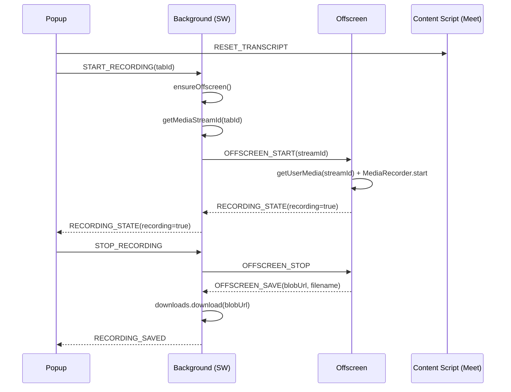

```mermaid
sequenceDiagram
  participant P as Popup
  participant B as Background (SW)
  participant O as Offscreen
  participant C as Content Script (Meet)

  P->>C: RESET_TRANSCRIPT
  P->>B: START_RECORDING(tabId)
  B->>B: ensureOffscreen()
  B->>B: getMediaStreamId(tabId)
  B->>O: OFFSCREEN_START(streamId)
  O->>O: getUserMedia(streamId) + MediaRecorder.start
  O-->>B: RECORDING_STATE(recording=true)
  B-->>P: RECORDING_STATE(recording=true)

  P->>B: STOP_RECORDING
  B->>O: OFFSCREEN_STOP
  O-->>B: OFFSCREEN_SAVE(blobUrl, filename)
  B->>B: downloads.download(blobUrl)
  B-->>P: RECORDING_SAVED
```
