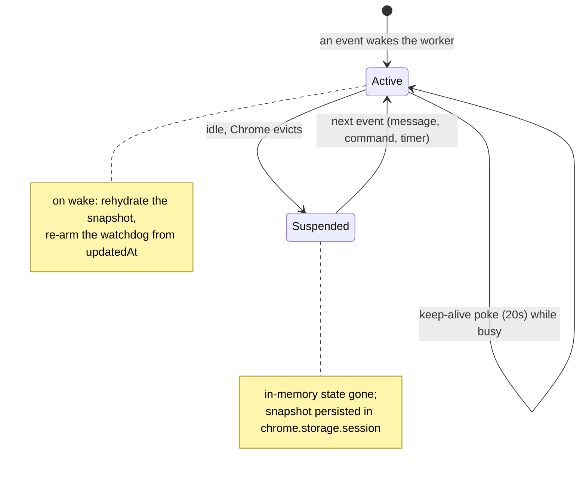
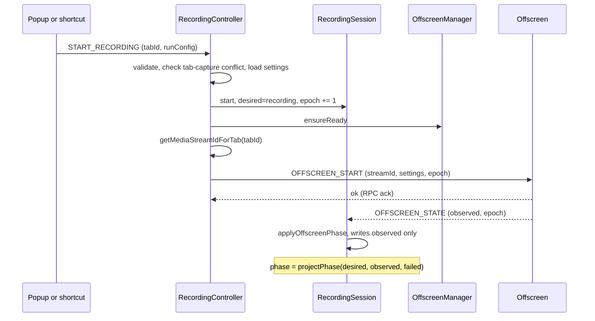

# Background — the control plane (MV3 service worker)

> The extension's brain: it owns the canonical recording state, orchestrates start/stop, manages the offscreen document's lifecycle, and survives its own death. It runs as an **MV3 service worker** — ephemeral and restartable at any moment — which shapes every decision here. For symbol-level structure use codegraph (`codegraph_explore "RecordingController RecordingSession OffscreenManager"`). The phase *projection* it depends on is documented in [`shared`](../shared/README.md); the offscreen *data plane* it commands is [`offscreen`](../offscreen/README.md).

> **Archetype:** *Platform Runtime*. The hard part here isn't business logic — it's that the runtime (the MV3 SW) can be **evicted between any two events** and restarted with empty memory. So this README leads with the platform constraints and how the control plane is built to survive them. If you read one section, read **MV3 service-worker constraints**.

## Purpose & mental model

The background is the **single source of truth** and the only place that *commands* recording. The mental model is **command plane vs. data plane**: the background decides *what should happen* (start/stop, the `desired` intent) and persists it; the offscreen document *does* the recording and reports *what is happening* (the `observed` status). The background never captures media; the offscreen never decides policy. Everything below exists to keep that authority coherent across service-worker restarts.

## MV3 service-worker constraints (the platform reality)

A Manifest V3 service worker is **not** a long-lived background page. Chrome evicts it when idle and restarts it on the next event, with **all in-memory state gone**. Three mechanisms cope:

- **Persisted snapshot.** The `RecordingSessionSnapshot` lives in `chrome.storage.session` (survives SW restarts, cleared on browser close — exactly a run's lifetime). On startup the worker calls `session.hydrate(...)` to rebuild in-memory state from it.
- **Keep-alive while busy.** `startKeepAlive` pokes the runtime every **20 s** *only* while a busy phase is active (recording/upload), so Chrome doesn't evict mid-recording; `stopKeepAlive` ends it once idle. (See the [`@perf`] note: this is a cost paid only during a run.)
- **Liveness backstop.** Because an in-flight RPC promise dies with the worker, a session can rehydrate stuck in `starting`/`stopping` — the **phase watchdog** rescues it (below).

This is also why **`updatedAt` matters**: timers (the watchdog budget) are measured from the snapshot's `updatedAt`, not from when the worker happened to wake — so a session rehydrated into an already-stale phase is treated correctly, not granted a fresh budget.

## The control-plane flow (start)

`RecordingController.start` is the orchestration: validate the request → reject if the tab already has a capture → load the frozen recorder + perf settings → `session.start()` (which assigns a fresh, strictly-increasing **epoch**) → `ensureReady()` the offscreen → resolve a `tabCapture` stream id → fire `OFFSCREEN_START` over RPC. `stop` is the mirror: guard `isStoppablePhase`, `markStopping()` (`desired=idle`), fire `OFFSCREEN_STOP`. Any failure on either path calls `session.fail(error)`.

## The session state machine

`RecordingSession` is the canonical machine (ADR-0003 Decision 4). It writes the two planes; it never writes `phase` (derived). Method → effect:

| Method | Writes | Notes |
| :--- | :--- | :--- |
| `start(runConfig, target)` | `desired=recording`, `observed=starting`, `epoch += 1` | fresh fencing token per run |
| `markStopping()` | `desired=idle` | phase derives to `stopping` while capture drains |
| `applyOffscreenPhase(update)` | `observed` only (or finalize) | a same-run `idle` finalizes; `failed` → `fail()` |
| `markIdle()` | resets to idle | preserves `epoch` (monotonic across runs) |
| `fail(error)` | `failed=true` | preserves run context for the error view |
| `setMicMuted/CameraMuted/Paused` | overlay flags + the pause-aware timer | mirrors offscreen actuation for a reopened popup |

Every mutation goes through `commit()` → persist + notify the change listener. The pause-aware timer (`recordedMs`/`runningSince`) is banked/restarted by `nextTimer` and `setPaused` so the popup clock excludes paused spans.

## Liveness: the phase watchdog

The epoch fence drops *stale* status; it does nothing for *missing* status. A worker that dies mid-start/stop leaves a session rehydrated in `starting`/`stopping` with no one to drive it on (the offscreen's reconnect re-broadcast is itself fenced out by the stale epoch). `createPhaseWatchdog` watches exactly those two orphan-prone phases (per-phase budget map: `STARTING_WATCHDOG_MS` / `STOPPING_WATCHDOG_MS`), armed from the session change-listener **including the rehydrated transition** (budget measured from `updatedAt`, so an already-stale phase fires immediately). On timeout it fails the session and tears down the offscreen so a retry starts clean. `recording`/`uploading`/`idle` are deliberately unwatched (steady states / minutes-long with their own recovery).

## Crash recovery & save

- **Rehydration:** on startup, `session.hydrate()` rebuilds from the persisted snapshot; the change-listener immediately re-arms keep-alive and the watchdog.
- **Save is crash-safe:** the `OFFSCREEN_SAVE` handler downloads the blob, then waits for the download to **actually settle** (`awaitDownloadSettled`, event-driven — not a blind timer). The OPFS source is deleted **only** on confirmed `complete`; an `interrupted` download frees the URL but keeps the OPFS file, and a `timeout` keeps both — so a recording is never lost to premature cleanup, and orphan recovery can reclaim it next launch.

## Entry paths & offscreen lifecycle

- **Two ways to start:** the popup `START_RECORDING` message, and a **keyboard shortcut** (`recordingCommands`). The shortcut path matters because Chrome grants `activeTab` to user-invoked commands, keeping `tabCapture` tied to a real gesture.
- **`OffscreenManager`** owns the offscreen document: `ensureReady()` (create-or-reconnect + a version handshake that heals SW/offscreen code skew), and `ensureRecorderTabReady()` — a fallback that hosts the same recorder runtime in a normal extension *tab* when a Chrome version can't scope a tab-capture stream id to an offscreen document.

## Observability

The background owns the **persisted** perf snapshot and its **reducers** (`PerfDebugStore` + `perf/PerfDebugReducers`), folding events from *every* context into the summary. It does **not** emit `lifecycle.*` events itself — those come from the [offscreen](../offscreen/README.md) engine; `PerfDebugStore` reduces them into `summary.lifecycle` (`startRequested`/`startCompleted`, `stopRequested`/`stopCompleted`, `failureCount`, `warningCount`, `activeTracks`/`peakActiveTracks`, `lastStopDurationMs`). That reduction is what makes a `startRequested` with no matching `startCompleted` legible as the orphaned-start the watchdog exists to catch. The snapshot is read-only-rendered by [`debug`](../debug/README.md); why sampling (offscreen) and persistence (here) are split lives in the [instrumentation doc](../../docs/plans/storage-and-instrumentation-architecture.md).

## Key invariants & gotchas

- **The SW can die between any two lines.** Never hold run state only in memory; if it must survive a restart, it's in the snapshot.
- **`desired` has exactly one writer** (the command path here); `observed` is written only by `applyOffscreenPhase`. Don't cross them.
- **The epoch is assigned here and never written back** from offscreen status — the offscreen only echoes it so the fence can match.
- **Keep-alive is busy-only.** Don't pin the worker while idle; it's a deliberate cost paid during a run.
- **`getSnapshot()` returns a `structuredClone`** — callers can't mutate the canonical state by reference.

## Files

| File | Role |
| :--- | :--- |
| `RecordingSession.ts` | the canonical state machine (writes planes, derives phase, owns the timer) |
| `RecordingController.ts` | start/stop/mute/pause orchestration (validate → command offscreen) |
| `OffscreenManager.ts` | offscreen document lifecycle: ensure/reconnect, version handshake, recorder-tab fallback, RPC |
| `phaseWatchdog.ts` | liveness backstop for orphaned `starting`/`stopping` |
| `sessionLifecycle.ts` | keep-alive loop, the crash-safe save handler, and `isFreshRecordingStart` (resets diagnostics at the start of a new run, so a finished run's snapshot survives for export) |
| `recordingAutoStop.ts` | auto-stop when the recorded tab is **closed** or **navigates away** from the meeting → `controller.stop()` |
| `recordingCommands.ts` | keyboard-shortcut start path (preserves `activeTab`) |
| `messageHandlers.ts` | registers the `chrome.runtime.onMessage` listener and dispatches popup commands to their handlers |
| `legacySession.ts` | rehydrates pre-refactor persisted state (the old separate `phase` / `activeRunConfig` keys) into a snapshot |
| `driveAuth.ts` | Drive OAuth token acquisition (silent→interactive, bad-client-id diagnosis) — token *use* is [`offscreen/drive`](../offscreen/drive/README.md) |
| `PerfDebugStore.ts` + `perf/` | the persisted perf snapshot + reducers (`PerfDebugReducers`, `PerfDebugState`) + `CpuSampler` (dev-only); see the [instrumentation doc](../../docs/plans/storage-and-instrumentation-architecture.md) |

Wiring entry: `src/background.ts` (the SW entrypoint) routes messages/commands to `RecordingController` (including the content script's `MEETING_ENDED` → `controller.stop()`), drives the session change-listener (persist → broadcast → keep-alive → `watchdog.observe` → reset diagnostics on a fresh-run start), and rehydrates on startup.

## Testing notes

- `RecordingSession`, `RecordingController`, `phaseWatchdog`, `OffscreenManager` are tested in `__tests__/` with injected persistors/clocks/timers (the watchdog takes injectable `now`/`setTimer` precisely so budgets are deterministic).
- `background.test.ts` (kept in the central `tests/` tree) is the **integration** test: it hydrates a stale phase and asserts the fence + watchdog behavior end-to-end across session + offscreen + wiring — it spans modules, so it doesn't live here.

## Related

- [ADR-0003](../../docs/adr/0003-recording-phase-ownership-and-stale-offscreen-status.md) — the epoch fence + desired/observed split + watchdog rationale.
- [`shared`](../shared/README.md) — the `projectPhase` projection and snapshot shape this machine writes.
- [`offscreen`](../offscreen/README.md) — the data plane this commands.

## External references

- Chrome — [Service workers in extensions](https://developer.chrome.com/docs/extensions/develop/concepts/service-workers) and [their lifecycle](https://developer.chrome.com/docs/extensions/develop/concepts/service-workers/lifecycle) (eviction, events, keep-alive realities).
- Chrome — [`chrome.offscreen`](https://developer.chrome.com/docs/extensions/reference/api/offscreen), [`chrome.tabCapture`](https://developer.chrome.com/docs/extensions/reference/api/tabCapture), [`chrome.storage`](https://developer.chrome.com/docs/extensions/reference/api/storage) (`session` area), [`chrome.commands`](https://developer.chrome.com/docs/extensions/reference/api/commands), [`chrome.downloads`](https://developer.chrome.com/docs/extensions/reference/api/downloads).
