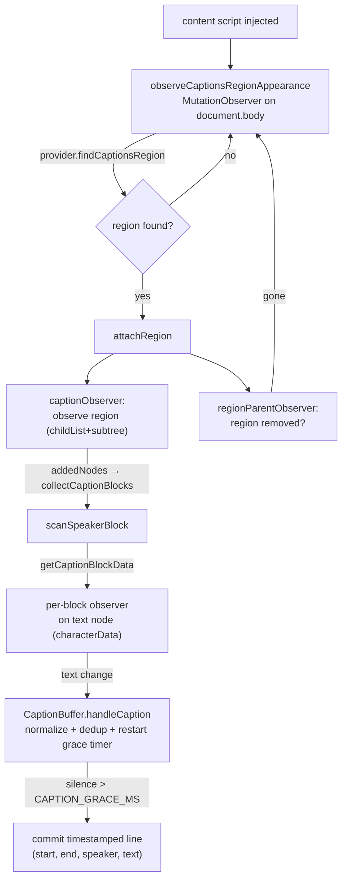
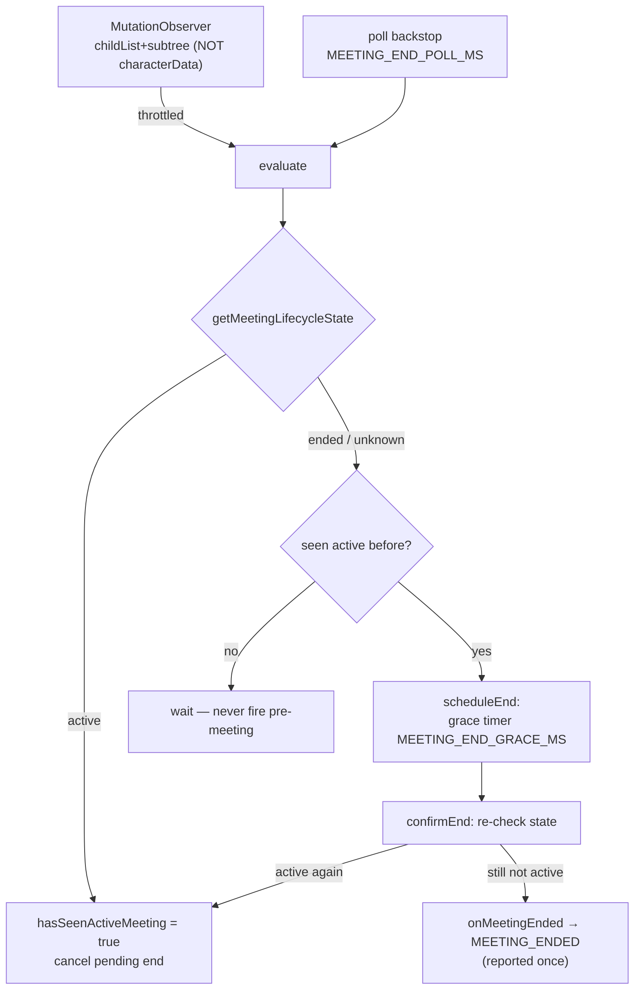

# Content — Google Meet transcript scraping & meeting-end detection

> The content-script side: it runs **inside the Meet page** and reads a DOM the extension does not own. The orchestrator (`TranscriptCollector`) lives in [`../scrapingScript.ts`](../scrapingScript.ts) (the injected entry); this folder holds the provider adapter, the caption buffer, and the end detector it drives. For symbol-level structure use codegraph (`codegraph_explore "TranscriptCollector GoogleMeetAdapter MeetingEndDetector"`).

> **Archetype:** *Fragile Boundary*. Unlike the rest of the codebase, almost nothing here is under our control — Google can restructure Meet's DOM at any time with no warning and no versioning. So this README is light on theory and heavy on **why it's fragile, how the fragility is contained, and what to do when it breaks**. If you read one section, read the **Maintenance playbook**.

## Purpose & mental model

Meet has **no transcript API**. The only way to capture a transcript is to scrape the live captions DOM. So this module is a *best-effort reader of a hostile, unversioned surface*: it watches the captions region for speaker blocks, accumulates per-speaker text, commits utterances after a pause, and separately watches for the call to end so recording can auto-stop. Treat every selector as a liability and every DOM assumption as temporary.

**Execution context.** This runs in the content-script *isolated world*, on the **page's main thread** — every observer callback competes with Meet's own rendering. So keeping per-mutation work cheap (and *not* waking the end-detector on `characterData`) is a deliberate performance constraint, not an accident. There is no worker offload here, unlike the recorder's storage path.

## Why this is fragile (and where the fragility lives)

- **The DOM is Google's, not ours.** Class names are obfuscated and rotate; the captions container, speaker blocks, and leave-call controls can move or disappear in any Meet release. There is no contract and no deprecation window.
- **All of that risk is deliberately concentrated in one place.** Every Meet-specific selector lives behind the `MeetingProviderAdapter` interface, implemented by `GoogleMeetAdapter`. The collection pipeline, the buffer, and the end detector are **provider-agnostic** — they never touch a raw selector. So a Meet redesign is a one-file fix (`GoogleMeetAdapter.ts`), not a scavenger hunt.

```ts
interface MeetingProviderAdapter {
  getProviderInfo(location, root): MeetingProviderInfo;
  findCaptionsRegion(root): HTMLElement | null;   // the captions container
  collectCaptionBlocks(node): HTMLElement[];        // speaker blocks within
  getCaptionBlockData(block): CaptionBlockData | null; // { key, speakerName, textNode }
  getMeetingLifecycleState(root): 'active' | 'ended' | 'unknown';
}
```

## Resilience strategy

Because the surface is unreliable, the *collection machinery around it* is defensive:

- **Three-tier, self-healing observation.** A `MutationObserver` on `document.body` waits for the captions region to appear → on attach, a region observer watches for speaker blocks (added/removed) → each block gets its own observer on its text node (`characterData`). A `regionParentObserver` re-attaches from scratch if the region is ever removed (Meet tears it down on layout changes). The pipeline survives the region coming and going mid-call.
- **Conservative end detection (never a false auto-stop).** `MeetingEndDetector` only fires after it has **seen an active meeting** (`hasSeenActiveMeeting`), waits out a **grace window**, **re-checks** the state in `confirmEnd`, and reports **at most once**. A transient "controls disappeared" blip can't stop a live recording.
- **Structural-only end observation.** The end detector observes `childList + subtree` but **not** `characterData` — live captions mutate text on nearly every frame, and re-running the doc-wide leave-call query on each would be pure waste. An ended call restructures the DOM (controls removed, post-call screen added), which `childList` catches; a poll backstop owns worst-case latency.
- **Dedup + grace-commit buffer.** `CaptionBuffer` normalizes text (lowercase, strip punctuation/whitespace) to dedupe Meet's repeated re-emissions of the same line, and commits a speaker's utterance only after `CAPTION_GRACE_MS` of silence — turning a stream of partial captions into clean, timestamped transcript lines.

## Diagram: transcript collection pipeline



## Diagram: meeting-end detection



## Key invariants & gotchas

- **Observer hygiene is mandatory.** Every observer is tracked (`blockObservers` WeakMap, `observedBlocks` set) and disconnected on region removal / stop. A missed `disconnect()` leaks an observer per speaker block per call — `getActiveBlockObserverCount()` exists precisely to catch that.
- **The end detector will not fire before it sees `active`.** This is intentional: at injection time the page may briefly look "ended," and we must never auto-stop a recording that hasn't really started.
- **Don't add `characterData` to the end-detector observer.** It would wake on every caption frame. The structural-only choice is a deliberate perf decision, documented in the source.
- **`getTranscriptText()` flushes open chunks.** Calling it commits any in-flight buffered utterances, so it's safe to call mid-call to get a complete snapshot.
- **Transcript text is meeting content — keep it local.** It lives only in-page (the `CaptionBuffer`) and leaves solely via the explicit `GET_TRANSCRIPT` request; this module never persists or transmits it. Don't add logging that dumps caption text.

## Maintenance playbook — when Meet changes

The single most likely failure in the whole extension. Triage:

| Symptom | Almost certainly | Fix location |
| :--- | :--- | :--- |
| Transcript empty, recording fine | `findCaptionsRegion` / `collectCaptionBlocks` selectors stale | `GoogleMeetAdapter.ts` |
| Speaker names wrong/blank | `getCaptionBlockData` (name/text node) selector drift | `GoogleMeetAdapter.ts` |
| Auto-stop never fires / fires late | `getMeetingLifecycleState` no longer recognizes the post-call DOM | `GoogleMeetAdapter.ts` |
| Auto-stop fires mid-call | lifecycle state flapping to non-`active` | `GoogleMeetAdapter.ts` + grace window |
| Observer count climbs unbounded | cleanup path regressed | `../scrapingScript.ts` (`TranscriptCollector`) |

Rule of thumb: **if it's a selector or a Meet-DOM shape, the fix is in `GoogleMeetAdapter.ts`.** If it's machinery (observers, buffering, lifecycle timing), it's in `scrapingScript.ts` / this folder. Keep that line clean — it's the whole point of the adapter.

## Observability

The pipeline emits `logPerf(console.log, 'captions', …)` events: `mutation_processed` (with `durationMs`, `sourceLatencyMs`, `coalesced`, `textLength`) and `observer_count` (`activeBlockObservers`). `sourceLatencyMs` (now − the caption's `emittedAt`) is the best signal for "are we keeping up with Meet's caption rate."

## Configuration

All timing lives in `shared/timeouts.ts` (`TIMEOUTS`), so the latency/safety trade-offs are tunable in one place:

| Constant | Governs | Trade-off |
| :--- | :--- | :--- |
| `CAPTION_GRACE_MS` | silence before a speaker's line commits | lower → finer lines but more fragmentation; higher → cleaner lines, later commit |
| `MEETING_END_OBSERVER_THROTTLE_MS` | coalescing of mutation bursts before re-evaluating | lower → snappier end detection, more work on Meet's render path; higher → cheaper, later |
| `MEETING_END_POLL_MS` | backstop poll interval | worst-case auto-stop latency if a mutation is missed |
| `MEETING_END_GRACE_MS` | confirmation window before reporting end | the guard against a transient blip causing a false auto-stop |

## Files

| File | Role |
| :--- | :--- |
| `MeetingProviderAdapter.ts` | the provider contract — the only boundary the rest of the pipeline knows |
| `GoogleMeetAdapter.ts` | **the fragile part** — every Meet-specific selector + lifecycle heuristic |
| `MeetingEndDetector.ts` | conservative auto-stop signal (observer + poll + grace + once) |
| `captionBuffer.ts` | per-speaker dedup + grace-commit into timestamped transcript lines |

Orchestrator: [`../scrapingScript.ts`](../scrapingScript.ts) — `TranscriptCollector` wires the observers and exposes this module's only outside surface: `window.getTranscript()` / `window.resetTranscript()`; the runtime handlers `GET_TRANSCRIPT` / `RESET_TRANSCRIPT` / `GET_CAPTION_STATE` (popup → content); and the `MEETING_ENDED` message it emits to the background to drive auto-stop.

## Testing notes

- `__tests__/MeetingEndDetector.test.ts` drives the detector against a fake `MeetingProviderAdapter` returning scripted lifecycle states — the *logic* (seen-active gate, grace, re-check, report-once) is unit-tested without a real DOM.
- `CaptionBuffer` is pure-ish (timers + maps) and tested by feeding caption sequences and asserting committed lines.
- **`GoogleMeetAdapter`'s selectors cannot be unit-tested meaningfully** — they only mean anything against real Meet. The real-Meet e2e harness is the only thing that catches selector rot; treat a green unit suite as *necessary, not sufficient* for this module.

## Related

- Root [architecture reference](../../README.md#architecture-reference) — transcript collection (diagram 14) and meeting-end auto-stop (diagram 15) in the cross-context context; the `MEETING_ENDED` → background → auto-stop flow.
- [`MeetingProviderAdapter`](./MeetingProviderAdapter.ts) — the seam that would let a second provider (Zoom, Teams) be added without touching the pipeline.

## External references

- MDN — [`MutationObserver`](https://developer.mozilla.org/en-US/docs/Web/API/MutationObserver) and [`MutationObserverInit`](https://developer.mozilla.org/en-US/docs/Web/API/MutationObserver/observe) (why `childList`/`subtree`/`characterData` are chosen deliberately).
- Chrome — [Content scripts](https://developer.chrome.com/docs/extensions/develop/concepts/content-scripts) (the isolated world this runs in).
- There is **no public Google Meet captions/transcript API** — that absence is the root cause of everything in this module.
