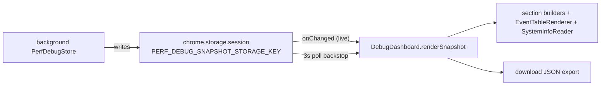

# Debug — the diagnostics dashboard (read-only perf viewer)

> The dev-only diagnostics page: it renders the session-scoped `PerfDebugSnapshot` the rest of the extension produces, and exports it as JSON. It is a **consumer**, not a producer — it computes nothing, it only displays. For symbol-level structure use codegraph (`codegraph_explore "DebugDashboard EventTableRenderer PerfDebugSnapshot"`). The producer side (who emits the metrics, and why the split) is the [instrumentation architecture doc](../../docs/plans/storage-and-instrumentation-architecture.md).

> **Archetype:** *Reference Catalog* (instrumentation viewer). Its value is twofold: the **schema of what's measured** (the perf-event catalog) and an honest account of **what these numbers can and cannot mean**. So this README leads with the snapshot schema and the measurement caveat. If you read one section, read **What the numbers mean (and don't)**.

## Purpose & mental model

A **window onto a snapshot.** The background folds every perf event from every context into one persisted `PerfDebugSnapshot` (in `chrome.storage.session`); this dashboard reads that key, renders its sections, and lets you download it for offline analysis. The mental model: **the dashboard owns no state and changes nothing** — it's a pure projection of a snapshot that lives elsewhere, so it can be opened/closed freely and is safe to leave running.

## The `PerfDebugSnapshot` (the catalog)

The snapshot (`shared/types/perfTypes.ts`) has two halves the dashboard renders:

- **The event log** — `entries: PerfEventEntry[]`, each `{ source, scope, event, ts, fields }`. `source ∈ {background, offscreen, captions, popup}`; `scope`/`event` name the thing (e.g. `storage` / `write_backpressure`). This is the raw timeline (the events table).
- **The rolled-up `summary`** — per-area aggregates, each section a reference of what's tracked:

| Section | Tracks (examples) |
| :--- | :--- |
| `capture` | per-stream attempt/success/failure counts, requested vs. delivered profile, mic DSP constraints |
| `recorder` | start latency, persisted chunk count/bytes, write-duration distributions, timeslice, bitrate |
| `storage` | open/write/close counts, **worker** vs main-thread writes, backpressure-warning count, peak pending bytes |
| `captions` | observer count, mutation/coalesced/missed counts, processing + source-latency distributions, and **Meet-tab main-thread long-task** count/total/max (content-script, dev-only) |
| `finalization` / `upload` | file counts, local-fallback counts, durations, upload retries, throughput, concurrency |
| `lifecycle` | start/stop requested-vs-completed, failures, warnings, peak active tracks |
| `runtime` | heap, **event-loop lag**, **long-task** counts, and dev-only system CPU % |

Durations are `PerfDistribution` (`count/avg/p50/p95/max/last`) — so "write p95" etc. are first-class. The event log is **bounded**: `entries` is capped at `PERF_EVENT_BUFFER_LIMIT` (oldest evicted, `droppedEvents` counts the overflow), so the snapshot stays well under the `chrome.storage.session` quota no matter how long the run — the persisted copy keeps the **newest** events (including the tail of the run — the Drive upload) instead of silently freezing once the quota is hit. On a run long enough to overflow, `count`/`avg`/`max` stay whole-session (maintained incrementally) while `p50`/`p95` reflect the retained window. As a final guard, if a persist is still rejected the store falls back to writing a summary-only snapshot so the aggregates never freeze. `enabled` + `settings` record whether diagnostics are on and which perf flags the run used.

## What the numbers mean (and don't)

The single most important honesty in this module (from `SystemInfoReader`): **true system CPU/GPU utilization is not exposed to Chrome extensions.** So:

- "CPU pressure" in the runtime panel is **approximated** by event-loop lag and long-task counts — a proxy for main-thread contention, *not* a system CPU reading.
- The real `lastCpuPercent`/`avgCpuPercent` fields are **dev-only** (the `system.cpu` permission), `null` in production.
- System info (WebGL/WebGPU vendor+renderer, hardware threads, device memory) is best-effort capability detection, not live load.

Treat the dashboard as a **main-thread-health and pipeline-throughput** instrument, and read CPU figures with that caveat.

## How the dashboard syncs

- **Dev-only gate:** `init()` short-circuits to a "diagnostics only in `npm run dev`" message in production builds.
- **Two sync paths:** a `storage.onChanged` listener (live) plus a **3 s poll** backstop, so the view stays current even if a change event is missed.
- **Diagnostics survive a finished run.** The snapshot is reset at the **start of the next recording** (`isFreshRecordingStart` in `background`), not when a run goes idle — so you can record without the dashboard open, then open it afterward and export the full run (the bounded buffer keeps the newest events). The previous mechanism (a `debug-dashboard` port + an open-dashboard "keep" lock) was removed.
- **Incremental events table:** `EventTableRenderer` appends only new rows (resets only if the entry prefix diverges) and auto-scrolls when near the bottom — so a long event log doesn't re-render every poll. Row text is HTML-escaped.

## Key invariants & gotchas

- **Read-only.** The dashboard never writes the snapshot or mutates recording state. Keep it that way.
- **Dev-build only.** Don't add production-facing behavior here; the data source (`debugMode`) isn't populated in production.
- **Don't full-re-render the events table.** The incremental + prefix-reset design is deliberate (long logs); appending is the fast path.
- **Always escape event fields** before injecting into the DOM (`escapeHtml`) — entries carry arbitrary string fields.
- **CPU % is not system CPU** unless the dev-only `system.cpu` permission is present — label it accordingly in any new UI.

## Files

| File | Role |
| :--- | :--- |
| `DebugDashboard.ts` | the controller: dev gate, storage-listener + poll sync, section rendering, JSON export |
| `debugDashboardText.ts` | the `build*Text` formatters (summary/recorder/upload/captions/runtime) + timestamp/field formatting |
| `renderers/EventTableRenderer.ts` | incremental, auto-scrolling events table |
| `renderers/SystemInfoReader.ts` | WebGL/WebGPU + hardware capability strings (and the CPU caveat) |

Entry: `../debug.ts` (page wiring). The snapshot **type** lives in `shared/types/perfTypes.ts`; the **producers** are `background/PerfDebugStore` + `offscreen` `RuntimeSampler`.

## Testing notes

- `renderers/tests/eventTableRenderer.test.ts` (incremental/reset table logic) and `renderers/tests/systemInfoReader.test.ts` (capability reads) sit beside the renderers; `__tests__/DebugDashboard.test.ts` covers the dev-gate/render paths against a mocked DOM + `chrome.storage`.
- These render pure projections of a snapshot — feed a `PerfDebugSnapshot` literal and assert the DOM; no live recording needed.

## Related

- [Storage & instrumentation architecture](../../docs/plans/storage-and-instrumentation-architecture.md) — **why** the perf split exists (offscreen samples its own thread; background owns the persisted snapshot) and the revisit triggers.
- [`background`](../background/README.md) — `PerfDebugStore` (the producer + reducer) and the clear-on-start retention policy (`isFreshRecordingStart`).
- [`offscreen/storage`](../offscreen/storage/README.md) — emits the `storage` events (`write_backpressure`, …) this dashboard surfaces.

## External references

- Chrome — [`chrome.storage` `onChanged`](https://developer.chrome.com/docs/extensions/reference/api/storage#event-onChanged) (the live-sync mechanism) and [`system.cpu`](https://developer.chrome.com/docs/extensions/reference/api/system/cpu) (the dev-only CPU source).
- MDN — [`WEBGL_debug_renderer_info`](https://developer.mozilla.org/en-US/docs/Web/API/WEBGL_debug_renderer_info) and [WebGPU `GPUAdapter`](https://developer.mozilla.org/en-US/docs/Web/API/GPUAdapter) (system-info capability reads).
