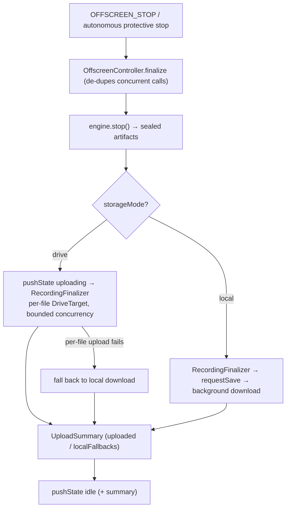

# Offscreen — the recording runtime (data plane)

> The MV3 **offscreen document**: the *only* context that can hold a DOM, run `MediaRecorder`, and own OPFS handles — so all media work lives here. The [background](../background/README.md) commands it over a port; it reports status back. This README is the **composition layer** — how the pieces wire together; each subsystem has its own README. For symbol-level structure use codegraph (`codegraph_explore "OffscreenController RecordingFinalizer wirePortHandlers"`).

> **Archetype:** *Platform Runtime* (composition). Thin by design: it owns the **port/RPC wiring, the phase/warning state, and the stop→finalize sequencing**, and delegates the actual work down. If you read one section, read **The stop → finalize pipeline**.

## Purpose & mental model

The **data plane** to the background's command plane. The background decides *what* (start/stop, the `desired` intent); the offscreen *does* it — acquires media, encodes, persists, uploads — and broadcasts *what is happening* (the `observed` status). The mental model: **a recreatable worker behind an RPC port.** It holds no durable truth (the snapshot lives in the background); it can be torn down and rebuilt at any time, which is exactly how SW/offscreen code-skew is healed.

## How it composes

```
background ──OFFSCREEN_START/STOP (RPC)──▶ rpcHandlers ─▶ OffscreenController (phase + finalize coordinator)
                                                              │
                                              ┌───────────────┼────────────────┐
                                              ▼               ▼                ▼
                                       RecorderEngine     storage         RecordingFinalizer
                                       (engine/)          (storage/)      (drive/ or local download)
                                                              │
offscreen ──OFFSCREEN_STATE { phase, epoch } (status)─────────┘
```

`rpcHandlers` validate commands and drive the controller; `OffscreenController` owns the phase/warning state and sequences finalize; `RecorderEngine` captures/encodes; the storage targets persist; `RecordingFinalizer` delivers. Each layer is its own README: [engine](./engine/README.md), [storage](./storage/README.md), [drive](./drive/README.md).

## The stop → finalize pipeline



`finalize()` is **idempotent across concurrent calls** (one shared in-flight promise), so a user stop and an autonomous protective stop can't double-run it. Drive mode uploads each file with bounded concurrency (`min(parallelUploadConcurrency, 2)`) and **falls back to a local download per file** on any failure, so a Drive outage never loses a recording. A thrown pipeline → `pushState('failed')`.

## The command/status protocol (offscreen side)

- **Commands in (RPC over a `chrome.runtime.Port`):** `OFFSCREEN_START` (validate → busy-check → `clearWarnings` → `applyPerfSettings` → freeze `epoch`/`storageMode` → `pushState('starting')` → `engine.startFromStreamId`), `OFFSCREEN_STOP`, `OFFSCREEN_SET_MIC_MUTED` / `_CAMERA_MUTED` / `_PAUSED`, `REVOKE_BLOB_URL`.
- **Status out:** `pushState` broadcasts `OFFSCREEN_STATE { phase, epoch, warnings? }`. The offscreen **self-derives** its phase from engine events and **echoes** the run `epoch` from `OFFSCREEN_START` — it never reads the background's phase. (That echoed epoch is what the background's [fence](../shared/README.md) matches against; see ADR-0003.)
- **Readiness & reconnect:** on connect it posts `OFFSCREEN_READY { version }` (the build id — the **version handshake** that lets the background detect and heal SW/offscreen code skew) followed by the current `OFFSCREEN_STATE`. A dropped port reconnects with exponential backoff (1 s → 30 s cap).

## Key invariants & gotchas

- **No durable truth here.** The offscreen is recreatable; persistent state belongs in the background snapshot / OPFS. Anything in memory dies with the document.
- **Phase is self-derived and broadcast, never read back.** The offscreen owns the `observed` plane only; it echoes (does not own) the `epoch`.
- **`finalize` is single-flight.** Guard concurrent stops with the shared promise — don't kick off a second `engine.stop()`.
- **Warnings are de-duplicated** and re-broadcast on the current phase, so a repeated condition doesn't spam the popup.
- **Busy-check before start.** `OFFSCREEN_START` rejects if already in a busy phase or finalizing — the background's epoch fence + this guard together prevent overlapping runs.

## Files

| File | Role |
| :--- | :--- |
| `offscreen.ts` | the entrypoint: port lifecycle (connect/reconnect/backoff), `OFFSCREEN_READY` version handshake, constructs engine + finalizer + controller, the runtime-sampler timer |
| `OffscreenController.ts` | phase/warning state machine + the stop→finalize coordinator |
| `RecordingFinalizer.ts` | post-stop delivery: Drive upload (bounded concurrency, per-file local fallback) or local download; emits `finalizer.*` perf events |
| `rpcHandlers.ts` | the background→offscreen command handlers + the reconnect runtime listener |
| `RuntimeSampler.ts` | samples event-loop lag / long-tasks / heap for the perf snapshot |

Subsystems (own READMEs): [`engine/`](./engine/README.md), [`storage/`](./storage/README.md), [`drive/`](./drive/README.md). Support modules (`RecorderAudio`, `RecorderCapture` — its e2e-only synthetic tab stream lives in the sibling `RecorderCaptureE2EMock` so the production capture path carries no test scaffolding — `RecorderProfiles`, `DriveTarget`, `LocalFileTarget`) sit at this root and are documented by the subsystem that owns them.

## Observability

The finalizer emits `finalizer.*` events (`finalize_complete`, `local_save_requested`, `drive_file_complete`, `drive_finalize_complete` with `fallbackRate`); `RuntimeSampler` emits `runtime.*` (lag/long-tasks/heap). Both fold into the background's `PerfDebugStore` and render in [`debug`](../debug/README.md). The offscreen is the only context that can observe its *own* event-loop lag — see the [instrumentation doc](../../docs/plans/storage-and-instrumentation-architecture.md).

## Testing notes

- `__tests__/OffscreenController.test.ts` drives the phase machine + the finalize sequence (engine.stop → upload/save → idle, the failed branch, single-flight) against fake engine/finalizer slices — no live port/DOM needed (the controller was *extracted from* `offscreen.ts` precisely so it's testable).
- `__tests__/RecordingFinalizer.test.ts` covers the local vs. Drive paths + the per-file fallback; `rpcHandlers` and `RuntimeSampler` have focused tests.

## Related

- [ADR-0003](../../docs/adr/0003-recording-phase-ownership-and-stale-offscreen-status.md) — the offscreen owns the `observed` plane and echoes the epoch; the fence + handshake rationale.
- [`background`](../background/README.md) — the command plane that drives this runtime and owns its lifecycle (create/reconnect/recreate).
- [MV3 update hygiene](../../docs/plans/) / the version handshake — why `OFFSCREEN_READY` carries a build id.

## External references

- Chrome — [`chrome.offscreen`](https://developer.chrome.com/docs/extensions/reference/api/offscreen) (why this document exists and its `reasons`) and [long-lived connections / `runtime.connect`](https://developer.chrome.com/docs/extensions/develop/concepts/messaging#connect) (the command/status port).
