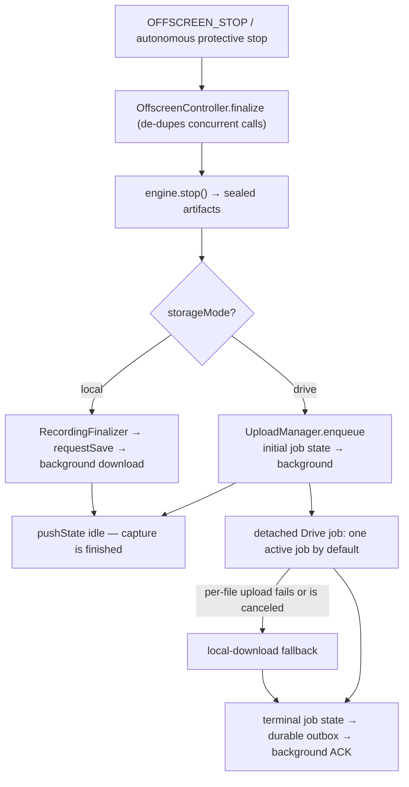

# Offscreen — the recording runtime (data plane)

> The MV3 **offscreen document**: the *only* context that can hold a DOM, run `MediaRecorder`, and own OPFS handles — so all media work lives here. The [background](../background/README.md) commands it over a port; it reports status back. This README is the **composition layer** — how the pieces wire together; each subsystem has its own README. For symbol-level structure use codegraph (`codegraph_explore "OffscreenController RecordingFinalizer wirePortHandlers"`).

> **Archetype:** *Platform Runtime* (composition). Thin by design: it owns the **port/RPC wiring, the phase/warning state, and the stop→finalize/upload-job sequencing**, and delegates the actual work down. If you read one section, read **The stop → delivery pipeline**.

## Purpose & mental model

The **data plane** to the background's command plane. The background decides *what* (start/stop/discard, the `desired` intent); the offscreen *does* it — acquires media, encodes, persists, and queues delivery — then broadcasts what happened. The mental model: **a recreatable worker behind an RPC port.** The recording snapshot and history belong in the background, while OPFS files, in-flight upload markers, and the terminal-upload outbox provide the small durable bridges needed to recover this recreatable runtime.

## How it composes

```
background ──OFFSCREEN_START/STOP (RPC)──▶ rpcHandlers ─▶ OffscreenController (phase + capture-finalize coordinator)
                                                              │
                                              ┌───────────────┼───────────────────────┐
                                              ▼               ▼                       ▼
                                       RecorderEngine     storage         RecordingFinalizer / UploadManager
                                       (engine/)          (storage/)      (local save / detached Drive jobs)
                                                              │
offscreen ──OFFSCREEN_STATE { phase, epoch } (status)─────────┘
```

`rpcHandlers` validate commands and drive the controller; `OffscreenController` owns the capture phase/warning state and sequences capture finalization; `RecorderEngine` captures/encodes; the storage targets persist; `RecordingFinalizer` delivers local files; and `UploadManager` delivers Drive jobs after capture has returned to idle. Each layer is its own README: [engine](./engine/README.md), [storage](./storage/README.md), [drive](./drive/README.md), [analysis](./analysis/README.md).

## The stop → delivery pipeline


```mermaid
flowchart TD
    STOP["OFFSCREEN_STOP / autonomous protective stop"] --> CTRL["OffscreenController.finalize (de-dupes concurrent calls)"]
    CTRL --> ENG["engine.stop() → sealed artifacts"]
    ENG --> MODE{"storageMode?"}
    MODE -->|drive| QUEUE["UploadManager.enqueue<br/>initial job state → background"]
    MODE -->|local| SAVE["RecordingFinalizer → requestSave → background download"]
    QUEUE --> IDLE["pushState idle — capture is finished"]
    SAVE --> IDLE
    QUEUE --> UP["detached Drive job: one active job by default"]
    UP -->|per-file upload fails or is canceled| FB["local-download fallback"]
    UP --> TERM["terminal job state → durable outbox → background ACK"]
    FB --> TERM
```

`finalize()` is **idempotent across concurrent calls** (one shared in-flight promise), so a user stop and an autonomous protective stop can't double-run it. Local mode saves inline. Drive mode hands sealed artifacts to `UploadManager` and immediately returns the recording to idle, so a new recording can start while the old upload runs. The manager uses one job at a time by default so it cannot starve live capture; its per-file finalizer still uses bounded Drive concurrency and **falls back to a local download** on failure or cancellation, so a Drive outage never loses a recording. A failure before the job can be queued → `pushState('failed')`.

`OFFSCREEN_DISCARD` follows a separate path: it stops capture, waits for every artifact cleanup, drops the artifact references, and reports idle. It never invokes a local save, a Drive upload, or a retained upload job. A cleanup failure is surfaced to the caller rather than falsely reporting a successful discard.

## The command/status protocol (offscreen side)

- **Commands in (RPC over a `chrome.runtime.Port`):** `OFFSCREEN_START` (validate → busy-check → freeze `epoch`/`storageMode`/telemetry run id → `pushState('starting')` → `engine.startFromStreamId`), `OFFSCREEN_STOP`, `OFFSCREEN_DISCARD`, `OFFSCREEN_SET_MIC_MUTED` / `_CAMERA_MUTED` / `_PAUSED`, `OFFSCREEN_RETRY_UPLOAD`, `OFFSCREEN_CANCEL_UPLOAD`, `OFFSCREEN_RENAME_DRIVE_RESOURCES`, and `REVOKE_BLOB_URL`.
- **Status out:** `pushState` broadcasts `OFFSCREEN_STATE { phase, epoch, warnings?, telemetrySnapshot? }`. The offscreen **self-derives** its capture phase and **echoes** the run `epoch` from `OFFSCREEN_START` — it never reads the background's phase. `UploadManager` independently broadcasts `OFFSCREEN_UPLOAD_STATE { job, telemetryRunId?, telemetrySnapshot? }`; job state is not a recording phase. (The echoed epoch is what the background's [fence](../shared/README.md) matches against; see ADR-0003.)
- **Readiness & reconnect:** on connect it posts `OFFSCREEN_READY { version }` (the build id — the **version handshake** that lets the background detect and heal SW/offscreen code skew), current capture state, and any active upload jobs. A dropped port reconnects with exponential backoff (1 s → 30 s cap). Terminal jobs are first written to `UploadJobStateOutbox` in `chrome.storage.local`; the entry is replayed until `OFFSCREEN_ACK_UPLOAD_STATE { jobId }` arrives after the background has persisted it.

## Key invariants & gotchas

- **The recording snapshot is not owned here.** The offscreen is recreatable; the canonical session and history live in the background. OPFS files, pending-upload markers, and the terminal-upload outbox are narrowly scoped durability aids, not alternate session truth.
- **Phase is self-derived and broadcast, never read back.** The offscreen owns the `observed` plane only; it echoes (does not own) the `epoch`.
- **`finalize` is single-flight.** Guard concurrent stops with the shared promise — don't kick off a second `engine.stop()`.
- **A Drive upload is detached.** It must not put the capture session back into `uploading`; preserve its `historyId` and job id in immutable artifact context instead of relying on mutable controller state.
- **Terminal job delivery is at-least-once.** Persist the terminal state before posting it and remove the outbox record only after the background acknowledgement. The background/history reducers must therefore tolerate replay.
- **Warnings are de-duplicated** and re-broadcast on the current phase, so a repeated condition doesn't spam the popup.
- **Busy-check before start.** `OFFSCREEN_START` rejects if already in a busy phase or finalizing — the background's epoch fence + this guard together prevent overlapping runs.

## Files

| File | Role |
| :--- | :--- |
| `offscreen.ts` | the entrypoint: port lifecycle, `OFFSCREEN_READY` handshake, engine/finalizer/controller/upload composition, detached-state replay, per-run telemetry reducers/checkpoints, and production/development runtime sampling |
| `OffscreenController.ts` | capture phase/warning state machine plus stop→local-save or stop→enqueue coordinator; owns discard cleanup |
| `RecordingFinalizer.ts` | sealed-artifact delivery primitive: local save or per-file Drive upload with bounded concurrency and local fallback; emits `finalizer.*` perf events |
| `UploadManager.ts` | detached Drive queue, progress/terminal job state, cancellation, and bounded retry-artifact retention |
| `rpcHandlers.ts` | background→offscreen command handlers, Drive metadata rename RPC, upload-state acknowledgement, and reconnect runtime listener |
| `RuntimeSampler.ts` | cumulative event-loop lag / long-task / heap sampler shared by the local dashboard and bounded production reducer |

Subsystems (own READMEs): [`engine/`](./engine/README.md), [`storage/`](./storage/README.md), [`drive/`](./drive/README.md), [`analysis/`](./analysis/README.md) — the embedding engine and the analysis job (ADR-0007). Support modules (`RecorderAudio`, `RecorderCapture` — its e2e-only synthetic tab stream lives in the sibling `RecorderCaptureE2EMock` so the production capture path carries no test scaffolding — `RecorderProfiles`, `DriveTarget`, `LocalFileTarget`) sit at this root and are documented by the subsystem that owns them.

## Observability

The finalizer emits `finalizer.*` events (`finalize_complete`, `local_save_requested`, `drive_file_complete`, `drive_finalize_complete` with `fallbackRate`); `RuntimeSampler` emits `runtime.*` (lag/long-tasks/heap). Both fold into the background's `PerfDebugStore` and render in [`debug`](../debug/README.md). Separately, one `TelemetryAccumulator` per telemetry-only run ID reduces capture, recorder, OPFS, finalization, upload, and runtime signals into bounded production totals/maxima/incidents. High-frequency work mutates memory only; snapshots move to the background at most every 60 seconds and at critical/terminal boundaries. Production runtime sampling is 10 seconds while recording and diagnostics are enabled; the existing development sampler remains more frequent. Opt-out resets accumulators and stops production sampling immediately. The offscreen is the only context that can observe its *own* event-loop lag — see the [instrumentation doc](../../docs/plans/storage-and-instrumentation-architecture.md).

## Testing notes

- `__tests__/OffscreenController.test.ts` drives the phase machine plus local save, detached Drive enqueue, discard cleanup/error propagation, and single-flight behavior against fake engine/finalizer slices — no live port/DOM needed (the controller was *extracted from* `offscreen.ts` precisely so it's testable).
- `__tests__/RecordingFinalizer.test.ts` covers local/Drive paths, immutable artifact/telemetry context, per-file fallback, and cancellation. `UploadManager.test.ts` covers queueing, cancel/retry, and bounded retry retention; `rpcHandlers` covers metadata rename delegation; `RuntimeSampler` covers cumulative/reset behavior.

## Related

- [ADR-0003](../../docs/adr/0003-recording-phase-ownership-and-stale-offscreen-status.md) — the offscreen owns the `observed` plane and echoes the epoch; the fence + handshake rationale.
- [ADR-0004](../../docs/adr/0004-decouple-uploads-from-the-recording-session.md) — detached upload jobs, retry/cancel semantics, and capture/upload separation.
- [`background`](../background/README.md) — the command plane that drives this runtime and owns its lifecycle (create/reconnect/recreate).
- [MV3 update hygiene](../../docs/plans/) / the version handshake — why `OFFSCREEN_READY` carries a build id.

## External references

- Chrome — [`chrome.offscreen`](https://developer.chrome.com/docs/extensions/reference/api/offscreen) (why this document exists and its `reasons`) and [long-lived connections / `runtime.connect`](https://developer.chrome.com/docs/extensions/develop/concepts/messaging#connect) (the command/status port).
