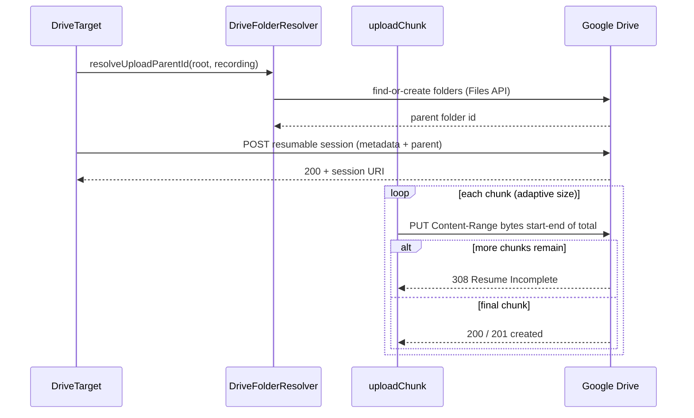
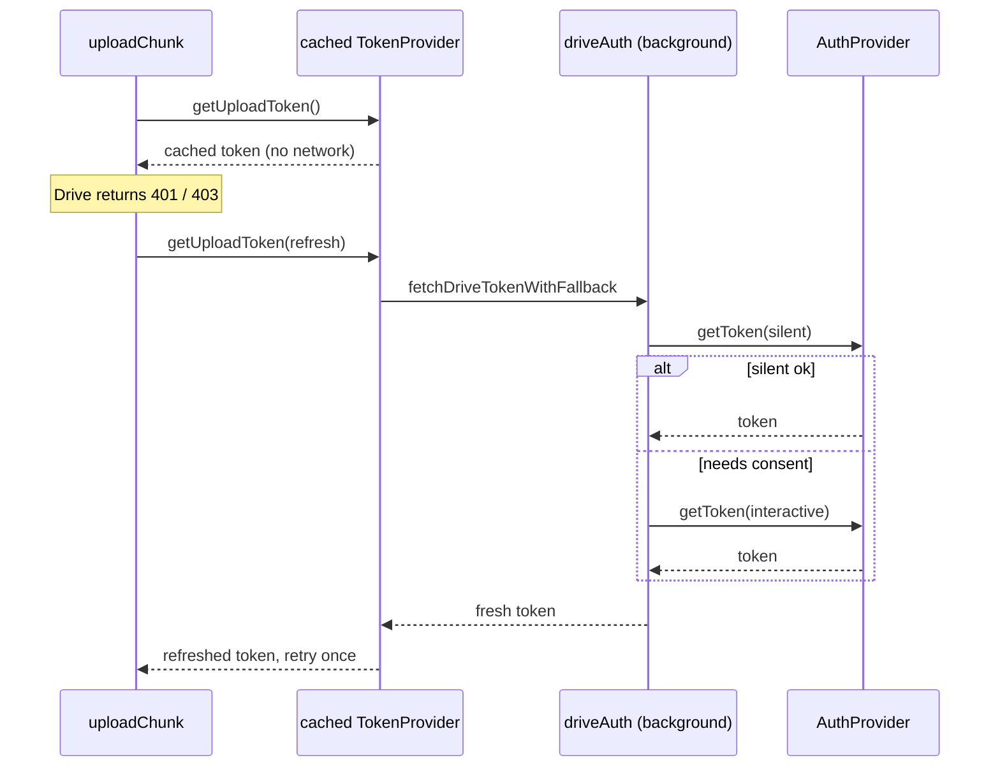

# Drive Upload — resumable upload, OAuth token use & crash recovery

> Part of the [offscreen runtime](../README.md) (data plane). Uploads a sealed recording to Google Drive. For symbol-level structure use codegraph (`codegraph_explore "DriveChunkUploader DriveFolderResolver resumePendingUploads"`); this doc explains the wire protocols and the failure handling around them. The per-file orchestrator `DriveTarget` lives one level up at [`../DriveTarget.ts`](../DriveTarget.ts); this folder is the protocol layer it drives.

> **Archetype:** *External Integration*. The defining property here is that **the other side is a remote HTTP API we don't control** — so this README leads with the two wire protocols (resumable upload, OAuth token use) as sequence diagrams and a status-code-driven failure table. Token *acquisition* (the browser-specific consent flow) is a separate seam — see [`platform/capabilities`](../../platform/capabilities/README.md); this folder only *uses* tokens. If you read one section, read **The resumable-upload protocol**.

## Purpose & mental model

Upload a finished, sealed recording file to Drive **durably over a flaky network**: chunk it, drive a [resumable session](https://developers.google.com/workspace/drive/api/guides/manage-uploads#resumable), recover from partial commits and transient failures, and — if the whole offscreen document dies mid-upload — re-upload it on the next launch. A recording can be several files (tab, separate mic, self-video); each is one `DriveTarget` upload, and up to `parallelUploadConcurrency` of them run **concurrently across files** (a single resumable session is inherently sequential by byte-range, so the concurrency is between files, never within one session). `UploadManager` runs this work as a detached job after capture is idle; Drive work is never an active-recording phase.

## The resumable-upload protocol

```mermaid
sequenceDiagram
    participant DT as DriveTarget
    participant FR as DriveFolderResolver
    participant CU as uploadChunk
    participant G as Google Drive

    DT->>FR: resolveUploadParentId(root, recording)
    FR->>G: find-or-create folders (Files API)
    G-->>FR: parent folder id
    DT->>G: POST resumable session (metadata + parent)
    G-->>DT: 200 + session URI
    loop each chunk (adaptive size)
        CU->>G: PUT Content-Range bytes start-end of total
        alt more chunks remain
            G-->>CU: 308 Resume Incomplete
        else final chunk
            G-->>CU: 200 / 201 created
        end
    end
```

- The session is created once (`DRIVE_UPLOAD_URL`, `uploadType=resumable`); Drive returns a **session URI** that every chunk `PUT`s to.
- Each chunk carries `Content-Range: bytes <start>-<end>/<total>` and the sealed artifact's actual `Content-Type` (`video/webm`, `video/mp4`, or `audio/mp4`). The same type is sent in the resumable-session metadata. A non-final chunk that lands returns **`308`** (Resume Incomplete) → advance `start`; the final chunk returns **`200/201`** → done.
- **Partial-commit recovery** (`recoverFromCommittedState`): on a transient failure mid-chunk, re-query the session with `Content-Range: bytes */<total>`, read Drive's `Range` header to learn the committed offset, and **slice the body forward** to exactly what's missing — so a retry never re-sends committed bytes or leaves a gap.

## The OAuth token flow (use, not acquisition)

```mermaid
sequenceDiagram
    participant CU as uploadChunk
    participant TP as cached TokenProvider
    participant AU as driveAuth (background)
    participant ID as AuthProvider

    CU->>TP: getUploadToken()
    TP-->>CU: cached token (no network)
    Note over CU: Drive returns 401 / 403
    CU->>TP: getUploadToken(refresh)
    TP->>AU: fetchDriveTokenWithFallback
    AU->>ID: getToken(silent)
    alt silent ok
        ID-->>AU: token
    else needs consent
        AU->>ID: getToken(interactive)
        ID-->>AU: token
    end
    AU-->>TP: fresh token
    TP-->>CU: refreshed token, retry once
```

- **`createCachedTokenProvider`** holds one token in memory for the whole upload so we don't call the identity API per chunk; a `refresh` bumps a generation counter (so a stale in-flight load can't overwrite the new token) and forces one re-fetch.
- A `401/403` triggers exactly **one** refreshed retry (both in `uploadChunk` for PUTs and `fetchWithAuthRetry` for folder ops). Token **acquisition** (silent→interactive fallback, bad-client-id diagnosis) is `background/drive/driveAuth.ts` behind the [`AuthProvider`](../../platform/capabilities/README.md) seam (ADR-0002) — this folder treats it as a black box that returns a string.

## Failure modes & retry/backoff

The status-code contract `uploadChunk` enforces (`DRIVE_MAX_RETRIES = 5`, exponential backoff `1 s` base capped at `8×`):

| Drive response | Action |
| :--- | :--- |
| `308` (non-final) | chunk committed → advance to next chunk |
| `200` / `201` (final) | upload complete |
| `401` / `403` | refresh token, retry once |
| `429` / `408` / `5xx` | recover committed offset → backoff → retry (≤5) |
| transient fetch (`AbortError`/`TypeError`, including the 180 s `DRIVE_REQUEST_TIMEOUT_MS` abort) | recover committed offset → backoff → retry (≤5), unless the job was canceled |
| other `4xx` | throw `formatDriveError` — status + detail **+ an actionable hint** (missing scope, Drive API not enabled, unverified consent screen, …) |

`formatDriveError` is deliberately user-actionable: a `403 insufficient scope` becomes "confirm `manifest oauth2.scopes` includes `drive.file` and re-consent", not a raw payload dump.

Every Drive HTTP operation — folder lookup/create, resumable-session creation, chunk upload, and committed-offset probe — goes through `fetchWithTimeout`. A job `AbortSignal` aborts the active request and retry backoff. Folder resolution is shared through an abort-aware flight: canceling one caller releases that caller immediately, but the underlying lookup is aborted only after its **last** cancelable consumer leaves. A remaining upload therefore keeps setup alive; an abandoned setup does not keep running until its 180 s timeout or create folders after every job has been canceled.

## Crash recovery — re-upload fresh, never resume

If the offscreen document dies mid-upload, recovery does **not** resume the abandoned session. Why: the marker (`PendingUploadStore`) intentionally does **not** store the session URI, because a WebM OPFS file can contain raw, pre-duration-fix bytes — splicing it onto the duration-fixed prefix the old session already committed would silently corrupt the file. So `resumePendingDriveUploads` re-opens the raw OPFS file, **re-runs the duration fix only for WebM**, and uploads through a **brand-new** resumable session. MP4 and M4A retain their real MIME type and bypass the fix. Recovery re-sends already-committed bytes only in the rare crash case, in exchange for guaranteed correctness.

- **`PendingUploadStore`** writes **one IndexedDB key per file** (prefix-namespaced), *not* a single map — so the concurrent (across-files) uploader's `put`/`remove` can never lose each other to a read-modify-write race.
- **Durable state here is IndexedDB, never `chrome.storage`.** This code runs in the offscreen document, whose `chrome` object is `runtime` only, and `platform/chrome/storage.ts` deliberately degrades to a no-op instead of throwing so a failed marker cannot abort finalize. Both together meant every marker and every terminal upload state was silently discarded: crash recovery had nothing to find, and terminal states were never replayed. IndexedDB belongs to the extension origin, so the offscreen document writes it and background reads it.
- The marker is cleared **the instant** Drive confirms the upload (before deleting the OPFS file), to keep the "crashed between Drive's 200 and our cleanup" duplicate window as small as possible.
- Markers carry the owning `historyId` and detached `jobId` when available. Recovery first reports the grouped job as uploading, then reports a terminal result, so history and the popup converge rather than receiving a silent Drive-side change.
- A marker whose OPFS file is already gone is reported as **unavailable** and dropped. A recovery upload failure is **retry-pending** and retains its marker for the next launch; the UI must not claim either outcome was saved locally.

## Folder resolution

`DriveFolderResolver` resolves `rootFolderName / destinationFolderName / recordingFolderName` to a parent id, creating folders as needed. The root's name comes from settings and rides the stop message, because the offscreen document has no `chrome.storage` to read it from; `DRIVE_ROOT_FOLDER_NAME` is the legacy fallback for a stop sent by an older background build, or a crash-recovery marker written before the setting existed. It caches a recording-folder **flight** statically (shared across `DriveTarget` instances, so the several files of one recording resolve the folder once and race-free), evicting a failed or fully canceled flight. Folder-name lookups escape the Drive query literal (`'` and `\`) to keep the `q=` search safe. Each flight owns an `AbortController`: it passes that signal into lookup/create requests, but aborts only when no cancelable caller remains. This preserves shared work without leaving abandoned Drive setup running.

## Post-upload metadata rename

Completed jobs persist `driveFolderId`, folder name/link, and each available `driveFileId` into the session/history projections. When the user names that recording, the background builds deterministic targets with `slugifyRecordingTitle` / `buildRenamedRecordingFilename` and calls `OFFSCREEN_RENAME_DRIVE_RESOURCES`; the offscreen owns the token and invokes `DriveMetadataRenamer`.

The renamer first reads every original name, then PATCHes files followed by the folder **sequentially**. If any PATCH fails, it rolls already-changed resources back in reverse order. A complete rollback leaves history untouched and returns an actionable error. If rollback itself is incomplete, the renamer reads current names best-effort and returns them so `RecordingHistoryService` can synchronize history to observable Drive reality rather than claim either the old or requested names. IDs and names remain delivery/history data only—they are excluded from telemetry.

## Configuration & flags

| Constant / flag | Value | Role |
| :--- | :--- | :--- |
| `DRIVE_UPLOAD_CHUNK_BYTES` | 2 MB | default chunk size |
| `DRIVE_MIN/MAX_UPLOAD_CHUNK_BYTES` | 1–8 MB | adaptive bounds |
| `DRIVE_UPLOAD_CHUNK_STEP_BYTES` | 1 MB | adaptive step |
| `DRIVE_FAST/SLOW_CHUNK_MS` | 1.5 s / 8 s | grow / shrink thresholds |
| `DRIVE_MAX_RETRIES` | 5 | transient-retry cap |
| `DRIVE_REQUEST_TIMEOUT_MS` | 180 s | per-PUT abort |
| `dynamicDriveChunkSizing` (perf flag, default on) | — | adapt chunk size to measured throughput |
| `parallelUploadConcurrency` (perf flag, default 2) | — | files uploaded concurrently (see the [perf roadmap](../../../docs/plans/perf-optimization-roadmap.md)) |

## Observability

Drive upload feeds the `upload.*` section of the local perf snapshot and the production telemetry reducer. The development dashboard retains chunk/job distributions, throughput, concurrency, and fallback detail. Production retains only bounded job/file/chunk/byte counts, request/job duration totals and maxima, retries, concurrency maximum, and completed/partial/failed/canceled outcomes. It never includes Drive IDs, filenames, folder names, links, tokens, or raw errors. Metadata rename is intentionally outside telemetry because its inputs are user and Drive data.

## Key invariants & gotchas

- **A resumable session is sequential.** Concurrency is across files only; never issue two byte-range `PUT`s to one session URI.
- **Never store the session URI for recovery** — the raw OPFS bytes don't match what the old session committed (see Crash recovery). Re-upload fresh.
- **Clear the marker before deleting the OPFS file**, not after — minimizes the duplicate window.
- **Keep identity with the artifact.** `historyId` and `jobId` travel with each pending-upload marker and local-fallback request; never derive them from mutable active-session state after capture ends.
- **Cancellation is a safe terminal delivery path.** Abort the upload request/backoff, then let the normal per-file local-download fallback preserve unfinished files.
- **One token per upload, one refresh per auth failure.** The cached provider's generation counter is what keeps a slow stale fetch from clobbering a freshly-refreshed token.
- **`driveFetch` is the single fetch seam** — in E2E builds it routes through a message bridge to a mock Drive; never call `fetch` directly here or you bypass the test harness.

## Files

| File | Role |
| :--- | :--- |
| `DriveChunkUploader.ts` | the resumable chunk `PUT` loop: byte-range protocol, 308/200 handling, retry/backoff, `recoverFromCommittedState` |
| `DriveFolderResolver.ts` | resolve/create `root/recording` folders, static race-free cache, query escaping |
| `DriveMetadataRenamer.ts` | GET current metadata, sequential PATCH rename, reverse rollback, and incomplete-rollback reconciliation evidence |
| `PendingUploadStore.ts` | per-file IndexedDB crash-recovery markers |
| `resumePendingUploads.ts` | next-launch fresh re-upload of interrupted uploads |
| `UploadJobStateOutbox.ts` | durable terminal detached-upload state, replayed until `OFFSCREEN_ACK_UPLOAD_STATE` |
| `request.ts` | `driveFetch` (real / E2E bridge), `createCachedTokenProvider`, `fetchWithAuthRetry` |
| `errors.ts` | `formatDriveError` (status + detail + actionable hint), `readDriveErrorDetail` |
| `constants.ts` | endpoints, chunk-sizing + retry/backoff constants |
| `folderNaming.ts` | derives the recording folder name from filenames |

Orchestrator: [`../DriveTarget.ts`](../DriveTarget.ts) (per-file upload, adaptive chunk sizing, shared folder-resolver/token context).

## How it's wired

After capture seals, `UploadManager` owns a detached job and drives `RecordingFinalizer`, which creates a `DriveTarget` per sealed file and calls `upload(file)`. Before/around the upload it writes a `PendingUploadStore` marker so a crash is recoverable; job updates go to the background, and terminal updates are also written to `UploadJobStateOutbox` until acknowledged. On the next launch, `offscreen.ts` runs `resumePendingDriveUploadsWithChrome`. The token comes from the background's `GET_DRIVE_TOKEN` path (`driveAuth.fetchDriveTokenWithFallback`); on any upload failure or cancellation the finalizer falls back to a **local download** of that file, so a Drive outage never loses a recording.

## Testing notes

- `__tests__/DriveChunkUploader.test.ts` drives the byte-range protocol against scripted responses (308 chain, 200 final, 401-refresh, 5xx-recover-and-backoff, the `Range`-header committed-offset recovery) — the protocol is unit-tested without a network.
- `__tests__/DriveFolderResolver.test.ts` covers find-vs-create, the static cache, pre-canceled callers, last-consumer abort, shared-consumer survival, and hard-timeout wrapping; `DriveMetadataRenamer.test.ts` covers no-op names, sequential success, rollback, and incomplete rollback; `resumePendingUploads.test.ts` covers fresh re-upload, `retry-pending`, and unavailable-source reporting. `UploadJobStateOutbox.test.ts` covers terminal-state persistence and acknowledgement removal.
- The full path against a *simulated* Drive is covered by the `@perf-full` Drive scenario and `tests/e2e/recording-rename.spec.ts` through the `driveFetch` E2E bridge. Real Google Drive is only exercised by the real-Meet harness.

## Related

- [`platform/capabilities`](../../platform/capabilities/README.md) — token **acquisition** (the `AuthProvider` seam, silent→interactive fallback, ADR-0002 cross-browser).
- [ADR-0004](../../../docs/adr/0004-decouple-uploads-from-the-recording-session.md) — the detached upload-job lifecycle that drives this protocol.
- [Perf roadmap](../../../docs/plans/perf-optimization-roadmap.md) — `parallelUploadConcurrency` and `dynamicDriveChunkSizing` (both shipped, default-on).
- [`offscreen/storage`](../storage/README.md) — orphan recovery reads the same OPFS files these markers point at.

## External references

- Google Drive API — [Resumable upload](https://developers.google.com/workspace/drive/api/guides/manage-uploads#resumable) (the `308` / `Content-Range` / session-URI protocol), [Files: create](https://developers.google.com/workspace/drive/api/reference/rest/v3/files/create), and [Files: update](https://developers.google.com/workspace/drive/api/reference/rest/v3/files/update) (metadata rename PATCH).
- MDN — [`Content-Range`](https://developer.mozilla.org/en-US/docs/Web/HTTP/Reference/Headers/Content-Range) and [`Range`](https://developer.mozilla.org/en-US/docs/Web/HTTP/Reference/Headers/Range) (the resume protocol's headers).
- [OAuth 2.0 (RFC 6749)](https://datatracker.ietf.org/doc/html/rfc6749) — the bearer-token model; acquisition specifics live with the auth seam.
