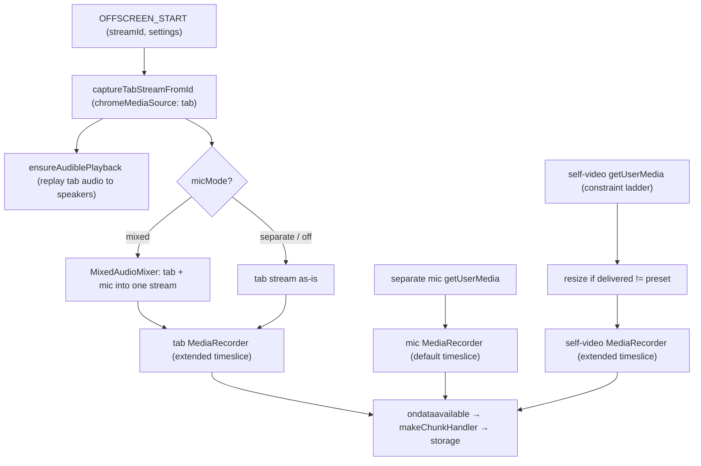
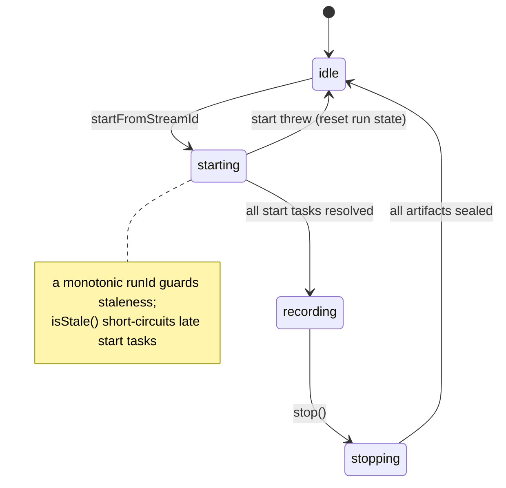
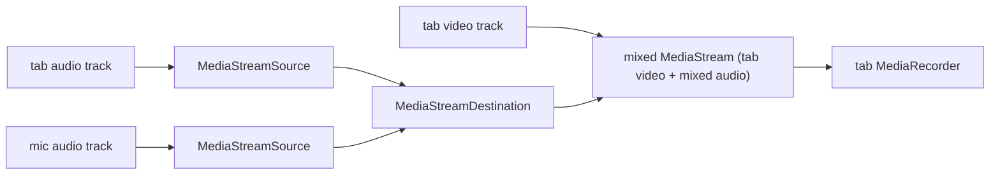

# Offscreen Engine — the recorder core (capture → encode → artifacts)

> The media engine of the [offscreen runtime](../README.md): it acquires the capture streams, runs a `MediaRecorder` per stream, and hands sealed artifacts to the storage layer. For symbol-level structure use codegraph (`codegraph_explore "RecorderEngine RecorderProfiles startTabRecorder"`). Where the bytes *go* after the recorder emits them is [`offscreen/storage`](../storage/README.md); this folder is everything up to `ondataavailable`.

> **Archetype:** *Media Pipeline* (an altered Resilience-Subsystem — storage owns the durability/failure story, so this README leads with the **dataflow** and the **audio graph** instead of a failure table). The hard parts here are the multi-stream parallel startup, the Web Audio mixing, and actuating live controls without interrupting capture. If you read one section, read **The capture → encode pipeline**.

## Purpose & mental model

Turn one tab-capture stream id (plus optional mic and camera) into one-to-three encoded WebM artifacts. The mental model is **N independent per-stream recorders started in parallel, with one load-bearing stream**: the **tab** recorder is required (its failure aborts the run); the **separate mic** and **self-video** recorders are optional (their failures are warned and degraded, never fatal). The engine owns stream lifetimes and live actuation (mute/hide/pause); it does *not* decide policy (that's the [background](../../background/README.md)) or persist bytes (that's [storage](../storage/README.md)).

## The capture → encode pipeline

`startFromStreamId` acquires the tab stream, sets up audible playback, builds the optional streams, then starts all recorders in **parallel** (`Promise.all` over `buildRecorderStartTasks`). The tab task is un-caught (its rejection aborts the start); the optional tasks are `.catch`-warned.

## The engine state machine

A monotonic **`runId`** (bumped each `startFromStreamId`) is the staleness guard: any task that resolves after a stop/new-run checks `isStale()` and bows out, so a slow camera acquisition from an abandoned run can't attach to the live one.

## Mic modes & the audio graph

Three modes (`off` / `mixed` / `separate`):

- **`mixed`** folds the mic into the tab recording via a real Web Audio graph (`MixedAudioMixer`) — there is no separate mic file:

- **`separate`** records the mic as its own audio-only file (its own `MediaRecorder`).
- **`off`** acquires no mic.

**`ensureAudiblePlayback`** (the `AudioPlaybackBridge`) replays the captured tab audio back to the speakers — `tabCapture` mutes the tab locally while capturing, so without this the user hears nothing during recording.

## Self-video: constraint ladder, adaptive bitrate, resize

- **Constraint ladder** (`getSelfVideoConstraintRequests`): try `exact-size-and-fps` → `exact-size` → `best-effort`, so a camera that can't hit the exact preset still yields a usable stream.
- **Resolution enforcement / resize:** if the delivered track resolution ≠ the preset, a per-frame resize re-rasterizes to the target. `selfVideoUseAutoResolution` **skips** this (records the browser-delivered resolution), trading enforced dimensions for the CPU of the resize pump.
- **Adaptive bitrate** (`resolveSelfVideoBitrate`, gated by the `adaptiveSelfVideoProfile` flag): estimate `width × height × fps × SELF_VIDEO_QUALITY_FACTOR` (0.05 bits/pixel/frame — a webcam talking head is low-motion, so it needs far fewer bits/pixel than general video), clamped to `[minAdaptive, configured]` — so a camera delivering less than the preset doesn't waste bits, and one delivering the full preset gets the configured ceiling.

## Codec & timeslice policy (`RecorderProfiles`)

- **MIME**: VP8/Opus preferred for tab (falls back VP9 → generic webm), VP8 for self-video, Opus for mic — chosen via `MediaRecorder.isTypeSupported`.
- **Content hints**: each recorded video track is tagged with a `MediaStreamTrack.contentHint` — camera → `motion` (a talking head; bias toward temporal smoothness), tab → `text` for `screen` content / `motion` for `video` content — an advisory hint that steers the encoder's rate/quality tradeoff. Best-effort: `MediaRecorder` may ignore it.
- **Timeslice** (`getChunkTimesliceMs`): tab + self-video use the **extended** (longer) cadence — fewer, larger OPFS writes cut churn; a crash loses at most one timeslice of unflushed buffer, and a power cut is bounded by storage's ~10 s flush window anyway. The mic stays on the **default** (shorter) cadence unless `extendedTimeslice` opts it in.

## Live controls (actuation, not policy)

The popup toggles, the background commands, the engine **actuates** — never interrupting capture:

- **mute mic** → the mic track is silenced (records silence); **hide camera** → black frames; both via per-stream control callbacks captured at start.
- **pause** (`setPaused` / `applyPauseState`) pauses every recorder *and* idles the upstream producers, **in order**: on resume, restart producers (mixer/self-video) *before* the recorders so frames/audio are already flowing; on pause, idle producers *after* the recorders so no work is wasted. A toggle during `starting` is applied to recorders as they come up.

## Key invariants & gotchas

- **The tab stream is load-bearing.** Its recorder task is the one not swallowed — a tab failure aborts the whole run; optional streams degrade.
- **Stop the mic *source* track before nulling `micStream`.** Stopping a `MediaRecorder` does **not** stop its source track; in `separate` mode the engine owns that track, so the `onStopped` callback stops it first (`safeStopStream`, idempotent) — otherwise the OS mic indicator stays lit after recording ends. (This was a real regression; the fix lives in `buildRecorderStartTasks`.)
- **`runId` is the staleness fence.** Every async task re-checks it; don't attach a recorder without the `isStale()` guard.
- **Pause ordering matters** — producers and recorders start/stop in the opposite order on pause vs. resume (see above) to avoid black/blank filler and wasted mixing.

## Files

| File | Role |
| :--- | :--- |
| `../RecorderEngine.ts` | the orchestrator: acquire → parallel start → stop → seal; live-control actuation |
| `TabRecorderTask.ts`, `MicRecorderTask.ts`, `SelfVideoRecorderTask.ts` | per-stream start/stop, each owning its `MediaRecorder` + storage target |
| `RecorderEngineSetup.ts`, `RecorderTaskUtils.ts` | start-task helpers, `openStorageTarget` + `makeChunkHandler` (the storage seam) |
| `RecorderEngineTypes.ts` | `StorageTarget`, `SealedStorageFile`, `CompletedRecordingArtifact`, `InMemoryStorageTarget`, `RecorderEngineDeps` |
| `../RecorderProfiles.ts` | MIME / bitrate / timeslice / self-video-constraint policy |
| `../RecorderCapture.ts` | tab/mic/self-video media acquisition |
| `../RecorderAudio.ts` | `MixedAudioMixer` (mixed mode) + `AudioPlaybackBridge` (audible playback) |
| `../SelfVideoResize.ts` | the insertable-streams per-frame resize to the preset |
| `../RecorderSupport.ts` | recorder media-error formatting (`describeMediaError`) |

(Several collaborators sit at the `offscreen/` root rather than in `engine/` — they're cross-referenced above.)

## Observability

The engine emits the `lifecycle.*` events (`start_requested`/`start_completed`, `stop_requested`/`stop_completed`, `failure`) and the `capture.*` / `recorder.*` metrics (per-stream attempt/success/failure, requested-vs-delivered profile, start latency, chunk throughput, seal duration, last bitrate/timeslice) — all folded by `background/PerfDebugStore` and rendered by [`debug`](../../debug/README.md).

## Testing notes

- `__tests__/RecorderEngine.test.ts` drives start/stop/pause and the per-stream task wiring against mocked `MediaRecorder`/streams — including a **regression test** that the separate-mic source track is stopped on `stop()` (the lingering-mic-indicator bug).
- `RecorderProfiles`, `SelfVideoResize`, `RecorderCapture` have focused unit tests; real encode/CPU behavior is only meaningful on real hardware → the `@perf-*` e2e tiers, not jsdom.

## Related

- [`offscreen/storage`](../storage/README.md) — where `ondataavailable` chunks go (the `makeChunkHandler` seam).
- [`shared/settings`](../../shared/settings/README.md) — the frozen `RecorderRuntimeSettingsSnapshot` this engine consumes.
- [Perf roadmap](../../../docs/plans/perf-optimization-roadmap.md) — the candidate WebCodecs encode path for self-video; `adaptiveSelfVideoProfile` / `extendedTimeslice` flags.

## External references

- MDN — [`MediaRecorder`](https://developer.mozilla.org/en-US/docs/Web/API/MediaRecorder) (and [`isTypeSupported`](https://developer.mozilla.org/en-US/docs/Web/API/MediaRecorder/isTypeSupported)), [`MediaDevices.getUserMedia()`](https://developer.mozilla.org/en-US/docs/Web/API/MediaDevices/getUserMedia), [Web Audio API](https://developer.mozilla.org/en-US/docs/Web/API/Web_Audio_API) (the mixing graph).
- Chrome — [`chrome.tabCapture`](https://developer.chrome.com/docs/extensions/reference/api/tabCapture) (why captured tab audio needs the playback bridge).
- MDN — [Insertable streams / `MediaStreamTrackProcessor`](https://developer.mozilla.org/en-US/docs/Web/API/MediaStreamTrackProcessor) (the self-video resize) and [WebCodecs](https://developer.mozilla.org/en-US/docs/Web/API/WebCodecs_API) (the roadmap encode path).
