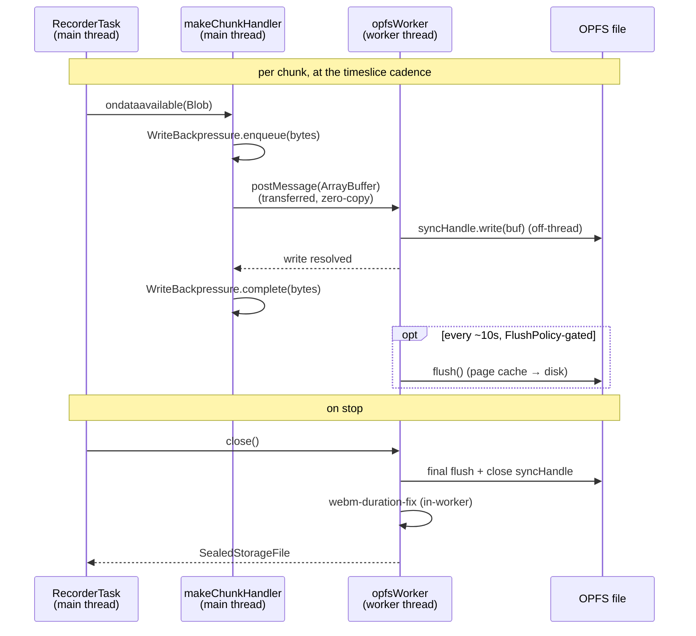
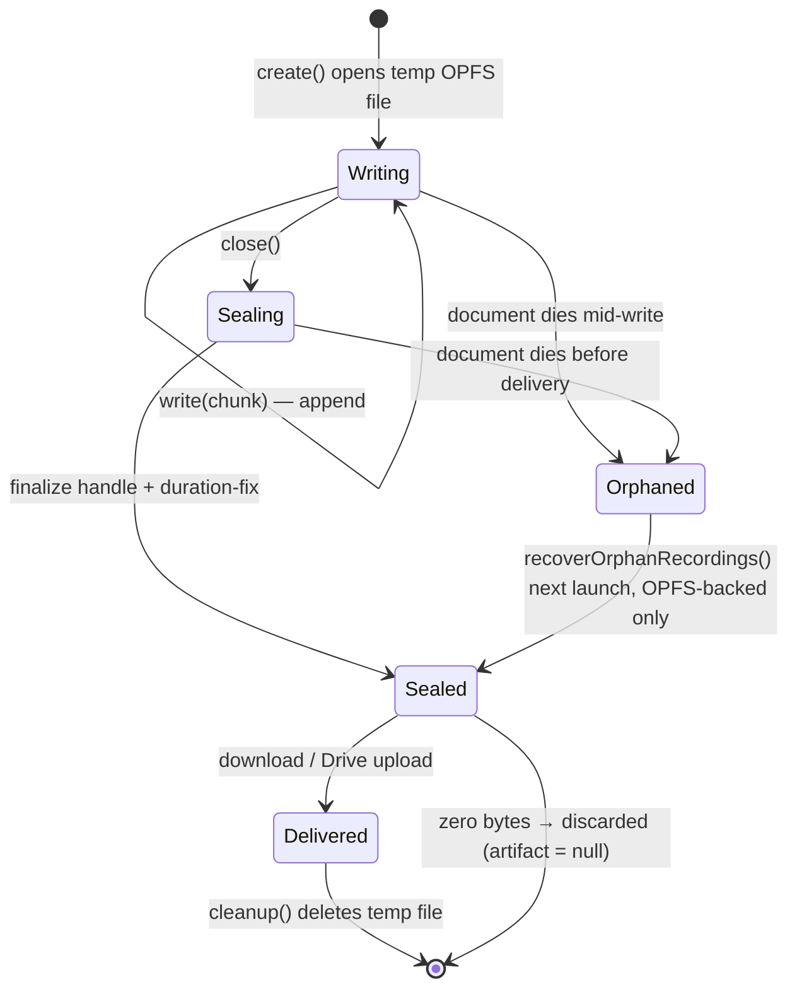
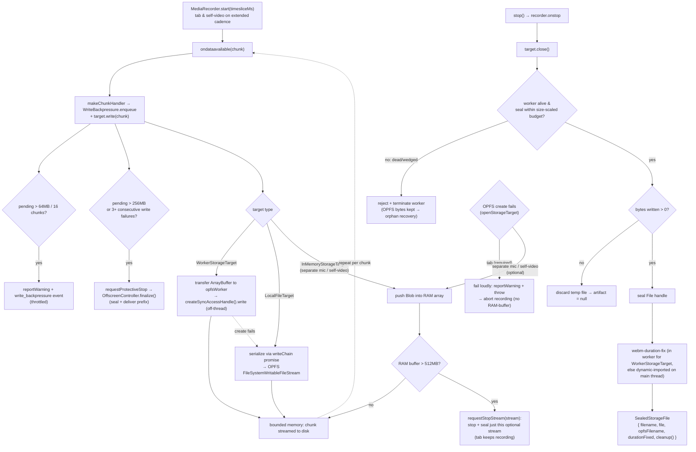

# Offscreen Storage — OPFS streaming, fallback ladder & crash recovery

> Part of the [offscreen runtime](../README.md) (data plane). Cross-cutting flows (control plane, persistence-to-Drive) live in the [root architecture reference](../../../README.md#architecture-reference). For symbol-level structure use codegraph (`codegraph_explore "offscreen storage opfs worker"`) — this doc carries the *why* and the invariants the code can't state for itself.

> **Archetype:** *Resilience Subsystem*. This README leads with design rationale, invariants, and a failure-modes table because storage is the component most defined by what happens when things go wrong (a slow disk, a dead worker, a power cut, an OOM-bound RAM buffer). If you only read one section, read **Failure modes & recovery**.

## Purpose & mental model

The long-meeting safety mechanism. Recorder chunks stream straight to OPFS so memory stays **bounded** instead of growing with recording length — a real 22-min / 507 MB recording peaks at ~23 MB JS heap (i.e. O(1) memory, not O(recording size)). Think of it as a small **bounded producer→consumer pipeline**: `MediaRecorder` produces chunks, a write target consumes them to disk, and a backpressure gate plus a fallback ladder keep the buffer between them from ever growing without limit. Everything in this folder exists to make the consumer either keep up, degrade gracefully, or stop cleanly with the captured prefix preserved — never to silently drop data or OOM the document.

## The `StorageTarget` contract

The three targets are interchangeable because they honor one small interface (`../engine/RecorderEngineTypes.ts`):

```ts
interface StorageTarget {
  write(chunk: Blob): Promise<void>;            // append; resolves when accepted (not necessarily flushed)
  close(): Promise<SealedStorageFile | null>;   // seal; null when nothing was written
}

interface SealedStorageFile {
  filename: string;
  file: Blob;                    // the sealed recording
  opfsFilename?: string;         // set iff OPFS-backed → the orphan-recovery key
  durationFixed?: boolean;       // true if the WebM duration fix already ran (in-worker)
  cleanup: () => Promise<void>;  // delete the temp/OPFS file once delivered
}
```

What every implementation must honor:

- **Ordered, serialized writes.** Calls may be fire-and-forget, but bytes must land in call order and never reorder past `close()` (the worker serializes posts; `LocalFileTarget` chains a write promise).
- **`close()` is terminal.** It seals exactly once and returns the artifact (or `null` for zero bytes); the `cleanup` hook on the result — not the target — is how the file is later deleted.
- **`opfsFilename` is the recovery key.** Set it *iff* the bytes live in OPFS; orphan recovery keys off it, which is precisely why a RAM artifact (which omits it) is unrecoverable by design.
- **`cleanup()` belongs to the caller, post-delivery.** The target hands back the hook; the persistence pipeline calls it after a successful download/upload — never the target itself.

## Design rationale & theory

Each mechanism here is a named, well-understood pattern adapted to the MV3 offscreen constraints. The references are tied to the specific decision they justify — not decoration.

- **Bounded buffer + backpressure (producer/consumer).** `MediaRecorder` is an unstoppable producer (you can pause it, but while running it emits on its own cadence), so the only lever on a slow consumer is to **bound the in-flight buffer and shed load when it's exceeded**. `WriteBackpressure` is that bounded buffer; the two-stage soft/hard breach is classic backpressure with **load-shedding** at the hard ceiling. See the [Reactive Streams](https://www.reactive-streams.org/) backpressure model — same problem (fast producer, slow consumer, finite memory), same answer (signal, then shed).
- **Graceful degradation with a load-bearing exception.** The `Worker ▸ LocalFile ▸ RAM` ladder is fault-tolerant *degradation*: lose the best option, fall to a worse-but-working one. The deliberate exception is the **required tab stream, which fails fast rather than degrading** — a fail-stop choice, because RAM-buffering a multi-GB tab recording is a path that *predictably* OOMs partway through with nothing salvageable. This is the availability/consistency tradeoff made explicit: degrade the optional, fail-stop the load-bearing.
- **Circuit-breaker / fail-stop on repeated faults.** The "silent-REC guard" (≥3 consecutive write rejections → protective stop) is a [circuit breaker](https://martinfowler.com/bliki/CircuitBreaker.html) (Nygard, *Release It!*): after a streak of failures, stop hammering a broken dependency and fail in a controlled way (here: seal the prefix) instead of running a phantom REC that records nothing to disk.
- **Bounded waits for liveness.** `close()` uses a size-scaled deadline rather than waiting forever on the worker — an unbounded wait on a wedged dependency is how a stop pipeline gets stuck in `stopping` forever. Pairing a deadline with "keep the raw bytes for recovery" makes the timeout *safe to be wrong about*. This is the same liveness reasoning as the background phase watchdog ([ADR-0003](../../../docs/adr/0003-recording-phase-ownership-and-stale-offscreen-status.md)).
- **Durability as a bounded loss window.** A periodic `flush()` turns "lose everything since the last `close()`" into "lose at most ~10 s," the same checkpoint-interval logic a database uses for group commit / WAL checkpoints. Application-level crash-consistency is genuinely hard (see Pillai et al., *All File Systems Are Not Created Equal*, OSDI '14) — so we keep the contract narrow and explicit: page-cache survives a process crash for free; only a hard power cut needs the flush, and it's bounded, not eliminated.
- **Zero-copy handoff.** Each chunk's `ArrayBuffer` is **transferred** (not copied) to the worker via [transferable objects](https://developer.mozilla.org/en-US/docs/Web/API/Web_Workers_API/Transferable_objects), so moving bytes off the main thread costs ~nothing and the main thread can't accidentally keep them alive.

## Threading model

The whole point of the default path is *what runs where*: the offscreen document already shares one main thread with the encoders, so storage must not add to its load.

| Offscreen **main thread** | OPFS **worker thread** |
| :--- | :--- |
| `makeChunkHandler` + `WriteBackpressure` accounting (O(1) bookkeeping) | `createSyncAccessHandle().write()` — the actual disk I/O |
| `ArrayBuffer` *transfer* to the worker (zero-copy, ~free) | `FlushPolicy`-gated `flush()` |
| `LocalFileTarget` writes (**fallback path only**) | WebM duration-fix on `close()` |
| RAM-buffer accumulation (`InMemoryStorageTarget`) | — |

On the default (`WorkerStorageTarget`) path, **no byte-writing or container-parsing touches the main thread** — only cheap accounting and a zero-copy handoff. The `LocalFileTarget` fallback deliberately gives this up (writes + duration-fix on the main thread) because it runs only when the worker is unavailable. That off-thread guarantee is exactly what the `@perf-contention` tier measures.

The cross-thread choreography of a write and the final seal:



## Alternatives considered — why OPFS

OPFS is not the obvious backend for a Chrome extension; it is the right one here.

- **`chrome.storage` (local/session):** key-value, multi-MB quotas, async, a structured-clone per write. Recordings are GB-scale binary streams — wrong shape, far past quota. (It *does* hold the small session/settings state — see the [instrumentation doc](../../../docs/plans/storage-and-instrumentation-architecture.md).)
- **IndexedDB:** no quota ceiling, but no streaming *append* — you'd accumulate chunks and write one giant blob (RAM blow-up), and every write crosses a structured-clone boundary. Off-main-thread append is the whole requirement, and IDB doesn't offer it cleanly.
- **OPFS + `createSyncAccessHandle`:** synchronous, in-place append from a **worker**, no per-write clone, no user-visible quota prompt, and an origin-private file we can hand to recovery by name. The cost — worker-only and Chromium-recent — is why the capability probe + fallback ladder exist.

## Key invariants & gotchas

- **Fallback ladder: `WorkerStorageTarget` ▸ `LocalFileTarget` ▸ `InMemoryStorageTarget`.** All three implement the same `StorageTarget` interface (`write(chunk)` / `close()`). The ladder spans three folders — the worker target is here, `LocalFileTarget` is at `../LocalFileTarget.ts`, and `InMemoryStorageTarget` is defined in `../engine/RecorderEngineTypes.ts`.
- **The required tab stream never degrades to RAM.** `openStorageTarget` fails it *loudly* (`reportWarning` + throw → abort the recording) rather than spend a whole meeting on a path that predictably OOMs. Only the **optional** streams (separate mic, self-video) degrade to RAM, because they still leave a useful recording if they drop; that downgrade is surfaced via `reportWarning`, not just a console warn. (Mixed-mic mode folds the mic into the tab stream, so only `separate` mic mode reaches this fallback.)
- **`close()` is hang-proof.** If the worker already failed it fails fast (no `close` posted to a dead worker), and the seal wait is bounded by a size-scaled budget (`TIMEOUTS.SEAL_BASE_MS` + per-MB) so a wedged worker can't leave the stop pipeline stuck in `stopping` forever. On timeout `close()` rejects and the worker is terminated; because the duration fix is read-only (bytes already flushed, sync handle closed), the raw recording is left on disk for orphan recovery — a false timeout only costs a re-run of the fix next launch.
- **RAM buffer is byte-capped (512 MB).** Past the ceiling `InMemoryStorageTarget` escalates `requestStopStream` to stop *just that* optional stream (sealing its partial artifact) while the tab keeps recording — a runaway RAM buffer can't OOM the shared offscreen document. This is distinct from the write-queue ceiling, which only catches a slow disk (pending bytes) and is blind to instant-completing RAM writes. Matters doubly because a RAM artifact has no `opfsFilename`, so it is *unrecoverable* by orphan recovery.
- **Backpressure is two-stage.** `makeChunkHandler` wraps every write with `WriteBackpressure`: a **soft** breach (>64 MB or >16 chunks queued) raises a throttled `reportWarning` + `write_backpressure` diagnostic; a **hard ceiling** (>256 MB unwritten) escalates once (`write_backpressure_ceiling`) to a **protective stop** that seals the persisted prefix instead of growing the queue toward OOM.
- **Storage-failure escalation (silent-REC guard).** `makeChunkHandler` counts *consecutive* write rejections (a success resets the streak). Past `MAX_CONSECUTIVE_WRITE_FAILURES` (3; ~12 s at tab cadence) it triggers the same protective stop — closing the case where the worker dies mid-session, every write rejects, yet the badge still reads REC with nothing reaching disk. Both escalations call `requestProtectiveStop` → `OffscreenController.finalize()`, the **same** seal→deliver pipeline a user stop uses, so the captured prefix is uploaded/saved, not dropped.
- **Periodic flush bounds power-cut loss.** By default the worker only forces the OS page cache to disk on `close()`. `FlushPolicy` (time-based gate, injectable clock) makes the worker `flush()` at most once per ~10 s of writes, bounding hard-power-cut loss to ~10 s rather than the whole unflushed window. The flush runs in the worker thread, never blocking the offscreen main thread. (A browser/extension crash with the OS alive was already safe — the page cache survives.)
- **`opfsWorkerStorage` perf flag (default on)** gates the worker target; `WorkerStorageTarget.create()` doubles as the capability probe — if `Worker`/`createSyncAccessHandle` is unavailable it rejects and the factory falls back.
- **Orphan recovery** (`recoverOrphanRecordings.ts`) reclaims OPFS bytes left behind when the offscreen document dies after writing but before delivery — the counterpart to every "kept on disk for orphan recovery" escape hatch above.

## Failure modes & recovery

The table is the contract: every way this subsystem can fail, how it's detected, what it does, and the blast radius. (RAM-only artifacts are the one *unrecoverable* path — they have no `opfsFilename`.)

| Failure | Detected by | Recovery | Blast radius |
| :--- | :--- | :--- | :--- |
| OPFS worker dies mid-session | ≥3 consecutive write rejections (silent-REC guard) | protective stop → seal prefix → deliver; bytes also recoverable via orphan recovery | captured prefix preserved; run ends early |
| Slow disk / consumer lag | `WriteBackpressure` soft (>64 MB / 16 chunks) then hard (>256 MB) | soft: throttled warning; hard: protective stop sealing the prefix | optional streams may seal early; **tab preserved** |
| RAM buffer runaway (optional stream) | `InMemoryStorageTarget` byte count > 512 MB | `requestStopStream` on *that* stream only; seal its partial | only that optional stream; tab keeps recording |
| `close()` hangs (wedged worker) | seal wait exceeds size-scaled budget | reject + terminate worker; raw OPFS bytes kept | re-run duration fix next launch; **no data loss** |
| OPFS unavailable at `start()` | `create()` capability probe rejects | tab (required): fail loudly + abort; optional: degrade to RAM | required stream → whole session aborts *cleanly* |
| Hard power cut | — (prevented, not detected) | `FlushPolicy` bounds loss to ~last 10 s of writes | ≤ ~10 s of unflushed video |
| Document dies after write, before delivery | next-launch scan (`recoverOrphanRecordings`) | reclaim + deliver the OPFS file | recovered next launch (**OPFS only**; RAM lost) |

## Durability & memory budget

The constants are chosen so the worst case is bounded and explainable:

- **~23 MB heap for a 22-min / 507 MB recording** — proof the streaming design is O(1) in memory: bytes leave the heap as fast as they arrive.
- **512 MB RAM cap** (`InMemoryStorageTarget`) — the maximum an *optional* stream may buffer before self-stopping, sized so one runaway optional stream can't OOM the shared offscreen document and take the tab recorder down with it.
- **256 MB write-queue ceiling** (`WriteBackpressure`) — the maximum *unwritten* backlog (slow disk) before a protective stop; orthogonal to the RAM cap (queued-but-pending vs. completed-into-RAM).
- **~10 s flush window** (`FlushPolicy`) — the upper bound on data lost to a hard power cut.
- **~12 s silent-REC budget** — 3 consecutive failures at the tab chunk cadence before the circuit breaker trips.

## OPFS file lifecycle

A recording travels: **temp OPFS file → sealed `SealedStorageFile` → delivered → `cleanup()`** on the happy path, or **→ orphaned → recovered next launch** if the document dies.

1. **Write** — `create()` opens a temp file in OPFS; each chunk appends (off-thread via the sync handle, or via a `FileSystemWritableFileStream` on the fallback path).
2. **Seal** — `close()` finalizes the handle, runs the duration fix, and returns the `SealedStorageFile` (with `opfsFilename` set for OPFS-backed files).
3. **Deliver** — the persistence pipeline downloads or uploads `file`, then calls `cleanup()` to delete the OPFS temp file.
4. **Recover (failure branch)** — if the document dies between write and delivery, the bytes are still on disk under `opfsFilename`; `recoverOrphanRecordings` finds and delivers them on the next launch. A RAM artifact has no `opfsFilename` and is lost — the one unrecoverable path.



**Why the WebM duration fix exists.** `MediaRecorder` streams a WebM/Matroska container with **no known duration** — the `Duration` element is only written when a recording stops normally, so `timeslice`/streamed output leaves it unset. Players then show no/garbled length and can't seek. `webm-duration-fix` rewrites that element after sealing. It runs **in the worker** for the default path (so the container parse never touches the main thread) and is dynamic-imported on the main thread only on the fallback path; `durationFixed` records that it already ran so the pipeline doesn't redo it.

## Diagram: OPFS streaming & storage-target fallback



## Files

| File | Role |
| :--- | :--- |
| `opfsWorker.ts` | the worker: opens the file via `createSyncAccessHandle()`, appends each chunk synchronously off-thread, runs the WebM duration fix in-thread on `close()`, returns the sealed `File` |
| `WorkerStorageTarget.ts` | default target — spawns `opfsWorker`, transfers each chunk `ArrayBuffer` zero-copy, hang-proof bounded `close()`; `create()` is the capability probe |
| `WriteBackpressure.ts` | two-stage write-queue guard (soft warning at 64 MB/16 chunks, hard ceiling at 256 MB) |
| `FlushPolicy.ts` | time-based flush gate (~10 s, injectable clock) for power-cut durability |
| `recoverOrphanRecordings.ts` | reclaims OPFS bytes left on disk when the document dies before delivery |

Cross-folder collaborators: `../LocalFileTarget.ts` (main-thread OPFS fallback), `../engine/RecorderEngineTypes.ts` (`StorageTarget`, `SealedStorageFile`, `InMemoryStorageTarget`).

## Configuration & flags

- **`opfsWorkerStorage`** (perf flag, default `true`) — routes writes through the off-main-thread worker. Read into the frozen `perfSettings` snapshot at `start()`, so a run's storage path is fixed for its whole duration. Kill-switch: set `false` to force the `LocalFileTarget` main-thread path. (See the [perf roadmap](../../../docs/plans/perf-optimization-roadmap.md).)
- The chunk **timeslice** (write cadence) is owned by `RecorderProfiles`, not here — but it's the lever that sets how much sits in the flush window and the write queue. The roadmap's "shorter video cadence" durability item directly trades cadence against this subsystem's crash-loss bound.

## How it's wired

Both `makeChunkHandler` (the write wrapper — backpressure + the consecutive-failure / protective-stop escalations) and the `openStorageTarget` factory (which picks the target per stream and applies the fallback ladder) live in `../engine/RecorderTaskUtils.ts`, called per-stream by each `RecorderTask` (`TabRecorderTask`, `SelfVideoRecorderTask`, `MicRecorderTask`). The `requestProtectiveStop` dependency they invoke is provided in `offscreen.ts`, which routes it to `OffscreenController.finalize()` — the same seal→deliver path a user stop uses. Targets are gated by the `opfsWorkerStorage` flag. The post-stop delivery of sealed artifacts (download vs Drive upload) is the offscreen→background **persistence pipeline** — documented at the [root reference](../../../README.md#architecture-reference), not here.

## Observability — diagnostic events & warnings

This subsystem surfaces through two channels, both of which originate here and fold into `PerfDebugStore` in the background (see the [instrumentation doc](../../../docs/plans/storage-and-instrumentation-architecture.md)):

| Signal | Channel | Meaning |
| :--- | :--- | :--- |
| `write_backpressure` | `debugPerf(log, 'storage', …)` | soft breach — disk falling behind; payload carries `stream`, `pendingBytes`, `pendingChunks`, `peakPendingBytes` |
| `write_backpressure_ceiling` | `debugPerf(log, 'storage', …)` | hard ceiling — a protective stop is now in flight |
| user-facing warning | `reportWarning(…)` | the human-readable "storage may be slow / recording at risk" surfaced in the UI |

`WriteBackpressure` itself emits nothing — it invokes `onWarn`/`onCeiling` callbacks, and `makeChunkHandler` wires those to `reportWarning` + `debugPerf`. So a new failure signal goes there, not deep in a target. When diagnosing a slow-disk report after the fact, **`peakPendingBytes` is the single most useful field** — it captures the worst backlog even if the queue later drained.

## Testing notes

- jsdom has no OPFS/`createSyncAccessHandle`, so unit tests **mock the worker boundary**: `WorkerStorageTarget.test.ts` and `openStorageTarget.test.ts` (the fallback-ladder + capability-probe behavior), `WriteBackpressure.test.ts` (both stages + ceiling escalation), `recoverOrphanRecordings.test.ts`.
- `FlushPolicy` takes an **injectable clock** specifically so the ~10 s gate is deterministic in `FlushPolicy.test.ts` — don't replace it with `Date.now()`.
- Real OPFS-under-load (worker vs main-thread, backpressure on a throttled disk) is covered by the **`@perf-contention`** e2e tier, not unit tests — the off-thread guarantee is an integration property, so assert it there, not in jsdom.

## Browser support & privacy

- **Capability, not assumption.** `createSyncAccessHandle` is Chromium-recent and worker-only; `WorkerStorageTarget.create()` probes it and the ladder falls back to main-thread OPFS (`createWritable`) then RAM. This is also the seam that matters for cross-browser ([ADR-0002](../../../docs/adr/0002-cross-browser-support-strategy.md)) — a browser lacking the sync handle still records via the fallback path.
- **Origin-private, local-first.** OPFS is sandboxed to the extension origin and never appears in a user-visible filesystem. Recording bytes stay on the device until an explicit download or Drive upload — relevant for sensitive meeting content; nothing in this subsystem transmits.

## Related

- [ADR-0003](../../../docs/adr/0003-recording-phase-ownership-and-stale-offscreen-status.md) — a wedged `close()` is exactly the `stopping`-orphan case the phase watchdog backstops; the bounded-wait reasoning is shared.
- [Perf roadmap](../../../docs/plans/perf-optimization-roadmap.md) — `opfsWorkerStorage` (shipped, default-on) and the shorter-video-cadence durability lever.
- [Storage & instrumentation architecture](../../../docs/plans/storage-and-instrumentation-architecture.md) — why recording bytes live in OPFS, not `chrome.storage`.

## External references

- MDN — [Origin private file system](https://developer.mozilla.org/en-US/docs/Web/API/File_System_API/Origin_private_file_system) and [`FileSystemSyncAccessHandle`](https://developer.mozilla.org/en-US/docs/Web/API/FileSystemSyncAccessHandle) (the synchronous, worker-only handle the default path depends on).
- MDN — [`FileSystemWritableFileStream`](https://developer.mozilla.org/en-US/docs/Web/API/FileSystemWritableFileStream) (the async main-thread fallback in `LocalFileTarget`).
- MDN — [Transferable objects](https://developer.mozilla.org/en-US/docs/Web/API/Web_Workers_API/Transferable_objects) and [Using Web Workers](https://developer.mozilla.org/en-US/docs/Web/API/Web_Workers_API/Using_web_workers) (zero-copy chunk handoff).
- MDN — [`MediaRecorder: dataavailable`](https://developer.mozilla.org/en-US/docs/Web/API/MediaRecorder/dataavailable_event) and the [`timeslice`](https://developer.mozilla.org/en-US/docs/Web/API/MediaRecorder/start) argument (the producer cadence this pipeline consumes).
- [`webm-duration-fix`](https://www.npmjs.com/package/webm-duration-fix) — rewrites the WebM/Matroska duration element that `MediaRecorder` leaves unset on streamed output.
- Fowler, [Circuit Breaker](https://martinfowler.com/bliki/CircuitBreaker.html) / Nygard, *Release It!* — the consecutive-failure fail-stop.
- [Reactive Streams](https://www.reactive-streams.org/) — the backpressure model.
- Pillai et al., *All File Systems Are Not Created Equal* (OSDI '14) — why the durability contract is deliberately narrow (bounded flush window, not guaranteed zero-loss).
