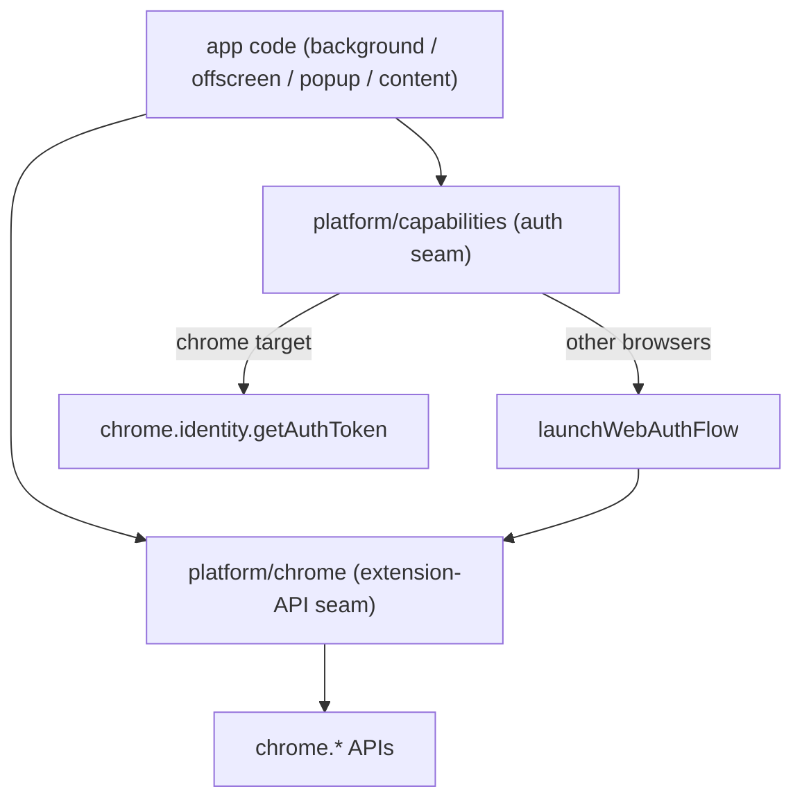

# Platform — the browser-abstraction layer

> The boundary between app logic and the browser. App code (background, offscreen, popup, content) never touches `chrome.*` or an OAuth flow directly — it goes through this layer. This is a **container README**: it exists to explain how the two seams relate and the cross-browser stance that spans them. Each seam has its own README.

## The two seams

| Seam | What it abstracts | README |
| :--- | :--- | :--- |
| **`chrome/`** | the broad extension-API surface (storage, tabs, downloads, runtime, identity, offscreen, action) — thin wrappers, one per area | [`chrome/README.md`](./chrome/README.md) |
| **`capabilities/`** | the *divergence-prone* capabilities that need a strategy chosen per browser — today just **auth** (OAuth token acquisition) | [`capabilities/README.md`](./capabilities/README.md) |

## How they relate

`chrome/` is the **broad, mostly browser-common** seam — most of it ports across Chromium browsers unchanged. `capabilities/` is the **narrow, divergence-isolating** seam: where a capability genuinely differs by browser, the strategy selection lives there, not scattered through the app. The two meet at auth — `capabilities`'s cross-browser `WebAuthFlow` strategy is *built on* `chrome/identity` (`launchWebAuthFlow` / `getRedirectURL`).

## The cross-browser stance (ADR-0002)

This split is the shape of the [cross-browser strategy](../../docs/adr/0002-cross-browser-support-strategy.md): keep the broad `chrome/` seam portable, and concentrate the one capability that really differs (auth) behind `capabilities/` so adding a browser is a *selection* change in one place, not a sweep. As of today, **auth is the only Chromium-specific divergence**; everything else in `chrome/` is common.

## Why this container has a README (and most don't)

A directory that's a pure namespace usually doesn't earn a README (see [the conventions](../../docs/agents/module-readmes.md)). This one does because the **interaction between its children is non-obvious** — that `capabilities` builds on `chrome/identity`, and that the layer as a whole is the cross-browser pivot. That relationship has no home inside either child.

## Related

- [ADR-0002](../../docs/adr/0002-cross-browser-support-strategy.md) — the cross-browser strategy this layer implements.
- [`offscreen/drive`](../offscreen/drive/README.md) and [`background`](../background/README.md) — the main consumers of the auth seam.
