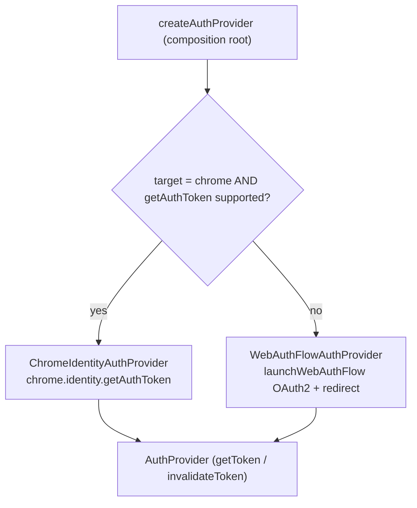

# Platform / Capabilities — the auth seam (OAuth token acquisition)

> The OAuth token-*acquisition* capability behind a single port (`AuthProvider`). This is **the one real cross-browser divergence** (ADR-0002): Chrome ties tokens to its Google sign-in; every other Chromium browser uses the standard OAuth2 redirect flow. For symbol-level structure use codegraph (`codegraph_explore "AuthProvider createAuthProvider"`).

> **Archetype:** *External Integration* (seam). Small but pivotal — it's the file you change to support a new browser. Token *use* (caching, refresh-on-401) is [`offscreen/drive`](../../offscreen/drive/README.md); the silent→interactive *policy* is `background/driveAuth.ts`; this folder only **acquires** a token.

## Purpose & mental model

Get an OAuth access token for Drive, hiding *how* behind a port. Common logic depends only on the `AuthProvider` interface; the composition root (`createAuthProvider`) picks a concrete strategy by browser. The mental model: **one interface, two strategies, selected once** — so adding a browser is a selection change, not a rewrite.

## The port

```ts
interface AuthProvider {
  getToken(request: { interactive: boolean }): Promise<string>; // silent when interactive=false
  invalidateToken(token: string): Promise<void>;               // force a re-fetch next time
}
```

## Strategy selection



- **`ChromeIdentityAuthProvider`** — `chrome.identity.getAuthToken`, which ties the token to the browser's signed-in Google account (no client secret, no redirect). Preferred on Chrome.
- **`WebAuthFlowAuthProvider`** — the standard `launchWebAuthFlow` OAuth2 redirect flow (client id/secret, `drive.file` scope, `getRedirectURL`). The fallback for every other Chromium target.
- **Selection** is by **build target + runtime capability**: `target === 'chrome' && chrome.identity.getAuthToken` exists → ChromeIdentity; otherwise WebAuthFlow. The runtime guard means a Chrome build lacking `getAuthToken` still falls back rather than crashing. (A build-target override — e.g. `edge → WebAuthFlow` — is the planned next step.)

## Key invariants & gotchas

- **This folder only acquires.** It returns a token string; it does **not** decide silent-vs-interactive retries or diagnose bad client ids — that policy is `background/driveAuth.ts`, layered on top of `getToken`.
- **`createAuthProvider` is the only place a concrete provider is chosen.** Add a browser there, behind the same guard pattern.
- **Capability guard, not just build flag.** Always pair the target check with a runtime `typeof chrome.identity?.getAuthToken === 'function'` so a misconfigured build degrades instead of throwing.
- **Scope is `drive.file`** (per-file Drive access) — the minimum the uploader needs.

## Files

| File | Role |
| :--- | :--- |
| `AuthProvider.ts` | the capability port (`getToken` / `invalidateToken`) |
| `auth/ChromeIdentityAuthProvider.ts` | Chrome strategy (`chrome.identity.getAuthToken`) |
| `auth/WebAuthFlowAuthProvider.ts` | cross-browser strategy (`launchWebAuthFlow` OAuth2) |
| `auth/createAuthProvider.ts` | the composition root (browser-target + capability selection) |

## Testing notes

- `auth/__tests__/authProvider.test.ts` covers each strategy against a mocked `chrome.identity` / `launchWebAuthFlow`, and the `createAuthProvider` selection logic (target + capability guard). `background/driveAuth.ts` is tested separately for the silent→interactive + bad-client-id policy that wraps this.

## Related

- [ADR-0002](../../../docs/adr/0002-cross-browser-support-strategy.md) — auth is *the* Chromium-specific change; everything else ports unchanged.
- [`offscreen/drive`](../../offscreen/drive/README.md) — the token *consumer* (caching + refresh-on-401 around `getToken`).
- [`background`](../../background/README.md) — `driveAuth.fetchDriveTokenWithFallback` (the silent→interactive policy + actionable bad-client-id errors).
- [`platform/chrome`](../chrome/README.md) — `identity.ts` (`getRedirectURL` / `launchWebAuthFlow`) that the WebAuthFlow strategy uses.

## External references

- Chrome — [`chrome.identity.getAuthToken`](https://developer.chrome.com/docs/extensions/reference/api/identity#method-getAuthToken) and [`launchWebAuthFlow`](https://developer.chrome.com/docs/extensions/reference/api/identity#method-launchWebAuthFlow).
- [OAuth 2.0 (RFC 6749)](https://datatracker.ietf.org/doc/html/rfc6749) and [PKCE (RFC 7636)](https://datatracker.ietf.org/doc/html/rfc7636) — the flow the cross-browser strategy implements.
