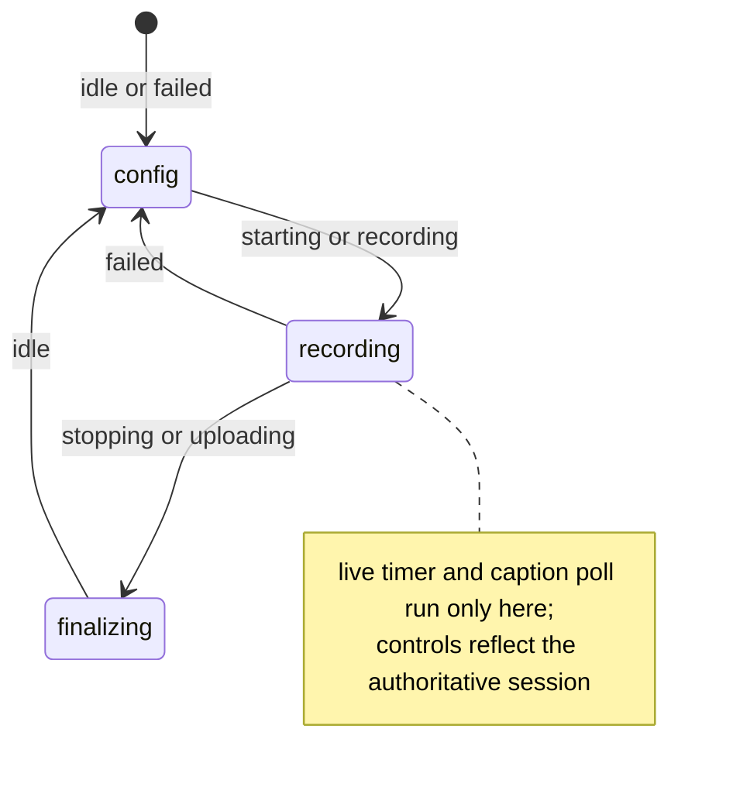
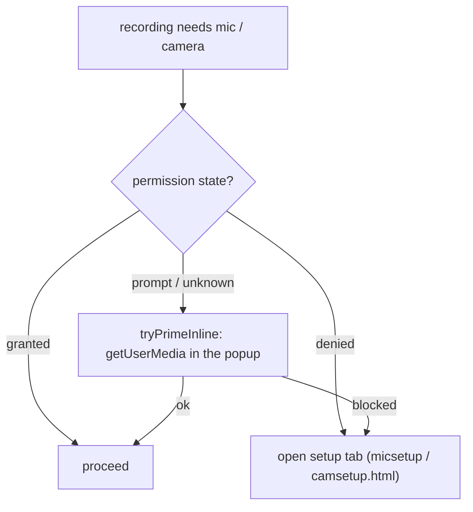

# Popup — the control panel (state-driven, non-authoritative UI)

> The browser-action UI: start/stop, live recording controls (mute/hide/pause), transcript download, and permission priming. It is **created fresh every time the user opens it and destroyed on close** — so it owns *no* truth; it renders from the background's authoritative session. For symbol-level structure use codegraph (`codegraph_explore "PopupController SessionTabsView RecordingTimer CaptionPoller"`). The entry `../popup.ts` is intentionally thin (reads DOM, hands to `PopupController`), and `PopupController` is itself a **thin orchestrator** that delegates the recording timer, the caption poll, and the session-tab/upload UI to focused collaborators.

> **Archetype:** *Interactive Surface*. The defining constraint is that this UI is **ephemeral and not the source of truth** — it must render correctly from state it doesn't own, every time it reopens, with live controls that never interrupt the recording. So this README leads with the view-state model and the authority/reconciliation rules. If you read one section, read **The authority model**.

## Purpose & mental model

A **dumb-but-careful renderer of the background's session.** Open the popup mid-recording and it must immediately show the right view, the right elapsed time, and the right control states — reconstructed entirely from a `RecordingStatusView` pushed/pulled from the background. The popup sends *commands* and reflects *results*; it never decides recording policy and never assumes its own last action succeeded.

## State-driven views

The popup has three **phase-driven** views; the **derived `phase` picks which one is active** (`setActiveView`), and only the matching one is populated:



Live intervals (the 1 s recording timer, the caption-state poll — owned by the `RecordingTimer` and `CaptionPoller` collaborators) are started **only** in the recording view and torn down everywhere else — and unconditionally in `destroy()`.

A fourth surface — the **session tab bar + per-job upload view** (ADR-0004, owned by `SessionTabsView`) — is *not* phase-driven: it's overlaid when an upload tab is selected, independent of the recording phase, so a background Drive upload can be viewed while a new recording runs.

## The authority model

The single most important rule: **the popup is not authoritative.** Two consequences shape all the interaction code:

- **Render from the session, not from local intent.** `RECORDING_STATE` broadcasts (and the responses to commands) carry a `RecordingStatusView`; `applySession` re-derives the whole UI from it. Local fields (`micMuted`, `paused`, …) are *display caches* refreshed from the session, never the truth.
- **Optimistic-but-reconciled toggles.** Mute / hide-camera / pause each: disable the button → send the command → **apply the session from the response** → re-enable. A rejected command reverts the UI because the authoritative session in the response says so. **Recording is never interrupted** by a control toggle. All three share one `runToggleCommand` helper, so this optimistic→reconcile→revert flow is defined exactly once.
- **The timer is the session's, computed locally.** `recordedMs + (runningSince ? now - runningSince : 0)`, ticking once a second — the same pause-aware formula the background owns, so the popup clock matches the snapshot exactly and excludes paused spans.

## Message flow

```
popup → background : START_RECORDING · STOP_RECORDING · GET_RECORDING_STATUS · SET_MIC_MUTED · SET_CAMERA_MUTED · SET_PAUSED
popup → content    : GET_TRANSCRIPT · RESET_TRANSCRIPT · GET_CAPTION_STATE
background → popup  : RECORDING_STATE · RECORDING_SAVED · RECORDING_SAVE_ERROR
```

The status line distinguishes a **persistent** status (rebuilt from phase on every change) from a transient **toast** (`POPUP_TOAST_DURATION_MS`, then it reverts to persistent) — so a "saved locally" toast never overwrites the standing phase text permanently.

## Permission readiness (mic / camera)

Recording with a mic or self-video needs Chrome permission first. The popup can't always prompt inline, so the services degrade to a dedicated setup page:



`MicPermissionService` / `CameraPermissionService` each expose `queryPermissionState`, `tryPrimeInline` (a throwaway `getUserMedia` that grants from the popup when Chrome allows), and `openSetupTab`. `ensureReadyForRecording` runs this ladder before a run that needs the device; the mic button (`bindButton`) reflects granted/blocked/enable state live.

## Live intervals

- **Recording timer** (`RecordingTimer`) — a 1 s `setInterval` that re-renders from the session timer fields; started only while `phase === 'recording'` and not paused.
- **Caption-state poll** (`CaptionPoller`) — every `CAPTION_POLL_MS`, asks the active tab's content script `GET_CAPTION_STATE` (best-effort; "off" if the tab is unreachable) to drive the Transcript chip. Recording-view only.

## Transcript download

Separate from recording: the header **Save** button (`wireTranscriptDownload`) pulls the transcript on demand — query the active tab → `GET_TRANSCRIPT` to the content script → if it's unreachable or empty, toast (`noTranscriptOnPage` / `transcriptEmpty`); otherwise wrap the text in a `text/plain` blob and `downloadFile(saveAs: true)` named by meeting id. Because the transcript is scraped live by the [content script](../content/README.md) (not produced by the recorder), this works whenever Meet captions are present — with or without an active recording.

## Key invariants & gotchas

- **Never persist state in the popup.** It dies on close; the next open rebuilds from the session. Anything you stash on the instance is a display cache, not state.
- **Always reconcile from the command response**, not from the optimistic local flip — that's what makes a rejected toggle self-correct.
- **Clean up intervals on view-exit and `destroy()`** — a leaked timer/poll survives the view it belonged to.
- **A muted mic records silence; a hidden camera records black frames; a paused span is never written** (seamless resume). The popup only *reflects* these; the actuation is in the offscreen recorder.
- **Caption polling is best-effort** — never block UI on it; an unreachable tab just shows "Transcript off".

## Files

| File | Role |
| :--- | :--- |
| `PopupController.ts` | thin orchestrator: DOM wiring, view population (`onPhaseChange`), the optimistic toggles (`runToggleCommand`), toasts — delegates the timer, caption poll, and session-tab/upload UI to the collaborators below |
| `RecordingTimer.ts` | the pause-aware 1 s recording clock (extracted from the controller) |
| `CaptionPoller.ts` | the recording-view caption-state poll that drives the Transcript chip (extracted) |
| `SessionTabsView.ts` | the session tab bar + per-job background-upload view (ADR-0004); owns its tab/selection state and talks back to the controller via a `{ rerender, applySession, toast }` callback bag |
| `controllers/PopupStateController.ts` | maps the session → phase → view; `applySession`, `refreshInitialState`, persistent-status text |
| `popupView.ts` | `setActiveView` + DOM helpers (the view switch) |
| `popupRunConfig.ts`, `popupStatus.ts`, `popupMessages.ts` | config-view run-config reads, status/label text, message/toast string builders |
| `MicPermissionService.ts`, `CameraPermissionService.ts` | permission query + inline-prime + setup-tab ladder |

Entry: `../popup.ts` (DOM wiring only). The Settings *page* is a separate surface — a thin `../settings.ts` shell over [`settings/SettingsController.ts`](../settings/SettingsController.ts) (same shell→controller pattern as here), reached via the settings link; its schema lives in [`shared/settings`](../shared/settings/README.md).

## Testing notes

- `__tests__/PopupController.test.ts` and `PopupStateController.test.ts` drive the controller against a fake element set + mocked `chrome.runtime`, asserting view switches, the reconcile-from-response behavior, and the session-tab/upload flows.
- The extracted collaborators are unit-tested in isolation: `RecordingTimer.test.ts` (tick / pause / stop-idempotence), `CaptionPoller.test.ts` (on / off / unreachable tab / idempotent start), `SessionTabsView.test.ts` (tab render + select, and the retry/dismiss callback seam).
- `MicPermissionService`/`CameraPermissionService` are tested against a mocked `navigator.permissions`/`mediaDevices` — the ladder (granted / denied / prompt→prime→fallback) is the unit under test.
- `popupMessages.test.ts` pins the user-facing strings.

## Related

- [`background`](../background/README.md) — the authority the popup renders; the `RECORDING_STATE` broadcasts originate there.
- [`shared`](../shared/README.md) — `RecordingStatusView` (the curated, control-plane-stripped view the popup receives) and the phase model.
- [`content`](../content/README.md) — answers the `GET_CAPTION_STATE` poll.

## External references

- Chrome — [Action / popup](https://developer.chrome.com/docs/extensions/reference/api/action) (the ephemeral popup lifetime).
- MDN — [`Permissions.query()`](https://developer.mozilla.org/en-US/docs/Web/API/Permissions/query) and [`MediaDevices.getUserMedia()`](https://developer.mozilla.org/en-US/docs/Web/API/MediaDevices/getUserMedia) (the permission-readiness ladder).
