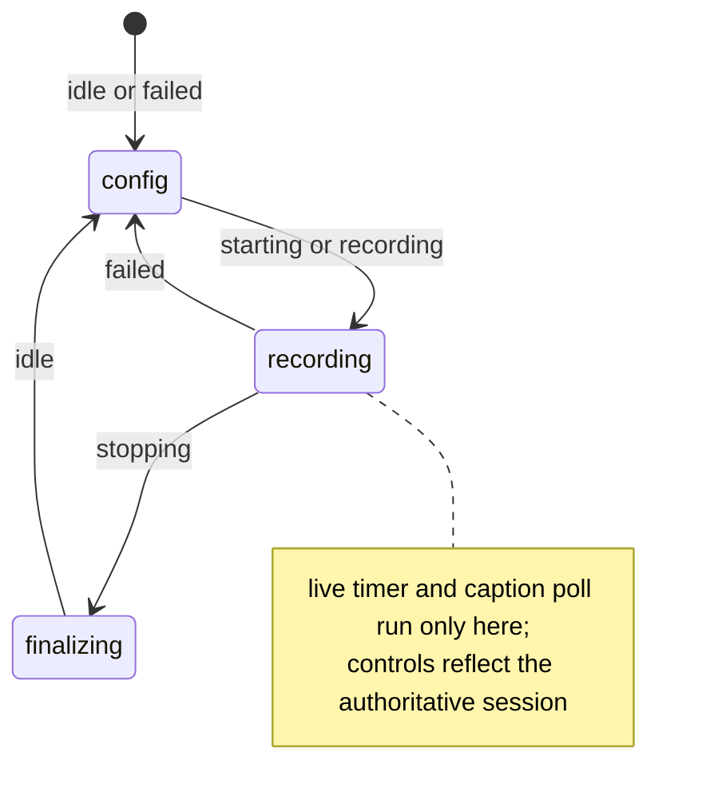
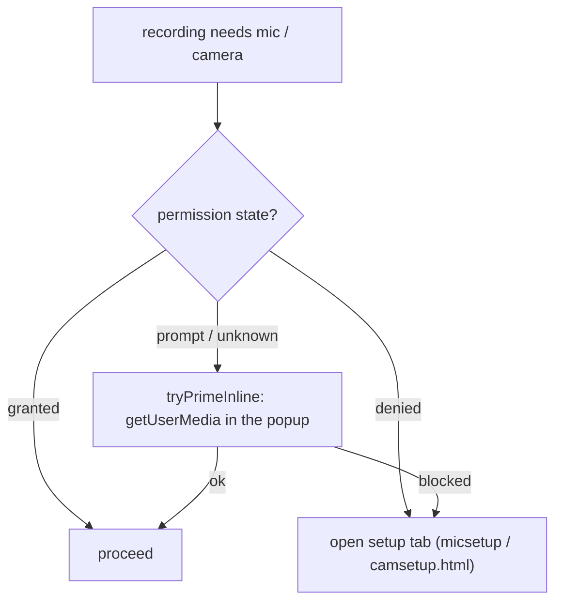

# Popup — the control panel (state-driven, non-authoritative UI)

> The browser-action UI: start/stop/discard, live recording controls (mute/hide/pause), transcript download, permission priming, history navigation, detached-upload controls, and completed-upload naming. It is **created fresh every time the user opens it and destroyed on close** — so it owns *no* truth; it renders from the background's authoritative session. For symbol-level structure use codegraph (`codegraph_explore "PopupController SessionTabsView RecordingNameDialog"`). The entry `../popup.ts` is intentionally thin (boots the shared shell and controller), and `PopupController` is itself a **thin orchestrator** that delegates the recording timer, caption poll, dialogs, and session-tab/upload UI to focused collaborators.

> **Archetype:** *Interactive Surface*. The defining constraint is that this UI is **ephemeral and not the source of truth** — it must render correctly from state it doesn't own, every time it reopens, with live controls that never interrupt the recording. So this README leads with the view-state model and the authority/reconciliation rules. If you read one section, read **The authority model**.

## Purpose & mental model

A **dumb-but-careful renderer of the background's session.** Open the popup mid-recording and it must immediately show the right view, the right elapsed time, and the right control states — reconstructed entirely from a `RecordingStatusView` pushed/pulled from the background. The popup sends *commands* and reflects *results*; it never decides recording policy and never assumes its own last action succeeded.

## Popup state gallery

Run `npm run popup:gallery`, then open the local URL printed by the command. Every card loads the real `popup.html` and normal popup bundle in an isolated frame. A development-only preview adapter supplies deterministic state for setup, permissions, recording, saving/uploads, history, details, and overlays; the production controller and shell still render every element. This makes every important layout visible together without starting a recording or granting browser permissions.

The gallery toolbar switches light/dark/system theme, tests 300/320/360 px viewports, filters states, pauses animation, and overlays element bounds. Each card also has a focused URL suitable for screenshots and bug reports. In a development extension build the same gallery is available from **Menu → Popup gallery**; production builds omit both the gallery page bundle and the visible menu action.

Scenarios in `gallery/popupStories.ts` are domain fixtures, never selector mutations. `popupPreviewState.ts` defines the fixture seam, `popupBootstrap.ts` owns the one shared element map, and `PopupController.renderPreview` renders fixtures through the same view code used in production. The gallery test boots every story against the current `static/popup.html`, so markup/controller drift fails in CI rather than leaving a silently stale card.

## State-driven views

The popup has three **phase-driven** views; the **derived `phase` picks which one is active** (`setActiveView`), and only the matching one is populated:


```mermaid
stateDiagram-v2
    [*] --> config: idle or failed
    config --> recording: starting or recording
    recording --> finalizing: stopping
    finalizing --> config: idle
    recording --> config: failed
    note right of recording
        live timer and caption poll run only here;
        controls reflect the authoritative session
    end note
```

Live intervals (the 1 s recording timer, the caption-state poll — owned by the `RecordingTimer` and `CaptionPoller` collaborators) are started **only** in the recording view and torn down everywhere else — and unconditionally in `destroy()`.

A fourth surface — the **session tab bar + per-job upload view** (ADR-0004, owned by `SessionTabsView`) — is *not* phase-driven: it's overlaid when an upload tab is selected, independent of the recording phase, so a background Drive upload can be viewed, retried, or canceled while a new recording runs. The header also opens the standalone [recordings history page](../recordings/README.md).

The recording view labels the tab source with its chosen content type and, once capture starts, the **actual delivered tab height** reported by the track (`Screen · 1080p`, for example). This is observational: it explains what Chrome delivered, not a promise that a requested preset was reached.

## The authority model

The single most important rule: **the popup is not authoritative.** Two consequences shape all the interaction code:

- **Render from the session, not from local intent.** `RECORDING_STATE` broadcasts (and the responses to commands) carry a `RecordingStatusView`; `applySession` re-derives the whole UI from it. Local fields (`micMuted`, `paused`, …) are *display caches* refreshed from the session, never the truth.
- **Optimistic-but-reconciled toggles.** Mute / hide-camera / pause each: disable the button → send the command → **apply the session from the response** → re-enable. A rejected command reverts the UI because the authoritative session in the response says so. **Recording is never interrupted** by a control toggle. All three share one `runToggleCommand` helper, so this optimistic→reconcile→revert flow is defined exactly once.
- **The timer is the session's, computed locally.** `recordedMs + (runningSince ? now - runningSince : 0)`, ticking once a second — the same pause-aware formula the background owns, so the popup clock matches the snapshot exactly and excludes paused spans.

## Message flow

```
popup → background : START_RECORDING · STOP_RECORDING · DISCARD_RECORDING · GET_RECORDING_STATUS · SET_MIC_MUTED · SET_CAMERA_MUTED · SET_PAUSED · RETRY_UPLOAD_JOB · CANCEL_UPLOAD_JOB · RENAME_RECORDING_HISTORY · SKIP_RECORDING_NAMING
popup → content    : GET_TRANSCRIPT · RESET_TRANSCRIPT · GET_CAPTION_STATE
background → popup  : RECORDING_STATE · RECORDING_SAVED · RECORDING_SAVE_ERROR
```

## Permission readiness (mic / camera)

Recording with a mic or self-video needs Chrome permission first. The popup can't always prompt inline, so the services degrade to a dedicated setup page:


```mermaid
flowchart TD
    A["recording needs mic / camera"] --> Q{"permission state?"}
    Q -->|granted| OK["proceed"]
    Q -->|denied| T["open setup tab (micsetup / camsetup.html)"]
    Q -->|"prompt / unknown"| P["tryPrimeInline: getUserMedia in the popup"]
    P -->|ok| OK
    P -->|blocked| T
```

`MicPermissionService` / `CameraPermissionService` each expose `queryPermissionState`, `tryPrimeInline` (a throwaway `getUserMedia` that grants from the popup when Chrome allows), and `openSetupTab`. `ensureReadyForRecording` runs this ladder before a run that needs the device; the mic button (`bindButton`) reflects granted/blocked/enable state live.

When separate camera capture is selected with a sub-1080p camera preset, the setup form shows a non-blocking resolution nudge (`Camera delivering <preset>p · raise in settings`). It reflects the configured target profile for the next run, not the device's guaranteed delivered resolution; users can change it on the Settings page.

## Live intervals

- **Recording timer** (`RecordingTimer`) — a 1 s `setInterval` that re-renders from the session timer fields; started only while `phase === 'recording'` and not paused.
- **Notes ribbon** (`RecordingNotesView`) — the same 1 s cadence, but started only while a span is *open* (a closed span does not move). The ribbon is scaled so the playhead sits at 82% rather than the right edge: a live recording has no known end, so the unfilled remainder of the track is what says "there is more to come". The interaction rule the module exists to enforce is that **ending a note is silent** — starting or ending a span opens nothing, and a message is written only by clicking a span. `toStatusView` drops the **live** session's `historyId`, so the popup has no id for the run that is currently recording (it does receive one for finished runs, on `UploadJob.historyId`). Hence the active-run message family (`MARK_NOTATION`, `END_NOTATION`, `LIST_ACTIVE_NOTATIONS`, `UPDATE_ACTIVE_NOTATION`, `REMOVE_ACTIVE_NOTATION`), which follows the line the protocol already draws: **live commands are id-less** (`SET_PAUSED`, `SET_MIC_MUTED`, `STOP_RECORDING` all name no run) **and history commands are keyed**.
- **Caption-state poll** (`CaptionPoller`) — every `CAPTION_POLL_MS`, asks the active tab's content script `GET_CAPTION_STATE` (best-effort; "off" if the tab is unreachable) to drive the Transcript chip. Recording-view only.

## Stop, discard, and detached uploads

**Stop** seals the capture. In local mode the popup stays in the short finalizing view while the download request is handed off. In Drive mode capture returns to the configuration view as soon as artifacts are queued, while the job remains available in its own upload tab.

**Discard** is deliberately different: it confirms the action, resets the captured transcript, sends `DISCARD_RECORDING`, and waits for the background result. The offscreen runtime deletes sealed temporary artifacts rather than downloading or uploading them. If cleanup fails, the popup refreshes authoritative state and shows the error instead of pretending the recording was discarded.

An upload tab shows the latest job/file outcomes and opens the resolved Drive folder or each uploaded Drive file when metadata is available. Retry is only offered while the offscreen runtime still retains the failed artifacts; retention is bounded to the latest failed job, five minutes, and 128 MB. Cancel aborts queued or active Drive work and routes unfinished files through the normal local-download fallback. Both actions reconcile from the response/session update rather than assuming a local tab mutation succeeded.

### Naming completed Drive uploads

When the oldest completed job still has `namingStatus: 'pending'`, `PopupController` selects that job and opens `RecordingNameDialog` after the current render. Save sends `RENAME_RECORDING_HISTORY`; for a Drive entry the background renames the remote folder and every available uploaded file before returning the updated history/session projections. Skip sends `SKIP_RECORDING_NAMING`, which durably marks the job handled so reopening the ephemeral popup does not ask again. The same dialog is reused by the recording-detail rename action. It validates a nonblank, slug-compatible title, traps focus, blocks dismissal while the remote update is active, and surfaces rollback errors without inventing local success.

## Transcript download

Separate from recording: the header **Save** button (`wireTranscriptDownload`) pulls the transcript on demand — query the active tab → `GET_TRANSCRIPT` to the content script → if it's unreachable or empty, toast (`noTranscriptOnPage` / `transcriptEmpty`); otherwise wrap the text in a `text/plain` blob and `downloadFile(saveAs: true)` named by meeting id. Because the transcript is scraped live by the [content script](../content/README.md) (not produced by the recorder), this works whenever Meet captions are present — with or without an active recording.

## Key invariants & gotchas

- **Never persist state in the popup.** It dies on close; the next open rebuilds from the session. Anything you stash on the instance is a display cache, not state.
- **Always reconcile from the command response**, not from the optimistic local flip — that's what makes a rejected toggle self-correct.
- **Clean up intervals on view-exit and `destroy()`** — a leaked timer/poll survives the view it belonged to.
- **A muted mic records silence; a hidden camera records black frames; a paused span is never written** (seamless resume). The popup only *reflects* these; the actuation is in the offscreen recorder.
- **The mic meter is observational.** A missing/paused/muted mic returns zero and clears the bars; it must never create an audio destination, alter gain, or influence capture.
- **Upload state is not a phase.** Do not add `uploading` back to `setActiveView`; render detached jobs through `SessionTabsView` so capture can return to idle and start another run.
- **Caption polling is best-effort** — never block UI on it; an unreachable tab just shows "Transcript off".
- **Naming state is authoritative session/history state.** `namingJobId` only prevents duplicate dialogs during one popup lifetime; `namingStatus` and command responses decide whether another popup should ask.

## Files

| File | Role |
| :--- | :--- |
| `PopupController.ts` | thin orchestrator: DOM wiring, view population (`onPhaseChange`), the optimistic toggles (`runToggleCommand`), toasts — delegates the timer, caption poll, and session-tab/upload UI to the collaborators below |
| `RecordingTimer.ts` | the pause-aware 1 s recording clock (extracted from the controller) |
| `RecordingNotesView.ts` | the live notes UI (ADR-0005): the "Make a note" row, the span ribbon, and the message editor |
| `CaptionPoller.ts` | the recording-view caption-state poll that drives the Transcript chip (extracted) |
| `SessionTabsView.ts` | the session tab bar + per-job background-upload view (ADR-0004), including retry/cancel affordances and recovery-state messaging; owns its tab/selection state and talks back to the controller via a `{ rerender, applySession, toast }` callback bag |
| `RecordingNameDialog.ts` | accessible reusable title-input modal for the one-time completed-upload prompt and later recording-detail rename |
| `controllers/PopupStateController.ts` | maps the session → phase → view; `applySession`, `refreshInitialState`, persistent-status text |
| `popupView.ts` | `setActiveView` + DOM helpers (the view switch) |
| `popupRunConfig.ts`, `popupStatus.ts`, `popupMessages.ts` | config-view run-config reads, status/label text, message/toast string builders |
| `MicPermissionService.ts`, `CameraPermissionService.ts` | permission query + inline-prime + setup-tab ladder |

Entry: `../popup.ts` (DOM wiring only). The Settings *page* is a separate surface — a thin `../settings.ts` shell over [`settings/SettingsController.ts`](../settings/SettingsController.ts) (same shell→controller pattern as here), reached via the settings link; its schema lives in [`shared/settings`](../shared/settings/README.md).

## Testing notes

- `__tests__/PopupController.test.ts` and `PopupStateController.test.ts` drive the controller against a fake element set + mocked `chrome.runtime`, asserting view switches, stop/discard reconciliation, session-tab/upload flows, naming prompt ordering, skip persistence, and rename response reconciliation.
- `__tests__/RecordingNameDialog.test.ts` covers validation, focus trapping, busy/error state, Save, Skip, and disposal. `tests/e2e/recording-rename.spec.ts` proves a completed mocked-Drive upload can rename the real remote folder/file projections through the built extension.
- The extracted collaborators are unit-tested in isolation: `RecordingTimer.test.ts` (tick / pause / stop-idempotence), `CaptionPoller.test.ts` (on / off / unreachable tab / idempotent start), and `SessionTabsView.test.ts` (tab render/select, retry/cancel, and recovery states).
- `MicPermissionService`/`CameraPermissionService` are tested against a mocked `navigator.permissions`/`mediaDevices` — the ladder (granted / denied / prompt→prime→fallback) is the unit under test.
- `popupMessages.test.ts` pins the user-facing strings.

## Related

- [`background`](../background/README.md) — the authority the popup renders; the `RECORDING_STATE` broadcasts originate there.
- [`shared`](../shared/README.md) — `RecordingStatusView` (the curated, control-plane-stripped view the popup receives) and the phase model.
- [`recordings`](../recordings/README.md) — the durable history page opened from the popup header.
- [`content`](../content/README.md) — answers the `GET_CAPTION_STATE` poll.

## External references

- Chrome — [Action / popup](https://developer.chrome.com/docs/extensions/reference/api/action) (the ephemeral popup lifetime).
- MDN — [`Permissions.query()`](https://developer.mozilla.org/en-US/docs/Web/API/Permissions/query) and [`MediaDevices.getUserMedia()`](https://developer.mozilla.org/en-US/docs/Web/API/MediaDevices/getUserMedia) (the permission-readiness ladder).
