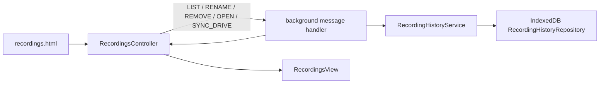

# Recordings — durable recording history

> The standalone recordings page: a small client over the background-owned history service. It lists completed and in-progress local/Drive artifacts, lets the user rename or hide an entry, and opens a confirmed local download or a Drive file. It never owns recording bytes or upload state. For symbol-level structure use codegraph (`codegraph_explore "RecordingsController RecordingHistoryService RecordingHistoryRepository"`).

> **Archetype:** *Interactive Surface*. The page is deliberately thin: durable history belongs to IndexedDB in the background, while this module renders a cursor-paged projection and reconciles each action with the response.

## Purpose and user contract

Open **Recordings** from the popup to see recordings in newest-first order. An entry can contain tab, microphone, and self-video files. Each file is shown as one of:

- an available local download, which opens in Chrome's Downloads UI;
- an available Drive file, which opens its Drive link;
- a pending save/upload;
- an unavailable file, with the recovery or download error that explains why it cannot be opened.

Renaming a local recording changes only its history label. Renaming a current Drive recording with persisted folder/file IDs changes the remote Drive folder and every available uploaded filename first, then commits the matching history projection. Legacy Drive rows without a folder ID retain display-only rename behavior because they cannot safely identify the remote folder. **Remove from history** is a soft delete: it hides the entry from this page and, by default, leaves its local download and Drive files alone. The tombstone also prevents delayed upload, download-settlement, or recovery messages from recreating an entry the user removed. Deleting the files too is a separate, explicit choice — see *Removing, and deleting files* below.

## Data flow

The background creates a pending history record before local download or detached Drive work starts. It then advances that same record as download settlement, Drive-upload updates, crash recovery, local fallback, or Drive metadata rename outcomes arrive. `RecordingHistoryService` owns those transitions; the page never tries to infer a file's availability from an upload tab. A Drive rename is delegated through the offscreen token/data plane; if a later PATCH fails, completed changes are rolled back, and a rare incomplete rollback synchronizes history to the names Drive actually reports.

## Notes column (ADR-0005)

The table carries one 170px `NOTES` column **between `NAME` and `DUR`** (design
`f1`). Each cell is a gold count chip plus the first note as a preview — that
preview is what makes a row worth opening. A recording with no notes shows a
dash, so the column never pads itself. The header reads in the accent colour in
both themes; it sorts like the other columns.

Both the count and the searchable note text come from a single
`LIST_RECORDING_NOTATION_SUMMARIES` read per loaded page, not one read per row;
`RecordingsView.setNoteSummaries` receives the digest and the controller repaints.
The read is fire-and-forget: if it fails the table still lists, with the column
empty. The digest's `search` field is folded into the existing
"Search name or note…" filter alongside the name and the recording's free-text
note, so one field searches all three.

**Searching regroups the table** (`f2`). While a query is active the day/sort
groups are replaced by `MATCHED IN NOTES` then `MATCHED IN NAME` — a note match
is the more interesting of the two and needs saying — and the matched substring
is wrapped in a gold `<b>` in both the name and the notes preview. The count
becomes `3 OF 42 · IN NAMES, NOTES AND TOPICS`, because a bare count is only useful next
to what it was drawn from.

## Adding notes later (f5, f6)

ADD beside the note count in the details dialog opens `NoteEditor` in the dialog's place. The NOTES column stays blank until its digest lands, rather than showing a dash it has not read. A recording nobody noted still shows its notes section — the empty track and ADD — so the absence reads (`f4`). The editor leaves by its back button or Done to the details dialog, since naming and deleting the other notes still happen there, and by × to the list; either way the NOTES column refreshes.

With a transcript (`f5`) the lines are the editor: dragging over them sets a span, a click plays from a line, and a double-click takes one line. Without a mouse, a focused line plays on Enter and Shift+Enter marks the span from where the last one began (`f19`); Shift+click does the same. The span's lines turn warm with a ticked rail so they never read as part of a saved note; saved notes keep a solid rail with their name in the gutter. The composer under the lines holds the range, the length and the name. On the timeline the span is drawn full height with a grab handle at each end, and dragging one trims it while a bubble reads the range; saved notes sit at half height and open for editing only when their name is clicked. VIDEO in the header, off by default, pulls in the picture beside the line under the playhead. The speaker column is 44px rather than the design's 26px, because it holds a name, not `TAB` or `MIC`.

Without a transcript (`f6`) the saved notes take the lines' place in their details rows (`RecordingNotesSection` in its bare mode), with rename and delete as in the dialog. NOTE opens a span at the playhead and END closes and keeps it; while it runs it is listed in time order as `running`, named in the composer, and Discard throws it away rather than saving it unnamed. Done keeps a finished span, and a running one that has a name, ended at the playhead; × keeps nothing.

Notes are written through `ADD_RECORDING_NOTATION` and `UPDATE_RECORDING_NOTATION` (which also moves a note's start and end). Playback reuses the player's source resolution (`player/playbackSource.playbackUrl`). The Drive `notes.vtt` is written once when recording stops, so notes added or re-timed here are not in it.

## Removing, and deleting files

The page's own dialog is the only confirmation for **Remove from history**. It carries an unticked **Also delete its files**: ticking it replaces the dialog's text with exactly what will happen (`fileDeletion.ts`) and renames the button, and Remove then asks once more with a native `confirm`, because deleting a Downloads file cannot be undone. Declining that keeps the dialog open; nothing is closed, cleared or removed.

The background (`REMOVE_RECORDING_HISTORY` with `deleteFiles`) first ends every live share that includes the recording — a share is served from those Drive files — and removes nothing if that fails. It then removes the entry and deletes its files (`background/library/history/RecordingFileDeletion.ts`): each Drive file goes to the Drive trash (recoverable for 30 days) and each Downloads file is deleted from disk. The recording's Drive folder is never trashed, even when it looks empty: the extension sees only the files it created, and trashing a folder trashes everything in it. A file that cannot be deleted is reported on the page, never hidden.

## Sync with Drive

The toolbar's **Sync with Drive** (`DriveSyncDialog.ts`, background `DriveLibrarySync`) compares the library with every destination folder in Drive and previews: recordings whose folder moved or was re-filed (re-pointed and re-tagged by where the folder is now; ticked), recording folders the library lacks — ones the user removed and ones it never had (each unticked, brought back only if ticked), recordings without a duration (read from the file's own WebM header or last timestamps; ticked), files missing from Drive (reported only) and folders it cannot read as one recording (reported only). `SYNC_DRIVE_APPLY` plans again against Drive as it is then and does only what was ticked; sync never deletes. It sees only files the extension created (`drive.file`).

## Sidecar rows

A recording's notes and transcript are delivered as WebVTT files beside the media (ADR-0005, ADR-0007), so history carries them as rows with a `kind`. They are not playable tracks — the playback manifest keeps only rows with no `kind` — and in the files list they are named for what they are, `NOTES` and `VTT`, since the stream a sidecar rides says nothing about it.

## Pagination and reconciliation

History uses a stable `(createdAt, id)` cursor and a bounded page size (50 by default, at most 100). The first page also carries `total`, the library's size (counted on the active index, so tombstones never count); the page's `N RECORDINGS` and the popup's badge show it rather than the length of whatever has been paged in. The repository's IndexedDB v3 `activeCreatedAtId` index contains only visible entries, so retained soft-delete tombstones cannot make **Load more** scan every deleted record. `loadMore()` appends only entries not already present, so a repeated response cannot duplicate a card.

Rename and delete update the rendered list from their command responses rather than reloading the first page. This preserves entries already loaded through **Load more** and avoids a stale first-page refresh overwriting the user's local page state.

## Files

| File | Role |
| :--- | :--- |
| `../recordings.ts` | page entrypoint: finds the static elements, creates the view and controller |
| `RecordingsController.ts` | cursor state, RPC calls, response reconciliation, and action error handling |
| `RecordingsView.ts` | DOM-only rendering and interaction callbacks |
| `RecordingNotesSection.ts` | a recording's notes in the details dialog (`f2`): timeline, NOTES spoiler, rows, ADD; bare list mode for the editor |
| `NoteEditor.ts` | adding and re-timing notes on a finished recording (`f5`, `f6`) |
| `noteEditorModel.ts` | what the editor shows: lines by note, a drag's span, the lines a span covers, span text |

The durable domain types and message guard are [`shared/recordingHistory.ts`](../shared/recordingHistory.ts). The repository and transition service are documented in [`background`](../background/README.md).

## Testing notes

`__tests__/` covers controller paging, deduplication, rename/remove reconciliation, and local-file actions with mocked background messages. The history service/repository tests live beside the background implementation because atomic mutation, remote-rename coordination, and IndexedDB ordering are persistence contracts, not page behavior. `tests/e2e/recording-history.spec.ts` validates a real v2→v3 IndexedDB migration and active-only paging index; `tests/e2e/recording-rename.spec.ts` covers the completed-upload prompt and remote folder/file rename path.

## Player

Playing a recording back is a modal on this page, not a page of its own — which
is also what lets background scope a Drive authorization to `sender.tab.id`.
See [`player/README.md`](player/README.md).

## Related

- [`popup`](../popup/README.md) — popup navigation and detached upload tabs.
- [`background`](../background/README.md) — the history service and lifecycle integrations.
- [`shared`](../shared/README.md) — history types, cursors, normalization, and message validation.
