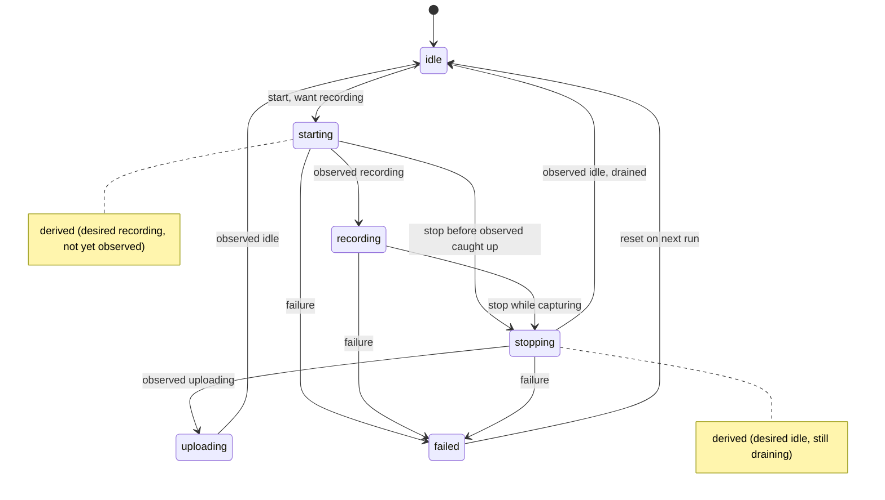
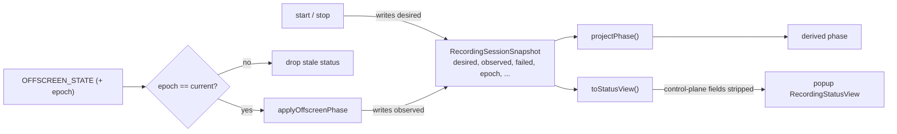

# Shared Kernel — recording state model, messaging substrate & cross-context types

> Imported by **every** runtime context (background, offscreen, popup, content). It owns no behavior of its own — it owns the *vocabulary* they agree on. For symbol-level structure use codegraph (`codegraph_explore "projectPhase recordingNormalizers rpc"`); this doc explains the model and the rules that keep four independently-restarting contexts in agreement.

> **Archetype:** *Protocol & State Model*. This README leads with a formal state model and a transition table because the hard part here isn't any single function — it's that the displayed recording phase is a **derivation**, and getting that derivation provably right (across stale messages, service-worker restarts, and legacy persisted data) is the whole job. If you read one section, read **The recording state model**.

## Purpose & mental model

`shared/` is the lingua franca. Two pillars:

1. **The recording state model** (`recording*.ts`) — the canonical `RecordingSessionSnapshot`, its phase, and the pure functions that derive and normalize it. This is where ADR-0003 lives in code.
2. **The messaging substrate** (`protocol.ts`, `protocolMessageTypes.ts`, `messages.ts`, `rpc.ts`) — the typed envelopes and the request/response framework the contexts talk over.

Everything else (`timeouts.ts`, `logger.ts`, `perf.ts`, `async.ts`, `typeGuards.ts`, `build.ts`) is cross-cutting infrastructure those two pillars and their callers share. The mental model: **the background owns the truth, persists it, and every other context derives its view from a snapshot of it** — so the snapshot's shape and the rules for reading it are load-bearing.

## The recording state model

The displayed `RecordingPhase` (`idle | starting | recording | stopping | uploading | failed`) is **not stored** — it is *derived* from two independently-owned inputs plus a terminal flag (ADR-0003 Decision 4):

- **`desired: 'idle' | 'recording'`** — command-plane *intent*. Written **only** by the command path (`start` ⇒ `recording`; `stop`/finalize ⇒ `idle`).
- **`observed: 'none' | 'starting' | 'recording' | 'stopping' | 'uploading' | 'idle'`** — status-plane *observation*. Written **only** by `applyOffscreenPhase` from the offscreen's `OFFSCREEN_STATE` reports.
- **`failed: boolean`** — terminal, cross-cutting. A start can fail in the command path before any status exists, and the offscreen can report a runtime failure — so it is separate and wins over both.

`phase = projectPhase(desired, observed, failed)` (`recordingProjection.ts`) is a **pure, total** function. Because each plane writes only its own field and the phase is computed, the status path can no longer permanently clobber the command path's view: a stale `observed` can at worst flip a derived `recording` back to `starting` until the next report — never overwrite intent.

### Transition table (the full truth of `projectPhase`)

| `failed` | `desired` | `observed` | → `phase` | reading |
| :---: | :---: | :--- | :---: | :--- |
| `true` | * | * | **`failed`** | terminal; wins over everything |
| `false` | `recording` | `recording` | **`recording`** | intent met |
| `false` | `recording` | `none`/`starting`/`stopping`/`uploading`/`idle` | **`starting`** | intent ahead of observation |
| `false` | `idle` | `starting`/`recording`/`stopping` | **`stopping`** | observation lagging the stop |
| `false` | `idle` | `uploading` | **`uploading`** | draining to Drive |
| `false` | `idle` | `none`/`idle` | **`idle`** | settled |

`starting` and `stopping` are therefore *derived gaps* between intent and observation, not stored states — which is exactly why the [phase watchdog](../background/phaseWatchdog.ts) watches them (a gap that never closes is an orphaned session).

### Derived-phase lifecycle



## The session snapshot

`RecordingSessionSnapshot` is the single persisted record of a run — written by the background, read (as a normalized copy) by every other context. `phase` is derived; everything else is owned data.

```ts
type RecordingRunConfig = {
  storageMode: 'local' | 'drive';
  micMode: 'off' | 'mixed' | 'separate';
  recordSelfVideo: boolean;
};

type RecordingSessionSnapshot = {
  phase: RecordingPhase;          // DERIVED — projectPhase(desired, observed, failed); never written directly
  desired: DesiredState;          // command-plane intent (written by start/stop only)
  observed: ObservedState;        // status-plane report (written by applyOffscreenPhase only)
  failed?: boolean;               // terminal flag (wins over both planes)
  runConfig: RecordingRunConfig | null;
  epoch?: number;                 // fencing token (ADR-0003 D1) — preserved across idle, monotonic
  targetTabId?: number;           // the captured tab
  meetingSlug?: string;           // Meet URL slug, for display/recovery
  uploadSummary?: UploadSummary;  // per-file uploaded / local-fallback results
  error?: string;
  warnings?: string[];            // trimmed, de-duplicated run warnings
  // Live overlay flags — mirrored from offscreen actuation so a reopened popup
  // renders the right controls; orthogonal to phase.
  micMuted?: boolean;
  cameraMuted?: boolean;
  paused?: boolean;
  // Pause-aware timer. recordedMs = banked recorded duration (excludes paused
  // spans); runningSince = epoch ms the clock last (re)started (omitted while
  // paused/stopped). Live elapsed = recordedMs + (runningSince ? now - runningSince : 0).
  recordedMs?: number;
  runningSince?: number;
  updatedAt: number;
};
```

Two rules `normalizeSessionSnapshot` enforces on every read:

- **Phase-gating.** When the derived phase is `idle`, run-scoped fields (`runConfig`, `targetTabId`, `meetingSlug`, the overlay flags, the timer) are dropped — a settled snapshot can't carry stale run data. `error`/`warnings` persist (post-mortem), and…
- **…the epoch survives `idle`.** The fencing token is the one run-scoped field deliberately *not* dropped, so it stays monotonic across runs — which is what lets the background reject status from a previous epoch.

## The write paths & the popup-facing view

Each plane has exactly one writer, the epoch fence guards the status path, and the popup gets a **curated** view — never the raw snapshot:



`toStatusView` (in `recordingFactories.ts`) is the boundary between the full internal snapshot and what the UI sees: it projects the snapshot into a `RecordingStatusView` that **omits control-plane bookkeeping** — the `epoch` fencing token, `targetTabId`, and the raw `desired`/`observed` planes never reach the popup (ADR-0003 keeps the epoch out of the view *by construction*; a test asserts the planes don't leak). The popup renders from the derived `phase` plus the user-facing overlay flags, nothing more.

## Design rationale & theory

The split is a textbook application of patterns, each tied to the failure it prevents (full argument in [ADR-0003](../../docs/adr/0003-recording-phase-ownership-and-stale-offscreen-status.md)):

- **Spec/status reconciliation (Kubernetes).** `desired` is *spec*, `observed` is *status*, `phase` is the reconciled view. The same single-writer-per-field discipline that lets a k8s controller and the kubelet write the same object without clobbering each other.
- **CQRS / [event-carried state transfer](https://martinfowler.com/articles/201701-event-driven.html) (Fowler).** `OFFSCREEN_STATE` carries the whole observed phase (idempotent, self-contained state transfer) rather than deltas — chosen over event-sourcing because the offscreen still needs local phase state and the reconstruction cost wasn't worth it.
- **Fencing token (Kleppmann, *Designing Data-Intensive Applications*, ch. 8–9).** A monotonic per-run `epoch` lets the background **reject status from a stale run** (a message that survived a reconnect / SW restart / document recreation). The split handles *within-run* intent preservation; the fence handles *cross-run* staleness — complementary, not redundant. `normalizeEpoch` deliberately preserves the epoch **across `idle`** so it stays monotonic.

## Legacy migration — a provable inverse

A snapshot persisted before Decision 4 has only the old `phase` field. `normalizeSessionSnapshot` prefers the planes when present, else reconstructs them via `decomposeLegacyPhase` — the **inverse** of `projectPhase`, which must round-trip:

```
projectPhase(decomposeLegacyPhase(p)) === p   for every phase p
```

This is asserted exhaustively in tests. It's why you can ship Decision 4 without a migration script: old data rehydrates losslessly into the new planes on first read.

## The messaging substrate

The contexts talk over `chrome.runtime` ports/messages; `shared/` owns the *mechanism* and the *envelopes* — not the catalogue of who-sends-what (cross-cutting, at the [root reference](../../README.md#architecture-reference)).

- **`rpc.ts`** — a request/response framework over a port: correlates a request to its reply, bounds it with a timeout (`TIMEOUTS.RPC_MS`), and surfaces transport errors. Used where the caller needs an **ack** — `OFFSCREEN_START` / `OFFSCREEN_STOP` (background → offscreen).
- **`protocol.ts` / `protocolMessageTypes.ts` / `messages.ts`** — the typed envelopes and their runtime guards (`isOffscreenToBgMessage`, …), so every boundary validates shape before trusting a payload.

Two carriers, by design: **commands** (`OFFSCREEN_START`/`STOP` over rpc — need an ack) and **state transfer** (`OFFSCREEN_STATE`, fire-and-forget, idempotent — the event-carried state transfer the model above relies on). The epoch rides on both so the fence can reject a stale sender.

## Key invariants & gotchas

- **`phase` is never written directly.** Anything that sets `phase` outside `projectPhase` is a bug. Write `desired`/`observed`/`failed`; let the projection compute.
- **Single writer per field.** `desired` ← command path only; `observed` ← `applyOffscreenPhase` only; `epoch` ← background only (the offscreen merely echoes it for the fence to match).
- **`projectPhase` is pure & total.** No I/O, no clock, defined for all 24 input combinations — that totality is what makes the transition table a complete spec.
- **Snapshot fields are phase-gated on normalize.** When the derived phase is `idle`, `normalizeSessionSnapshot` drops run-scoped fields (`runConfig`, `targetTabId`, `micMuted`, `recordedMs`, …) so a settled snapshot can't carry stale run data — but `epoch` survives (monotonic) and warnings/errors persist.
- **The full *message contract* is not here.** This module owns the rpc/protocol *mechanism* and types; the catalogue of which message flows between which contexts is cross-cutting and lives in the [root reference](../../README.md#architecture-reference).

## Files

| Group | Files | Role |
| :--- | :--- | :--- |
| **State model** | `recordingProjection.ts` | the pure `projectPhase` derivation |
| | `recordingNormalizers.ts` | `normalizeSessionSnapshot`, `decomposeLegacyPhase`, plane parsers, phase-gating |
| | `recordingTypes.ts` | `RecordingPhase`, `DesiredState`, `ObservedState`, `RecordingSessionSnapshot` |
| | `recordingConstants.ts` | recording defaults + allowed values + phase constant sets (`isBusyPhase`, `isStoppablePhase`) |
| | `recordingFactories.ts` | `createIdleSession` and **`toStatusView`** → the popup-facing `RecordingStatusView` (strips control-plane fields) |
| | `recording.ts` | the public barrel re-export — import from here, not deep paths |
| **Messaging substrate** | `rpc.ts` | the request/response framework over `chrome.runtime` ports |
| | `protocol.ts`, `protocolMessageTypes.ts`, `messages.ts` | typed message envelopes + guards |
| **Perf vocabulary** | `perf.ts`, `types/perfTypes.ts`, `constants/perfConstants.ts`, `utils/mathUtils.ts` | perf event types/names/helpers + math; the *vocabulary* only — the stores live in `background/`/`debug/` (see the instrumentation doc) |
| **Cross-cutting infra** | `timeouts.ts` | the single `TIMEOUTS` budget table (watchdogs, RPC, seal, caption/meeting-end) |
| | `async.ts`, `logger.ts`, `typeGuards.ts`, `build.ts`, `provider.ts` | `withTimeout`, logging, `isRecord`, build flags, meeting-provider metadata |

`shared/settings/` is its own **deep module** (load / persist / normalize / derive recorder configuration) and is documented in its own README — not covered here.

## Testing notes

- `__tests__/recordingProjection.test.ts` is the spec: it asserts `projectPhase` over the **exhaustive 24-combination** input space (so the transition table above is *tested*, not aspirational) plus the `decomposeLegacyPhase` ⇄ `projectPhase` **round-trip** for all six phases.
- `projectPhase`/`decomposeLegacyPhase` are pure — test them with values, no mocks. Resist adding a clock or I/O to them; their totality is the property under test.
- Snapshot normalization edge cases (legacy `phase`, missing planes, phase-gating) live alongside in the shared tests.

## Related

- [ADR-0003](../../docs/adr/0003-recording-phase-ownership-and-stale-offscreen-status.md) — the full decision: epoch fence (D1), keep state transfer (D3), the desired/observed split (D4).
- [`background/phaseWatchdog.ts`](../background/phaseWatchdog.ts) — the liveness backstop for the derived `starting`/`stopping` gaps.

## External references

- Fowler — [What do you mean by "Event-Driven"?](https://martinfowler.com/articles/201701-event-driven.html) (event-carried state transfer vs. event sourcing) and [CQRS](https://martinfowler.com/bliki/CQRS.html).
- Kubernetes — [Objects: spec and status](https://kubernetes.io/docs/concepts/overview/working-with-objects/kubernetes-objects/) (the reconciliation shape).
- Kleppmann, *Designing Data-Intensive Applications*, ch. 8–9 — fencing tokens for rejecting stale writers.
