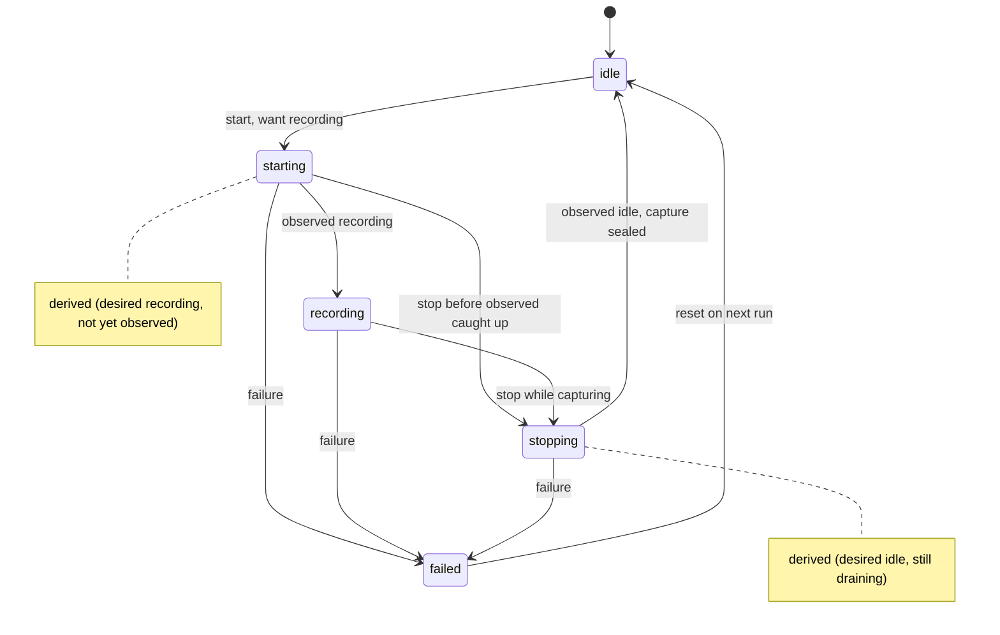
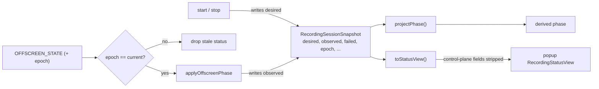

# Shared Kernel — recording state model, messaging substrate & cross-context types

> Imported by **every** runtime context (background, offscreen, popup, content). It owns no behavior of its own — it owns the *vocabulary* they agree on. For symbol-level structure use codegraph (`codegraph_explore "projectPhase recordingNormalizers rpc"`); this doc explains the model and the rules that keep four independently-restarting contexts in agreement.

> **Archetype:** *Protocol & State Model*. This README leads with a formal state model and a transition table because the hard part here isn't any single function — it's that the displayed recording phase is a **derivation**, and getting that derivation provably right (across stale messages, service-worker restarts, and legacy persisted data) is the whole job. If you read one section, read **The recording state model**.

## Purpose & mental model

`shared/` is the lingua franca. Five pillars:

1. **The recording state model** (`recording*.ts`) — the canonical `RecordingSessionSnapshot`, its capture phase, detached upload jobs, and the pure functions that derive and normalize them. This is where ADR-0003 and ADR-0004 meet in code.
2. **The recording-history domain** (`recordingHistory.ts`) — normalized entries, files, cursors, and the message guard shared by the background persistence service and history page.
3. **The notation domain** (`notations.ts`) — timecoded, user-authored annotations on a recording. `tStartMs`/`tEndMs` are *media-relative* offsets stamped from the background's pause-aware clock, so they map onto playback position without pause-gap correction (ADR-0005). Decode is tolerant (a bad end degrades to a point mark); the background service is strict on write.
4. **The messaging substrate** (`protocol.ts`, `protocolMessageTypes.ts`, `messages.ts`, `rpc.ts`) — the typed envelopes and the request/response framework the contexts talk over.
5. **The recording-format policy** (`recordingFormats.ts`) — the shared WebM/MP4/M4A profile resolver and `MediaRecorder` capability probe used by Settings and the offscreen recorder. It keeps the selected recorder MIME, delivery content type, and filename extension in one contract, with no transcoding or silent fallback.

Everything else (`timeouts.ts`, `logger.ts`, `perf.ts`, `async.ts`, `typeGuards.ts`, `build.ts`) is cross-cutting infrastructure those pillars and their callers share. The mental model: **the background owns the truth, persists it, and every other context derives its view from a snapshot of it** — so the snapshot's shape and the rules for reading it are load-bearing.

## The recording state model

The displayed `RecordingPhase` (`idle | starting | recording | stopping | failed`) is **not stored** — it is *derived* from two independently-owned inputs plus a terminal flag (ADR-0003 Decision 4):

- **`desired: 'idle' | 'recording'`** — command-plane *intent*. Written **only** by the command path (`start` ⇒ `recording`; `stop`/finalize ⇒ `idle`).
- **`observed: 'none' | 'starting' | 'recording' | 'stopping' | 'idle'`** — status-plane *observation*. Written **only** by `applyOffscreenPhase` from the offscreen's `OFFSCREEN_STATE` reports.
- **`failed: boolean`** — terminal, cross-cutting. A start can fail in the command path before any status exists, and the offscreen can report a runtime failure — so it is separate and wins over both.

`phase = projectPhase(desired, observed, failed)` (`recordingProjection.ts`) is a **pure, total** function. Because each plane writes only its own field and the phase is computed, the status path can no longer permanently clobber the command path's view: a stale `observed` can at worst flip a derived `recording` back to `starting` until the next report — never overwrite intent.

### Transition table (the full truth of `projectPhase`)

| `failed` | `desired` | `observed` | → `phase` | reading |
| :---: | :---: | :--- | :---: | :--- |
| `true` | * | * | **`failed`** | terminal; wins over everything |
| `false` | `recording` | `recording` | **`recording`** | intent met |
| `false` | `recording` | `none`/`starting`/`stopping`/`idle` | **`starting`** | intent ahead of observation |
| `false` | `idle` | `starting`/`recording`/`stopping` | **`stopping`** | observation lagging the stop |
| `false` | `idle` | `none`/`idle` | **`idle`** | settled |

`starting` and `stopping` are therefore *derived gaps* between intent and observation, not stored states — which is exactly why the [phase watchdog](../background/phaseWatchdog.ts) watches them (a gap that never closes is an orphaned session).

### Derived-phase lifecycle


```mermaid
stateDiagram-v2
    [*] --> idle
    idle --> starting: start, want recording
    starting --> recording: observed recording
    starting --> stopping: stop before observed caught up
    recording --> stopping: stop while capturing
    stopping --> idle: observed idle, capture sealed
    starting --> failed: failure
    recording --> failed: failure
    stopping --> failed: failure
    failed --> idle: reset on next run
    note right of starting
        derived (desired recording, not yet observed)
    end note
    note right of stopping
        derived (desired idle, still draining)
    end note
```

## The session snapshot

`RecordingSessionSnapshot` is the persisted record of the active capture plus any still-draining detached upload jobs — written by the background, read (as a normalized copy) by every other context. `phase` is derived; everything else is owned data.

```ts
type RecordingRunConfig = {
  storageMode: 'local' | 'drive';
  micMode: 'off' | 'mixed' | 'separate';
  recordSelfVideo: boolean;
};

type RecordingSessionSnapshot = {
  phase: RecordingPhase;          // DERIVED — projectPhase(desired, observed, failed); never written directly
  desired: DesiredState;          // command-plane intent (written by start/stop only)
  observed: ObservedState;        // status-plane report (written by applyOffscreenPhase only)
  failed?: boolean;               // terminal flag (wins over both planes)
  runConfig: RecordingRunConfig | null;
  epoch?: number;                 // fencing token (ADR-0003 D1) — preserved across idle, monotonic
  targetTabId?: number;           // the captured tab
  meetingSlug?: string;           // Meet URL slug, for display/recovery
  historyId?: string;             // stable identity of this recording's durable history entry
  tabResolution?: { width?: number; height?: number }; // actual tab-track dimensions reported at start
  uploadSummary?: UploadSummary;  // per-file uploaded / local-fallback results
  uploadJobs?: UploadJob[];       // detached Drive jobs; can exist while phase is idle
  error?: string;
  warnings?: string[];            // trimmed, de-duplicated run warnings
  // Live overlay flags — mirrored from offscreen actuation so a reopened popup
  // renders the right controls; orthogonal to phase.
  micMuted?: boolean;
  cameraMuted?: boolean;
  paused?: boolean;
  // Pause-aware timer. recordedMs = banked recorded duration (excludes paused
  // spans); runningSince = epoch ms the clock last (re)started (omitted while
  // paused/stopped). Live elapsed = recordedMs + (runningSince ? now - runningSince : 0).
  recordedMs?: number;
  runningSince?: number;
  updatedAt: number;
};
```

Two rules `normalizeSessionSnapshot` enforces on every read:

- **Phase-gating.** When the derived phase is `idle`, capture-scoped fields (`runConfig`, `targetTabId`, `meetingSlug`, `historyId`, the overlay flags, the timer) are dropped — a settled snapshot can't carry stale capture data. `uploadJobs` deliberately survive: Drive delivery is detached from the recording phase. `error`/`warnings` persist (post-mortem), and…
- **…the epoch survives `idle`.** The fencing token is the one run-scoped field deliberately *not* dropped, so it stays monotonic across runs — which is what lets the background reject status from a previous epoch.

## The write paths & the popup-facing view

Each plane has exactly one writer, the epoch fence guards the status path, and the popup gets a **curated** view — never the raw snapshot:


```mermaid
flowchart LR
    START["start / stop"] -->|writes desired| SNAP
    OFF["OFFSCREEN_STATE (+ epoch)"] --> FENCE{"epoch == current?"}
    FENCE -->|no| DROP["drop stale status"]
    FENCE -->|yes| APPLY["applyOffscreenPhase"]
    APPLY -->|writes observed| SNAP
    SNAP["RecordingSessionSnapshot<br/>desired, observed, failed, epoch, ..."] --> PROJ["projectPhase()"]
    PROJ --> PHASE["derived phase"]
    SNAP --> VIEW["toStatusView()"]
    VIEW -->|control-plane fields stripped| POPUP["popup RecordingStatusView"]
```

`toStatusView` (in `recordingFactories.ts`) is the boundary between the full internal snapshot and what the UI sees: it projects the snapshot into a `RecordingStatusView` that **omits control-plane bookkeeping** — the `epoch` fencing token, `targetTabId`, and the raw `desired`/`observed` planes never reach the popup (ADR-0003 keeps the epoch out of the view *by construction*; a test asserts the planes don't leak). The popup renders from the derived `phase`, user-facing overlay flags, and curated detached job views.

`RecordingStatusView` also carries the curated detached `uploadJobs` list. It is intentionally independent of `phase`: a new recording can start and still render an older Drive job in its own session tab.

Sealed files carry a separate immutable `RecordingArtifactContext`: `historyId`, an optional detached `uploadJobId`, and the unrelated random `telemetryRunId`. The finalizer, local-save request, pending-upload marker, recovery path, and telemetry reducer pass only the identity they need. This prevents a later capture from assigning an old artifact/fallback to the wrong history entry or joining diagnostics through a user-visible/persistent identifier.

## Recording history domain

`recordingHistory.ts` defines the durable, user-facing history vocabulary. A `RecordingHistoryEntry` contains a stable id, name, timestamp, storage mode, aggregate status, and one normalized file record per stream. A file is `pending`, `available`, or `unavailable`, with a local download id or Drive link when available.

The history API is cursor-paged with a `(createdAt, id)` cursor, so equal timestamps remain deterministic. Current Drive rows also persist folder ID/name/link plus per-file Drive IDs so a rename can target the actual remote resources. `recordingNames.ts` owns Unicode-safe title slugging and stream-specific renamed filenames while preserving the resolved extension. Its messages include `LIST_RECORDING_HISTORY`, `RENAME_RECORDING_HISTORY`, `SKIP_RECORDING_NAMING`, `REMOVE_RECORDING_HISTORY`, and `OPEN_RECORDING_HISTORY_FILE`. `deletedAt` is a soft-delete tombstone: consumers hide it, while delayed download/upload/recovery updates preserve it rather than recreating an entry the user removed.

## Production telemetry contract

`shared/telemetry/` is the privacy and cardinality boundary used by background, offscreen, and captions. Each recording receives a random telemetry-only `runId`; it is never derived from or replaced by a history ID, meeting slug, upload job ID, Drive identifier, or persistent browser identity. `TelemetryAccumulator` exposes `increment`, `measure`, `context`, `incident`, `checkpoint`, and `flush`. High-frequency events update only bounded in-memory counters/totals/maxima; context is a 32-event flight recorder copied only into incidents.

Schema v1 caps encoded batches at 32 KiB, summary names at 64, incidents at 10, strings at 128 characters, and metrics at one billion. Errors become an allowlisted stage/kind, bounded error name, and eight-character fingerprint of at most four normalized same-extension frames—never a message or raw stack. The IndexedDB store holds at most 10 queued batches/256 KiB plus four active-run checkpoints/64 KiB each. Delivery is enqueue-before-fetch, oldest first: `202` removes, permanent non-429 `4xx` evicts, and `429`/`5xx`/network failures retain for bounded alarm retry. Opt-out deletes both stores.

Healthy completion batches contain only coarse release/runtime/recording categories and metric aggregates. Incident batches may additionally contain allowlisted breadcrumbs. Recording media, transcript/caption text, meeting/file names, Drive or device identifiers, OAuth data, raw user agent, language/timezone, exact display/hardware details, raw errors, and raw stacks are excluded. The Cloudflare validator mirrors these exact keys/enums/bounds; see the [Worker runbook](../../telemetry-worker/README.md).

## Design rationale & theory

The split is a textbook application of patterns, each tied to the failure it prevents (full argument in [ADR-0003](../../docs/adr/0003-recording-phase-ownership-and-stale-offscreen-status.md)):

- **Spec/status reconciliation (Kubernetes).** `desired` is *spec*, `observed` is *status*, `phase` is the reconciled view. The same single-writer-per-field discipline that lets a k8s controller and the kubelet write the same object without clobbering each other.
- **CQRS / [event-carried state transfer](https://martinfowler.com/articles/201701-event-driven.html) (Fowler).** `OFFSCREEN_STATE` carries the whole observed phase (idempotent, self-contained state transfer) rather than deltas — chosen over event-sourcing because the offscreen still needs local phase state and the reconstruction cost wasn't worth it.
- **Fencing token (Kleppmann, *Designing Data-Intensive Applications*, ch. 8–9).** A monotonic per-run `epoch` lets the background **reject status from a stale run** (a message that survived a reconnect / SW restart / document recreation). The split handles *within-run* intent preservation; the fence handles *cross-run* staleness — complementary, not redundant. `normalizeEpoch` deliberately preserves the epoch **across `idle`** so it stays monotonic.

## Legacy migration — a provable inverse

A snapshot persisted before Decision 4 has only the old `phase` field. `normalizeSessionSnapshot` prefers the planes when present, else reconstructs them via `decomposeLegacyPhase` — the **inverse** of `projectPhase`, which must round-trip:

```
projectPhase(decomposeLegacyPhase(p)) === p   for every phase p
```

This is asserted exhaustively in tests. It's why you can ship Decision 4 without a migration script: old data rehydrates losslessly into the new planes on first read.

## The messaging substrate

The contexts talk over `chrome.runtime` ports/messages; `shared/` owns the *mechanism* and the *envelopes* — not the catalogue of who-sends-what (cross-cutting, at the [root reference](../../README.md#architecture-reference)).

- **`rpc.ts`** — a request/response framework over a port: correlates a request to its reply, bounds it with a timeout (`TIMEOUTS.RPC_MS`), and surfaces transport errors. Used where the caller needs an **ack** — `OFFSCREEN_START` / `OFFSCREEN_STOP` (background → offscreen).
- **`protocol.ts` / `protocolMessageTypes.ts` / `messages.ts`** — the typed envelopes and their runtime guards (`isOffscreenToBgMessage`, …), so every boundary validates shape before trusting a payload.

Two carriers, by design: **commands** (`OFFSCREEN_START`/`STOP`/`DISCARD`, upload retry/cancel, and Drive metadata rename over rpc—need an ack) and **state transfer** (`OFFSCREEN_STATE`, `OFFSCREEN_UPLOAD_STATE`, telemetry snapshots; fire-and-forget/idempotent where no command result is required). Terminal upload state is separately acknowledged with `OFFSCREEN_ACK_UPLOAD_STATE` only after the background persists the session and history updates. The epoch rides on capture status so the fence can reject a stale sender; the independent telemetry run ID follows capture and detached upload evidence without entering user-visible state.

## Key invariants & gotchas

- **`phase` is never written directly.** Anything that sets `phase` outside `projectPhase` is a bug. Write `desired`/`observed`/`failed`; let the projection compute.
- **Single writer per field.** `desired` ← command path only; `observed` ← `applyOffscreenPhase` only; `epoch` ← background only (the offscreen merely echoes it for the fence to match).
- **`projectPhase` is pure & total.** No I/O, no clock, defined for all 20 input combinations — that totality is what makes the transition table a complete spec.
- **Snapshot fields are phase-gated on normalize.** When the derived phase is `idle`, `normalizeSessionSnapshot` drops capture-scoped fields (`runConfig`, `targetTabId`, `micMuted`, `recordedMs`, …) so a settled snapshot can't carry stale capture data — but `epoch` survives (monotonic), warnings/errors persist, and detached `uploadJobs` remain visible.
- **History is normalized at the boundary.** Invalid durable rows are skipped and a history tombstone always wins over a late delivery result.
- **The full *message contract* is not here.** This module owns the rpc/protocol *mechanism* and types; the catalogue of which message flows between which contexts is cross-cutting and lives in the [root reference](../../README.md#architecture-reference).

## Files

| Group | Files | Role |
| :--- | :--- | :--- |
| **State model** | `recordingProjection.ts` | the pure `projectPhase` derivation |
| | `recordingNormalizers.ts` | `normalizeSessionSnapshot`, `decomposeLegacyPhase`, plane parsers, phase-gating |
| | `recordingTypes.ts` | `RecordingPhase`, `DesiredState`, `ObservedState`, `RecordingSessionSnapshot` |
| | `recordingConstants.ts` | recording defaults + allowed values + phase constant sets (`isBusyPhase`, `isStoppablePhase`) |
| | `recordingFactories.ts` | `createIdleSession` and **`toStatusView`** → the popup-facing `RecordingStatusView` (strips control-plane fields, preserves detached job views) |
| | `recording.ts` | the public barrel re-export — import from here, not deep paths |
| **History domain** | `recordingHistory.ts` | history entries/files, cursor page, normalization, labels, and history-message validation |
| | `recordingNames.ts` | Unicode-safe title slug and stream filename derivation for coordinated history/Drive rename |
| **Messaging substrate** | `rpc.ts` | the request/response framework over `chrome.runtime` ports |
| | `protocol.ts`, `protocolMessageTypes.ts`, `messages.ts` | typed message envelopes + guards |
| **Perf vocabulary** | `perf.ts`, `types/perfTypes.ts`, `constants/perfConstants.ts`, `utils/mathUtils.ts` | perf event types/names/helpers + math; the *vocabulary* only — the stores live in `background/`/`debug/` (see the instrumentation doc) |
| **Production telemetry** | `telemetry/` | schema, allowlists, sanitization, reducer, accumulators, checkpoints/outbox, coordinator, and acknowledged delivery |
| **Cross-cutting infra** | `timeouts.ts` | the single `TIMEOUTS` budget table (watchdogs, RPC, seal, caption/meeting-end) |
| | `async.ts`, `format.ts`, `logger.ts`, `typeGuards.ts`, `build.ts`, `provider.ts` | `withTimeout`, display formatting, logging, `isRecord`, build flags, meeting-provider metadata |
| | `recordingFormats.ts` | format-profile resolver and content-type/filename helpers; MP4/M4A are capability-gated, while WebM retains the existing codec preferences |

`shared/settings/` is its own **deep module** (load / persist / normalize / derive recorder configuration) and is documented in its own README — not covered here.

## Testing notes

- `__tests__/recordingProjection.test.ts` is the spec: it asserts `projectPhase` over the **exhaustive 20-combination** input space (so the transition table above is *tested*, not aspirational) plus the `decomposeLegacyPhase` ⇄ `projectPhase` **round-trip** for all five capture phases.
- `projectPhase`/`decomposeLegacyPhase` are pure — test them with values, no mocks. Resist adding a clock or I/O to them; their totality is the property under test.
- Snapshot normalization edge cases (legacy `phase`, missing planes, phase-gating, detached upload jobs/naming state) live alongside in the shared tests. `recordingHistory.test.ts` covers history normalization, Drive folder metadata, stable cursor semantics, and tombstones; `recordingNames.test.ts` pins Unicode slug and extension-preserving filenames. `telemetry/__tests__` covers sanitization/bounds, compaction, queue policy, opt-out deletion, and exactly-once recovery incidents.

## Related

- [ADR-0003](../../docs/adr/0003-recording-phase-ownership-and-stale-offscreen-status.md) — the full decision: epoch fence (D1), keep state transfer (D3), the desired/observed split (D4).
- [ADR-0004](../../docs/adr/0004-decouple-uploads-from-the-recording-session.md) — why Drive work is a detached job instead of a recording phase.
- [`background/phaseWatchdog.ts`](../background/phaseWatchdog.ts) — the liveness backstop for the derived `starting`/`stopping` gaps.
- [`recordings`](../recordings/README.md) — the history page that consumes this domain.

## External references

- Fowler — [What do you mean by "Event-Driven"?](https://martinfowler.com/articles/201701-event-driven.html) (event-carried state transfer vs. event sourcing) and [CQRS](https://martinfowler.com/bliki/CQRS.html).
- Kubernetes — [Objects: spec and status](https://kubernetes.io/docs/concepts/overview/working-with-objects/kubernetes-objects/) (the reconciliation shape).
- Kleppmann, *Designing Data-Intensive Applications*, ch. 8–9 — fencing tokens for rejecting stale writers.
