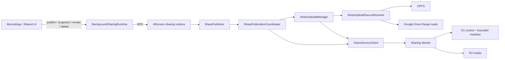
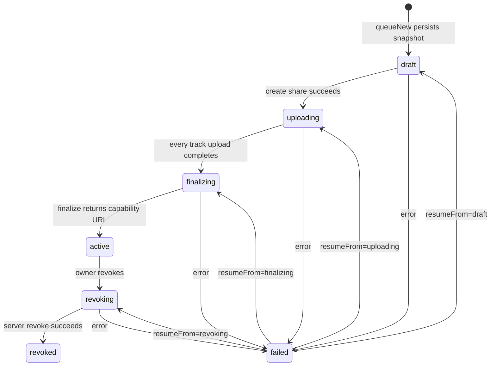

# Sharing — durable revocable publication

> The owner-side sharing deep module. It turns one or more private recordings into an immutable public snapshot, persists enough local state to survive page/service-worker/browser restarts, uploads media from OPFS or Drive through resumable sessions, and exposes owner management state without leaking private source locators into the public manifest. The Cloudflare service implementation lives under [`sharing-worker/src`](../../sharing-worker/src); deployment and operational procedures live in [`docs/sharing-operations.md`](../../docs/sharing-operations.md).

> **Archetype:** *Durable workflow + boundary adapter*. `SharePublicationCoordinator` owns the publication state machine, `ShareUploadManager` owns resumable byte transfer, and `ShareServiceClient` is the HTTP boundary. Browser runtime plumbing stays outside those domain roles.

## Purpose & mental model

A private recording is the owner's source. Sharing creates a new, immutable-at-publication representation with new public recording and track ids. The public snapshot may include transcript, topics, notations, and selected tracks, but it never contains the OPFS filename, Drive file id, Drive authorization, or other private source locator used to obtain the bytes.

The runtime is split across Chrome contexts because MV3 service workers are ephemeral while publication may take minutes:

The background is the command-plane bridge. It ensures an offscreen document exists, forwards commands, and wakes the offscreen runtime at startup when a durable publication is unfinished. The offscreen document hosts the long-running browser data plane: source reads, authentication helpers, resumable uploads, and lifecycle recovery. Local IndexedDB stores remain the recovery authority when either runtime disappears.

## Publication boundary

`PublishedManifestBuilder` creates two related values in one pass:

- a sanitized `PublishedPlaybackManifest` that can cross the sharing-service boundary;
- private `PublishedRecordingPlan` entries that map each public track id back to the owner's `PlaybackTrack` source.

This prevents public ids and upload sources from drifting apart while keeping private locators local. A share can contain several recordings. Each publication receives fresh share, recording, and track ids; the source recording ids are retained only in local workflow state.

The current sharing options can include/exclude transcript, topics, notations, and self-video and can mark downloads enabled in the published snapshot. Topics are included only when the transcript snapshot is included.

## Durable lifecycle

`SharePublicationCoordinator` persists the complete publication before the first network request. It advances only after each corresponding side effect succeeds, so replay after a crash uses the same ids and the same immutable snapshot.

`failed` is a durable retry marker, not a new workflow branch: `resumeFrom` records which phase should be replayed. `resumePending()` isolates failures between shares, so one unavailable source cannot block recovery of unrelated publications. Active/revoked rows are terminal; temporary upload jobs are then cleaned idempotently.

`BackgroundSharingRuntime.resumeIfPending()` checks the durable publication store during background bootstrap. If anything is neither `active` nor `revoked`, it recreates the offscreen host; offscreen startup then resumes pending publications. The sharing E2E also exercises a no-recording/no-audio upload whose response is delayed for more than 60 seconds, proving the current offscreen reason combination remains alive for that workload in the tested Chromium runtime.

## Resumable media upload

`ShareUploadManager` is transport-independent. For each published track it:

1. resolves the private source through `ShareUploadSourceResolver`;
2. persists an upload job before/while transfer advances;
3. asks the service for an upload session and its committed offset;
4. sends chunks with offset in both the URL and `Content-Range`;
5. persists per-track committed bytes and activity (`uploading`, `retrying`, `resuming`);
6. completes the remote upload and marks the local job complete.

The source resolver supports retained OPFS objects and Drive-backed files. Drive sources are read by authenticated Range requests, so publication does not require first downloading the whole file into memory or flattening the recording into one video.

Chunk replay is designed for response loss. The server can return the already-committed offset, and replaying a chunk at the same offset is idempotent. Expired multipart sessions are replaced while preserving durable local progress semantics.

## Owner registry & management projection

`ShareRuntime.snapshot()` combines three pieces of state:

- paginated remote summaries from the Worker;
- durable local publications;
- durable local upload jobs/progress.

`ShareRegistry` reconciles remote owner state with the local publication store. `ShareManagementModel` converts that combined snapshot into the rows rendered by the persistent **Shared** UI.

The list API intentionally returns summary projections only. `GET /api/shares` is cursor-paginated and carries fields such as titles, lifecycle timestamps, recording/track counts, total bytes, and share URL. `GET /api/shares/:id` is the detail boundary that returns the complete canonical manifest. This keeps the owner registry bounded even when transcripts are large.

If the remote registry is temporarily unavailable, `ShareRuntime.snapshot()` still returns local publications/uploads plus `remoteError`; management can therefore show recoverable local state instead of failing the whole surface.

## Revoke vs. permanent delete

These are different lifecycle operations:

- **Revoke** removes public capability access immediately while retaining published data according to server retention policy. Local state becomes `revoked`.
- **Delete published data** removes the remote share metadata, multipart state, and media objects, then clears local upload/publication state.

Permanent DELETE is response-loss safe. The Worker returns success for an already-absent/non-owned share, and the client retries a transient/network/5xx failure once. If the server performed deletion but the 204 response was lost, the retry still succeeds and local publication state can be removed.

## Authentication & public access

Owner requests use `ShareOwnerSession`: a Google identity token is exchanged for a short-lived sharing-service owner session, and a 401 causes one token/session refresh attempt at the HTTP boundary.

The viewer URL is a capability, separate from the owner-visible share id. Opening it establishes a viewer session; each manifest/media request still passes through the Worker, which checks that the share remains active before serving content. Media Range requests are authorized before the Worker streams the requested R2 range, so revocation affects future reads immediately.

Capability signing is key-versioned on the service. Rotation can add a new key for future shares while retaining old keys required by existing capability links; operational steps are documented in the runbook.

## Contract and storage limits

The cross-runtime limits live in [`shared/sharingContract.ts`](../shared/sharingContract.ts), so the extension and Worker reject the same shapes. Two byte ceilings are deliberately distinct:

- request JSON: `2_000_000` bytes;
- canonical persisted manifest JSON: `1_500_000` UTF-8 bytes.

The Worker measures serialized UTF-8 bytes before D1 persistence. The persisted ceiling stays below D1's row/string limit; transcript/topic/notation aggregate limits keep valid manifests within that budget. Media bytes do not live in D1: R2 owns the uploaded track objects, while D1 owns share/upload/control rows and the bounded canonical manifest used by the current MVP.

## Files

| File | Role |
| :--- | :--- |
| `PublishedManifestBuilder.ts` | builds the sanitized immutable viewer snapshot and private source→public-track plan |
| `SharePublisher.ts` | high-level queue/publish entrypoint; builds a manifest then hands it to the durable coordinator |
| `SharePublicationCoordinator.ts` | publication/revocation state machine, persistence ordering, restart recovery |
| `SharePublicationStore.ts` | durable local publication records and phase/error/resume state |
| `ShareUploadManager.ts` | resumable per-track transfer, retry/resume progress, transport abstraction |
| `ShareUploadSourceResolver.ts` | opens OPFS or Drive-backed sources behind one ranged source interface |
| `ShareUploadStore.ts` | durable per-track upload state, offsets, byte counts, activity/error state |
| `ShareServiceClient.ts` | authenticated HTTP adapter for share CRUD, registry, multipart upload, finalize/revoke/delete |
| `ShareOwnerSession.ts` | Google identity → short-lived owner-session exchange and refresh |
| `ShareRegistry.ts` | paginated remote registry refresh and reconciliation with local publications |
| `ShareRuntime.ts` | offscreen composition root for owner-side sharing services |
| `ShareManagementModel.ts` | pure projection from remote/local/upload state into Shared UI rows |
| `config.ts` | build-time sharing-service origin resolution |

Runtime adapters live outside this directory: [`background/sharing/BackgroundSharingRuntime.ts`](../background/sharing/BackgroundSharingRuntime.ts) is the background command bridge, and [`offscreen/rpcHandlers.ts`](../offscreen/rpcHandlers.ts) exposes the offscreen sharing commands.

The service implementation is under [`sharing-worker/src`](../../sharing-worker/src): `shares/` owns share metadata/finalization/deletion, `uploads/` owns multipart coordination, `auth/` owns owner/capability sessions, `viewer/` owns protected playback, and `maintenance/cleanup.ts` owns stale-draft/revoked cleanup.

## Testing notes

Unit tests in `__tests__/` pin the public/private manifest boundary, durable phase replay, source resolution, resumable offsets, auth refresh, registry reconciliation, management projection, and response-loss-safe deletion.

`tests/e2e/sharing-lifecycle.spec.ts` is the vertical contract. It exercises real extension + local Worker behavior including OPFS publication, Drive Range publication, Recordings-page closure, Chrome restart/resume, lost upload/finalize/delete responses, expired multipart recovery, viewer playback and Range seeking, revoke, permanent deletion, and the >60-second idle offscreen upload soak. The CI workflow gives sharing its own gate so these lifecycle guarantees are validated together with Worker tests/typechecks and deployment dry-run.

## Related

- [`shared/sharing.ts`](../shared/sharing.ts) — published viewer/domain types.
- [`shared/sharingContract.ts`](../shared/sharingContract.ts) — runtime validation and shared limits.
- [`shared/player/PlaybackClock.ts`](../shared/player/PlaybackClock.ts) — synchronization used by both extension playback and the public viewer.
- [`background`](../background/README.md) — MV3 control-plane lifecycle and startup recovery.
- [`offscreen`](../offscreen/README.md) — browser data-plane host.
- [`recordings`](../recordings/README.md) — owner recording history and Shared surface entrypoint.
- [`docs/sharing-operations.md`](../../docs/sharing-operations.md) — deployment, keys, quotas, retention, CI, staging acceptance, and rollback.
