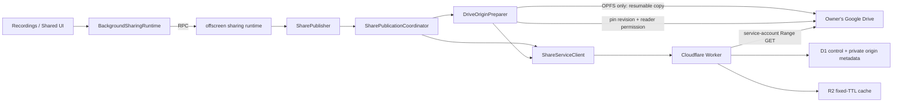

# Sharing — Drive-backed revocable publication

The sharing module publishes one or more private recordings as an immutable, revocable web snapshot. Google Drive is the durable media origin. Cloudflare owns authorization and lifecycle state in D1, proxies protected Range reads, and may keep a bounded temporary R2 cache. New publications never create permanent R2 media copies.

The Worker implementation lives under [`sharing-worker/src`](../../sharing-worker/src). Deployment and operational procedures live in [`docs/sharing-operations.md`](../../docs/sharing-operations.md).

## Architecture

A private recording stays owned by the user. Publication creates new public recording/track ids and binds each published track to one exact Drive blob revision.



The durable media identity is:

```text
Drive file id + pinned revision id
```

The file id, revision id, permission id, OPFS key, and Google credentials are private implementation state. `PublishedPlaybackManifest` contains only public playback ids, metadata, and Worker media endpoints.

## Publication boundary

`PublishedManifestBuilder` creates two values together:

- a sanitized `PublishedPlaybackManifest` that may cross the sharing-service boundary;
- private `PublishedRecordingPlan` entries that map public tracks back to owner playback sources.

A share can contain multiple recordings and each publication gets fresh public ids. Source recording ids remain local workflow state.

For every track, `DriveOriginPreparer` then establishes an immutable Drive origin:

1. If the track already has a Drive location, reuse that file. Publication does not download or re-upload its media bytes.
2. If the track is OPFS-only, read it through `ShareMediaSourceResolver` and create a user-owned Drive file with the resumable Drive uploader.
3. Read file metadata and verify size, MIME type, checksum when available, and `canDownload`.
4. Pin `headRevisionId` with Keep Forever.
5. Grant the configured sharing-reader service account an explicit `reader` permission on that file.
6. Register the private origin descriptor with the Worker. The Worker independently reads revision metadata with the service account before accepting it.

The service account never receives the user's refresh token and is not granted access to a folder or the rest of Drive.

## Durable lifecycle

`SharePublicationCoordinator` persists the complete publication before the first remote mutation. Each phase is replayable with the same ids.

```mermaid
stateDiagram-v2
    [*] --> draft: persist snapshot
    draft --> preparing-origin: create Worker share
    preparing-origin --> finalizing: every Drive origin is registered
    finalizing --> active: capability finalized
    active --> revoking: owner revokes
    revoking --> revoked: Worker revoke succeeds
    draft --> failed: error
    preparing-origin --> failed: error
    finalizing --> failed: error
    revoking --> failed: error
    failed --> draft: resumeFrom=draft
    failed --> preparing-origin: resumeFrom=preparing-origin
    failed --> finalizing: resumeFrom=finalizing
    failed --> revoking: resumeFrom=revoking
```

`uploading` remains accepted as a legacy persisted local phase and resumes as origin preparation. The Worker also uses `uploading` as its remote pre-finalization state after the first origin is registered.

`failed` is a durable retry marker. Background startup calls `resumeIfPending()`, which recreates the offscreen runtime when local publication or cleanup work remains. Offscreen startup calls `resumePending()` and replays the idempotent phase. This is what makes a lost origin-registration response recover after a full Chrome restart.

`ShareUploadStore` keeps its historical name and IndexedDB database for compatibility, but its current job is durable Drive-origin preparation state: OPFS→Drive upload session URI, committed offset, Drive file/revision metadata, and per-track progress.

## Viewer media path

The viewer never talks to Drive directly.

```text
viewer Range request
        ↓
Worker viewer-session + active-share check
        ↓
D1 media asset lookup
        ↓
R2 cache hit ───────────────→ response
        │ miss
        ↓
exact pinned Drive revision
        ↓
response + best-effort R2 cache write
```

For new Drive-origin tracks the Worker:

- caps one media response at 8 MiB;
- performs at most one Drive media fetch for a cache miss;
- requests the exact pinned revision with a byte range;
- returns only the served `Content-Range`, allowing the browser to request the next range;
- does not touch Drive for `HEAD` media requests;
- authorizes the share before reading either R2 or Drive.

The R2 cache is disposable and cannot be required for correctness. Its hard-coded envelope is:

- `8_000_000_000` live bytes maximum;
- `15_000` cache PUTs per UTC day;
- fixed 30-hour TTL from `cachedAt`;
- no sliding expiration on hits;
- one D1 cache-row lookup followed by at most one R2 `GetObject` per media request;
- cache write/storage failures fall through to Drive playback.

The cache key includes media asset id, immutable revision id, and served byte interval. The hourly scheduled cleanup removes expired cache objects and releases their byte budget.

Tracks published before the Drive-origin migration may still use their legacy permanent R2 object as a playback fallback. The legacy multipart publication routes are no longer reachable from the Worker router, so new shares cannot enter that path.

## Owner registry and private origin metadata

`ShareRuntime.snapshot()` combines:

- paginated remote summaries;
- durable local publications;
- local Drive-origin preparation jobs.

`ShareRegistry` reconciles remote owner state with local publication state. If the remote registry is temporarily unavailable, local state is still returned with `remoteError`.

Public/summary APIs never return Drive locators. `GET /api/shares/:shareId/origins` is a separate owner-authenticated cleanup endpoint and returns only the private Drive descriptors needed to revoke the service-account permission and release publication pins. It exists so a remote-only share can still be cleaned up when local publication state is missing.

## Revoke and delete

Public authorization and Drive cleanup are deliberately ordered.

**Revoke**:

1. persist a durable cleanup job when needed;
2. set the Worker share to `revoked` first;
3. from then on, every viewer manifest/media request is denied before touching R2 or Drive;
4. remove the service-account file permission with the owner's Drive token;
5. if Drive cleanup fails, keep durable cleanup state and retry on a later startup.

Revocation does not delete the user's recording file and does not need R2/cache deletion for security because viewer authorization is checked first.

**Delete published data**:

1. capture private Drive cleanup descriptors before server deletion;
2. delete Worker publication state and any R2 cache entries for its media assets;
3. remove the service-account permission;
4. release the publication revision pin: clear Keep Forever when it is still the head revision, or delete the obsolete pinned revision when appropriate;
5. remove local publication/preparation state.

The user's actual Drive recording file is never deleted by sharing cleanup, including when publication originally copied an OPFS recording into Drive.

The cleanup queue persists before the server action. Therefore a lost successful DELETE response, browser crash between server deletion and Drive cleanup, or missing local publication row can all be resumed safely.

## Authentication boundaries

There are three independent credentials:

- **User Google token** — stays in the extension; uploads OPFS media to the user's Drive, pins revisions, and grants/removes the explicit reader permission.
- **Sharing-reader service account** — private key stays in a Worker secret; its OAuth token uses `drive.readonly` and can read only files explicitly shared to its service-account email. Domain-wide delegation is not used.
- **Viewer capability/session** — authorizes one active share through the Worker; it contains no Drive credentials and exposes no Drive id.

Owner API calls use `ShareOwnerSession`: a Google identity token is exchanged for a short-lived service session, with one refresh/retry on a 401. Viewer capabilities are key-versioned so signing keys can rotate without changing existing links while their referenced key remains configured.

## Contract and storage limits

Cross-runtime manifest limits live in [`shared/sharingContract.ts`](../shared/sharingContract.ts). The Worker currently caps request JSON at 2,000,000 bytes and canonical persisted manifest JSON at 1,500,000 UTF-8 bytes.

D1 stores lifecycle/control state, canonical public manifests, private media-asset descriptors, and cache accounting. Durable media bytes live in the user's Drive. R2 stores only bounded temporary cache objects for Drive-origin shares plus migration-era media objects that already existed before this architecture.

## Main files

| File | Role |
| :--- | :--- |
| `PublishedManifestBuilder.ts` | builds sanitized viewer snapshots and private source→public-track plans |
| `SharePublisher.ts` | queues/publishes snapshots through the durable coordinator |
| `SharePublicationCoordinator.ts` | publication/revocation state machine and restart replay |
| `SharePublicationStore.ts` | durable local publication phase/error/origin state |
| `DriveOriginPreparer.ts` | ensures Drive origin, pins revision, manages reader permission, registers origin |
| `ShareMediaSource.ts` | random-access owner media interface used when a Drive copy must be created |
| `ShareMediaSourceResolver.ts` | resolves OPFS first and can read Drive ranges when bytes are explicitly needed |
| `ShareUploadStore.ts` | compatibility-named durable Drive preparation/resumable-upload state |
| `ShareOriginCleanupQueue.ts` | crash-safe revoke/delete Drive cleanup, including remote-only shares |
| `ShareServiceClient.ts` | authenticated owner HTTP boundary |
| `ShareOwnerSession.ts` | Google identity → short-lived owner-session exchange |
| `ShareRegistry.ts` | paginated remote registry + local reconciliation |
| `ShareRuntime.ts` | offscreen composition root |
| `ShareManagementModel.ts` | Shared UI projection |

Runtime adapters remain outside this directory: [`background/sharing/BackgroundSharingRuntime.ts`](../background/sharing/BackgroundSharingRuntime.ts) is the background command bridge and [`offscreen/rpcHandlers.ts`](../offscreen/rpcHandlers.ts) exposes offscreen commands.

The service implementation is under [`sharing-worker/src`](../../sharing-worker/src): `shares/` owns lifecycle/private media-asset metadata, `drive/` owns service-account Drive access, `cache/` owns the bounded R2 cache, `auth/` owns owner/capability sessions, `viewer/` owns protected playback, and `maintenance/` owns scheduled cleanup. `uploads/` remains only for migration-era cleanup code; its publication routes are not exposed by the router.

## Tests

Unit tests cover the manifest privacy boundary, durable phase replay, Drive-origin preparation, OPFS resumable Drive upload recovery, source resolution, service-account verification, bounded media caching, authorization, registry reconciliation, and cleanup replay.

`tests/e2e/sharing-lifecycle.spec.ts` is the vertical contract. It proves:

- OPFS media is copied to the user's Drive, pinned, granted to the reader, and registered with the Worker;
- publication continues after the Recordings page closes;
- a committed-but-lost origin response recovers after a full Chrome restart;
- an origin response held for more than 60 seconds does not kill offscreen sharing work;
- an already Drive-backed recording is reused without owner-side media reads or another resumable upload;
- public manifests do not expose Drive file/revision/permission ids;
- a clean Chromium viewer decodes real WebM tracks and performs protected Range playback;
- R2 cache rows are created only after playback;
- revoke denies the viewer before Drive permission cleanup;
- delete removes Worker metadata/cache and releases the pin while the owner's Drive file remains.

## Related

- [`shared/sharing.ts`](../shared/sharing.ts) — published viewer/domain types.
- [`shared/sharingContract.ts`](../shared/sharingContract.ts) — runtime validation and shared limits.
- [`shared/player/PlaybackClock.ts`](../shared/player/PlaybackClock.ts) — synchronization shared by private and public playback.
- [`background`](../background/README.md) — MV3 control-plane lifecycle and startup recovery.
- [`offscreen`](../offscreen/README.md) — browser data-plane host.
- [`recordings`](../recordings/README.md) — owner recording history and Shared UI.
- [`docs/sharing-operations.md`](../../docs/sharing-operations.md) — deployment, service-account setup, cache guardrails, cleanup, CI, acceptance, and rollback.
